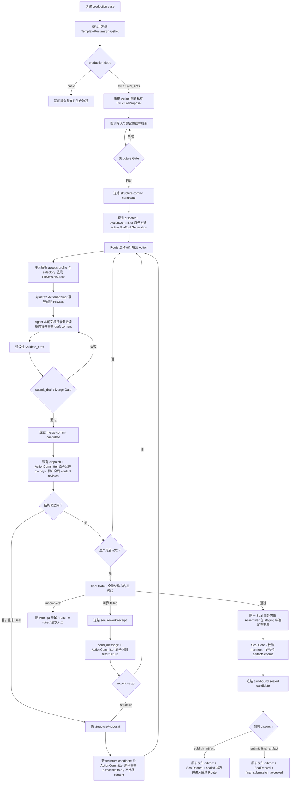

# Forge Core 结构槽引擎系统设计

> 状态：**Living Design / 当前权威设计**
> 首次冻结：2026-08-10
> 最近批量收敛：2026-08-10（全部剩余 P1、接缝审计 L01–L05、对抗审查 Round 1 的 M01–M07、Round 2 的 N01–N03 与 Round 3 的 N04 均已回写；同一独立 reviewer 于 Round 5 给出 `APPROVED`）
> 实施可落地性复审：2026-08-10 由同一独立 reviewer 连续复核 5 轮，Round 5 最终 `APPROVED`；O01–O09 与任务责任接缝均已闭合。审查记录见 [`STRUCTURED-SLOT-ENGINE-IMPLEMENTATION-REVIEW.md`](./STRUCTURED-SLOT-ENGINE-IMPLEMENTATION-REVIEW.md)。
> 维护规则：结构槽后续的已接受结论统一更新在本文，不再新建平行权威设计文档；尚待评审的问题可以暂存于非权威评审队列，接受后必须回写本文。
> 文档性质：系统设计，不是实施计划。进入开发前仍需基于本文编写独立 dev plan。
> 历史来源：本文承接并取代 `docs/2026-08-08-structured-slots-three-role-design.md`；旧文档仅保留问题发现过程与历史背景。

---

## 1. 文档目标

本文定义 Forge Core 的**结构槽运行模式**及 Slot Engine 的系统级基础能力。

它回答以下问题：

- 结构槽在 Forge Core 中是什么定位；
- 模板、编排 Agent、填充 Agent 和平台分别拥有什么权力；
- 一个 production case 如何从模板快照走到结构提案、内容填充、校验和正式交付；
- 哪些状态是权威状态，哪些只是私有草稿；
- 权限、恢复、版本、重编排和 Seal 如何保持确定性；
- 首版明确不做哪些能力，未来如何扩展而不破坏当前契约。

本文优先描述**稳定语义和边界**。示例接口与 TypeScript 形状是概念契约；第 25 节已按稳定编号冻结 v1 的详细系统契约。只有明确标记为实施默认项、基准候选或内部物理布局的内容可在 dev plan 中校准，且不得改变本文定义的公开字段、权威关系和失败语义。

---

## 2. 定位与核心结论

### 2.1 结构槽是模板可选的系统运行模式

Forge Core 保留两种生产模式：

- **基础模式（basic）**：沿用现有整文件生产方式；Agent 通过 `finish_production` 形成文件包，再由现有 custody、gate 和 artifact 版本链托管。
- **结构槽模式（structured slots）**：模板先定义槽类型、结构语法和交付规则；编排 Agent 生成具体槽树；填充 Agent 在私有草稿中写槽内容；平台校验并原子合并；最后由确定性 Assembler 生成正式文件。

运行模式由模板选择。结构槽不是所有模板的强制底座，也不替换现有基础模式。

现有模板未声明结构槽模式时，必须继续按基础模式运行，行为不变。

### 2.2 Slot Engine 是通用内核，不是故事编辑器

Slot Engine 只理解以下系统概念：

- 稳定身份；
- 单根有序树；
- 类型引用；
- `spec` 与 `content`；
- 读写授权；
- 私有草稿；
- schema 与 validator；
- revision、状态和原子提交；
- 确定性组装与 Seal。

Slot Engine 不理解“章节、场景、标题、段落、知乎故事、报告”等业务词。

槽可以表示一句话、一个段落、一个场景、一篇文档、一个 JSON 对象，或其他任何由模板定义的内容单元。槽的粒度和语义不属于平台内核。

### 2.3 Slot Engine 是结构槽模式的创作事实源

结构槽模式下：

- 权威 scaffold 及其已合并 content 是创作事实源；
- FillDraft 和 StructureProposal 是私有候选状态；
- 正式文件是 sealed scaffold 的确定性、不可变投影；
- 不允许把导出文件独立修改后反向当作槽树的新事实；
- 未来的块编辑器只能是 Slot API 的人类交互适配器，不能成为另一套权威存储。

### 2.4 角色不是内核枚举

“编排 Agent、填充 Agent、审核 Agent”是常见流程角色，不是平台硬编码的互斥身份。

平台使用 capability 和按 session kind 判别的 SlotSessionGrant 表达权力。同一个 Agent 可以组合多种能力；模板也可以让不同 Agent 分担能力。Slot Engine 不要求模板必须拆成三个 Agent。

v1 不为“审核 Agent”增加专门的 slot session、capability、审核状态或证据模型。Seal 前若审核必须读取并修订槽内容，就把它建模为普通 fill/revision 流程并提交 Draft；纯只读审核沿用 Seal 后的现有 artifact Route。v1 不提供一个只读 Slot 审核 turn 来单独产出审核裁决。专门的审核裁决与证据协议待出现多人审核、合规留痕等明确需求后独立版本化。

### 2.5 术语与现有命名映射

| 本文术语 | 含义及与当前仓库的关系 |
|---|---|
| production case | 一次独立的模板生产实例；在当前仓库中对应一个 Task / `taskId` |
| TemplateRuntimeSnapshot | case 使用的完整冻结运行契约；应扩展现有 `FrozenTemplate` 与任务 `snapshot/`，不是第二套快照 |
| ActionAttempt | 一次 structured v3 生产动作尝试；复用 `turnId` 作为稳定身份，并由持久化、单调的 attempt epoch 显式分配，不创建平行 attempt ID |
| StructureProposal | 编排 Agent 的私有候选槽树，不是权威 scaffold |
| Scaffold Generation | 一代不可原地修改的结构与 spec；case 同时只有一个 active generation |
| SlotInstance | scaffold 树中的统一节点，具有平台 ID、typeId、spec 和可选 content |
| SlotSessionGrant | 平台为当前 Agent、ActionAttempt 和 session kind 解析出的具体授权；structure 与 fill/seal 使用不同判别分支 |
| FillDraft | 绑定 ActionAttempt 与 baseRevision 的私有 content overlay |
| SealRecord | sealed scaffold 与正式派生文件之间的不可变来源记录 |

---

## 3. 目标、非目标与铁律

### 3.1 目标

1. 让模板定义产物允许使用的槽类型、结构语法、内容契约和交付方式。
2. 让编排 Agent 在受模板约束的语言内动态构造具体结构。
3. 让填充 Agent 只看到被授权的槽位投影，并只修改 content。
4. 让所有权威结构和内容更新都经过平台校验与原子提交。
5. 让长内容创作可以持久化恢复，而不把半成品写入权威状态。
6. 让最终交付可追踪到确定的模板快照、scaffold revision、Assembler 和文件哈希。
7. 保持现有 v2 custody、Route、Action、事件与 artifact 模型的权威地位。

### 3.2 首版非目标

首版明确不实现：

- 同一 production case 内的并行填充或并行 merge；
- 自动 rebase、三方合并或槽级冲突消解；
- Notion 类块编辑器；
- 人类直接写槽、拖拽结构、手工 Merge 或从导出文件反向同步槽树；
- 专门的语义审核 slot session、审核裁决或审核证据模型；
- Slot Engine 内部的任务领取队列或独立 scheduler；
- StructureProposal 的增量 add/move/delete 模型工具；
- 字符串 diff、JSON Patch、流式槽内容编辑或协同编辑；
- scaffold generation 之间的自动 content 迁移；
- 封存后的同 case 交付版本编辑；
- 运行中的 case 热升级模板；
- 从任意非结构化旧文件自动投影、反推并接管为权威槽树；
- 把某个故事模板的槽粒度、槽类型或文学规则写入平台；
- Assembler 输出图片、音视频等二进制文件，或动态文件名、嵌套目录和运行时新增文件。

### 3.3 必须保持的 Forge Core 铁律

- 平台代码零业务词；业务语义只存在于模板和业务 fixture。
- 模型不控制工程 ID、revision、时间戳、路径、权限和路由。
- TaskEvent 与权威历史只追加，不覆盖既有事实。
- 模型声明不权威；平台 Gate 和 custody 拥有最终否决权。
- raw provider thinking 不持久化、不展示。
- 基础模式继续使用当前 TurnContract v2；结构槽模式的 Seal 前槽阶段显式使用 v3，Seal 后 artifact 阶段可继续使用受限 v2，历史 v1/v2 契约不以隐式方式恢复或升级。
- 基础模式必须保持向后兼容。

---

## 4. 与现有架构的关系

结构槽运行模式叠加在现有 v2 custody 之上，不建设平行的任务系统、路由系统或文件版本系统。

| 现有组件 | 在结构槽模式中的职责 |
|---|---|
| Template loader / frozen snapshot | 校验模板并在 case 创建时冻结完整运行规则 |
| TaskScheduler / TaskRunner | 继续串行调度 Production Action 与 Agent Turn |
| Route | 决定何时调用哪个 Agent、成功或失败后如何流转 |
| ActionAttempt | 作为 StructureProposal / FillDraft 的执行归属与恢复边界 |
| ActionCommitter / custody | 承担不可绕过的最终提交与原子发布边界 |
| EventStore | 记录 structured Attempt 起止、权威结构、内容、generation 切换和 Seal 事实 |
| ArtifactStore | 保存 Seal 后的正式派生文件及既有基础模式产物 |
| GateRunner | 作为受信 validator 隔离执行环境的现有基础，后续扩展输入契约 |
| TaskProjector | 从冻结快照和追加事件投影当前 active scaffold、状态与交付结果 |

当前仓库已经在任务创建时复制并复核模板快照。本文的 `TemplateRuntimeSnapshot` 应演进现有 `FrozenTemplate + task snapshot`，而不是在旁边再造一套互不一致的模板冻结机制。

---

## 5. 端到端主流程



主流程的权威边界是：

1. StructureProposal 只在当前 turn 内形成 candidate；ActionCommitter 提交前，权威 scaffold 不存在或不变化。
2. FillDraft 只在当前 turn 内形成 merge candidate；ActionCommitter 提交前，权威 content 不变化。
3. Seal Gate 与 Assembler 只形成 staging candidate；ActionCommitter 提交前，正式 artifact、SealRecord 和 sealed 状态不存在或不变化。
4. 权威状态转换与该 turn 的现有 dispatch 必须作为一个可恢复提交全有或全无；Seal 的可靠失败返工 dispatch 同样原子提交，但不改变 scaffold phase/revision。

---

## 6. 模板运行快照

### 6.1 Case 创建时冻结

每个 production case 创建时，平台必须先完整校验模板并生成不可变 `TemplateRuntimeSnapshot`。同一 case 后续不能再读取模板源目录中的“最新内容”。

概念形状：

```ts
interface TemplateRuntimeSnapshot {
  snapshotId: string;
  templateId: string;
  templateVersion: string;
  snapshotHash: string;

  productionMode: 'basic' | 'structured_slots';
  agents: unknown;
  prompts: unknown;
  routes: unknown;
  artifactSchema: unknown;

  structuredSlots?: {
    slotTypes: unknown;
    layoutGrammar: unknown;
    accessProfiles: unknown;
    slotSelectors: unknown;
    validators: unknown;
    assembler: unknown;
    resourceLimits: unknown;
  };
}
```

这不是最终模板 schema，只表达必须被冻结的语义集合。

### 6.2 快照规则

- 模板 JSON/YAML、prompt、skill 和声明文件保存规范化副本。
- validator、assembler 等受信实现必须有稳定实现引用和内容摘要。
- 密钥值不进入快照，只保存逻辑 secret reference。
- 用户输入、模型输出和运行产物属于 case 数据，不进入模板快照。
- 同一 case 的所有 Scaffold Generation 共用同一 snapshot。
- 模板发布新版本只影响之后创建的新 case。
- v1 不允许运行中的 case 升级模板。
- 恢复时若快照缺失、损坏或实现摘要不一致，系统 fail closed，不能回退到最新模板。

---

## 7. 模板负责什么

### 7.1 一个 Template Package，而不是多个子模板

结构槽模板仍然是一个不可分割的 Template Package。把配置拆成多个文件只是模块化组织，不引入可独立运行、独立版本化或动态组合的“子模板”。整个 package 只有一个 `templateId`、一个 `versionHash`、一次完整校验和一份 case snapshot。

固定文件分层为：

```text
template.yaml
pipeline.yaml
agents/*.yaml

slots/
  contract.yaml
  validators/*
  assembler/*
```

文件职责：

| 文件 | 职责 |
|---|---|
| `template.yaml` | 产品元信息、用户输入字段、最终产物描述 |
| `pipeline.yaml` | productionMode、Agent 顺序、Route、artifactSchema、最终提交者与流程级策略 |
| `agents/*.yaml` | 模型、提示词、Skill、Gate、TurnContract 与 Agent 的 slot capability 上限 |
| `slots/contract.yaml` | SlotTypeDefinition、LayoutGrammar、access profile、validator、Assembler 与结构槽资源限制 |
| `slots/validators/*` | contract 引用的受信校验实现或声明资源 |
| `slots/assembler/*` | contract 引用的确定性组装实现或声明资源 |

### 7.2 contract.yaml 的权威性与拆分边界

`slots/contract.yaml` 是结构槽契约的单一、完整、声明式权威入口，采用“声明内联、实现外置”的组织方式。它的顶层固定分区为：

```yaml
version: 1
slotTypes: []
layoutGrammar: {}
accessProfiles: []
validators: []
assembler: {}
limits: {}
```

v1 顶层 exact schema 已冻结：七个字段全部必填，禁止额外字段；`slotTypes` 与 `accessProfiles` 至少各一项，`validators` 可以为空，`assembler` 必须且只能注册一个最终 Assembler。`version: 1` 同时选择 Slot Schema、LayoutGrammar、selector、validator 与 Assembler 注册契约的整套 v1 方言，不允许自由拼装多个 dialect 版本。

以下归属不再开放：

- SlotTypeDefinition、LayoutGrammar、access profile、validator/Assembler 的注册与绑定、资源限制必须直接声明在 `contract.yaml`。
- validator、Assembler 的受信实现文件或大型静态资源可以放在固定的 `slots/validators/*`、`slots/assembler/*` 下，由 contract 使用 package-local 安全相对路径引用。
- `contract.yaml` 不能嵌入可执行代码；给 Agent 的结构契约投影也不能暴露实现源码或工程路径。
- v1 不提供任意 YAML include、通用 `$ref` 文件组合、跨 Template Package 引用、外部 URL、递归导入或运行时网络解析。
- 未知顶层键、路径越界、缺失资源、未声明资源、未引用资源或任何外部引用都 fail closed。
- Loader 必须在运行前解析并校验全部引用；规范化声明和引用资源内容或稳定实现摘要共同进入 package 的 `versionHash` 与 snapshot。

这不是一个通用模板模块系统。未来若出现跨模板复用需求，需要独立设计带版本锁定和依赖解析的模块协议，不能通过放宽 v1 文件引用规则隐式获得。

### 7.3 模式启用与兼容规则

`pipeline.yaml` 负责选择生产模式：

```yaml
productionMode: structured_slots
```

- 字段缺失时语义默认为 `basic`，保持现有模板和历史 snapshot 可读、可复核。
- `structured_slots` 模式必须存在并完整校验固定路径 `slots/contract.yaml`。
- `basic` 模式出现 `slots/contract.yaml` 或结构槽专用绑定时必须 fail closed，不能静默忽略死配置。
- `slots/contract.yaml` 必须声明自己的契约版本，例如 `version: 1`。
- exact field schema、固定路径、模式归属和单 package 版本语义均按本文第 25 节冻结；未知版本和额外字段 fail closed。

### 7.4 控制面职责

结构槽模板冻结以下控制面：

1. **交付格式与 artifactSchema**：最终要生成哪些文件、格式和媒体类型。
2. **SlotTypeDefinition 集合**：允许编排 Agent 使用哪些槽类型。
3. **LayoutGrammar**：类型之间允许怎样嵌套、排序和重复。
4. **实例 spec 契约**：每类槽允许编排 Agent填写哪些实例级意图。
5. **content 契约**：槽内容的 JSON schema、存在性和尺寸限制。
6. **validator**：槽级、子树级和 scaffold 级规则及触发时机。
7. **Assembler**：如何把合法的 sealed scaffold 确定性转换为 artifact 文件。
8. **Agent capability 上限**：每个 Agent 最多可以提出结构、读取、填充、校验或请求 Seal 中的哪些操作；v1 不把“审核”定义为独立 Slot capability。
9. **access profile 与 slot selector**：每个 Action 可以读取和写入哪些逻辑范围。
10. **Route / Action 流程**：调用顺序、失败与成功后的流程走向。

模板定义的是一门受约束的结构语言；编排 Agent 只在这门语言中构造实例，不能创建新类型、放宽 grammar、注入执行代码或扩大权限。

`artifactSchema` 只描述最终派生文件，不嵌套槽树。槽树是结构槽模式的创作事实源，Assembler 负责将 sealed scaffold 映射成符合 artifactSchema 的输出 manifest。

### 7.5 Loader、校验与版本哈希

- 现有 template loader 仍是唯一加载入口，不新增平行 Slot Template Loader。
- Loader 先读取 `productionMode`，再按模式要求加载或拒绝 `slots/` 契约。
- Agent capability、pipeline 绑定、access profile、selector、validator 和 Assembler 引用必须做完整交叉引用校验。
- structured pipeline 必须按 11.6 的 scaffold typestate 对所有可达 Route 做数据流校验；初始输入不能绕过 structure，任何 fill/seal 或 Seal 后 v2 节点都必须被相应 scaffold 状态支配。
- structured mode 的 `artifactSchema` 至少有一个 `required: true, phase: create` 文件；所有 `phase: annotate` 文件必须显式 `required: false`。该限制只适用于 structured v1，不改变历史 basic snapshot 的解释。
- 所有引用必须限制在当前 Template Package 内；缺失、路径越界、未声明资源或摘要异常都 fail closed。
- 规范化的 `slots/contract.yaml`、所有被引用资源的内容及受信实现摘要必须进入现有 `versionHash`。
- 历史模板缺失 `productionMode` 时，canonicalization 必须保持原有 hash 稳定；不能因为新增默认字段而把已冻结 task 判为损坏。
- 任务创建时仍把整个已验证 package 复制到现有 `snapshot/`，运行期只读取该快照。

### 7.6 三层资源限制模型

结构槽资源限制分为三层：

```text
Slot Schema / LayoutGrammar 局部语义约束
                    <= slots/contract.yaml.limits 模板运行包络
                    <= 平台不可由模板放宽的 hard ceiling
```

规则：

- structured_slots contract v1 必须显式声明规定的 `limits` 字段。
- Loader 同时验证局部约束不超过模板包络、模板包络不超过当前平台兼容上限。
- 超限必须拒绝模板，不能静默 clamp、套用平台默认值或只发 warning 后继续。
- 规范化的模板 limits、资源契约版本和必要的运行兼容身份进入 `versionHash` 与 TemplateRuntimeSnapshot。
- case 运行期间只使用 snapshot 冻结的模板 limits，不能因源模板或平台配置变化而悄悄收紧或放宽。
- 恢复环境无法满足 snapshot 声明的运行包络时返回 `TEMPLATE_RUNTIME_UNAVAILABLE` 并 fail closed，不能以较小额度继续，也不能回退当前模板。
- StructureProposal、FillDraft、validator、Assembler 和 Seal 必须在各自入口或提交门禁执行相关限额；越界失败不得留下部分权威写入或正式 artifact。

平台 hard ceiling 是部署安全边界，不属于模板可配置能力。平台收紧 hard ceiling 可以阻止新模板和新 case；既有 case 只有在环境仍满足其冻结包络时才能继续运行，不能被隐式降级。

v1 模板包络最终固定为七组、二十八个必填正整数字段：

```ts
type PositiveInteger = number;

interface StructuredSlotLimitsV1 {
  schema: {
    maxSchemaDepth: PositiveInteger;
    maxSchemaNodes: PositiveInteger;
    maxEnumItems: PositiveInteger;
    maxPatternLength: PositiveInteger;
  };
  structure: {
    maxSlots: PositiveInteger;
    maxTreeDepth: PositiveInteger;
    maxChildrenPerSlot: PositiveInteger;
  };
  payload: {
    maxSpecBytesPerSlot: PositiveInteger;
    maxContentBytesPerSlot: PositiveInteger;
    maxScaffoldPayloadBytes: PositiveInteger;
  };
  draft: {
    maxChangedSlots: PositiveInteger;
    maxDraftBytes: PositiveInteger;
  };
  attempt: {
    maxSlotToolCallsPerAttempt: PositiveInteger;
    maxValidationRunsPerAttempt: PositiveInteger;
    maxValidatorInvocationsPerAttempt: PositiveInteger;
    maxAggregateValidatorCpuMsPerAttempt: PositiveInteger;
    maxAggregateValidatorWallClockMsPerAttempt: PositiveInteger;
    maxValidatorOutputBytesPerAttempt: PositiveInteger;
    maxAttemptWallClockMs: PositiveInteger;
  };
  validation: {
    maxValidators: PositiveInteger;
    maxValidatorInvocationsPerGate: PositiveInteger;
    maxAggregateValidatorCpuMsPerGate: PositiveInteger;
    maxAggregateValidatorWallClockMsPerGate: PositiveInteger;
    maxValidatorOutputBytesPerGate: PositiveInteger;
    maxIssuesPerRun: PositiveInteger;
  };
  output: {
    maxArtifactFiles: PositiveInteger;
    maxArtifactBytesPerFile: PositiveInteger;
    maxTotalArtifactBytes: PositiveInteger;
  };
}
```

计量口径与交叉规则：

- `maxSchemaDepth` 对任一 schema 计算，根为 1；`maxSchemaNodes` 统计 contract 内全部 spec/content schema 节点总数；`maxEnumItems` 按单个 enum 计；`maxPatternLength` 统计 pattern 源文本的 Unicode code point。
- `maxTreeDepth` 根为 1；`maxSlots` 统计全树节点；`maxChildrenPerSlot` 统计单个直接父节点的 children。
- JSON payload 字节统一按平台 canonical JSON 的 UTF-8 编码计量；artifact 按实际输出 UTF-8/二进制字节计量。
- `maxScaffoldPayloadBytes` 统计全部 spec 与已 set content，不包括 ID、事件、索引或数据库内部元数据。
- `maxChangedSlots` 统计一个 FillDraft overlay 中不同的槽位数；`maxDraftBytes` 统计该 overlay 的规范化变更 payload。
- `maxChangedSlots <= maxSlots`；单槽 spec/content 上限分别不得超过 `maxScaffoldPayloadBytes`。
- `maxArtifactBytesPerFile <= maxTotalArtifactBytes`；artifactSchema 声明文件数不得超过 `maxArtifactFiles`。
- `maxSlotToolCallsPerAttempt` 统计一次 structured Attempt 中到达平台的 Slot Tool 调用签名 `(toolCallId, canonicalArgsHash)`；只有同 key、同参数且可直接重放已缓存结果的真正幂等重放不重复计数。同 key 换参数的每个新冲突签名、参数无效、权限失败和业务失败调用都先占用一次额度，meter 达限后不再解析新的调用签名。锁定的 Pi 0.82 会在 Tool `execute` 前执行 TypeBox 校验，因此计量入口必须是它在校验前、可等待的原始 `tool_execution_start` 事件，而不能只放在 Tool callback；平台先持久化预收费，再允许 SDK 校验或执行，合法 execute 复用该收费，schema-invalid、未授权但命中封闭 Slot Tool 名称和截断调用也不能绕过。`maxValidationRunsPerAttempt` 统计其中首次执行或尝试执行 `validate_structure_proposal`、`submit_structure_proposal`、`validate_draft`、`submit_draft` 或 `request_seal` 的调用签名，必须小于等于 Slot Tool 总调用上限。
- `maxValidatorInvocationsPerAttempt`、`maxAggregateValidatorCpuMsPerAttempt`、`maxAggregateValidatorWallClockMsPerAttempt` 与 `maxValidatorOutputBytesPerAttempt` 分别累计该 Attempt 内所有 validation run 的 validator target 调用、实际 CPU、validator phase elapsed wall-clock 与 result stream 原始字节。它们必须分别大于等于对应的每 Gate 上限，防止一个合法 Gate 本身无法运行。
- `maxAttemptWallClockMs` 从 `structured_slot_attempt_started` batch 可见时开始，以平台单调时钟覆盖 provider、Slot Tool、validator、Assembler 与 dispatch，直到 terminal batch 提交；它必须大于等于 `maxAggregateValidatorWallClockMsPerAttempt`。模型上下文压缩、provider session 续接或工具重放都不能重置任一 Attempt 计数器。
- `maxValidators` 限制 contract 注册项总数；`maxValidatorInvocationsPerGate` 独立限制一次 Merge/Seal Gate 中实际的 `(validatorId, logical target)` 执行数。二者不建立简单大小关系，因为 trigger/selector 可以使已注册 validator 在某个 Gate 没有适用 target。
- Gate 在执行前解析全部适用 target，并以各注册项 budget 计算最坏 CPU 预算和调用数；计划值超过 `maxValidatorInvocationsPerGate` 或 `maxAggregateValidatorCpuMsPerGate` 时，一个 validator 都不运行，返回 `RESOURCE_LIMIT_EXCEEDED` + `incomplete`。执行中还要按实际 CPU 与整个 validator phase 的 elapsed wall-clock 强制 `maxAggregateValidatorCpuMsPerGate` / `maxAggregateValidatorWallClockMsPerGate`。
- `maxValidatorOutputBytesPerGate` 统计所有沙箱 result stream 在完整解析前已经发出/编码的累计原始字节，无效返回也计入；runner 必须流式计量并在越界时停止，不能先无界读入再规范化。`maxIssuesPerRun` 统计一次完整 Gate verdict 在内部形成的累计 issue 数。任一累计值超过上限时停止继续执行，verdict 固定为 `incomplete` 并返回 `truncated: true`，不能把截断解释为验证通过。
- v1 validator 在一个 Gate 内严格串行，因此各调用的沙箱内存不做求和；Gate peak memory 的封闭上界由“最大单调用 `memoryMiB` budget + 固定 runner overhead + 受 `maxValidatorOutputBytesPerGate` / `maxIssuesPerRun` 约束的结果累加器”构成，并受平台 hard ceiling 和 Gate 可用内存约束。未来并行执行必须新增聚合内存协议，不能复用此口径。
- 每次 validation run 在启动前还要以 declared worst-case 检查剩余 Attempt 调用/CPU/wall 包络；运行中同时扣减实际累计量。恰好消耗到某项最大值合法；只有新调用或运行中实际消耗将使累计值严格超过上限，或总 wall-clock deadline 到期时，平台才触发超限。触发后平台立即 abort 当前 provider/sandbox、清理未提交 staging，把 Proposal/Draft/candidate 转为 abandoned，并以一个 batch 写 `RESOURCE_LIMIT_EXCEEDED` Agent result 与 `failed/runtime_failure` terminal。总 wall-clock 必须由平台 deadline timer 主动中断，不得依赖模型再次调用工具才被发现。该 Attempt 此后不能再调用 Slot Tool、dispatch 或 `request_human_input`；自动/人工 retry 只能由 scheduler 在既有有界 retry policy 下创建新 Attempt。
- 缺失字段、未知字段、非整数、零、负数或跨字段关系不合法都使模板加载失败。

每个 validator 与 Assembler 仍在执行注册中声明单次 CPU、内存和 timeout budget，并受平台 hard ceiling 控制；validation 组额外约束一次 Gate 的聚合 validator 工作量。Assembler 不与 validator 共用这组 Gate 聚合预算。

模板字段名称、单位和语义不再开放。绝对平台 hard ceiling 数值可以在实施基准测试后确定，但必须受稳定的兼容版本协议约束。

---

## 8. 槽树与身份模型

### 8.1 SlotTypeDefinition 只定义节点自身

`SlotTypeDefinition` 只回答“这个槽节点自身是什么”，至少承担以下内在契约：

- package 内唯一、稳定的 `typeId`；
- 面向模板作者和 Agent 的名称与说明；
- 实例级编排意图 `spec` 的 `specSchema`；
- content 的存在策略：`forbidden | optional | required`；
- content 的 `contentSchema`。

它不承担节点之间或系统其他层面的职责：

| 不属于 SlotTypeDefinition 的规则 | 权威归属 |
|---|---|
| 根类型、允许的父子类型、顺序、重复、分组和基数 | LayoutGrammar |
| Markdown 等交付格式的渲染 | Assembler |
| Agent 读写范围和运行期授权 | access profile / SlotGrant |
| 超出 schema 的语义检查及其实现 | validator registry |
| slotId、revision、ACL、存储路径等工程字段 | 平台运行时 |

因此同一个 slot type 可以在多个合法结构上下文中复用，而不会在类型内部复制或冲突地维护关系规则。SlotTypeDefinition 不能携带 `allowedChildren`、`allowedParents`、渲染片段、ACL 或可执行代码。

`specSchema` / `contentSchema` 的具体受限语言已经由 8.3 与 25.2 冻结；类型只描述节点自身、结构关系只归 LayoutGrammar 的职责边界同样不再开放。

### 8.2 SlotTypeDefinition 全显式契约

SlotTypeDefinition 的外层字段没有猜测槽语义的业务默认值。每个条目都必须显式声明 `id`、`name`、`description`、`specSchema` 和 `content`：

```yaml
slotTypes:
  - id: paragraph
    name: 正文段落
    description: 承载一段连续正文
    specSchema:
      type: object
      additionalProperties: false
      properties:
        purpose:
          type: string
      required: [purpose]
    content:
      presence: required
      schema:
        type: string
        minLength: 1
        maxLength: 5000
```

规则：

- `id` 是 package 内唯一的安全标识；SlotInstance 使用该值作为 `typeId`。
- `name` 与 `description` 必须是非空字符串，且可以安全投影给 Agent。
- `specSchema.type` 必须显式为 `object`，根层必须显式 `additionalProperties: false`。
- `content.presence` 必须显式为 `forbidden | optional | required`。
- `presence: forbidden` 时禁止声明 `content.schema`，槽始终保持 content unset。
- `presence: optional | required` 时必须声明 `content.schema`；规范化后分别形成 `contentPresence` 与 `contentSchema`。
- `required` 不阻止创建尚未填充的 scaffold 或开放 Draft；它只要求 Seal Gate 前 content 已 set。Merge Gate 不因其他 required 槽仍 unset 而阻塞合法的局部合并。
- SlotTypeDefinition、content wrapper 和 schema 中的未知字段或不合法组合全部在 Loader 阶段拒绝。

Loader 不得根据名称或说明推断 schema，不得把缺失 schema 解释为 any，也不得把缺失 presence 默认成 optional/string。Slot Schema 内部某个白名单关键字未出现时，仍按冻结 dialect 为该关键字定义的确定语义解释；“全显式”针对槽类型的业务契约，不要求机械写出所有无关 schema 关键字。

### 8.3 specSchema 与 contentSchema 的统一方言

`specSchema` 与 `contentSchema` 共用一套由平台版本化、白名单控制的 JSON Schema 子集。它沿用 JSON Schema 的声明结构和常用关键字语义，但不承诺支持完整 JSON Schema；contract v1 对应固定的 Slot Schema dialect v1，规范化 snapshot 必须显式保存或可确定性推导该 dialect 身份。

v1 的精确关键字白名单为：

| 适用类型 | 允许关键字 |
|---|---|
| 所有类型 | `type`、`description`、`enum`、`const` |
| `string` | `minLength`、`maxLength`、`pattern` |
| `number` / `integer` | `minimum`、`maximum`、`exclusiveMinimum`、`exclusiveMaximum` |
| `object` | `properties`、`required`、`additionalProperties`、`minProperties`、`maxProperties` |
| `array` | `items`、`minItems`、`maxItems`、`uniqueItems` |
| `boolean` / `null` | 无专用关键字 |

配套语义：

- 每个 schema 节点都是显式映射且必须声明单一 `type`；布尔 schema 不属于 v1。
- object 必须显式声明 `additionalProperties`；其值只允许 `false` 或另一个 Slot Schema v1 schema，不允许无约束 `true`。
- array 必须声明一个统一的 `items` schema，不支持 tuple items。
- `enum` 与 `const` 互斥，值必须同时符合当前 `type` 和同节点其他约束。
- `pattern` 只能使用平台认可的安全正则子集，并受长度与求值预算限制。
- schema、字符串、数组、对象、枚举和嵌套深度都受模板 `limits` 与平台 hard ceiling 约束。
- Schema 只验证，不执行默认值填充、类型转换、字段删除、字符串修剪或任何输入改写。

非白名单能力在 Loader meta-validation 阶段 fail closed，包括但不限于 `multipleOf`、`default`、`format`、`examples`、`$id`、`$schema`、`$defs` / `definitions`、引用、组合、条件和自定义关键字。运行期校验器和错误格式只能按 snapshot 冻结的 dialect 解释，不能因为底层依赖升级而改变历史 case 语义。

content 的根值仍可由模板声明为任意合法 JSON 类型，基础引擎不把它限定为字符串、段落或文档。`contentPresence: unset` 是槽实例外层状态，与 content schema 允许的合法 `null` 不同。

关键字数值参数与计量口径按 25.2 冻结，模板 limits 按 7.6 冻结；平台 hard ceiling 的首个部署数值只允许在 25.13 所述基准范围内校准。关键字白名单、对象/数组开放性、纯验证语义、加载期拒绝未知能力以及 spec/content 复用同一验证内核均不再开放。

### 8.4 一个 typeId 只对应一种 Schema 形态

Slot Schema dialect v1 不支持联合或组合 schema。每个 `typeId` 的 `specSchema` 和 `contentSchema` 各自只描述一种确定的数据形态：

- 每个 schema 节点的 `type` 必须是单个基础类型字符串，不能是类型数组；
- 禁止 `oneOf`、`anyOf`、`allOf`、`not`；
- `enum` 和 `const` 的所有值必须符合当前节点声明的单一 `type`；
- object 与 array 可以通过 `properties` / `items` 嵌套，但每个嵌套 schema 节点仍必须是单一 type；
- 语义上存在不同数据形态时，模板必须定义不同的 `typeId`，不能要求 Agent、validator 或 Assembler 根据运行值猜测分支。

例如纯文本引用和带来源的结构化引用应分别定义为 `quote_text` 与 `quote_with_source`。这样 LayoutGrammar、access profile、validator 和 Assembler 都可以显式按 `typeId` 工作。

未来若出现必须在单类型中表达 tagged union 的真实生产需求，应通过新的 dialect 版本单独设计分支互斥、错误合并和资源上限，不得改变 v1 snapshot 的解释。

### 8.5 spec 固定为对象，content 保持任意 JSON

每个 ProposalNode 和正式 SlotInstance 的 `spec` 始终存在，根值固定为 JSON object。没有实例级编排意图时，spec 的值为严格空对象 `{}`；不能省略，也不能使用字符串、数组、数值、布尔值或 `null`。

因此：

- 每个 `specSchema` 的根类型固定为 `object`；
- `spec` 使用稳定字段路径表达 purpose、tone、targetLength 等模板自定义的编排意图；
- StructureProposal 的基础形状校验即可拒绝非对象 spec，不必等到类型级 Structure Gate；
- spec 的具体必填字段仍由对应 SlotTypeDefinition 决定。

`content` 不采用相同限制。它可以是任意合法 JSON value，具体根类型完全由 `contentSchema` 决定。content 是否存在由 `forbidden | optional | required` 控制；外层 `unset` 与已经 set 为合法 `null`、空字符串、空数组或空对象不是同一状态。

这个约束只稳定编排意图的形状，不限制模板实际交付内容的粒度或类型。

### 8.6 LayoutGrammar 使用结构化 Production AST

LayoutGrammar v1 使用纯 YAML/JSON 的结构化 Production AST，不使用文本 EBNF，也不退化为无序的父子白名单。顶层由唯一根类型和按父槽 typeId 索引的 productions 组成：

```yaml
layoutGrammar:
  rootType: document
  productions:
    document:
      children:
        kind: sequence
        items:
          - { kind: slot, type: title }
          - kind: optional
            item: { kind: slot, type: subtitle }
          - kind: repeat
            min: 1
            max: 20
            item:
              kind: choice
              items:
                - { kind: slot, type: paragraph }
                - { kind: slot, type: quote }
```

上例等价于 `title, subtitle?, (paragraph | quote){1,20}`，但该文本不是模板语言；AST 本身才是权威契约。

作者可见的 AST 固定为六种判别节点：

```ts
type GrammarNode =
  | { kind: 'slot'; type: string }
  | { kind: 'sequence'; items: GrammarNode[] }
  | { kind: 'choice'; items: GrammarNode[] }
  | { kind: 'optional'; item: GrammarNode }
  | { kind: 'repeat'; min: number; max: number; item: GrammarNode }
  | { kind: 'empty' };
```

规则：

- production 按父槽 typeId 定义其有序 children 语法；根节点自身由 `rootType` 唯一确定。
- Grammar 只读取 typeId 和 children 顺序/基数，不读取 spec/content，不负责渲染、权限或 validator 执行。
- root、production key 和 AST 中的 type 引用都必须指向当前 package 已声明的 SlotTypeDefinition。
- `sequence.items` 至少一个，`choice.items` 至少两个，`optional.item` 必须存在。
- `repeat.item`、`min`、`max` 全部必填；`min` / `max` 为整数且 `0 <= min <= max`，`max` 必须有限并大于 0。
- `repeat.item` 不得是可空表达式，避免零长度循环；每个 production 的最大消费数必须可静态求出并不超过 `limits.structure.maxChildrenPerSlot`。
- `empty` 只能作为一个 production 的完整 children 表达式，不能嵌套；每个 SlotTypeDefinition 都必须有且只有一个 production，叶子显式使用 `empty`。
- v1 不支持 wildcard、lookahead、捕获、基于 spec/content 的条件、回溯动作或可执行表达式。
- Loader 编译每个节点的 nullable、最小/最大消费数、FIRST type 集合和所在上下文的 FOLLOW type 集合；对未知 kind/字段/type、非法基数、nullable repeat、缺失/重复 production、不可达规则、静态歧义或超出 grammar hard ceiling fail closed。
- Structure Gate 使用确定性左到右匹配；issue 同时定位规则 AST 路径和实际 slot/clientKey 路径。
- `get_structure_contract` 给编排 Agent 返回同构的声明式投影，但不暴露平台内部编译状态。

#### 8.6.1 递归只允许可终止形式

LayoutGrammar v1 允许类型 production 直接递归或互相递归，但 Loader 必须在模板加载期证明递归是可终止的，不能只依赖运行期深度限制兜底。例如：

```yaml
section:
  children:
    kind: sequence
    items:
      - { kind: slot, type: heading }
      - kind: repeat
        min: 0
        max: 20
        item:
          kind: choice
          items:
            - { kind: slot, type: paragraph }
            - { kind: slot, type: section }
```

Loader 将 production 的 type 引用编译为依赖图，并按最小不动点计算每个 type 是否“可生成”，即是否至少存在一棵完整、有限的合法子树：

- 完整 production 为 `empty` 时可生成；
- `slot(T)` 在类型 `T` 可生成时可生成；
- `sequence` 在所有 item 都可生成时可生成；
- `choice` 在至少一个分支可生成时可生成；
- `optional` 总有“不出现”的有限路径，因此可生成；
- `repeat(min: 0, ...)` 总有零次的有限路径；`min > 0` 时只有 item 可生成才可生成。

所有从 `rootType` 可达的 type 都必须可生成。这样直接或互相递归只要存在有限出口就可以加载；`A -> A`、`A -> B -> A` 等只有强制循环而没有有限出口的规则必须 fail closed。不可达 production 仍按前述规则拒绝，而不是借此隐藏不可生成类型。

递归语法不会让引擎自动展开节点。编排 Agent 必须提交一棵完整、有限的实例树；Structure Gate 仍使用 `limits.structure.maxTreeDepth` 与 `maxSlots` 约束实际实例。类型规则引用图可以成环，但实例所有权树始终必须单根、单父、有序且无环。v1 不增加按递归边或 type 单独计数的深度语法。

#### 8.6.2 Grammar 必须可静态确定性匹配

LayoutGrammar v1 不允许把歧义留给 Structure Gate。Loader 必须证明每个 production 都能根据下一个 child 的 typeId 或 children 结束位置作出唯一选择：

- `FIRST(node)` 是该节点能够消费的第一个 child typeId 集合；`FOLLOW(node)` 是该节点结束后，在当前 production 上下文中可能紧随其后的 child typeId 集合。Loader 需要让 FOLLOW 穿过可空的后继节点并传播至外层 AST 上下文。
- `choice` 的每个分支都必须非 nullable，且各分支的 FIRST 集合两两不相交。零次语义应写在 `choice` 外层的 `optional`，不能藏在某个 choice 分支里。
- `optional.item` 必须非 nullable；其 FIRST 集合必须与该 optional 节点的 FOLLOW 集合不相交，否则无法只看下一个 typeId 判断“进入 optional”还是“跳过 optional”。
- `repeat.item` 继续要求非 nullable。当 `min < max`、重复次数存在选择时，其 item 的 FIRST 集合必须与 repeat 节点的 FOLLOW 集合不相交，否则无法唯一判断“继续重复”还是“结束重复”。`min == max` 的固定次数 repeat 没有该边界选择，不受这条交集限制。
- production 结束位置作为独立 EOF 标记参与 nullable/FOLLOW 分析，但它不是模板可引用的 typeId。

因此，`choice(paragraph, sequence(paragraph, quote))`、`sequence(optional(paragraph), paragraph)` 和 `sequence(repeat(0..5, paragraph), paragraph)` 都必须在模板加载期拒绝。Loader 不尝试用更远的 child、最长匹配、最短匹配或 AST 书写顺序消解它们。

通过加载的 Grammar 由 Structure Gate 单遍、从左到右匹配；不回溯、不猜测，也不存在“第一个分支优先”或 greedy/lazy 等隐藏语义。同一份实例输入必须得到唯一的接受结果或唯一的首个结构失败位置。AST 中的数组顺序只表达 sequence 顺序或稳定的声明顺序，不能成为 choice 优先级。

Grammar issue 的 code、location、details 与 verdict 按 19 和 25.5 冻结；六种 AST kind、有限重复、显式叶子、nullable repeat 拒绝、可终止递归、强制循环拒绝、静态无歧义、单遍确定性匹配、rootType + productions、纯结构职责和路径化错误定位均不再开放。

### 8.7 单根有序统一节点树

每个 scaffold 是一棵单根、有序树。所有布局节点统一为 `SlotInstance`，不另设 container node 与 leaf slot 两套实体。

一个槽是否允许自身 content、是否允许 children，是两个独立维度：

- 可以是纯容器；
- 可以是只有 content 的叶子；
- 可以同时拥有 content 与 children；
- 也可以是模板定义的无 content 标记节点。

跨槽依赖不放进布局树。布局树只表达所有权、嵌套和渲染顺序；语义依赖、校验依赖和未来的失效传播使用独立关系模型。

### 8.8 概念数据结构

```ts
type JsonValue =
  | null
  | boolean
  | number
  | string
  | JsonValue[]
  | JsonObject;

type JsonObject = { [key: string]: JsonValue };

interface SlotInstance {
  slotId: string;             // 平台生成，generation 内稳定
  scaffoldId: string;
  parentSlotId: string | null;
  order: number;
  typeId: string;
  spec: JsonObject;           // 始终存在的对象型编排意图，提交 scaffold 后冻结
  contentPresence: 'unset' | 'set';
  content?: JsonValue;        // 只有 set 时存在
}
```

具体持久化实现可以把 tree、spec 和 content 分表或分文件保存；概念契约不要求物理上嵌在同一个对象中。

### 8.9 `spec` 与 `content` 严格分离

`spec` 由编排阶段产生，用于表达“这个槽应当完成什么”；`content` 由填充阶段产生，用于表达“实际写了什么”。

规则：

- StructureProposal 只能提出 `typeId + spec + tree`；不能提前写 content。
- scaffold 提交后，结构、typeId、spec 和 slotId 全部冻结。
- FillDraft 只能提出授权槽的 content 变更。
- content 不能携带 ACL、validator 路径、revision、平台 ID 或其他工程字段。
- “未填写”是独立状态，不等同于合法的 `null`、空字符串、空数组或空对象。

---

## 9. StructureProposal 与 scaffold 创建

### 9.1 Proposal 是私有候选状态

编排 Agent 不直接增量修改权威 scaffold，而是在 ActionAttempt 绑定的私有 `StructureProposal` 上工作。

首次 structure Attempt 的 started 事件提交后，平台先按 `turnId` 确定性预分配 `proposalId` 并幂等创建 open Proposal，再签发绑定该身份的 StructureSessionGrant，最后才把工具暴露给模型。这个顺序不需要 active scaffold，也不允许模型自行提交 proposalId；如果 Grant 签发或模型启动失败，恢复器按 11.5 关闭 Attempt 并把该 Proposal abandoned。

首版模型接口：

- `get_structure_contract`
- `put_structure_proposal`
- `get_structure_proposal`
- `validate_structure_proposal`
- `submit_structure_proposal`

首版使用**整树替换**，不提供增量 add/move/delete 工具。

### 9.2 ProposalNode

```ts
interface ProposalNode {
  clientKey: string;       // Proposal 内唯一，仅用于定位和报错
  typeId: string;
  spec: JsonObject;
  children: ProposalNode[];
}
```

ProposalNode 不得包含：

- content；
- 正式 slotId；
- ACL 或 SlotGrant；
- revision；
- validator / assembler 可执行代码；
- 存储路径。

### 9.3 Proposal 写入与提交

`put_structure_proposal` 只强制：

- JSON 可序列化；
- 每个节点的 spec 存在且为对象；
- 总体大小、深度和节点数限制；
- `clientKey` 唯一；
- 不包含禁止的工程字段；
- 存储安全。

它允许暂时违反 specSchema、LayoutGrammar 和基数约束。

`validate_structure_proposal` 提供建议性 issues。`submit_structure_proposal` 执行完整 Structure Gate；成功后冻结 structure commit candidate、预分配正式 slotId，并返回候选 `clientKey -> slotId` 映射。只有同一 turn 的 ActionCommitter 连同合法 dispatch 提交成功后，平台才原子创建 scaffold 并使该映射成为权威事实。

Proposal 生命周期：

```text
open ──> committed
  └────> abandoned
```

校验失败不关闭 Proposal。

形成 candidate 后，Proposal 仍未 committed，但在该 turn 内进入提交锁定，不能继续改写。ActionCommitter 成功后转为 `committed`；turn 失败、取消或 candidate 失效时转为 `abandoned`。

---

## 10. 权限模型

### 10.1 两层授权

结构槽采用：

1. **模板冻结能力上限与访问配置**；
2. **平台在运行期解析具体 SlotGrant**。

Agent 不能提交原始 ACL、任意 slot ID 列表或自行扩大授权。

### 10.2 Capability，而不是固定角色

v1 capability 使用封闭枚举：

```ts
type SlotCapabilityV1 =
  | 'read_structure_contract'
  | 'write_structure_proposal'
  | 'validate_structure_proposal'
  | 'submit_structure_proposal'
  | 'read_slot_spec'
  | 'read_slot_content'
  | 'write_draft_content'
  | 'validate_draft'
  | 'submit_draft'
  | 'request_seal';
```

能力可以组合，不能强制映射为互斥角色。v1 不加入 `audit_slots`；普通只读状态查询由当前合法 slot session 隐含允许，不另造 capability。

### 10.3 SlotSessionGrant 使用按 kind 判别的联合

structure session 发生在 active scaffold 创建前，不能伪造 scaffoldId 或 revision。平台根据冻结模板、当前 Action/Agent 和 session kind 生成以下内部 Grant 联合：

```ts
interface SlotSessionGrantBaseV1 {
  grantId: string;
  kind: 'structure' | 'fill' | 'seal';
  caseId: string;
  turnId: string;
  agentId: string;
  snapshotHash: string;
  capabilities: SlotCapabilityV1[];
}

interface StructureSessionGrantV1 extends SlotSessionGrantBaseV1 {
  kind: 'structure';
  proposalId: string;
}

interface FillSessionGrantV1 extends SlotSessionGrantBaseV1 {
  kind: 'fill';
  accessProfileId: string;
  scaffoldId: string;
  baseRevision: number;
  readableSlotIds: string[];
  writableSlotIds: string[];
  draftId: string;
}

interface SealSessionGrantV1 extends SlotSessionGrantBaseV1 {
  kind: 'seal';
  accessProfileId: string;
  scaffoldId: string;
  baseRevision: number;
  readableSlotIds: string[];
  writableSlotIds: [];
  draftId: null;
}

type SlotSessionGrantV1 =
  | StructureSessionGrantV1
  | FillSessionGrantV1
  | SealSessionGrantV1;
```

所有 Grant 都绑定冻结 snapshot。structure Grant 只授权 contract/Proposal 工具，并绑定当前 Proposal；它不存在 slot selector、readable/writable slot 集合或 access profile。fill/seal Grant 才基于 active scaffold、revision、冻结 access profile 和 selector 解析具体槽集合，并保存解析所依据的 `accessProfileId` 以供审计；模型仍不能提交该 ID。

v1 Grant 不使用墙钟过期时间。所有 Grant 在 `turnId` 终止或 snapshot 不匹配时失效；structure Grant 还在 Proposal 终态时失效，fill/seal Grant 还在 active generation 改变或 `baseRevision` 失效时失效，fill Grant 另在 Draft 终态时失效。seal candidate 形成后该 Attempt 只保留安全 receipt，不再允许用原 Grant 重新执行 Seal。时间型租约留到未来并行或远程执行协议。

### 10.4 授权不变量

- 所有 Slot API 默认拒绝，逐次在服务端校验。
- Agent 只接收授权范围内的槽位投影；隐藏槽在其视角中不存在。
- 写权限不自动等于整树读权限。
- 祖先、依赖、邻接或前文上下文必须由 profile 显式授予只读访问。
- 所有 Grant 绑定具体 case、`turnId` 与 Agent；structure 额外绑定 snapshot/Proposal，fill/seal 额外绑定 scaffold/revision，fill 再绑定 Draft。任何 Grant 都不能跨 session kind、turn 或 task 复用。
- Merge Gate 再次检查实际 changes 没有越过 writable scope。
- validation issue 也要经过授权过滤，不能通过错误消息泄露隐藏槽内容或关系。
- ACL 属于控制面，不能进入 slot spec 或 content。

### 10.5 Selector v1：静态写目标与封闭只读上下文

Selector v1 的写目标保持静态、可加载期审计，只允许三种基础目标：

```ts
type SlotTargetSelectorV1 =
  | { kind: 'all' }
  | { kind: 'root' }
  | { kind: 'types'; typeIds: string[] };
```

`typeIds` 必须非空、去重并全部引用已声明 type。多个规则做集合并集，默认拒绝。v1 不允许模板使用 spec/content 任意谓词、正则查询、路径脚本、运行时 slotId 白名单、“第一个未填槽”或自定义代码选择写目标。

access profile 可以在静态目标之外显式声明只读上下文，包括有界 ancestors、descendants、direct siblings，以及一个平台封闭关系：

```ts
interface ContinuityContextV1 {
  precedingFilled: boolean;
}
```

`precedingFilled: true` 的精确语义是：

- 平台以 active scaffold 的**文档顺序**为准；v1 文档顺序固定为单根有序树的 depth-first pre-order，parent 先于 descendants，siblings 按 `order` 排列。
- 对当前 fill Action 的全部 writable target，取每个 target 之前 `contentPresence: 'set'` 的槽并做并集，加入 Grant 的只读 content 范围。合法的 `null`、空字符串、空数组或空对象仍属于 set。
- 只有同时具备模板 capability 上限和当前 slotSession 的 `read_slot_content` 能力时才能启用；缺少能力却绑定 `precedingFilled: true` 的模板在加载期失败，不能运行期静默降级。
- 该关系只能扩大读取，不能扩大 writable scope，不能决定 Agent 应写哪个槽，也不能产生“下一个未填槽”或新的工作项。
- 前文槽仍遵守模板明确授予的 profile；启用 `precedingFilled` 本身就是模板对这部分前文 content 的显式授权。未启用时平台不得自动开放。
- 为保留树位置，投影可以补齐到 root 的 ancestor outline shell，但不得暴露未授权 sibling、真实隐藏 child 数或其他存在性提示。

`precedingFilled` 是 v1 唯一允许根据当前 content presence 解析的动态 selector 关系，而且仅用于 continuity read context。它不是一门通用状态查询语言，也不改变“不建设 Slot Scheduler”的决定。

### 10.6 前文采用按槽渐进披露

签发了前文读取权不等于把前文 content 全量注入模型上下文。fill 会话采用与 Skill section 相同的渐进披露原则：

1. 会话初始只提供授权槽的有序目录和当前工作目标，不自动加载前文正文。
2. 目录至少包含可安全暴露的 slot reference、树位置、type、content presence；只有具备 `read_slot_spec` 时才包含相应 spec 投影，不生成内容摘要或预览。
3. Agent 根据目录主动调用 `read_slot`，选择需要衔接的一个前文槽并读取其完整有效 content；可以继续读取其他授权槽。
4. 对同一 FillDraft，`read_slot` 返回 `base scaffold + 当前 Draft overlay` 的有效值。因此 Agent 先写前一个工作槽、再读取它为后一个槽衔接时，能看到尚未合并但属于自己 Draft 的最新内容。
5. `list_slots` 可以分页，但必须保持同一 scaffold generation、revision、Grant 和文档顺序；分页不改变授权范围。

v1 的渐进披露最小单位是一个完整槽，不在槽内再做自动切片、模型摘要或静默截断。需要被模型消费的单槽内容必须由模板选择合适粒度和 `maxContentBytesPerSlot`；超出单次安全工具响应上限时应明确失败，而不是返回残缺 content。

---

## 11. 调度边界与串行模型

### 11.1 不建设 Slot Scheduler

首版不新增 `SlotWorkItem`、领取队列或 Slot Scheduler。

现有 Production Action / ActionAttempt / Route 继续负责：

- 何时调用哪个 Agent；
- 当前执行哪个生产阶段；
- 成功或失败后流向哪里；
- 重试、停止和恢复。

Slot Engine 只负责：

- 根据 Action 上下文签发 SlotGrant；
- 创建或恢复 StructureProposal / FillDraft；
- 授权投影；
- 校验与原子提交；
- scaffold generation 与 Seal。

一次 Action 可以覆盖一个槽、多个槽或一个子树。工作粒度由模板 selector 决定，平台不假设“一个槽等于一个任务”。

### 11.2 v1 单 case 串行

同一 production case 内，同一时刻只允许一个可提交的写入流程和一个 `open` 的可写 FillDraft。

FillDraft 严格绑定全局 `baseRevision`。任意权威 content merge 都提升 scaffold 的全局 content revision。Merge Gate 要求：

```text
draft.baseRevision === activeScaffold.contentRevision
```

不相等时返回确定性的 `DRAFT_STALE`，不执行自动 rebase、局部冲突检查或三方合并。

跨 case 的现有调度能力不受此决定影响。未来若出现真实的单 case 并行需求，可新增依赖感知提交协议，但不能静默改变 v1 草稿的严格基线语义。

### 11.3 九个 ForgeAction 保持不变

结构槽不扩充现有封闭九动作 registry。Proposal、Draft 与 Seal 使用另一套上下文绑定、平台封闭的 Slot Tool；这些工具属于当前 turn 内的领域操作，不负责选择 Route：

- Proposal/Draft 的读取、替换和建议性校验立即作用于各自的私有 store；
- `submit_structure_proposal`、`submit_draft` 和 `request_seal` 分别运行完整 Gate，并冻结与当前 turn 绑定的 structure、merge 或 seal commit candidate；
- candidate 只表示“已经通过提交前门禁”，不是权威 scaffold、content revision、artifact 或 SealRecord；
- 模型仍必须使用现有 dispatch action 结束 turn；
- ActionCommitter 复核 candidate、active generation、revision 和 snapshot 后，把权威状态转换与 dispatch 作为一个可恢复提交落地；
- turn 失败、取消、receipt 失配或提交前状态变化时，candidate abandoned，权威状态不变。

Slot session 形成 candidate 后禁止继续写 Proposal/Draft、重新执行 Gate 或 Assembler；模型只能读取安全 receipt 摘要，并按下表执行与该 completion 绑定的现有 dispatch：

| slotSession kind | completion | candidate 后的合法 dispatch |
|---|---|---|
| `structure` | `structure_commit_candidate_created` | 只能 `send_message` |
| `fill` | `merge_candidate_created` | 只能 `send_message` |
| `seal` | `seal_candidate_created` | `publish_artifact` 或 `submit_final_artifact`；模板可声明其一或两者，但运行时仍只能选择一个 |

Seal 还有一个与成功 completion 明确分离的失败结果：只有当所有适用 evaluator 都可靠完成且 `StructuredVerdictV1.status === 'failed'` 时，平台冻结 turn/revision/snapshot-bound `seal_rework_required` receipt。该 receipt 不是 candidate，不创建 artifact/SealRecord，也不改变 scaffold；它只允许 seal Agent 以 `send_message` 把安全 issue 摘要发给模板冻结的 v3 fill/structure target。ActionCommitter 复核 receipt、active scaffold/revision 和目标后，把 Gate 失败结果、Agent result、Attempt terminal 与 Route/input 放进一个原子 batch，scaffold phase 保持 `active_unsealed`。

`status === 'incomplete'` 表示 evaluator、资源或执行可靠性没有完成，不能伪装为“内容需要返工”，因此不生成 rework receipt。在 7.6 的 Attempt 剩余包络内，seal Agent 可以重试 `request_seal`、由 runtime 结束为 retryable failure，或使用下面的人工出口；Attempt 包络一旦触发则立即失败关闭，不能再使用这些出口。它不能用 `send_message` 把系统故障错误路由成内容修订。

`request_human_input` 是与上表 completion dispatch 互斥的安全放弃出口，不代表 candidate 完成。它可以在 completion dispatch 前的任意时刻调用，包括 Proposal/Draft 已变更、Gate 失败或 candidate 已冻结之后；平台必须先废弃本 Attempt 的 Proposal/Draft/candidate 与 Seal staging，再把相应 terminal/abandonment 事实、Agent result 和 human request 放进一个原子 batch。任何私有状态或 receipt 都不能跨到回答后的新 Attempt。`forward_input_version`、`annotate_artifact` 及基于输入 artifact 的最终提交只属于 Seal 后的 v2 artifact 流程，不能结束 v3 structure/fill/seal session。

### 11.4 Structured TurnContract v3

基础模式继续使用 TurnContract v2。结构槽模板允许按阶段组合两类 Agent 节点：Seal 前直接读写槽树的节点必须使用 TurnContract v3；Seal 后只消费 artifact 的节点继续使用 TurnContract v2 的 operate/coordinate 形态。v3 复用 v2 的 `dispatch`，并增加与 `production` / `annotate` 互斥的 `slotSession`：

```ts
type StructuredSlotSessionV3 =
  | {
      kind: 'structure';
      accessProfile: null;
      capabilities: SlotCapabilityV1[];
      completion: 'structure_commit_candidate_created';
    }
  | {
      kind: 'fill';
      accessProfile: string;
      capabilities: SlotCapabilityV1[];
      completion: 'merge_candidate_created';
    }
  | {
      kind: 'seal';
      accessProfile: string;
      capabilities: SlotCapabilityV1[];
      completion: 'seal_candidate_created';
      failureDispatch: {
        when: 'seal_gate_failed';
        action: 'send_message';
      };
    };

const SLOT_SESSION_CAPABILITY_ALLOWLIST_V3 = {
  structure: [
    'read_structure_contract',
    'write_structure_proposal',
    'validate_structure_proposal',
    'submit_structure_proposal',
  ],
  fill: [
    'read_slot_spec',
    'read_slot_content',
    'write_draft_content',
    'validate_draft',
    'submit_draft',
  ],
  seal: ['read_slot_spec', 'read_slot_content', 'request_seal'],
} as const;

const SLOT_SESSION_REQUIRED_CAPABILITIES_V3 = {
  structure: [
    'read_structure_contract',
    'write_structure_proposal',
    'submit_structure_proposal',
  ],
  fill: [
    'read_slot_spec',
    'read_slot_content',
    'write_draft_content',
    'submit_draft',
  ],
  seal: ['request_seal'],
} as const;
```

一个 v3 Agent 节点只能固定声明一种 `slotSession.kind`，不能按某次 Route 或模型输出临时切换 kind，也不能同时声明 v2 的 `production` 或 `annotate`。相同底层 model、system prompt 或 Skill 可以被多个不同 Agent 节点复用，但每个节点仍各自冻结 session kind、capability 和 Route 身份。

Loader 必须验证 kind、completion、capabilities、access profile、Agent capability 上限和 pipeline dispatch 的完整交叉引用：capabilities 必须包含该 kind 的完整 required set，且不能超出 allowlist。structure 的 read-contract/write/submit 与 fill 的 read-spec/read-content/write/submit 保证节点在首次运行时真实可完成；对应 validate capability 仍可选。seal 只要求 `request_seal` 是有意允许的最小机械节点，因为它不产生模型内容，全部输入重验和 Assembler 都由平台执行；需要模型在 Seal 前阅读的模板再显式加入 read capability。

除可选的人工中断出口外，structure/fill 的 allowedActions 必须且只能包含 `send_message`。seal 必须声明 `send_message`、至少一个 `publish_artifact` / `submit_final_artifact`，且不能声明其他 dispatch；其 `send_message` targets 至少有一个并全部指向 v3 fill 或 structure 节点。Loader 必须按结果阶段而不是仅按 allowedActions 集合解释 seal：

- `seal_candidate_created` 后只能 `publish_artifact` / `submit_final_artifact`；
- `seal_rework_required` 后只能 `send_message` 到冻结 rework target；
- `incomplete` 不形成 candidate 或 rework receipt，不能 `send_message`；在 Attempt 剩余包络内，只能以新 toolCallId 重试 `request_seal`、让 runtime 将 Attempt 记为 retryable failure，或原子 `request_human_input`。Attempt meter 超限则上述出口全部关闭。

每类 v3 节点都可以额外声明 `request_human_input`；一旦选择它，本 Attempt 的所有私有状态按 11.3 原子 abandoned，不能再执行 completion/rework dispatch。回答人工问题时创建新 Attempt，不恢复旧 Proposal/Draft/candidate/receipt。

Seal 后的 v2 Agent 只能使用 artifact read/annotate 与 coordinate 能力，不得声明 `production`、`finish_production` 或任何 Slot capability；其 dispatch 只允许 `forward_input_version`、`submit_final_artifact` 或 `request_human_input`，不能重新 publish 或 send 回槽阶段。pipeline 也不得从 Seal 后的 v2 节点回边到任一 v3 节点。`SlotCapabilityV1` 使用 10.2 的封闭枚举，运行时不能接受模板自定义 capability 名称。

历史 v1/v2 snapshot 保持其原始版本和既有可运行性判断；平台不把旧契约原地重写为 v3。structured template 的 Seal 前槽节点缺失 v3、Seal 后 v2 节点声明 production、Route 阶段逆行或任一节点包含互斥能力时都 fail closed。

### 11.5 Structured ActionAttempt 身份与中断恢复

`turnId` 是一次 structured v3 逻辑 ActionAttempt 的唯一身份，不是 provider session ID，也不能仅由当前 `agent_attempt_failed` 数量临时推导。平台在调用模型前先追加：

```ts
interface StructuredSlotAttemptStartedV1 {
  type: 'structured_slot_attempt_started';
  inputNodeId: string;
  agentId: string;
  attemptEpoch: number;
  turnId: string;
  sessionKind: 'structure' | 'fill' | 'seal';
}

interface StructuredSlotAttemptTerminalV1 {
  type: 'structured_slot_attempt_terminal';
  inputNodeId: string;
  attemptEpoch: number;
  turnId: string;
  status: 'committed' | 'failed' | 'abandoned' | 'waiting_human';
  reason:
    | 'completion_dispatch'
    | 'rework_dispatch'
    | 'runtime_failure'
    | 'task_stop'
    | 'crash_recovery'
    | 'human_request';
}
```

`attemptEpoch` 对同一 inputNodeId 从 1 开始严格单调递增，`turnId` 由平台以 `inputNodeId + attemptEpoch` 确定性派生。started 事件是 epoch 分配的权威事实；创建 Proposal/Draft、签发 Grant 和 Slot Tool 幂等都只能引用该 turnId。

start 提交边界按 session kind 冻结：structure/seal 的 start batch 只含 `structured_slot_attempt_started`；fill 在同一互斥区内先由 `turnId` 确定性派生 `draftId`，其 start batch 必须一次写入 `structured_slot_attempt_started + structured_fill_draft_opened`，后者同时绑定 active scaffold、generation 与 `baseRevision`。只有该 batch 可见后，平台才幂等物化私有 Draft journal/checkpoint 并签发 Grant；若在 batch 后、私有文件创建前崩溃，恢复器必须依据 opened 事件重建同一空 Draft。因而不存在 terminal-without-opened，也不存在模型已经获得 fill 工具但 Draft open 尚未成为权威事实的窗口。StructureProposal 没有单独的公开 opened 事件，其 `proposalId` 由 turnId 派生并可在 active started Attempt 下幂等重建。

每个 started attempt 最终必须由恰好一个 terminal 事件关闭；`inputNodeId + attemptEpoch + turnId` 必须与 started 事件完全匹配。合法 status/reason 只允许 `committed/completion_dispatch`、`committed/rework_dispatch`、`failed/runtime_failure`、`abandoned/task_stop`、`abandoned/crash_recovery`、`waiting_human/human_request` 六种组合。terminal 与该终止路径实际产生的 Agent result、dispatch/lifecycle、Draft terminal 或其他权威事实处于同一 TaskEvent batch；未产生的事件不伪造占位。状态机固定为：

```text
active ──completion dispatch──> committed
  ├─────seal rework dispatch─> committed
  ├─────runtime failure───────> failed
  ├─────stop / crash recovery─> abandoned
  └─────abandon + human───────> waiting_human
```

started 分配与 terminal 关闭都必须在 task 级互斥/CAS 边界内验证 active Attempt。terminal batch 的前置条件是对应 started 已存在且尚无 terminal；completion、stop、runtime failure 与 crash recovery 竞争时只能一个提交成功，后来者读取已存在的 terminal 并丢弃 stale 模型结果/candidate，不能补写第二终态或覆盖先发生的权威事实。

- 同一 inputNode 的 retry、显式 stop 后 resume 和进程崩溃后 resume 都创建更高 epoch 的新 turnId；human answer 沿用现有 scheduler 语义，先追加已确认回答与一个全新的 `agent_input`，该新 inputNodeId 从自己的 epoch 1 开始，因此同样得到新 turnId。两类路径都让旧 Proposal/Draft/candidate 永久 abandoned，不自动克隆 overlay，也不重新注入旧 receipt。
- stop 必须在一个 batch 中关闭 active structured attempt、abandon 私有对象并追加 `task_stopped`。进程崩溃时，恢复器在任务重新可运行前用一个 batch 追加 attempt abandoned、相关 Draft terminal 与 `task_interrupted`；只有该恢复 batch 完成后才能 resume。
- runtime failure 与自动/人工 retry 同样先关闭旧 attempt，再开始新 epoch。响应丢失时先读事件：若 completion 或 seal rework terminal batch 已存在，直接返回原提交结果；若不存在，旧 candidate/rework receipt 不是权威事实，新 Attempt 从最后确认状态重做。
- 每个 started Attempt 同时创建按 `turnId` 持久化的 resource meter；7.6 的 Slot Tool、validation、validator aggregate 与总 wall-clock 计数在 terminal 前只增不减，context compaction、provider session 续接和新 toolCallId 都不能重置。上限触发立即走 `failed/runtime_failure` terminal，关闭 Grant 并禁止该 Attempt 的后续工具、dispatch 与人工请求。
- waiting-human 不持有 active Grant 或私有创作状态；answer 产生新的 confirmed input 与 Attempt，只注入已提交的人类回答和确认历史。
- basic TurnContract v2 继续保留当前 partial-commit replay 与 turnId 行为；上述 attempt epoch 是 structured v3 新协议，不能反向改写历史 basic task。

structured v3 的模型人工请求还冻结以下回答事务，不能沿用“先 append `human_answered`、再 append `agent_input`”的非原子顺序：

1. 平台解析当前尚未回答的 `human_requested`，验证其来源是 structured Agent request，并取得稳定 request event ID、请求 Agent 与冻结 snapshot。
2. 以该 request event ID 派生稳定 answer commitId，以及 `human_answered` / fresh `agent_input` 的确定性事件 ID；新 input 指回同一请求 Agent，body 为已校验的人类回答。
3. 使用一次 `appendBatch` 同时提交 `human_answered` 与 fresh confirmed `agent_input`。batch 前崩溃仍保持原问题可回答；batch 后新 input 必然存在并可由 run loop 开始自己的 epoch 1。
4. answer API 在按当前 task status 拒绝前，先查询该 request 的 answer commit：同 commitId + 同 canonical answer 重放原成功结果；同 request + 不同 answer 返回幂等冲突，不能覆盖第一次回答。

这项原子回答协议只新增于 structured v3 的 Agent request；basic v2 与 progress-guard 的既有回答/修复语义不被本文反向改写。

### 11.6 Pipeline scaffold typestate 与首个 structure 支配

structured case 创建后的 scaffold phase 初始固定为 `no_scaffold`。Loader 对 pipeline 初始节点和全部可达 dispatch Route 执行有限状态数据流分析，状态转移固定为：

| 节点类别 | 允许输入 phase | 成功 completion dispatch 后的 phase |
|---|---|---|
| v3 `structure` | `no_scaffold` 或 `active_unsealed` | `active_unsealed` |
| v3 `fill` | 只能 `active_unsealed` | `active_unsealed` |
| v3 `seal` | 只能 `active_unsealed` | `sealed` |
| Seal 后受限 v2 artifact 节点 | 只能 `sealed` | `sealed` |

规则：

- 当前 pipeline 只有一个初始 Agent，因此它必须是 v3 structure；若未来支持多入口，则每个初始入口都必须满足同一 `no_scaffold` 前置条件。
- structure 的成功原子提交支配所有首次 fill/seal；Seal 的成功原子提交支配所有 v2 artifact 节点。任何 Route 绕过、join 的任一入边状态不满足、fill/seal 作为首节点或 Seal 前进入 v2 都使模板加载失败。
- seal 的 `seal_rework_required + send_message` 是独立失败边：输入与输出 phase 都为 `active_unsealed`，target 只能是 v3 fill/structure。它不满足 Seal 对后续 v2 的支配，也不能被传播成 `sealed`。
- structure 可以在 `active_unsealed` 下创建新 generation，状态仍为 `active_unsealed`；任何 v3 节点在 `sealed` 后都非法，与既有 no-backedge 规则一致。
- `request_human_input`、runtime failure、retry、`incomplete` 和未提交 candidate 都不改变 scaffold phase；ActionCommitter 成功的 structure/fill/seal completion batch 执行表中状态转移，seal rework batch 只提交 Route 而保持 `active_unsealed`。
- Loader 使用固定点传播到所有可达节点，循环必须在有限三状态域内收敛；现有最终提交者和 Route 可达性校验继续生效，不能用“运行时也许不会走这条边”跳过非法路径。
- 运行时在开始 v3/v2 节点、签发 Grant 以及 ActionCommitter 提交时再次验证当前 phase。Loader 是静态拒绝边界，运行时复核防止损坏 snapshot 或 projector 状态绕过。

---

## 12. FillDraft 与模型工具

### 12.1 FillDraft 是逻辑副本、物理 overlay

Agent 的创作体验是一份授权槽树副本；物理实现保存：

- 冻结 scaffold 基线；
- 授权后的可见视图；
- content overlay / changes；
- validation summary；
- baseRevision 与 ActionAttempt 归属。

完整复制整棵槽树不是首版要求，也不能借此把未授权槽泄露给 Agent。

### 12.2 上下文绑定的窄 Slot API

模型工具自动绑定当前 ActionAttempt、FillDraft 和 `FillSessionGrantV1`。模型不传入 caseId、scaffoldId、draftId、agentId、revision、Grant 或 ACL。

概念接口：

- `list_slots`：返回授权槽位大纲，默认不加载完整 content；
- `read_slot`：返回可见 type、spec、有效 content 与状态；
- `replace_draft_content`：批量完整替换一个或多个可写槽的 content；
- `unset_draft_content`：显式恢复为“尚未填写”；
- `validate_draft`：建议性自检；
- `submit_draft`：请求 Merge Gate 并冻结 turn-bound merge commit candidate；candidate 只在 ActionCommitter 与 dispatch 一起提交后成为权威 revision；
- `get_draft_status`：返回生命周期、基线、变更和校验摘要。

填充接口不得创建、删除、移动槽，或修改 typeId、spec、ACL、revision 和平台 ID。

### 12.3 写入语义

- content 必须是 JSON 可序列化值。
- contentSchema 决定具体允许字符串、对象、数组、数字、布尔或 null 中的哪些形状。
- 首版使用完整值替换，不提供内容 patch。
- 批量替换在草稿内部全有或全无。
- 每次写入由运行器上下文中的 `toolCallId` 提供幂等身份，模型不传 request ID。
- 草稿写入只执行权限、存储安全、大小和禁止字段检查；允许业务上暂时不完整。

### 12.4 No-op FillDraft

`submit_draft` 允许 overlay 中没有任何 change。这个 no-op 能表达“本节点已经检查当前授权内容，但不需要修改”，使固定串行 pipeline 不必为了继续 Route 而制造无意义的内容 revision。

- no-op 仍必须通过正常的 Draft lifecycle、Grant、active scaffold、严格 `baseRevision`、资源与幂等检查，不能作为绕过 Merge Gate 的快捷路径；scaffold 级 merge validator 仍运行，只有明确以 changed slot/subtree 为输入的检查面对空受影响集合。
- 通过后冻结普通 merge candidate 和安全 receipt，但显式记录 `changeCount: 0`，其预期 content revision 与 `baseRevision` 相同。
- ActionCommitter 成功时把 Draft 终态与当前 `send_message` dispatch 一起提交，Draft 转为 `merged`；不创建新的 content snapshot/blob，不提升 `contentRevision`，也不伪造 content changed 事件。
- 提交失败、状态失配和响应丢失的恢复/幂等语义与非空 Draft 相同。
- no-op receipt 只是流程完成事实，不是独立的审核、批准、质量证明或合规证据。需要这些语义时必须使用未来专门版本化的审核协议。

---

## 13. FillDraft 生命周期、恢复与幂等

```text
open ──────> merged
  ├────────> stale
  └────────> abandoned
```

- `open`：允许继续修改、自检和请求合并。
- `merged`：提交已被 ActionCommitter 原子接受，永久只读；`changeCount: 0` 时不代表 content revision 发生变化。
- `stale`：baseRevision 不再匹配，永久禁止提交。
- `abandoned`：ActionAttempt 取消、确定失败或 active generation 被替换，永久只读。

Draft lifecycle 的权威来源只有 TaskEvent：`structured_fill_draft_opened` 且尚无 terminal 表示 open，`structured_fill_draft_terminal` 决定 merged/stale/abandoned。私有 journal/checkpoint 不得在权威 batch 前写入不可逆 terminal；如实现为了加速在 batch 后写 terminal cache，该 cache 只是可删除、可重建的派生数据，读取时必须以事件为准并自动修复。Proposal 同理：引用 `proposalId` 的 generation commit 与对应 Attempt terminal 共同证明 committed，非 committed terminal 证明 abandoned；私有 Proposal 文件不能成为第二套终态事实源。

业务校验失败不是生命周期状态。校验失败时 Draft 保持 `open`，只更新 validation issues；Agent 可以继续修正，也可以选择原子 abandon + `request_human_input`，但不能把 open Draft 带到回答后的新 Attempt。

成功形成 merge candidate 后，Draft 在 ActionCommitter 完成前仍未 `merged`，但被 turn-level submission lock 锁定，不能继续写入或再次提交。ActionCommitter 成功后转为 `merged`；turn 失败、取消或 candidate 失效时转为 `abandoned`。

恢复规则：

- FillDraft 持久化，不依赖模型上下文或进程内存；持久化用于同一 active Attempt 内的工具幂等、终态审计和崩溃后确定性关闭，不表示可跨 Attempt 续写。
- 同一仍处于 active 的 ActionAttempt 使用幂等 `getOrCreateDraft(turnId)` 语义找回同一草稿，并重新校验 Agent、Grant、active scaffold、baseRevision 和模板快照。
- stop、process crash、runtime failure、human interrupt 或其他 Attempt 终止后，恢复器先把旧 Draft 转为 `abandoned`；同 input 的 resume/retry 使用更高 attempt epoch，answer 使用新 confirmed input 的独立 epoch，二者都创建全新 Draft 且不自动继承 overlay。
- v1 不提供跨 Attempt 自动续写或草稿克隆。
- merge 必须幂等；如果 completion batch 已成功但响应丢失，事件投影返回原提交结果，不再次提升 revision。若 batch 不存在，candidate 随旧 Attempt abandoned，由新 Attempt 从权威 content 重做。
- `merged`、`stale`、`abandoned` Draft 均随 task 保留为只读审计记录，直到 task 按平台数据治理规则被删除；运行投影默认只索引 `open` / active 对象，终态 Draft 默认隐藏且绝不参与 Assembler。模板不能自定义保留期。

---

## 14. 分层校验模型

### 14.1 草稿写入检查

草稿写入只强制：

- 当前 Draft 和槽存在；
- 当前主体有写权限；
- payload 可安全持久化且未超过限制；
- 变更只涉及 content；
- 请求幂等键合法。

草稿允许暂时漏填、违反 contentSchema 或不满足业务 validator。

### 14.2 建议性自检

`validate_draft` 在 `base scaffold + overlay` 上运行，帮助 Agent 修正问题。结果不改变权威 scaffold，也不代表后续 Merge Gate 必然通过。

### 14.3 Merge Gate

Merge Gate 是权威、不可绕过且原子的局部提交门禁。至少检查：

1. Draft 仍为 `open`；
2. active scaffold 与 Draft 绑定一致；
3. 全局 baseRevision 严格匹配；
4. SlotGrant 和 writable scope 仍有效；
5. 所有 changes 都只修改 content；
6. 变更槽通过 contentSchema；
7. 变更槽的 merge-trigger validator 通过；
8. 受影响 subtree / scaffold 的 merge-trigger validator 通过。

通过后冻结包含规范化 changes、`changeCount`、输入摘要和预期 revision 的 merge candidate。ActionCommitter 复核并连同当前 dispatch 提交时，才把整批非空 changes 原子合并并提升全局 revision；`changeCount: 0` 时只提交 Draft 终态和 dispatch，revision 保持不变。Gate 或最终提交失败时权威树零变化。Merge 后整棵树可以仍未完成。

### 14.4 Seal Gate

Seal Gate 是一个覆盖“输入全量重验、staging 生成、输出校验”的复合门禁。它对当前 active scaffold 做全量重验，并在同一 Seal 事务中验证 Assembler 结果：

- 所有 required content 已填写；
- 所有 contentSchema 通过；
- 所有 blocking slot / subtree / scaffold validator 通过；advisory validator 可以拒绝并产生 warning，但必须可靠执行完成；
- LayoutGrammar 仍合法；
- 不存在 pending、invalid、执行失败或未运行的适用 validator；
- Assembler 在隔离 staging 中成功生成；
- 候选输出的 manifest 与 artifactSchema 匹配。

Seal Gate 返回三种互斥结果：

- `passed`：冻结 sealed candidate，等待 publish/final-submit completion dispatch；
- `failed`：所有 evaluator 可靠完成但存在 error，冻结 `seal_rework_required` receipt，允许按 11.3 原子 `send_message` 回 v3 fill/structure，不能发布文件；
- `incomplete`：执行可靠性未完成，不生成 candidate/rework receipt；允许受 7.6 Attempt 包络约束的同 Attempt 重试、runtime retry 或人工中断，不能路由成内容返工。

任何失败或 incomplete 都不能发布部分正式文件；rework batch 不修改 scaffold、revision、artifact 或 Seal 状态。

### 14.5 Validator 契约

validator 声明：

```ts
type ValidatorScope = 'slot' | 'subtree' | 'scaffold';
type ValidatorTrigger = 'merge-and-seal' | 'seal';
type ValidatorEnforcement = 'blocking' | 'advisory';
```

每个 validator 必须显式注册 `id`、scope、trigger、`enforcement`、静态 selector、`implementation { abi: 'forge-validator/v1', path }` 和 `budget { cpuMs, timeoutMs, memoryMiB }`；缺失 enforcement/预算、未知字段、重复 id、空 selector、越过平台 hard ceiling 或不兼容 ABI 均使模板加载失败。

validator 接收固定、只读的 canonical JSON 输入信封，只包含其 scope 内的 type/spec/content/tree 投影、必要模板声明和稳定逻辑位置，不包含宿主路径、Grant、Agent、事件、secret 或平台服务句柄。实现运行于禁止任意依赖加载、FS、网络、进程、墙钟、随机数、locale 和环境变量的受限执行器中。

validator 本身只返回窄 `{ pass, issues }`，不能指定平台 code 或 severity。可靠执行后，`pass: false` 按注册项的 enforcement 适配：`blocking` 固定产生 `VALIDATOR_REJECTED` / `error` 并阻塞，`advisory` 固定产生 `VALIDATOR_ADVISORY` / `warning` 而不阻塞。平台继续负责 location、`not_run`、`pending`、缓存与输入哈希失效。

enforcement 只控制“业务规则可靠拒绝”后的严重级别，不控制执行可靠性。无论 blocking 还是 advisory，编译失败、异常、超时、内存越限、无效返回和单项/聚合输出越限都形成 `incomplete` 并 fail closed，模板不能把它们降级为 warning。Seal 无条件重跑全部适用 validator；advisory 也必须完成，只是其可靠拒绝允许 verdict 以 warning 通过。

每次 Merge/Seal Gate 在启动沙箱前必须解析适用 validator 与 logical target，按 7.6 的 validator 数量、调用数和 aggregate CPU 预算做 preflight；超限时零执行并返回 `RESOURCE_LIMIT_EXCEEDED` + `incomplete`。v1 调用严格串行，运行器同时监测累计实际 CPU、整个 validator phase wall-clock、沙箱 result stream 原始字节与内部 issue 数；任何聚合上限触发都停止当前/后续调用并保持 fail closed。单调用 memoryMiB/timeout 继续由注册 budget 限制；串行 Gate peak memory 是最大单调用预算、固定 runner overhead 与有界结果累加器之和，不把各次沙箱预算相加。

v1 可以使用保守的受影响范围重跑策略；以后优化依赖图不能改变外部通过/失败语义。

### 14.6 状态维度保持正交

不要把所有状态压成一个巨大枚举。至少分离：

- `structureStatus`
- `contentRevision`
- `sealStatus`
- Draft lifecycle
- 派生 validation summary

---

## 15. Scaffold Generation 与重编排

已提交的 scaffold 结构、spec 和 slotId 永不原地修改。

封存前若发现结构不适合继续生产：

1. 具有 `write_structure_proposal` 能力的 Action 创建新 StructureProposal；
2. 新 Proposal 完整通过 Structure Gate；
3. 平台冻结 structure commit candidate；
4. ActionCommitter 连同合法 dispatch 原子创建新的 Scaffold Generation 并切换 `activeScaffoldId`；
5. 旧 generation 标记 `superseded` 并永久只读；
6. 旧 generation 上 open Draft 变为 `abandoned`；
7. dispatch 对应的现有 Route 决定从哪个生产阶段重新开始。

如果新 Proposal 失败，旧 active scaffold 保持不变。

新 generation 的所有槽获得全新 slotId。v1 不按 clientKey、类型、位置或内容匹配身份，不迁移旧 content。

重编排只允许发生在 Seal 前。Seal 后的修改在 v1 中通过新的 production case 完成。

---

## 16. LayoutGrammar 与 Assembler 分离

LayoutGrammar 和 Assembler 解决两个不同问题：

- **LayoutGrammar** 回答“这棵槽树是否合法”；
- **Assembler** 回答“如何把一棵已合法并完整的槽树转换为交付文件”。

不能用渲染结果反推结构是否合法，也不能允许 Assembler 在渲染时偷偷修正非法结构。

对于 Markdown 故事模板，模板可以定义标题、副标题、正文、引用等业务类型和渲染规则；但这些类型不进入 Slot Engine 枚举。其他模板可以定义完全不同的类型和输出格式。

Assembler 必须：

- 确定性；
- 只读取冻结 snapshot、scaffold 快照和显式配置；
- 不调用模型；
- 不访问网络；
- 不修改槽位；
- 不从未校验 content 构造任意输出路径；
- 在隔离 staging 中产生候选文件。

v1 contract 只注册一个 `forge-assembler/v1` Assembler。它只能返回 `{ routeId, content }[]`，其中 content 是 UTF-8 文本；route 必须一一映射冻结 `artifactSchema` 中 `phase: create` 的文件。所有 create 文件的 `producer` 必须是同一个执行当前 `request_seal`、随后 publish/final-submit 的 v3 seal Agent 节点；一个 artifact 不能把本次确定性生成的 create 文件声明给多个 producer。平台补齐文件名、producer、media type、required 和 phase，Assembler 无权动态声明这些控制字段。Seal manifest 的 required 完整性只针对 create 子集；annotate 文件不参与 Assembler 或 Seal Gate。

v1 文件名必须是安全单段静态名称。所有 create 文件统一继承冻结的 `finalOutput.format`，一个 artifact 不能混用 Markdown/Text：全局 `markdown` 映射为 `text/markdown; charset=utf-8`，全局 `text` 映射为 `text/plain; charset=utf-8`。JSON 序列化内容只能在全局格式为 `text` 时作为文本文件并由 artifact validator 校验，不能在 Markdown artifact 中伪装出局部 JSON 媒体类型；binary、base64、stream、动态文件名和嵌套目录必须通过未来新 ABI 扩展。

需要模型创作的标题、过渡语或格式内容必须先进入槽，而不能由 Assembler 临时生成。

---

## 17. Seal 与正式交付

### 17.1 Seal 流程

1. 固定当前 `activeScaffoldId + contentRevision`。
2. 执行全量 Seal Gate。
3. Assembler 在 staging 中生成候选文件。
4. 校验 artifactSchema 的 create 子集、create producer、全局 finalOutput.format、路径安全、媒体类型、大小和 manifest；不等待 Seal 后 annotation。
5. 计算 scaffold tree hash 与各文件 SHA-256。
6. 提交前再次确认 active scaffold 与 revision 未变化。
7. 冻结与当前 turn、scaffold revision 和 snapshot 绑定的 sealed candidate；此时文件仍只存在于 custody staging，不创建正式 artifact、SealRecord 或 sealed 状态。
8. 模型使用现有 dispatch 结束 turn，ActionCommitter 再次复核 candidate：
   - `publish_artifact`：先把完整 custody 候选 promote 到尚未被事件引用的最终地址，再用一个 TaskEvent batch 同时显现 artifact version、不可变 SealRecord、sealed 状态、Agent result 与后续 Route；
   - `submit_final_artifact`：当当前 Agent 是模板声明的 final submitter 时，以同一顺序准备文件，并用一个 batch 同时显现 artifact/Seal 事实与现有 `final_submission_accepted`。

任一步失败都不得留下**可见**的 artifact、SealRecord、sealed 状态或部分 Route；batch 前可能产生的无主 staging/promoted 数据不构成正式产物，由 custody 恢复协议按 digest 回收或复用。sealed candidate 不能跨 turn 引用；turn 失败、取消或提交前 revision 变化时 abandoned。

### 17.2 SealRecord

```ts
interface SealRecord {
  sealId: string;
  caseId: string;
  scaffoldId: string;
  scaffoldRevision: number;
  scaffoldTreeHash: string;
  templateId: string;
  templateVersion: string;
  snapshotHash: string;
  assemblerId: string;
  assemblerVersion: string;
  artifactVersionRef: {
    artifactId: string;
    version: number;
  };
  outputs: Array<{
    routeId: string;
    path: string;
    mediaType: string;
    byteLength: number;
    sha256: string;
  }>;
  sealedAt: string;
}
```

`artifactVersionRef` 指向 custody 中已经提交的正式版本；SealRecord 不保存 staging 路径。v1 的 `outputs[]` 只证明 Seal 时 `phase: create` 的文件，`path` 必须等于 route 对应的安全单段 `artifactSchema.files[].name`，媒体类型由平台按冻结 `finalOutput.format` 推导。

### 17.3 Seal 不变量

- 同一 scaffold revision 已经权威 Seal 后，重复请求幂等返回原 SealRecord；同一 turn 内的 candidate 重放返回同一安全 receipt。
- Seal 成功后 scaffold、slot content 和正式派生文件只读。
- 结构槽模式禁止绕过 Slot Engine 直接改写正式输出。
- 磁盘文件与 SealRecord 哈希不一致时判定为产物损坏，不反向吸收为槽 content。
- Seal 表示结构槽创作事实与派生文件已经冻结，是该 case 的内容生产终点，但不单独把 Task 标记为完成。
- `final_submission_accepted` 在基础模式和结构槽模式中继续作为 Task 完成的唯一权威事件；普通 Seal 或 `publish_artifact` 都不完成 Task。
- 任何可能修改 slot content 的审核、修订或返工都必须发生在 Seal 前，并建模为普通 v3 fill/revision Agent；需要 Seal 后改槽时，v1 必须创建新的 production case/task，不能解封原 scaffold。
- Seal 后 Route 单调进入 v2 artifact 阶段，只允许读取/标注 artifact、`forward_input_version`、`submit_final_artifact` 或 `request_human_input`；不得回到 v3 structure/fill/seal 节点，也不得通过 `send_message` 构造回写槽树的拒绝循环。
- 合法 final submitter 可以在同一 seal turn 直接提交 sealed candidate，也可以由后续 v2 Agent 审阅 artifact 后提交，不强制增加无业务价值的中转 Agent。
- v2 的 `annotate_artifact` 只能新增 `phase: annotate` 文件，不能覆盖任何 create 文件。annotation 由既有 `artifact_annotated` 事件单独证明并保存自身来源/摘要；它不进入或改写 SealRecord，也不改变 scaffold tree hash、create outputs hash 或 Seal 身份。
- structured v1 的 annotation 永远是 `required: false` sidecar；Seal 与 final submission 的文件完整性只检查 required create 文件。模板若需要强制审核裁决、合规证据或 required annotation，必须等待未来独立审核协议，不能借现有 `required` 字段暗示一个运行时并未执行的门禁。

---

## 18. 事实源、持久化与事件

### 18.1 权威层级

| 对象 | 权威性 | 可变方式 |
|---|---|---|
| TemplateRuntimeSnapshot | 不可变权威规则 | 创建 case 时一次冻结 |
| StructureProposal | 私有候选 | open 状态下整树替换 |
| Scaffold Generation | 不可变结构权威 | 只能被新 generation supersede |
| FillDraft | 私有候选 | open 状态下 content overlay 变更 |
| Scaffold content revision | 权威内容 | 只能通过 Merge Gate 原子提升 |
| SealRecord | 不可变交付事实 | sealed candidate 由 ActionCommitter 成功提交时一次创建 |
| 正式 artifact create 文件 | Seal 的不可变物理投影 | 只能由 custody 在提交前原子 promote，或按同一 Seal 修复 |
| artifact annotation 文件 | Seal 后的追加事实 | 只能由 v2 annotate 流程追加并由 `artifact_annotated` 事件证明，不能覆盖 create 文件 |

### 18.2 三层混合持久化

结构槽采用“权威小事件 + task 内不可变大对象 + 私有候选 journal/checkpoint”的三层模型：

1. **TaskEvent / 权威提交记录**：只追加 structured Attempt 起止、generation、merge、seal、dispatch 等权威状态转换及其不可变对象摘要；一个提交边界内的多个逻辑事件通过原子 batch 一次可见，不把几十 MiB 的完整 scaffold/content 反复嵌入事件。
2. **task 内 content-addressed blob**：保存规范化 scaffold generation、content revision snapshot、Seal 输入和其他大对象。事件以 digest、kind、byteLength 和协议版本引用 blob；blob 永不原地改写。
3. **私有 Proposal/Draft store**：使用可恢复 journal 与不可变 checkpoint 保存尚未提交的整树替换、content overlay 和提交锁定状态。它们不是权威 content 或 lifecycle 终态；任何 post-batch terminal cache 都只是由 TaskEvent 重建的加速数据，不能被主投影器误认为已经 merge/commit。

首版 blob 只在单个 task 内寻址和复用，不做跨 task 全局去重，避免把权限、保留期和任务删除耦合到全局引用计数。物理目录可以按职责分开，但不能产生第二套事实源。

### 18.3 追加、投影与恢复原则

- 当前 active scaffold、content revision、Draft lifecycle 和 seal status 由权威事件加可验证 blob 投影；checkpoint 只是加速，不能覆盖或压缩主 TaskEvent 历史。
- 私有草稿写入必须可恢复，但只有 ActionCommitter 的成功提交事件才能让 candidate 进入权威状态。
- 每次 structured v3 Attempt 在模型调用前以独立原子 start batch 分配 epoch/turnId；fill 的同一 start batch 还必须写入确定性 `draftId` 的 `structured_fill_draft_opened`。其 terminal 事件必须与对应的成功提交、runtime failure、stop/crash recovery 或 human request 事实处于同一原子 batch。不存在没有 started 事件的私有对象，也不存在 fill terminal 没有 opened 或 terminal 后仍有效的 Grant。
- structured Agent request 的 `human_answered + fresh agent_input` 也是一个不可拆分的 answer batch；pending request ID 是回答提交的稳定幂等身份，响应丢失后相同 answer 重放原结果。
- generation 切换、merge 和 Seal 必须有稳定、幂等的提交身份。
- 当前 turn 的结构权威转换、Draft 终态、artifact/Seal、Agent result、Route 和 final submission 等逻辑事件必须由同一个 ActionCommitter batch 全有或全无；不能通过依次调用单事件 append 模拟原子性。这里的“私有对象转终态”指 batch 所证明的生命周期事实，不要求也不允许把另一个目录中的 journal 写入伪装成同一文件系统事务；batch 后的私有 cache 标记只能幂等追赶并由恢复器修复。

存储层为此提供 `EventStore.appendBatch` 或语义等价的唯一原子 primitive。概念存储信封为：

```ts
interface TaskEventBatchEnvelopeV1 {
  version: 1;
  commitId: string;
  taskId: string;
  firstSequence: number;
  eventCount: number;
  events: TaskEvent[];
  canonicalPayloadSha256: string;
}
```

- `appendBatch(taskId, commitId, events)` 在接触正式事件目录前校验全部 TaskEvent、事件 ID 唯一性、规范化 payload 和 batch 资源上限；任一成员非法则一个都不写。
- EventStore 在 task 级互斥区内为成员分配连续的**逻辑事件序号**，然后只写一个新的不可变 batch 文件。该文件的原子创建是整个提交的唯一可见性点；reader 验证信封、digest、成员和序号后，将其平铺成既有 `CommittedEvent[]`，因此 projector 不感知物理分组。
- 历史“一事件一文件”继续可读，每个旧文件被视为跨度为 1 的 batch；新旧文件共同扫描时必须形成从 1 开始、无重复无空洞的逻辑序列。TaskEvent 判别联合本身不因存储信封而改变。
- `commitId` 是 batch 幂等身份：同一 ID 加完全相同的 canonical payload 重放原 batch 结果；同一 ID 加不同 payload，或成员事件 ID 与既有历史冲突，必须 fail closed 并返回稳定的存储冲突错误。
- structured completion/rework/human/terminal 的调用方还必须定义稳定的 **completion signature**，至少覆盖 task、turn、结果类别、candidate/receipt digest 与规范化 dispatch，并由该 signature 派生 commitId。调用方在重新校验当前状态或生成新的事件 ID/时间戳之前，必须先按 commitId 查询既有 batch；存在时核对其已提交稳定字段与 completion signature，匹配则返回原 mapping，不匹配则幂等冲突。不存在时才构造新 batch；CAS/创建竞态失败后再次查询 winner 并做同样核对。这样响应丢失后的重放不依赖重新生成完全相同的随机 ID 或墙钟时间，同时保留 EventStore 对直接“同 commitId、不同 canonical payload”的 fail-closed 规则。

大对象与事件 batch 使用“先备货、后显形”的顺序：

1. 在 staging 生成所有 blob、content snapshot、artifact directory、manifest 与 SealRecord 候选，校验 canonical digest 和完整性；
2. 把候选原子 promote 到最终 content-addressed/custody 地址，但在没有提交事件时它们仍是不可见的无主数据；
3. 原子写入 TaskEvent batch；这一刻结构状态、Agent result、Route、artifact、Seal 与 final submission 事实同时可见；
4. projection/cache 只从已提交 batch 重建，不参与决定成功。

崩溃发生在 batch 前，只会留下可按 digest 复用或回收的无主数据，绝不能投影为成功；崩溃发生在 batch 后，全部引用对象已经就位，reader 必须看到整个 batch。恢复器依据 commitId、事件引用和 digest 清理无主对象或重放原结果，不猜测“可能已经成功”，也不在 batch 后补写其余权威事件。

权威事件语义、幂等身份和崩溃提交顺序按第 25.6 节冻结。磁盘目录、私有 journal 编码和 checkpoint 阈值属于 dev plan 可校准的内部实现，不得改变三层事实边界。

---

## 19. 错误处理原则

所有模型工具和平台提交必须返回稳定 code 与结构化 issues，不能只返回自然语言。

### 19.1 平台统一使用 `StructuredIssueV1`

模板加载、StructureProposal、Draft、Merge、Seal、validator 适配和 Assembler 校验对外统一投影为版本化 issue 信封，而不是各自返回互不兼容的对象：

```ts
type IssuePhase =
  | 'template_load'
  | 'structure'
  | 'draft'
  | 'merge'
  | 'seal_input'
  | 'assemble'
  | 'seal_output'
  | 'publish';

type IssueSource =
  | 'template_loader'
  | 'slot_schema'
  | 'layout_grammar'
  | 'access_control'
  | 'resource_limits'
  | 'lifecycle'
  | 'validator'
  | 'assembler'
  | 'artifact_validator'
  | 'publisher';

interface StructuredIssueV1 {
  version: 1;
  code: string;
  severity: 'error' | 'warning';
  phase: IssuePhase;
  source: IssueSource;
  message: string;
  primaryLocation: IssueLocation;
  relatedLocations: IssueLocation[];
  details: JsonObject;
}

interface StructuredVerdictV1 {
  version: 1;
  status: 'passed' | 'failed' | 'incomplete';
  issues: StructuredIssueV1[];
  truncated: boolean;
  summary: { errors: number; warnings: number };
}
```

核心语义：

- `code` 是稳定的机器契约；Agent、UI、测试和重试逻辑不得解析 `message` 做判断。`message` 只提供当前语言下的可读说明，可以在不改变语义的情况下改写。
- `phase` 使用八值封闭枚举表示问题发生在哪个运行检查点；`source` 使用十值封闭枚举表示由哪类平台规则、子系统或受信适配器发现。二者保持正交，模板和 Agent 不能自定义。
- 同一 issue code 可以出现在 code registry 明确允许的多个 phase，例如 `CONTENT_SCHEMA_INVALID` 可出现在 `draft`、`merge` 和 `seal_input`，但其 source 始终是 `slot_schema`。具体 validatorId、routeId 或实现身份进入受控 details/location，不能扩展 source 字符串。
- `primaryLocation` 指向首要修正对象；`relatedLocations` 表达冲突规则、关联槽或输出位置等辅助上下文，不用自然语言拼接第二位置。
- `IssueLocation` 使用固定六类判别联合，分别定位规范化 contract、模板资源、Proposal 节点、正式槽、artifact 和无具体内容节点的平台操作；精确定义见 19.2。
- `details` 是由 `code` 决定形状的判别数据，不是任意日志袋；必须是有界、可序列化、可按授权过滤的 JSON 对象。
- operation 顶层结果 code 与 `StructuredIssueV1.code` 分工不同：前者说明调用整体为何失败，例如“校验未通过”；后者逐项说明具体可修正原因，例如“出现了不允许的 child type”。
- 一次完整 Merge/Seal Gate 的内部 issue 总数受 `limits.validation.maxIssuesPerRun` 限制；超过上限意味着 evaluator 输出没有可靠完成，verdict 为 `incomplete` 且 `truncated: true`。`truncated` 属于 verdict/result 包装层，不伪装成一条 issue，也不能被解释为通过。
- code registry 在平台侧固定每个 code 的 source、允许 phase、severity、details schema 和 location kind；模板和 Agent 不能新增 code、改变含义或在运行中降低严重程度。
- 只有 `error` 阻塞，`warning` 只提供建议。blocking validator 的可靠拒绝映射为 `VALIDATOR_REJECTED` / error，advisory validator 的可靠拒绝映射为 `VALIDATOR_ADVISORY` / warning；两类 validator 的执行失败都不是“建议”，而是 `incomplete`，与 `failed` 一样阻止权威提交。`passed` 要求全部适用 evaluator 可靠完成且没有 error，可以同时携带 warning。

现有 `GateIssue { stage?, evidence?, scope? }` 保留为沙箱 validator 的窄返回边界。它不是平台全局 issue 类型：平台继续丢弃未知字段并规范化允许字段，再由受信适配器结合注册项的 `enforcement` 补充平台控制的 code、severity、phase、source 和 location，转换为 `StructuredIssueV1`。validator 不能直接声明平台错误码、严重级别、工程 ID、授权范围或定位对象。

所有 issue 在返回 Agent、UI 或外部 API 前必须经过显式调用主体的授权投影。Agent 主体只能使用当前 Grant 绑定的冻结 AccessProfile；Forge Core v1 的 UI/API 主体固定为本地单用户 `task_owner`，使用平台内建的完整只读审计视图，可以读取该 task 的正式槽、spec/content、可公开 issue 与 SealRecord，但仍不能读取私有 Proposal/Draft、Grant、实现源码、secret 或宿主路径。`task_owner` 不是模板 AccessProfile，也不通过合并多个 profile 推导；未来一旦引入远程或多用户部署，必须先版本化 principal/auth 映射，不能沿用本地 owner 假设。内部审计可以保存更完整的受信定位，但任何投影都不能通过 primary/related location、details 或 message 泄露其主体无权查看的数据。

### 19.2 `IssueLocation` v1 固定为六类

```ts
type JsonPointer = string;

interface TextSpan {
  start: { line: number; column: number };
  end: { line: number; column: number };
}

type IssueLocation =
  | {
      kind: 'contract';
      pointer: JsonPointer;
    }
  | {
      kind: 'template_resource';
      resourcePath: string;
      span: TextSpan | null;
    }
  | {
      kind: 'proposal';
      clientKey: string;
      instancePath: JsonPointer;
      field: 'node' | 'typeId' | 'spec' | 'children';
      valuePointer: JsonPointer;
    }
  | {
      kind: 'slot';
      slotId: string;
      field: 'node' | 'spec' | 'content' | 'children';
      valuePointer: JsonPointer;
    }
  | {
      kind: 'artifact';
      routeId: string;
      artifactPath: string;
      valuePointer: JsonPointer;
    }
  | {
      kind: 'operation';
    };
```

位置语义：

- 所有 `JsonPointer` 都严格使用 RFC 6901；空字符串 `""` 表示对应目标值的根。`contract.pointer` 从冻结、规范化后的 `slots/contract.yaml` 文档根开始。
- `proposal.instancePath` 从本次 Proposal 的规范化整树根开始，精确定位该节点出现位置；`clientKey` 是提交者给出的局部身份。即使 clientKey 重复导致 Proposal 非法，instancePath 仍能区分各次出现。
- `proposal.valuePointer` 和 `slot.valuePointer` 相对各自 `field` 的值；空字符串表示整个字段。`node` 表示整个节点对象。
- `slotId` 是 scaffold generation 内的权威节点身份；Draft overlay 的 content issue 仍定位到对应 slot，不暴露 draftId。
- `template_resource.resourcePath` 是 Template Package 内的规范化 POSIX 逻辑相对路径。`span` 为 `null` 表示整个资源或实现无法提供可靠文本范围；非空 span 的 line/column 都是非负整数，使用从 0 开始、end-exclusive 的行列坐标，column 按 UTF-16 code unit 计数，且 end 不得早于 start。
- `artifactPath` 是发布 manifest 中的规范化 POSIX 逻辑相对路径；`valuePointer` 为空时定位整个 artifact，非空时定位其可结构化投影中的值。`routeId` 指向冻结 Assembler 声明中的 route。
- `operation` 只用于没有更具体且有权暴露的内容位置，不携带 caseId、scaffoldId、draftId、grantId、turnId 或 revision。
- `resourcePath` 与 `artifactPath` 禁止绝对路径、反斜杠、空段、`.` / `..` 段和 NUL；任何 location 都不得包含宿主机真实文件路径。
- 六种 kind 的字段都是封闭的；未知 kind、缺失字段或额外字段不能进入公开 issue 投影。

授权投影不能通过把敏感字段设为 `null` 或空字符串来制造不完整 location。不可见的 related location 直接移除；primary location 不可见时，平台只能抑制整条 issue，或根据固定映射生成新的、无隐藏信息的 `operation` issue，不能保留原 code/details 后只替换位置。

已冻结的关键失败语义：

- `DRAFT_STALE`：FillDraft 的全局 baseRevision 已过期；Draft 转为或被视为不可提交。
- `TEMPLATE_RUNTIME_UNAVAILABLE`：冻结 snapshot 或受信实现缺失/摘要不一致；fail closed。
- 未授权读取在 Agent 视角中不能证实隐藏槽是否存在。
- Proposal / Draft 校验失败保留 open 状态，允许同一 Attempt 修正。
- Merge、generation 切换和 Seal 的任何校验失败都必须保持权威状态零变化。
- 已成功提交但响应丢失时，重放应返回原结果。

v1 code registry 的最小集合、details 安全形状和授权投影顺序按第 25.5 节冻结；实施不得为同一失败创造近义 code。

---

## 20. 安全边界

- 模型参数面拒绝 task/case/scaffold/draft/grant/agent/revision/path 等工程键。
- 模型工具从当前执行上下文获取真实身份。
- slotId 由平台生成；Proposal 只有局部 clientKey。
- 模板冻结访问 profile，Agent 不能生成或放宽 ACL。
- 所有路径必须来自模板声明或平台安全派生，不能直接使用 content 作为路径。
- validator 与 Assembler 只能在受限环境执行，不能获得任意 FS、网络、`require` 或进程能力。
- 工具返回、validation issue 和统计信息都必须避免隐藏槽侧漏。
- Secret 只在需要时通过逻辑引用解析，不写进模板快照、SlotGrant、Draft、事件或 SealRecord。
- 资源限制必须覆盖 Proposal 节点数/深度/大小、单槽 content 大小、Draft 总大小、每 Attempt Slot Tool/validation 次数与总 wall-clock、Attempt/Gate 两层 validator CPU/wall/output/invocation、单次 validator 内存/超时和 Assembler 输出大小。

---

## 21. 可观测性与审计

结构槽模式至少应能追踪：

- case 使用的 snapshotHash；
- structured Attempt 的 inputNode、epoch、turnId、session kind、started/terminal 状态与终止原因；
- structured Attempt 的 Slot Tool/validation 调用计数、validator 累计资源与剩余 wall-clock 包络；
- StructureProposal 的 ActionAttempt、校验和提交结果；
- scaffold generation 创建与 supersede 链；
- SlotGrant 的主体、profile 与解析范围摘要；
- FillDraft 的归属、baseRevision、变更槽集合和 lifecycle；
- Merge Gate 的 validator 结果与新 revision；
- Seal Gate、Assembler、manifest 和 SealRecord；
- 所有幂等重放是新提交还是已提交结果回放。

可观测信息不能破坏信息隔离：UI、Agent trace 和公开错误只能看到当前用户/Agent有权读取的投影；内部审计记录可以保存平台控制面，但不能包含 raw provider thinking 或明文 secret。

---

## 22. 测试策略

实施时至少覆盖以下测试层：

### 22.1 模板与快照

- 未声明结构槽的旧模板仍按基础模式运行；
- structured template 的类型、grammar、profile、validator 和 assembler 引用 fail closed；
- Slot Schema 拒绝数组 type、组合关键字、未知关键字以及与 type 不一致的 enum/const；
- Slot Schema v1 明确拒绝 `multipleOf`；历史问题记录中的数值域说明不能使它成为受支持关键字；
- Slot Schema 校验不会填充 default、转换类型、移除字段或改写输入；
- 局部约束超过模板 limits、模板 limits 超过平台 hard ceiling 时拒绝加载，且不静默裁剪；
- limits 任一字段缺失、未知、非正整数或违反跨字段关系时拒绝加载；
- Attempt limits 小于对应每 Gate 上限、validation runs 大于 Slot Tool calls、或 Attempt 总 wall 小于 validator aggregate wall 时拒绝加载；
- validator 注册数、计划调用数或计划 aggregate CPU 超过模板包络时 Gate 零执行并返回 incomplete；实际累计 CPU、wall-clock、输出字节或 issues 越界时中止剩余调用并保持 incomplete；
- validator 缺失/伪造 enforcement 时拒绝加载；blocking/advisory 的可靠拒绝分别稳定映射 error/warning；
- 每个 v3 Agent 节点只能声明一个固定 slotSession kind，capability 必须包含该 kind 的完整 required set，且 completion dispatch 必须符合 kind 矩阵；相同 model/prompt 可由多个合法节点复用；
- structured pipeline 可以按 Seal 边界混用 v3 与 v2，但 Seal 后 v2 production、阶段回边、create producer 非 v3 seal Agent、多 create producer 或单 artifact 混合输出格式都在加载期拒绝；
- scaffold typestate 从 `no_scaffold` 开始；首节点为 fill/seal、任一初始/Route 路径绕过 committed structure、Seal 前进入 v2、join 含非法入边或 sealed 后回到 v3 均在加载期拒绝；
- seal 必须声明条件式 rework `send_message` 且全部 target 为 v3 fill/structure；其 reliable-failure edge 传播 `active_unsealed`，不能被当作 Seal success 或进入 v2；
- structured artifactSchema 至少包含一个 required create 文件，所有 annotate 文件必须显式 `required: false`；required annotate 在加载期拒绝；
- 同内容快照 hash 稳定；任一受控输入变化都会改变 hash；
- 运行中修改模板源目录不影响既有 case；
- snapshot 缺失、摘要不一致或恢复环境无法满足冻结资源包络时不可恢复运行。

### 22.2 StructureProposal

- 非法中间 Proposal 可以保存并获得 issues；
- clientKey 重复、过深、过大或包含工程字段时拒绝写入；
- LayoutGrammar 未知 type/kind、缺失或不可达 production 在模板加载期失败；实例不匹配时 issue 同时包含 rulePath 与 clientKey/instancePath；
- 非法 repeat 基数、无界 max、嵌套 empty 或 nullable repeat 在模板加载期失败；
- 存在有限出口的直接递归和互相递归在模板加载期通过，只有强制循环而无有限出口的可达 type 在加载期失败；
- 递归实例树超过 `maxTreeDepth` 或 `maxSlots` 时 Structure Gate 失败，Grammar 不自动展开实例节点；
- nullable optional、nullable choice 分支或 FIRST 集合重叠的 choice 在模板加载期失败；
- optional 或可变次数 repeat 的 FIRST/FOLLOW 集合重叠时加载失败；固定次数 repeat 后接相同 FIRST type 可以加载；
- 通过加载的嵌套 Grammar 对同一实例始终产生稳定的单遍匹配结果，不因 choice 数组顺序改变匹配优先级；
- Structure Gate 失败零权威写入；
- 成功 Gate 只冻结一个 structure candidate；ActionCommitter 与合法 dispatch 提交前不创建权威 generation；
- ActionCommitter 成功只创建一个 generation，并生成唯一 slotId；
- 重放 submit 返回同一结果。

### 22.3 授权

- 首次 structure session 在没有 active scaffold 时仍能签发只绑定 snapshot/Proposal 的 StructureSessionGrant；fill/seal Grant 则必须绑定 access profile、active scaffold 与 revision；三类 Grant 不能跨 kind 使用；
- hidden slot 不能通过 list/read/error/validator issue 侧漏；
- writable scope 外的 change 整批拒绝；
- 知道其他 draftId 或 slotId 不能越权访问；
- Grant 在 Agent、Attempt、scaffold 或 revision 不匹配时失效。
- `precedingFilled` 只授予文档顺序中 writable target 之前已经 set 的槽，不能开放后文、unset 槽或扩大写权限；
- 前文目录不携带 content 或模型生成摘要；Agent 只有显式 `read_slot` 后才能获得所选槽的完整有效 content；
- 文档顺序、目录分页和重复读取结果稳定；同一 Draft 对前序工作槽的读取能看到自己的 overlay。

### 22.4 FillDraft、Attempt 与 Merge

- 同一仍 active 的 Attempt 内，Draft journal/checkpoint 可支持工具幂等重放；stop、crash recovery、runtime retry 或 human answer 前必须先把旧 Attempt 与旧 Draft 终结，新的 epoch/turnId 不恢复或克隆旧 overlay；
- 每个 structured Attempt 只有一个 started 和一个 terminal 事件；epoch 对同一 inputNode 严格递增，stop/resume、crash/resume、retry 与 human answer 均不能复用旧 turnId；
- completion 与并发 stop/abort 的竞态只允许一个 terminal batch 胜出；loser 读取已提交终态并丢弃 stale result/candidate，不能产生双终态或 stop 后提交；
- structured human answer 以一个 batch 同时追加 `human_answered` 与确定性 fresh `agent_input`；在 batch 原子点前后注入崩溃不会产生“问题已回答但没有新输入”，相同 answer 的响应丢失重试返回原成功、不同 answer 冲突；
- 除完全相同且可直接返回缓存结果的幂等重放外，反复 read/write/validate/request-seal（包括复用 toolCallId 但更换参数）都会累计 Attempt meter；compaction 和 provider session 续接不重置。恰好达到上限合法，下一次将超出或 wall deadline 到期时 abort 当前执行并原子写 `RESOURCE_LIMIT_EXCEEDED + failed/runtime_failure`，旧 Attempt 不能继续工具、dispatch 或请求人工；
- validation 失败保持 open；
- 批量草稿写入全有或全无；
- `toolCallId` 重放无重复副作用，同 key 不同参数稳定冲突；
- baseRevision 不匹配稳定返回 `DRAFT_STALE`；
- Merge Gate 任一检查失败时 scaffold revision 和 content 零变化；
- Merge Gate 通过但 turn/dispatch 提交失败时，candidate abandoned，scaffold revision 和 content 仍零变化；
- Proposal/Draft 已变更、Gate 失败或 candidate 已形成后仍可选择 `request_human_input`；平台以一个 batch 原子 abandon 私有对象/candidate/staging、终结 Attempt 并记录 Agent result 与 human request，回答后从新 Attempt 开始；
- no-op Draft 正常经过 Gate，成功后 `changeCount: 0`、Draft 为 merged、revision 不变且不创建 content snapshot；失败和重放保持同样语义；
- merge 响应丢失后的重试返回原 revision；
- 权威 generation/merge 事件只引用可验证的不可变 blob，不把完整大对象反复嵌入 TaskEvent；私有 journal/checkpoint 不能被投影为已合并 content。

### 22.5 Generation 与 Seal

- 新 generation 校验失败不影响旧 active scaffold；
- 成功切换原子更新 active 指针并废弃旧 open Draft；
- 不发生自动 content 迁移或 slotId 复用；
- Seal Gate/Assembler 通过只形成 turn-bound candidate；ActionCommitter 前不存在正式 artifact、SealRecord 或 sealed 状态；
- Seal Gate 的可靠 `failed` 只形成 rework receipt；ActionCommitter 只能原子 `send_message` 到 v3 fill/structure，Attempt 以 `committed/rework_dispatch` 结束且 scaffold/revision/phase 不变；响应丢失重放原 rework batch；
- Seal Gate 的 `incomplete` 不形成 rework receipt，不能 send 到填充节点；在 Attempt 预算内可以重试，或走 runtime retry/人工中断；
- Seal 任一步或后续 dispatch commit 失败不留下正式文件或 SealRecord；
- 多文件发布全有或全无；
- Seal 重放幂等；
- 文件哈希损坏可被检测；
- sealed scaffold 拒绝进一步填充或重编排；所有可能改槽的审核都位于 Seal 前，Seal 后 Route 不能回到 v3，改稿必须新建 case/task；
- SealRecord 只证明全局 finalOutput.format 下的 create files；v2 annotation 不能覆盖 create file，由 `artifact_annotated` 单独证明且不改变 Seal/hash；
- structured v1 的 annotation 只能是 optional sidecar；Seal 与 final submission 只检查 required create 完整性，不把 annotation 当作强制审核门禁；
- `publish_artifact` 可以把 sealed candidate 送入后续 artifact Route 但不完成 Task；合法 final submitter 可以直接 `submit_final_artifact`；只有 `final_submission_accepted` 完成 Task；
- 在 blob/artifact promote 前、过程中、batch 原子创建前后分别注入崩溃：batch 前不出现任何权威/Route/正式产物投影，batch 后全部逻辑事件和引用对象一次可见。

### 22.6 铁律回归

- 平台结构槽模块源码不出现业务模板词；
- 基础模式现有单测、集成测试和真实模板 acceptance 全部保持通过；
- basic 模式只使用原有 TurnContract v2；structured 模式的 Seal 前节点使用 v3、Seal 后节点可使用非 production v2，v3 slotSession 与 production/annotate 互斥，九个 ForgeAction registry 保持不变；
- structure/fill/seal candidate 后的 completion dispatch 分别严格限制为 send/send/publish-or-submit；seal reliable-failure receipt 后只允许 rework send，incomplete 不允许 send；在合法 dispatch 前且 Attempt 未因资源越界关闭时保留“原子 abandon + request_human_input”这一互斥出口，forward/annotate 不能结束 v3 turn；
- 模型工具 schema 不暴露工程字段；
- validator / assembler 的沙箱限制有超时、内存、FS 和网络逃逸测试。
- 模板加载、Structure、Merge 与 Seal 的公开 issue 都符合 `StructuredIssueV1`；消费端只依赖稳定 code，不依赖 message 文案；
- 八种 phase 与十种 source 均做封闭枚举和合法 code 组合测试；模板 validator 不能自定义或覆盖二者；
- 沙箱 validator 不能通过额外字段伪造平台 code、source、phase、location 或工程 ID，合法 `GateIssue` 经受信适配器投影；
- primary/related location、details 和 message 均经过授权过滤，隐藏槽不会通过 issue 侧漏；
- 六种 `IssueLocation` 能分别往返序列化；RFC 6901 转义、空根指针、0-based UTF-16 文本范围和逻辑相对路径拒绝规则有边界测试；
- Proposal clientKey 重复时仍能用不同 instancePath 定位每个出现位置；Draft content issue 只暴露授权 slotId，不暴露 draftId；
- 不可见 related location 被移除；不可见 primary location 触发整条抑制或重新生成安全的 operation issue，不产生字段残缺的 location；
- issues 或 validator 聚合输出超过 Gate 上限时 verdict 明确 `truncated: true`，且结果保持 incomplete；validator 数量、调用数、aggregate CPU/wall 和串行 peak-memory 口径均有边界测试。
- advisory validator 的可靠拒绝允许 passed + warning，但 advisory 的超时、异常、无效返回和未运行与 blocking 一样得到 incomplete 并阻止提交；
- Attempt start/terminal、Draft terminal、Agent result、human request、stop/interrupted、completion 或 rework dispatch 的要求组合均做 batch 原子性与崩溃恢复测试；响应丢失时，有 completion/rework terminal batch 就重放原结果，没有则新 Attempt 从最后权威状态重做；
- EventStore batch 对全部成员预校验、连续逻辑序号、整批 idempotent replay、payload 冲突、历史单事件混读、物理 batch 损坏和 projector 平铺都有边界/恢复测试；任何 ActionCommitter 提交都不能回退为逐事件可见。

---

## 23. 首版范围摘要

首版结构槽引擎需要完成的最小闭环是：

1. 模板可选择 `basic` 或 `structured_slots`。
2. 结构槽模板保持单一 Template Package；固定 `slots/contract.yaml` 使用“声明内联、实现外置”的分文件契约。
3. 扩展现有冻结模板快照以包含结构槽规则、显式模板运行包络、运行兼容身份和所有引用资源摘要。
4. 持久化 StructureProposal，整树校验后冻结 structure candidate，再由现有 ActionCommitter 与 dispatch 原子创建 scaffold。
5. SlotTypeDefinition 使用无业务默认值的全显式契约，只定义节点内在属性；每个 typeId 使用单一 Schema 形态，spec 固定为对象、content 保持任意 JSON，二者共用有精确关键字白名单且只验证不改写数据的版本化 Schema 方言；LayoutGrammar 使用结构化 Production AST 统一定义结构关系，只允许 Loader 可证明存在有限出口且可静态无歧义匹配的规则；SlotInstance 使用单根有序树并严格分离 spec/content。
6. 模板上限 + 运行期判别式 SlotSessionGrant 两层授权；structure Grant 不依赖尚不存在的 scaffold，fill/seal Grant 才绑定 access profile、active scaffold 与 revision。写 selector 保持静态，平台以 `precedingFilled` 封闭只读关系开放已完成前文，并通过槽目录 + `read_slot` 按槽渐进披露。
7. Production Action/Route 调度，单 case 串行；九个 ForgeAction 不变。structured pipeline 从 `no_scaffold` typestate 开始，首节点及所有首次生产路径必须由 committed structure 支配；fill/seal 只能在 active unsealed scaffold 上运行，Seal 后才可进入禁止 production 的 v2 artifact Agent，Route 不得逆行。Seal 前 v3 Agent 节点固定一种 slotSession kind，并使用封闭 allowlist、最小 required capability set 与 completion dispatch 矩阵；seal reliable failure 通过 turn-bound rework receipt 原子 send 回 fill/structure，incomplete 只可重试/runtime retry/human。
8. 持久化 FillDraft、窄 Slot API、严格全局 baseRevision；Proposal/Merge/Seal 均先形成 turn-bound candidate。FillDraft 允许 `changeCount: 0` 的 no-op completion，但不制造 content revision 或审核证据。
9. 草稿自检、Merge Gate、Seal Gate 三层校验；validator 注册固定 blocking/advisory enforcement，可靠拒绝分别映射 error/warning，任何执行不完整都 fail closed。模板同时冻结每 Gate 与每 Attempt 两层 validator 工作量、Slot Tool/validation 次数和 Attempt 总 wall-clock，v1 严格串行并以单调用预算约束 peak memory；任何 Attempt 上限超限都自动终结，不能靠 compaction、重试 toolCallId 或人工出口在同 Attempt 绕过。
10. 不可变 Scaffold Generation 的封存前整代替换。
11. 确定性 Assembler、staging、sealed candidate、SealRecord 与多文件原子发布；create producer 是 v3 seal Agent，所有 create 文件统一继承 finalOutput.format，Seal 后 annotation 只能是 optional sidecar 且不改变 Seal。sealed candidate 可进入单调的后续 artifact Route 或由合法 final submitter 直接提交，只有 `final_submission_accepted` 完成 Task。
12. 权威小事件、task 内不可变 content-addressed blob、私有 Proposal/Draft journal + checkpoint 三层持久化；structured Attempt 使用显式递增 epoch 和 started/terminal 事件，stop/crash/retry/human answer 均关闭旧 Attempt 后再开新 turnId；structured human answer 以一个幂等 batch 同时提交回答与 fresh input；ActionCommitter 使用原子 TaskEvent batch 让状态、Agent result、Route、artifact/Seal 和 final submission 一次可见。
13. 统一版本化 `StructuredIssueV1` 信封；`IssueLocation` 固定为 contract、template_resource、proposal、slot、artifact、operation 六类；现有 `GateIssue` 只作为沙箱 validator 边界输入并由平台适配。
14. 基础模式零行为变化。
15. `contract.yaml`、Slot Schema、canonical JSON、capability、validator/Assembler ABI、issue/verdict、事件和 Seal 引用使用第 25 节冻结的 v1 契约。
16. v1 Assembler 只输出模板预先声明的安全单段 UTF-8 文本文件；整个 artifact 的 Markdown/Text 类型由全局 `finalOutput.format` 唯一决定，不支持逐文件混用、binary、动态文件名或嵌套目录。
17. 人类 UI 只读查看槽树、content、状态、issues、Draft 审计与 sealed output；模型写入只能通过绑定 turn 的 Slot Tool，不提供人工编辑或手工 Merge。
18. 终态 Draft 随 task 保留为默认隐藏的只读运行记录；no-op merged Draft 不是审核证据。warning 不阻塞，error 与 incomplete fail closed。

---

## 24. 后续演进方向

以下能力只能在出现明确需求后独立设计：

- 依赖感知的同 case 并行填充；
- per-slot / subtree revision 与冲突协议；
- StructureProposal 增量编辑 API；
- Draft patch、流式大内容写入或协同编辑；
- 人类块编辑器适配器；
- scaffold generation 之间的显式 content migration proposal；
- Seal 后交付版本链；
- 任意旧文件到槽树的投影、回收与复校；
- 专门的语义审核 Agent 协议与审核证据模型；
- 更精细的 validator 依赖图和缓存；
- artifact route 按槽投影注入。

这些扩展不得改变已有对象的权威性：Agent 仍不能直接改权威 scaffold，文件仍不能反向覆盖 sealed 槽树，权限仍由模板上限和平台 Grant 决定。

---

## 25. v1 已冻结的详细系统契约

2026-08-10 已将 [`STRUCTURED-SLOT-ENGINE-REMAINING-DECISIONS.md`](./STRUCTURED-SLOT-ENGINE-REMAINING-DECISIONS.md) 中全部剩余 P1 按推荐方案整组接受，并在最终跨模块审计中接受 L01–L05。随后独立对抗式审查 Round 1 发现 M01–M07、Round 2 发现 N01–N03、Round 3 发现 N04，均已回写；同一 reviewer 在最终 Round 5 确认没有未闭合的 material P0/P1 并给出 `APPROVED`。本节是所有当前结论的权威落点；原清单只保留问题背景、备选方案和编号追溯，不再是开放评审队列。

### 25.1 Contract 与 Loader（A01–A05）

- **A01｜exact 顶层**：`contract.yaml` 只允许且必须包含 `version`、`slotTypes`、`layoutGrammar`、`accessProfiles`、`validators`、`assembler`、`limits`；`additionalProperties: false`。`slotTypes`、`accessProfiles` 至少各一项，`validators` 可为空，最终 Assembler 恰好一个。`version: 1` 选择整套 v1 方言。
- **A02｜资源边界**：contract 只能引用 `slots/validators/` 或 `slots/assembler/` 内规范化 POSIX 相对路径。绝对路径、反斜杠、空段、`.`、`..`、NUL、符号链接、非普通文件、越限文件以及目录内未被 contract 引用的文件全部使加载失败。Loader 按逻辑路径稳定排序 manifest 并记录内容摘要。
- **A03｜规范化与 hash**：basic 模板保持原规范化路径，缺失 `productionMode` 时不注入默认字段。structured 模板的 hash 追加规范化 contract 语义、排序后的资源摘要和受信 ABI 身份；绝对路径、mtime、宿主元数据不参与。文本统一换行后摘要，非文本资源按原字节摘要。
- **A05｜兼容性**：`contract.version` 是封闭整数；未知版本拒绝。TemplateRuntimeSnapshot 逐项冻结 canonical JSON、Schema、Grammar、validator/Assembler ABI、实现摘要、limits 与必要 hard-ceiling profile 身份。恢复按能力覆盖关系判断，不按应用 build 或宽泛 semver 猜测；历史 snapshot 永不原地升级或由新 Loader 重解释。

### 25.2 Slot Schema 与 canonical JSON（B01–B05、C02–C03）

- **B01｜数值边界**：长度、数量和属性个数关键字必须是 JavaScript safe integer 范围内的非负整数，且 `min <= max`。数值边界必须为有限 JSON number；exclusive 边界只接受数值形式。运行时 `integer` 还必须是 safe integer；更大精确整数由模板建模为字符串。`multipleOf` 不在 Slot Schema v1 白名单中，Loader 必须拒绝；其参数语义不属于 v1。
- **B02｜长度口径**：`minLength` / `maxLength` 按 Unicode code point 计数；payload 限额单独按 canonical JSON 的 UTF-8 字节计数。v1 不做 Unicode normalization，也不改写用户内容。
- **B03｜安全正则**：`pattern` 固定使用 `forge-safe-regex/v1` 的 RE2 兼容子集，禁止回溯引用、lookaround、内联 flags 和宿主扩展。Loader 加载期编译；运行期继续受输入长度与预算约束。默认是子串搜索，整串匹配必须显式写锚点。
- **B04｜常量范围**：v1 的 `enum` / `const` 只接受 string、有限 number、boolean、null；对象和数组常量后置。枚举项按类型敏感的 canonical value 去重。
- **B05｜数组唯一性**：`uniqueItems` 使用类型敏感的 canonical JSON 摘要比较；对象键顺序不影响相等、数组顺序影响、非有限数在验证前拒绝。检查受 `maxItems` 和 payload hard ceiling 保护。
- **C02｜规范化协议**：`forge-canonical-json/v1` 以 RFC 8785 JCS 为核心；UTF-8、对象键按 JCS 的 UTF-16 code unit 规则排序、无额外空白、字符串不规范化、数字使用稳定最短形式且 `-0` 归一为 `0`。规范化前拒绝 NaN、Infinity、循环引用、undefined、bigint、孤立 surrogate 和非 JSON 对象；协议由跨实现测试向量冻结，不能把普通 `JSON.stringify` 当作完整实现。
- **C03｜运行能力**：snapshot 冻结 contract、canonical JSON、Slot Schema、Grammar、validator ABI、Assembler ABI、实现摘要和模板 limits。缺少任何必要能力都返回 `TEMPLATE_RUNTIME_UNAVAILABLE`，不得用更小限额降级继续。

### 25.3 Capability、授权投影与 Grant（D01–D06）

- **D01｜封闭能力**：使用 10.2 的 `SlotCapabilityV1` 十项枚举；v1 不加入 `audit_slots`。Seal 前审核若要读取并修订槽内容，使用普通 fill/revision 流程；纯只读审核走 Seal 后的现有 artifact Route。Slot Engine 不增加审核 session、状态或证据模型。
- **D02｜三层绑定**：Agent YAML 声明静态能力上限；TurnContract v3 声明本 turn 所需能力与 fill/seal access profile，structure 显式为 `accessProfile: null`；平台验证所需能力是 Agent 上限子集且包含 session kind 的完整 required set 后，再解析按 kind 判别的 SlotSessionGrant。StructureSessionGrant 绑定 snapshot/Proposal 而不伪造 scaffold，Fill/SealSessionGrant 才绑定 access profile、active scaffold 与 revision。模型不能传 profileId、capability 或原始 slotId 集合，角色名不参与授权计算。
- **D04｜可见树闭包**：投影分 `outline | spec | content`。任何可见深层节点自动补齐到 root 的 ancestor outline shell，但不补未授权 sibling；可写节点至少能看到自身 type、spec 和有效 content。shell 不含 spec/content、真实 child 数、隐藏 sibling 或任何隐藏存在性提示。投影 children 可连续展示，但不得伪装成权威 `order`。
- **D05｜防存在性探测**：按 slot 操作对“对象不存在”和“存在但不可见”统一返回 `SLOT_NOT_VISIBLE`，位置为 `operation`，不回显 slotId 或关系。批量调用含隐藏对象时整批失败，不允许部分成功枚举边界。
- **D06｜Grant 生命周期**：v1 不设时间租约。所有 Grant 在 turn 终止或 snapshot 不匹配时失效；structure 另受 Proposal 终态约束，fill/seal 另受 active generation 与 baseRevision 约束，fill 再受 Draft 终态约束。Grant 不跨 session kind、Attempt 或 task 复用。

### 25.4 Validator 与 Assembler（E01–E07）

- **E01｜注册**：validator 显式声明 `id`、`scope`、`trigger`、`enforcement: blocking | advisory`、静态 selector、`implementation { abi, path }` 与 `budget { cpuMs, timeoutMs, memoryMiB }`；scope 只允许 `slot | subtree | scaffold`，trigger 只允许 `merge-and-seal | seal`，ABI 为 `forge-validator/v1`。未知字段、重复 id、缺失 enforcement、空 selector、越界预算和不兼容 ABI 都加载失败；注册总数不得超过 `limits.validation.maxValidators`。
- **E02｜输入**：沙箱只接收固定、只读的 canonical JSON 信封，内容限于声明 scope 内的可验证 type/spec/content/tree 投影、必要模板声明和稳定逻辑位置；不得包含宿主路径、Grant、Agent、事件、task 存储位置、secret 或服务句柄。
- **E03｜重跑**：Merge 重跑所有可能受本次 overlay 影响且 trigger 包含 merge 的 validator；不能可靠证明无影响时就重跑，no-op 时 scaffold 级 merge validator 仍运行。Seal 无条件运行全部适用 validator；缓存只能做语义等价优化，advisory 也不能被省略执行。Gate 启动前必须解析全部 `(validatorId, logical target)`，调用数和预算计划超限时零执行并返回 incomplete。
- **E04｜沙箱**：结构槽使用独立纯函数 ABI 和受限执行器；实现不能加载任意 npm 包、`require`、FS、网络或进程，Date、随机数、locale 和环境变量等非确定输入被禁用或固定。snapshot 冻结 ABI 与实现摘要，不冻结宿主绝对路径。
- **E05｜预算与失败**：每个实现必须显式声明不超过平台 hard ceiling 的单调用预算，不提供隐式默认；模板 limits 同时冻结每 Gate 与每 Attempt 的 validator 调用、aggregate CPU/wall/output，以及每 Attempt Slot Tool/validation 次数与总 wall-clock。v1 validator 严格串行，peak memory 由最大单调用 `memoryMiB`、固定 runner overhead 与受 output/issues 上限约束的结果累加器共同决定；未来并行必须升级聚合内存协议。enforcement 只改变可靠业务拒绝的严重级别；blocking/advisory 的编译失败、异常、超时、内存越限、无效返回或任一聚合上限越界一律 fail closed。单 Gate 执行不完整返回 `incomplete`；Attempt 包络超限则立即原子终结为 `RESOURCE_LIMIT_EXCEEDED + failed/runtime_failure`，不能继续同 Attempt。
- **E06｜输出路由**：contract 只注册一个 Assembler，声明 `id`、`implementation { abi: 'forge-assembler/v1', path }`、预算和 routes。每个 route 精确映射 `phase: create` 的一个冻结 artifact 文件，且全部 create 文件的 producer 必须等于执行本次 request_seal 的同一个 v3 seal Agent；annotate 文件仍由后续 v2 Agent 产生。沙箱只返回 `{ routeId, content }[]`，控制字段由平台补齐，并要求必填 create 文件精确覆盖且无额外输出。
- **E07｜输出类型**：v1 Assembler 只输出 UTF-8 string；全部 create 文件统一继承 artifact 的全局 `finalOutput.format: markdown | text`，不支持单文件混用。JSON 只可在全局 text 格式下作为文本并额外验证；binary、base64 和 stream 需要未来新 ABI。

### 25.5 Issue、severity 与 verdict（F01–F06）

- **F01｜严重级别**：平台 code registry 固定 severity；只有 error 阻塞，warning 只建议。模板只通过 validator 注册项选择 `blocking | advisory`：可靠拒绝分别映射 `VALIDATOR_REJECTED` / error 与 `VALIDATOR_ADVISORY` / warning，validator 运行中不能自定义 code/severity 或把执行失败降级。
- **F02｜注册表**：每个公开 code 固定 `{ source, allowedPhases, severity, detailsSchema, allowedLocationKinds }`，名称使用 `UPPER_SNAKE_CASE`。公开后不得换义；新增可向后兼容，删除或改变语义必须升级公开契约版本。
- **F03｜首批 code**：v1 最小集合按责任域冻结如下：

```text
contract:       SLOTS_CONTRACT_INVALID, SLOTS_REFERENCE_UNKNOWN, SLOTS_RESOURCE_INVALID
compatibility:  TEMPLATE_RUNTIME_UNAVAILABLE
slot_schema:    SPEC_SCHEMA_INVALID, CONTENT_SCHEMA_INVALID, CONTENT_REQUIRED, CONTENT_FORBIDDEN
grammar_ref:    LAYOUT_GRAMMAR_NODE_INVALID, LAYOUT_GRAMMAR_REFERENCE_UNKNOWN,
                LAYOUT_GRAMMAR_PRODUCTION_UNREACHABLE
grammar_term:   LAYOUT_GRAMMAR_NULLABLE_REPEAT, LAYOUT_GRAMMAR_NON_TERMINATING
grammar_ambig:  LAYOUT_GRAMMAR_CHOICE_AMBIGUOUS, LAYOUT_GRAMMAR_OPTIONAL_FOLLOW_CONFLICT,
                LAYOUT_GRAMMAR_REPEAT_FOLLOW_CONFLICT
structure:      PROPOSAL_CLIENT_KEY_DUPLICATE, STRUCTURE_ROOT_TYPE_INVALID,
                STRUCTURE_PRODUCTION_MISMATCH
access:         SLOT_CAPABILITY_REQUIRED, SLOT_NOT_VISIBLE, SLOT_WRITE_FORBIDDEN
lifecycle:      PROPOSAL_NOT_OPEN, DRAFT_NOT_OPEN, DRAFT_STALE, SCAFFOLD_NOT_ACTIVE,
                COMMIT_CANDIDATE_STALE
limits/idemp:   RESOURCE_LIMIT_EXCEEDED, IDEMPOTENCY_CONFLICT
validator:      VALIDATOR_REJECTED, VALIDATOR_ADVISORY, VALIDATOR_UNAVAILABLE,
                VALIDATOR_RESULT_INVALID
assembler:      ASSEMBLER_FAILED, ASSEMBLER_UNAVAILABLE, ASSEMBLER_RESULT_INVALID
artifact:       ARTIFACT_SCHEMA_MISMATCH, ARTIFACT_INTEGRITY_FAILED, PUBLISH_FAILED
```

  Grammar 静态问题定位 contract AST；实例不匹配使用 `STRUCTURE_PRODUCTION_MISMATCH` 定位 Proposal/slot children，并只返回有界 expected/actual 摘要。异常、超时和内存越限共享相应 `*_UNAVAILABLE`，由封闭 reason 细分。
- **F04｜安全 details**：每个 code 使用 exact 判别 schema，只允许有界标量和短数组。默认不回显 content、spec、完整 schema、堆栈、绝对路径或内部 ID；证据只能是长度受限、平台规范化的说明。
- **F05｜verdict**：统一使用 19.1 的 `StructuredVerdictV1`。`incomplete` 与 `failed` 一样 fail closed；`passed` 要求无 error 且全部适用检查可靠完成，允许 `VALIDATOR_ADVISORY` 等 warning 共存。
- **F06｜过滤顺序**：平台先在内部形成完整 verdict，再按主体授权投影 issue、稳定排序，最后应用公开数量上限。不可见 related location 移除；隐藏 primary 对应 issue 必须抑制或重新生成不泄露数量与对象的通用 operation issue。公开 summary 只统计可见投影，但隐藏 error 仍可阻塞操作。

### 25.6 权威事件、幂等与恢复（G02–G07）

- **G02｜事件最小集合**：主 TaskEvent 只记录权威边界。v1 使用 `structured_slot_attempt_started`、`structured_slot_attempt_terminal`、`structured_scaffold_generation_committed`（创建并激活新 generation，可原子 supersede 旧 active）、`structured_fill_draft_opened`、`structured_fill_draft_terminal`（`merged | stale | abandoned`）和 `structured_scaffold_sealed`；事件只带稳定身份、状态、revision、摘要和 blob/artifact 引用。Attempt start 在模型调用前以独立原子 batch 分配身份；terminal 与成功 completion/rework、失败、stop/crash recovery 或 human request 的对应事实同 batch。既有 `human_answered` 与其 fresh `agent_input` 在 structured Agent request 路径也必须同 answer batch。Proposal 替换、Draft content 替换、建议性校验、resource meter 和 checkpoint 只进私有 journal。
- **G03｜身份**：`turnId` 就是 structured ActionAttempt 身份，由同一 inputNodeId 下持久化、严格递增的 `attemptEpoch` 确定性派生，不能根据 `agent_attempt_failed` 数量临时猜测。started/terminal 通过 task 级互斥或等价 CAS 保证单次分配、恰好一终态，stop 与 completion 竞态只有一个 batch 胜出。Proposal/Draft 由平台按 active turn 上下文 get-or-create；工具调用使用运行器提供的 `toolCallId` 做幂等键，模型不传 requestId。权威提交另生成稳定 receipt key 并保存原结果；structured answer commitId 由 pending human request ID 派生，同 canonical answer 重放、不同 answer 冲突。
- **G05｜崩溃提交**：大对象先写 staging、fsync/校验 digest 并 promote 到最终内容寻址/custody 地址，随后以一个不可变 TaskEvent batch 作为唯一可见性提交点。batch 前崩溃只留下无主数据，batch 后全部引用对象已就位；恢复器依据 commitId、事件和 hash 复用/清理无主对象，不以目录存在性猜测成功。
- **G07｜终态保留**：merged/stale/abandoned Draft 随 task 保留为只读审计记录直至 task 删除；普通运行投影只索引 open/active 对象，终态 Draft 默认隐藏、不能重新提交、不能进入 Assembler。独立保留期以后由平台数据治理决定，模板无权配置。

### 25.7 Slot Tool、turn 与 dispatch（H03–H06）

- **H03｜Attempt 身份**：实现和公共事件统一使用 `turnId`；“ActionAttempt”只保留为设计语义名。每个 started Attempt 必须有且只有一个 `committed | failed | abandoned | waiting_human` terminal；committed reason 可以是 completion 或 seal rework dispatch。retry、stop 后 resume 与 crash recovery 后 resume 在同一 inputNode 下使用更高 epoch，human answer 则创建新的 confirmed input 并从其 epoch 1 开始，两者都先关闭旧 Attempt 且绝不复用旧 turnId。旧 Proposal/Draft/candidate/rework receipt 不跨 Attempt 恢复或克隆；basic v2 的既有身份与 replay 语义不变。
- **H04｜工具幂等**：Slot Tool 从执行上下文读取 `toolCallId`。同 key + 同规范化参数重放原结果；同 key + 不同参数返回 `IDEMPOTENCY_CONFLICT`。模型参数不得出现 requestId、turnId、draftId、revision 或 Grant。
- **H05｜完成、返工、人工与提交**：达到 slotSession completion 后禁止继续写或重跑 Gate，模型只获得不含 blob、Grant 或内部提交 ID 的安全 receipt 摘要，随后可以执行 kind 矩阵允许的 completion dispatch。Seal Gate 可靠 failed 时改为生成 rework receipt，只允许原子 `send_message` 到冻结 v3 fill/structure target；incomplete 不生成 receipt，只能在 Attempt 包络内重试/runtime retry/human。合法 dispatch 前可以选择互斥的 `request_human_input`；后者先原子 abandon 私有状态，再把 Attempt terminal、生命周期、Agent result 与 human request 放进同一 batch。回答时用另一个幂等 batch 同时提交 `human_answered + fresh agent_input`。ActionCommitter 校验 receipt、turn、revision 后原子提交 completion/rework dispatch；资源包络超限已关闭 Attempt，不能再走人工出口。
- **H06｜无隐式队列**：v1 不实现“自动领取下一个未填槽”。profile 静态解析工作范围，一个 Draft 处理整个 writable set；后续 Route 仍由 pipeline 决定。逐实例领取、锁、游标和动态 anchor 属于未来 Slot Scheduler。

### 25.8 TaskWorkspace、API、Agent 投影与 UI（I01–I07）

- **I01｜Workspace 摘要**：现有 TaskWorkspace 增加可选 `structuredSlots` 摘要；basic task 字段缺失以保持兼容。摘要只含 mode、active generation 摘要、contentRevision、structure/seal status、可见/已填槽计数和 issue summary，不内嵌 content、完整树或私有 Draft。
- **I02｜只读 API**：内部共享一个以调用主体为判别输入的授权投影服务；Agent 分支只认当前 Grant/AccessProfile，本地 UI/API 分支只认平台内建 `task_owner` 完整只读审计视图。外部只读 REST 提供 contract projection、tree outline/subtree、slot detail、visible issues 和 SealRecord。v1 不假装存在尚未实现的用户 principal，也不把任意模板 profile 当成人类权限；人类 UI 没有槽写 API，模型写入只能走绑定 turn 的 Slot Tool。
- **I04｜人类界面**：v1 UI 只提供树形大纲、type/spec/content 只读查看、状态、issue 定位、Draft/merge 审计和 sealed output 链接。可以触发平台允许的重试、终止等流程动作，但没有拖拽、块编辑、人工 Merge 或文件反向同步。
- **I05｜Agent 最小投影**：structure session 只获得可创作 type、specSchema、Grammar、limits 和安全说明；fill session 只获得 Grant 授权的树投影、spec、有效 content 与 issue。两者都不获得实现路径、validator/Assembler 源码、ACL、宿主路径、事件 ID、Grant ID 或隐藏节点统计。
- **I07｜数据/指令隔离**：slot spec/content 作为带类型、来源和 slot reference 的结构化数据区块注入，不拼进 system prompt、工具说明或模板控制指令。content 中出现工具名、角色名或“忽略规则”等文本不改变 capability；授权始终由服务端 Grant 执行，trace 和 issue 继续按权限与长度脱敏。

### 25.9 Seal、artifact custody 与输出边界（J03–J06）

- **J03｜正式版本引用**：SealRecord 必须保存 `{ artifactId, version }` 的稳定 ArtifactVersion 引用，并继续记录 Seal 时每个 create route/path 的 byteLength 与 SHA-256；create 集合不可变且不得保存 staging 路径。后续 annotation 即使挂接同一 version，也只是由独立事件证明的追加 sidecar，不改变该引用所指的 create 身份。
- **J04｜静态平面文件**：route 一一映射当前 v3 seal Agent 负责、`phase: create` 的 `artifactSchema.files[].name`，所有 create producer 必须相同，文件名必须是安全单段名称，Assembler 只返回 routeId。structured v1 至少有一个 required create，所有 annotate 文件必须 `required: false`，并由 `artifact_annotated` 单独证明且不改变 SealRecord；Seal/final submission 只检查 required create。嵌套目录、多 route 同名、required annotation 和由 content 派生动态文件名全部后置。
- **J05｜媒体类型**：所有 create 文件统一继承 `finalOutput.format`；平台冻结 `markdown -> text/markdown; charset=utf-8`、`text -> text/plain; charset=utf-8` 的映射，Assembler 无权逐文件声明 format/mediaType。JSON 只允许作为全局 text artifact 的文本；binary 需要同时升级 pipeline schema 与 Assembler ABI。
- **J06｜Seal 幂等**：内容身份由 task、scaffoldId、revision、snapshotHash、Assembler 实现摘要和规范化输入 hash 派生；attempt receipt 另绑定 `turnId + toolCallId`。同 Attempt 重放返回同 candidate，已提交同内容身份返回原 SealRecord。新 Attempt 可以复用已校验的内容寻址字节，但必须重签 receipt、复核 active revision 并重新经过 ActionCommitter；revision 变化 fail closed。

### 25.10 最终接缝审计（L01–L05）

- **L01｜Session、typestate 与 dispatch 矩阵**：一个 v3 Agent 节点永久固定为 structure、fill 或 seal 之一；同一 model/prompt 可以通过多个节点复用。pipeline 从 `no_scaffold` 开始，首节点必须 structure；Loader 对全部 Route 做 typestate 传播，committed structure 支配 fill/seal，committed Seal 支配后续 v2 artifact 节点。三类 capability 使用 11.4 的封闭 allowlist 和 required set：structure 强制 read-contract/write/submit，fill 强制 read-spec/read-content/write/submit，seal 最小只需 request-seal。candidate 后的 completion dispatch 中，structure/fill 只能 send_message，seal 只能 publish_artifact 或 submit_final_artifact；seal reliable-failure edge 只能 send 到 v3 fill/structure 并保持 active_unsealed，incomplete 不能 dispatch。合法 dispatch 前且 Attempt 未因资源超限终结时允许原子 abandon + `request_human_input`，forward/annotate 只属于 Seal 后 v2 流程。
- **L02｜No-op FillDraft**：允许 `submit_draft` 在 `changeCount: 0` 时通过正常 Merge Gate 并形成 candidate。提交后 Draft 为 merged，但不创建 content snapshot、不提升 contentRevision；Draft 终态与 send_message 仍在同一 batch 提交。该 receipt 不是审核或批准证据。
- **L03｜Seal 与契约版本边界**：所有可能改槽的审核必须在 Seal 前作为 v3 fill/revision；Seal 后只允许 v2 artifact annotate/forward/final-submit/human 流程且不能回到 v3，需修改时创建新 case/task。structured template 可以混用这两类节点，但 Seal 后 v2 节点禁止 production。SealRecord 只证明 create 文件，annotation 由 `artifact_annotated` 证明；create producer 固定为 v3 seal Agent，且所有 create 文件继承一个全局 finalOutput.format。
- **L04｜Validator enforcement**：注册项必须选择 blocking 或 advisory，模板和实现都不能指定 code/severity。可靠拒绝分别映射 `VALIDATOR_REJECTED` error 与 `VALIDATOR_ADVISORY` warning；两类执行失败、超时或无效返回都形成 incomplete 并 fail closed。
- **L05｜原子 TaskEvent batch**：ActionCommitter 的结构状态、Draft 终态、Agent result、Route、artifact/Seal 与 final submission 事件必须由 `appendBatch` 或等价 primitive 一次可见。存储先验证全部成员并分配连续逻辑序号，再写一个不可变 batch 文件；reader 平铺读取并兼容历史单事件文件。同 commitId + 同 canonical payload 幂等重放，不同 payload 冲突；blob/artifact 先 promote，batch 文件是唯一可见性提交点。

### 25.11 对抗式审查收敛（M01–M07）

- **M01｜Grant 判别联合**：10.3 的 `SlotSessionGrantV1` 取代单一 scaffold-bound Grant。structure 不依赖 active scaffold，fill/seal 才绑定 profile/scaffold/revision；该变化只属于尚未上线的 structured v1，没有历史数据迁移。
- **M02｜最小可完成能力**：kind allowlist 之外新增 required set，Loader 必须同时验证“没有越权”和“节点具备完成该阶段的最小能力”。该项补强 L01，不改变十项 capability 枚举。
- **M03｜显式 Attempt epoch**：11.5 的 started/terminal 事件与单调 epoch **supersede** 原 H03 中“由当前重试计数自然获得新 turnId”的不足。stop、crash、retry、human answer 均关闭旧 Attempt 后创建新 turnId；basic v2 不受影响。
- **M04｜安全人工出口**：原 H05/L01 的“首次私有变更后禁止请求人工”被 **superseded**。新规则是在 completion dispatch 前始终允许原子 abandon + human；任何私有状态、candidate 或 receipt 都不跨回答后的新 Attempt。
- **M05｜Annotation 完整性**：structured v1 禁止 required annotation；Seal/final submission 只以 required create 为文件完整性。该限制不重解释历史 basic snapshot，未来强制审核必须使用独立版本化协议。
- **M06｜`multipleOf` 不支持**：25.2 B01 中旧的参数域表述被 **superseded**；`multipleOf` 保持非白名单关键字并在 Loader 阶段拒绝。structured v1 尚未发布，因此无模板迁移。
- **M07｜Gate 聚合预算**：六组 limits 从十六项扩为二十一项，新增 validator 注册数、每 Gate 调用数与 aggregate CPU/wall/output；原 `maxIssuesPerRun` 明确为 Gate 内部总 issue 数。v1 严格串行，peak memory 由单调用预算、runner overhead 与有界结果累加器共同决定。

### 25.12 对抗式审查 Round 2–3 收敛（N01–N04）

- **N01｜人工回答原子性**：11.5 的 structured answer batch 补齐 M04 只覆盖“请求侧”而未覆盖“回答侧”的半状态。`human_answered` 与 fresh confirmed `agent_input` 必须以 pending request ID 派生的稳定 commitId 一次提交；相同回答重放、不同回答冲突。该协议只新增于 structured v3，不反向改变 basic v2/progress-guard。
- **N02｜Scaffold typestate 支配**：11.6 要求 structured pipeline 从 `no_scaffold` 开始，当前唯一首节点必须 structure；Loader 通过三状态数据流证明 structure 成功提交支配所有 fill/seal、Seal 成功提交支配所有后续 v2 artifact 节点。运行时在节点启动、Grant 签发和 ActionCommitter 提交时复核；因此不能加载“首节点 fill/seal”或 Route 绕过结构创建的必死模板。
- **N03｜Seal 可靠失败返工**：Seal Gate 的 reliable `failed` 形成 turn/revision-bound rework receipt，而不是 candidate；seal Agent 只能 `send_message` 到冻结 v3 fill/structure target，ActionCommitter 原子提交 failure result、Attempt terminal 与 Route，phase 保持 `active_unsealed`。`incomplete` 不形成 rework receipt，只能在预算内重试、runtime retry 或人工中断。
- **N04｜Per-Attempt 硬包络**：M07 的每 Gate 预算不足以约束同一模型回合反复调用。7.6 新增 attempt limits，冻结非幂等重放的 Slot Tool/validation 调用次数、累计 validator invocation/CPU/wall/output 与 Attempt 总 wall-clock；meter 不因 compaction、session 续接、新 toolCallId 或同 key 换参数重置。恰好达到上限合法，下一次将超出或 wall deadline 到期时立即原子 `RESOURCE_LIMIT_EXCEEDED + failed/runtime_failure`，该 Attempt 不得继续工具、dispatch 或人工请求。最终 limits 因此从 M07 的六组二十一项扩为七组二十八项。

### 25.13 直接进入 dev plan 的实施默认项

以下 D/K 项不再作为产品问题重新评审，但仍必须由代码审查、测试和基准验证：

- Loader 对单文件语法/重复键立即失败，对可继续解析的 schema、引用、Grammar、资源和兼容问题聚合后稳定排序；不静默修复。
- Schema issue 按 schema pointer、instance pointer、keyword、code 排序，details 不回显完整 content；截断不改变内部失败结论。
- 使用统一、版本化 budget evaluator 覆盖 Loader、Proposal、Draft、validator、Assembler staging 和 artifact commit，任何边界都不 silent clamp。
- selector 的授权集合可覆盖完整合法范围，但目录/API 必须分页；cursor 绑定 generation、revision、授权投影和排序版本，变化后失效。
- validator/Assembler 提供 ABI conformance fixtures；CI 对相同输入双运行比较 manifest/hash，生产记录输入 hash、实现摘要和输出 hash。
- task 内 blob id 使用 canonical bytes 的 SHA-256；私有 journal 达到操作数或字节阈值后写不可变、可校验 checkpoint；task 删除时一并清理其 blob 和终态 Draft。
- UI 复用现有 task watch/polling，不新增协同光标或实时 patch stream；custody 采用 stage/verify → unreferenced promote → atomic TaskEvent batch，并把全部文件、manifest 与 SealRecord 当作一个恢复单元。
- 保持现有 Loader、scheduler、ActionCommitter、ArtifactStore 和 task projection 为唯一入口；所有磁盘、事件、API 与模型工具边界使用运行时 exact schema，未知字段 fail closed。
- 测试矩阵覆盖规范化 golden、Schema/Grammar 属性、selector 防泄漏、Draft 幂等和恢复、沙箱逃逸与预算、Seal 原子性、历史 basic hash/snapshot 以及 API/UI 授权投影。
- 为 active scaffold/revision、slot parent-order-type、Draft changed slots、事件序号和 blob digest 建立直接索引；不得为读取单槽反序列化整个最大 scaffold。
- structured mode 只以新增版本上线；basic task、TurnContract v2、现有 ArtifactVersion 与前端响应保持兼容，不提供 basic task 原地迁移或历史重写。

### 25.14 实施可落地性审查 Round 1–5 收敛（O01–O09）

- **O01｜Fill start 原子边界**：fill 的 `attempt_started + draft_opened` 使用同一个 start batch；draftId 由 turnId 确定性派生，batch 后才物化私有 Draft，崩溃时由事件重建，禁止 terminal-without-opened。
- **O02｜私有终态不是第二事实源**：Proposal/Draft journal 只保存未提交 overlay、工具幂等与 submission lock。committed/merged/stale/abandoned 由权威事件投影；post-batch terminal cache 可以存在，但必须可删除、可修复，不能参与与 EventStore 的伪跨目录事务。
- **O03｜completion signature 重放**：structured 权威提交先以稳定 completion signature 派生并查询 commitId，再校验状态或生成易变事件字段；命中时核对已提交稳定字段并返回原结果，竞态 loser 读取 winner。EventStore 自身仍对同 commitId 的不同 canonical payload fail closed。
- **O04｜独立运行就绪门禁**：TurnContract/Schema 版本兼容不等于 structured runtime 已获准上线。生产 Loader、Catalog/Task 创建与 Scheduler start/resume/retry/answer 必须共同检查版本化 runtime capability manifest 与匹配 profile；该 manifest 默认 disabled，只有完整链路 integrated profile 基准、恢复、安全与 basic 全回归证据完成后才由最终验收任务显式启用。测试只能通过依赖注入使用匹配的 enabled environment，不能靠环境变量或隐式 fallback 绕过。
- **O05｜单一 runtime environment 贯穿复验链**：capability 与对应 platform profile 组成同一个不可变 runtime environment，必须由同一依赖贯穿 Loader、TemplateCatalog、cache copy reopen、TaskStore task snapshot reopen 和 Scheduler。Catalog 对已知但不可运行的 structured source 保留内部 `TEMPLATE_RUNTIME_UNAVAILABLE` 诊断；TaskStore 不能把它降格成 `TEMPLATE_NOT_FOUND`。历史 snapshot 可读取，运行入口仍逐次 fail closed。
- **O06｜Pi 原始调用预收费**：Pi 0.82 的 TypeBox 校验发生在 Tool callback 前。structured runtime 必须订阅 SDK 可等待的 pre-validation `tool_execution_start`，对封闭 Slot Tool 名称按 raw JSON 参数预收费并持久化；execute 只能消费已经存在的 precharge。真实 SDK characterization 必须覆盖 schema-invalid、同 ID 改参、截断调用、合法缓存重放与额度关闭，且 Slot Tool 强制 sequential。
- **O07｜本地 owner 投影**：v1 是本地单用户产品；UI/API 调用主体固定为平台内建 `task_owner` 完整只读审计视图，Agent 继续受 Grant/AccessProfile 限制。owner policy 不写入模板，不与 Agent profile 混用；远程/多用户开放前必须新增版本化认证与 principal 映射。
- **O08｜profile 只能在完整链路后冻结**：早期任务只建设 benchmark harness 与 provisional candidate，供 disabled runtime 和测试使用。最终 profile 必须在 Grant projection、真实 Seal/Assembler、artifact custody、batch recovery 和 issue projection 全部实现后，于指定 reference runner 从干净源码基线运行 integrated benchmark 生成；最终 promotion 必须绑定并复核该证据。
- **O09｜可复现的两阶段启用**：最终任务先在 manifest disabled、profile provisional 的状态提交全部 harness、测试、脚本和文档；随后从 clean tree 生成 final profile/release evidence，只允许生成 profile JSON、两份 evidence 与 capability manifest。生成顺序固定为 `source/runner -> profile evidence -> final profile -> release evidence -> capability manifest`，禁止上游文件引用下游 digest 或形成自引用。现有会改写 tracked UI evidence 或依赖 gitignored 历史报告的 verifier 不得作为此离线门禁；锁定 Pi 的 deterministic boundary test 与完整 unit/e2e 结果直接进入 release evidence。promotion 后再以 production default 重跑全套，最终提交只包含上述生成物。

首个部署 profile 以以下值作为基准候选，而不是未经测试的永久兼容承诺：

| 范围 | 候选 hard ceiling |
|---|---:|
| schema 深度 / 总节点 / 单 enum / pattern 长度 | 16 / 4096 / 256 / 512 code points |
| scaffold 槽数 / 树深 / 单节点 children | 10,000 / 32 / 1,000 |
| 单槽 spec / 单槽 content / scaffold payload | 64 KiB / 1 MiB / 64 MiB |
| 单 Draft 变更槽数 / payload | 2,000 / 16 MiB |
| 每 Attempt Slot Tool / validation runs / validator 调用 / CPU / validator wall / 输出 / 总 wall | 512 / 16 / 40,000 / 240,000 ms / 480,000 ms / 16 MiB / 600,000 ms |
| validator 注册 / Gate 调用 / aggregate CPU / wall / 输出 / 内部 issues | 64 / 10,000 / 60,000 ms / 120,000 ms / 4 MiB / 500 |
| artifact 文件数 / 单文件 / 总量 | 64 / 16 MiB / 64 MiB |

后续 dev plan 必须先对最坏 Grammar/Schema、10k 槽遍历、最大 Draft、最大 validator 注册/target fanout/aggregate Gate、同 Attempt 重复 validation/Seal、500 issues、全量 Seal 和崩溃恢复做 CPU、wall-clock、内存、响应与磁盘基准，再冻结实际部署 profile；模板只能声明更小值。

**基准口径澄清（Task D，2026-08-11）：** `issueProjectionMaxMs`（250 ms）这一冻结 bound 只测量**纯授权 verdict projection**——即对 500 个 issue 的 `StructuredVerdictV1` 调用 `projectStructuredVerdict`（全可见性）的单次操作。owner outline 的 cold/hot（`owner-outline-cold` / `owner-outline-hot`）是**诊断测量**，用于把 projection 的 N+1 成本（投影构建、generation index 读取、presence-root 读取、逐槽 NDJSON 读取）与纯 projection 分开呈现；这两个诊断 case 不设 bound，仅要求被测量并记录。任何一处数值 bound（25/2000/2000/2000/250/30000 ms 与 512 MiB peak RSS）都不因本澄清而改变。

---

## 26. 已接受决策记录

| 日期 | 决策 |
|---|---|
| 2026-08-10 | 结构槽采用模板可选运行模式，基础模式继续存在 |
| 2026-08-10 | Slot Engine 保持内容类型与槽粒度无关 |
| 2026-08-10 | 模板定义槽类型、排布语法和交付格式；编排 Agent 实例化结构 |
| 2026-08-10 | 结构合法性由 LayoutGrammar 决定，渲染由独立 Assembler 完成 |
| 2026-08-10 | Slot Engine 是权威；块编辑器后置为可选适配器 |
| 2026-08-10 | 布局采用单根有序统一节点树，依赖关系与布局树分离 |
| 2026-08-10 | SlotInstance 严格分离编排 spec 与填充 content |
| 2026-08-10 | 结构与内容均在私有草稿中创作，通过 Gate 后原子提交 |
| 2026-08-10 | FillDraft 使用授权视图与 content overlay，不物理复制隐藏槽 |
| 2026-08-10 | 校验采用草稿自检、局部 Merge Gate、全量 Seal Gate |
| 2026-08-10 | 权限采用模板能力上限与运行期 SlotGrant 两层授权 |
| 2026-08-10 | v1 单 case 串行，使用全局严格 baseRevision |
| 2026-08-10 | 复用现有 Production Action / Route 调度，不建设 Slot Scheduler |
| 2026-08-10 | FillDraft 持久化、绑定 ActionAttempt，终态不可再写 |
| 2026-08-10 | 填充 Agent 使用上下文绑定的窄 Slot API，content 完整替换 |
| 2026-08-10 | StructureProposal v1 使用整树替换、建议性校验和原子提交 |
| 2026-08-10 | 封存前重编排使用不可变 Scaffold Generation 整代替换，不迁移 content |
| 2026-08-10 | 交付使用确定性 Assembler、不可变 SealRecord 和多文件原子发布 |
| 2026-08-10 | production case 启动时冻结完整 TemplateRuntimeSnapshot，中途不升级 |
| 2026-08-10 | 结构槽模板是单一 Template Package，按职责拆分为 pipeline、agent 与固定 slots contract 文件 |
| 2026-08-10 | slots contract 采用声明内联、实现外置；v1 禁止任意 include、跨包和外部引用 |
| 2026-08-10 | SlotTypeDefinition 只定义节点内在契约，所有节点关系统一归 LayoutGrammar |
| 2026-08-10 | specSchema 与 contentSchema 共用平台版本化的 JSON Schema 白名单子集，未知能力加载期拒绝 |
| 2026-08-10 | spec 始终为对象且不可省略，content 保持模板定义的任意 JSON，unset 与 null 分离 |
| 2026-08-10 | SlotTypeDefinition 核心字段全部显式；禁止 Loader 猜测 schema、presence 或内容类型 |
| 2026-08-10 | Slot Schema v1 禁止组合关键字和类型联合；一个 typeId 只对应一种确定形态 |
| 2026-08-10 | Slot Schema v1 使用有界实用关键字白名单，只验证、不转换或改写数据 |
| 2026-08-10 | 资源限制采用局部语义约束、模板显式包络、平台 hard ceiling 三层模型；超限拒绝且不静默裁剪 |
| 2026-08-10 | structured_slots v1 模板 limits 最终固定为七组二十八个必填正整数字段；除单调用与每 Gate 预算外，attempt 组还封闭整回合的工具次数、累计验证工作量和总 wall-clock |
| 2026-08-10 | LayoutGrammar v1 采用结构化 Production AST，以 rootType + productions 表达有序 children 语法 |
| 2026-08-10 | LayoutGrammar v1 固定 slot/sequence/choice/optional/repeat/empty 六种节点，重复必须有限且不得消费可空表达式 |
| 2026-08-10 | LayoutGrammar v1 允许直接或互相递归，但 Loader 必须证明每个根可达 type 都存在完整有限子树；无出口的强制循环加载期拒绝 |
| 2026-08-10 | LayoutGrammar v1 必须通过 FIRST/FOLLOW 静态无歧义检查；Structure Gate 单遍左到右匹配，不回溯且不存在分支优先级 |
| 2026-08-10 | 结构槽各阶段统一投影为版本化 StructuredIssueV1 信封和判别式位置；现有 GateIssue 仅作为沙箱 validator 输入并由平台受信适配 |
| 2026-08-10 | IssueLocation v1 固定为 contract/template_resource/proposal/slot/artifact/operation 六类，统一使用安全逻辑路径与精确指针语义 |
| 2026-08-10 | StructuredIssueV1 的 phase 固定为八个运行检查点，source 固定为十类平台检测来源；两者正交且模板不可扩展 |
| 2026-08-10 | Selector v1 的写目标只允许静态 all/root/types；precedingFilled 是唯一按 content presence 解析的封闭只读关系，按 depth-first pre-order 开放工作槽前已填内容且不产生调度 |
| 2026-08-10 | 前文 content 不自动注入或总结；Agent 先获得有序槽目录，再通过 read_slot 以完整槽为最小单位渐进披露，并能读取同一 Draft 的有效 overlay |
| 2026-08-10 | 结构槽持久化采用权威小事件、task 内不可变 content-addressed blob、私有 Proposal/Draft journal + checkpoint 三层模型 |
| 2026-08-10 | 现有九个 ForgeAction 保持不变；结构槽的 Seal 前阶段使用独立 Slot Tool 和 TurnContract v3，Structure/Merge/Seal 先形成 turn-bound candidate，再由 ActionCommitter 与 dispatch 一起提交 |
| 2026-08-10 | Seal candidate 通过 publish_artifact 进入后续 Route，或由合法 final submitter 直接提交；Seal 冻结内容生产，但只有 final_submission_accepted 完成 Task |
| 2026-08-10 | 剩余 P1 按推荐方案整组接受；contract/Loader、Slot Schema、canonical JSON、运行能力与安全资源规则形成封闭 v1 契约 |
| 2026-08-10 | v1 capability 使用十项封闭枚举，不内置 audit_slots；语义审核保留在模板工作流层，专门审核证据协议后置 |
| 2026-08-10 | validator/Assembler 使用独立受限 ABI、显式预算和 fail-closed 执行；Assembler v1 只输出静态、安全单段 UTF-8 文本文件，artifact 全局格式由 finalOutput.format 决定 |
| 2026-08-10 | 平台 code registry 控制 issue severity；warning 不阻塞，error 和 incomplete 阻止权威提交 |
| 2026-08-10 | merged/stale/abandoned Draft 随 task 保留为默认隐藏的只读审计记录，直至 task 删除 |
| 2026-08-10 | 人类 UI v1 只读查看和审计，不提供槽编辑、拖拽、人工 Merge 或文件反向同步；模型写入只能通过 turn-bound Slot Tool |
| 2026-08-10 | TaskEvent 只记录 Attempt 起止、结构 generation、Draft lifecycle 与 Seal 等权威边界；structured turnId 由持久化 attempt epoch 派生，toolCallId 承担工具幂等身份 |
| 2026-08-10 | SealRecord 必须引用正式 ArtifactVersion；route、文件名和媒体类型由冻结 artifactSchema 控制，Assembler 不能动态发明 |
| 2026-08-10 | L01（经 M02/M04 修订）：一个 v3 Agent 节点固定一种 slotSession；三类 session 使用封闭 allowlist、最小 required capability set 与 send/send/publish-or-submit 完成矩阵；completion dispatch 前始终允许原子 abandon + request_human_input |
| 2026-08-10 | L02：FillDraft 允许 no-op 提交；通过正常 Gate 后 Draft 转 merged，但不创建 content snapshot、不提升 revision，也不构成审核证据 |
| 2026-08-10 | L03：改槽审核全部前置到 Seal 前；Seal 后只走无 production 的 v2 artifact 流程且不得回到 v3，修改需新 case；Seal 只证明统一格式的 create files，annotation 单独追加证明 |
| 2026-08-10 | L04：validator 注册必须选择 blocking/advisory；可靠拒绝分别映射 error/warning，两类执行不完整都 fail closed |
| 2026-08-10 | L05：结构状态与 dispatch 事实通过原子 TaskEvent batch 一次可见；大对象先 promote，batch 文件作为唯一提交点并兼容历史单事件文件 |
| 2026-08-10 | M01/M02：SlotSessionGrant 改为按 structure/fill/seal 判别的联合，且 Loader 强制每类节点具备最小可完成能力 |
| 2026-08-10 | M03/M04：structured v3 使用显式 attempt epoch 与 started/terminal 事件；stop/crash/retry/human answer 开新 turnId，人工出口改为原子放弃私有状态后随时可用 |
| 2026-08-10 | M05/M06：structured v1 的 annotation 必须 optional，required 只约束 create；Slot Schema v1 明确不支持 multipleOf |
| 2026-08-10 | M07：validator 除单项预算外必须受注册数、每 Gate 调用数和 aggregate CPU/wall/output/issues 上限约束，v1 严格串行 |
| 2026-08-10 | N01：structured Agent request 的回答必须把 human_answered 与 fresh agent_input 放进同一幂等 batch；相同回答可重放，不同回答冲突 |
| 2026-08-10 | N02：structured pipeline 使用 no_scaffold/active_unsealed/sealed typestate；首节点必须 structure，Loader 与运行时共同保证 structure/Seal 对后续阶段的支配关系 |
| 2026-08-10 | N03：Seal Gate 可靠 failed 通过 turn-bound rework receipt 原子 send 回 v3 fill/structure 并保持 active_unsealed；incomplete 不得伪装成内容返工 |
| 2026-08-10 | N04：每 Attempt 冻结 Slot Tool/validation 次数、累计 validator CPU/wall/output/invocation 和总 wall-clock；超限自动失败并关闭全部工具/dispatch/人工出口 |
| 2026-08-10 | O01/O02：fill start 原子提交 attempt_started + draft_opened；Proposal/Draft 私有 journal 终态只是事件派生 cache，不参与伪跨目录事务 |
| 2026-08-10 | O03/O04：structured completion 先按稳定 signature 查询 commitId 并重放；独立 runtime capability manifest 在最终证据齐备前保持 disabled |
| 2026-08-10 | O05/O06：同一 runtime environment 贯穿 Catalog/cache/TaskStore/Scheduler；Slot Tool 在 Pi schema 校验前按 raw 调用持久化预收费 |
| 2026-08-10 | O07：本地 UI/API 使用内建 task_owner 完整只读审计投影，Agent 仍只使用 Grant/AccessProfile |
| 2026-08-10 | O08/O09：profile 只在完整 Seal/custody/projection 后冻结；production enable 使用 clean-tree 两阶段证据协议，不消费可变 tracked/ignored 历史报告 |

---

## 27. 文档维护规则

以后每次设计更新应同时完成：

1. 修改相关正文，使当前规则只有一种解释；
2. 在“已接受决策记录”追加或修订对应条目；
3. 若推翻旧决定，明确写出 superseded 关系及迁移影响，不能只覆盖文字；
4. 更新“首版范围摘要”和“v1 已冻结的详细系统契约”；若产生新的开放项，先进入独立非权威评审队列；
5. 检查与 `README.md`、`docs/ARCHITECTURE.md` 及当前代码行为是否存在冲突；
6. 在进入实施前另写 dev plan，不把实现任务清单混入本文。
