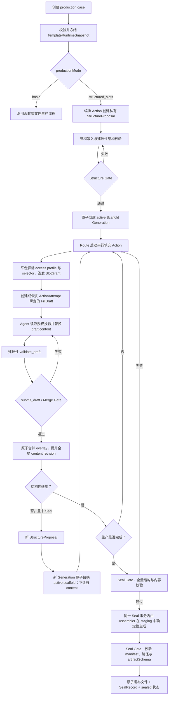

# Forge Core 结构槽引擎系统设计

> 状态：**Living Design / 当前权威设计**
> 首次冻结：2026-08-10
> 维护规则：结构槽后续的设计结论、修订和开放问题统一更新在本文，不再新建平行设计文档。
> 文档性质：系统设计，不是实施计划。进入开发前仍需基于本文编写独立 dev plan。
> 历史来源：本文承接并取代 `docs/2026-08-08-structured-slots-three-role-design.md`；旧文档仅保留问题发现过程与历史背景。

---

## 1. 文档目标

本文定义 Forge Core 的**结构槽运行模式**及 Slot Engine 的系统级基础能力。

它回答以下问题：

- 结构槽在 Forge Core 中是什么定位；
- 模板、编排 Agent、填充 Agent 和平台分别拥有什么权力；
- 一个 production case 如何从模板快照走到结构提案、内容填充、校验和正式交付；
- 哪些状态是权威状态，哪些只是私有草稿；
- 权限、恢复、版本、重编排和 Seal 如何保持确定性；
- 首版明确不做哪些能力，未来如何扩展而不破坏当前契约。

本文优先描述**稳定语义和边界**。示例接口与 TypeScript 形状是概念契约；未在“已接受设计”中冻结的具体字段名，可在实施计划中调整，但不得改变本文定义的权威关系和失败语义。

---

## 2. 定位与核心结论

### 2.1 结构槽是模板可选的系统运行模式

Forge Core 保留两种生产模式：

- **基础模式（basic）**：沿用现有整文件生产方式；Agent 通过 `finish_production` 形成文件包，再由现有 custody、gate 和 artifact 版本链托管。
- **结构槽模式（structured slots）**：模板先定义槽类型、结构语法和交付规则；编排 Agent 生成具体槽树；填充 Agent 在私有草稿中写槽内容；平台校验并原子合并；最后由确定性 Assembler 生成正式文件。

运行模式由模板选择。结构槽不是所有模板的强制底座，也不替换现有基础模式。

现有模板未声明结构槽模式时，必须继续按基础模式运行，行为不变。

### 2.2 Slot Engine 是通用内核，不是故事编辑器

Slot Engine 只理解以下系统概念：

- 稳定身份；
- 单根有序树；
- 类型引用；
- `spec` 与 `content`；
- 读写授权；
- 私有草稿；
- schema 与 validator；
- revision、状态和原子提交；
- 确定性组装与 Seal。

Slot Engine 不理解“章节、场景、标题、段落、知乎故事、报告”等业务词。

槽可以表示一句话、一个段落、一个场景、一篇文档、一个 JSON 对象，或其他任何由模板定义的内容单元。槽的粒度和语义不属于平台内核。

### 2.3 Slot Engine 是结构槽模式的创作事实源

结构槽模式下：

- 权威 scaffold 及其已合并 content 是创作事实源；
- FillDraft 和 StructureProposal 是私有候选状态；
- 正式文件是 sealed scaffold 的确定性、不可变投影；
- 不允许把导出文件独立修改后反向当作槽树的新事实；
- 未来的块编辑器只能是 Slot API 的人类交互适配器，不能成为另一套权威存储。

### 2.4 角色不是内核枚举

“编排 Agent、填充 Agent、审核 Agent”是常见流程角色，不是平台硬编码的互斥身份。

平台使用 capability 和 SlotGrant 表达权力。同一个 Agent 可以组合多种能力；模板也可以让不同 Agent 分担能力。Slot Engine 不要求模板必须拆成三个 Agent。

### 2.5 术语与现有命名映射

| 本文术语 | 含义及与当前仓库的关系 |
|---|---|
| production case | 一次独立的模板生产实例；在当前仓库中对应一个 Task / `taskId` |
| TemplateRuntimeSnapshot | case 使用的完整冻结运行契约；应扩展现有 `FrozenTemplate` 与任务 `snapshot/`，不是第二套快照 |
| ActionAttempt | 一次可恢复的生产动作尝试；其与当前 Turn、`turnId`、attempt count 的精确映射在实施契约中确定 |
| StructureProposal | 编排 Agent 的私有候选槽树，不是权威 scaffold |
| Scaffold Generation | 一代不可原地修改的结构与 spec；case 同时只有一个 active generation |
| SlotInstance | scaffold 树中的统一节点，具有平台 ID、typeId、spec 和可选 content |
| SlotGrant | 平台为当前 Agent 和 ActionAttempt 解析出的具体槽读写授权 |
| FillDraft | 绑定 ActionAttempt 与 baseRevision 的私有 content overlay |
| SealRecord | sealed scaffold 与正式派生文件之间的不可变来源记录 |

---

## 3. 目标、非目标与铁律

### 3.1 目标

1. 让模板定义产物允许使用的槽类型、结构语法、内容契约和交付方式。
2. 让编排 Agent 在受模板约束的语言内动态构造具体结构。
3. 让填充 Agent 只看到被授权的槽位投影，并只修改 content。
4. 让所有权威结构和内容更新都经过平台校验与原子提交。
5. 让长内容创作可以持久化恢复，而不把半成品写入权威状态。
6. 让最终交付可追踪到确定的模板快照、scaffold revision、Assembler 和文件哈希。
7. 保持现有 v2 custody、Route、Action、事件与 artifact 模型的权威地位。

### 3.2 首版非目标

首版明确不实现：

- 同一 production case 内的并行填充或并行 merge；
- 自动 rebase、三方合并或槽级冲突消解；
- Notion 类块编辑器；
- Slot Engine 内部的任务领取队列或独立 scheduler；
- StructureProposal 的增量 add/move/delete 模型工具；
- 字符串 diff、JSON Patch、流式槽内容编辑或协同编辑；
- scaffold generation 之间的自动 content 迁移；
- 封存后的同 case 交付版本编辑；
- 运行中的 case 热升级模板；
- 从任意非结构化旧文件自动投影、反推并接管为权威槽树；
- 把某个故事模板的槽粒度、槽类型或文学规则写入平台。

### 3.3 必须保持的 Forge Core 铁律

- 平台代码零业务词；业务语义只存在于模板和业务 fixture。
- 模型不控制工程 ID、revision、时间戳、路径、权限和路由。
- TaskEvent 与权威历史只追加，不覆盖既有事实。
- 模型声明不权威；平台 Gate 和 custody 拥有最终否决权。
- raw provider thinking 不持久化、不展示。
- v2 是当前唯一可运行 TurnContract；结构槽模式不以隐式方式恢复旧 v1 契约。
- 基础模式必须保持向后兼容。

---

## 4. 与现有架构的关系

结构槽运行模式叠加在现有 v2 custody 之上，不建设平行的任务系统、路由系统或文件版本系统。

| 现有组件 | 在结构槽模式中的职责 |
|---|---|
| Template loader / frozen snapshot | 校验模板并在 case 创建时冻结完整运行规则 |
| TaskScheduler / TaskRunner | 继续串行调度 Production Action 与 Agent Turn |
| Route | 决定何时调用哪个 Agent、成功或失败后如何流转 |
| ActionAttempt | 作为 StructureProposal / FillDraft 的执行归属与恢复边界 |
| ActionCommitter / custody | 承担不可绕过的最终提交与原子发布边界 |
| EventStore | 记录权威结构、内容、generation 切换和 Seal 事实 |
| ArtifactStore | 保存 Seal 后的正式派生文件及既有基础模式产物 |
| GateRunner | 作为受信 validator 隔离执行环境的现有基础，后续扩展输入契约 |
| TaskProjector | 从冻结快照和追加事件投影当前 active scaffold、状态与交付结果 |

当前仓库已经在任务创建时复制并复核模板快照。本文的 `TemplateRuntimeSnapshot` 应演进现有 `FrozenTemplate + task snapshot`，而不是在旁边再造一套互不一致的模板冻结机制。

---

## 5. 端到端主流程



主流程的权威边界是：

1. StructureProposal 提交前，权威 scaffold 不存在或不变化。
2. FillDraft 合并前，权威 content 不变化。
3. Seal 完整成功前，正式交付文件不存在或不变化。
4. 每个提交点都必须全有或全无。

---

## 6. 模板运行快照

### 6.1 Case 创建时冻结

每个 production case 创建时，平台必须先完整校验模板并生成不可变 `TemplateRuntimeSnapshot`。同一 case 后续不能再读取模板源目录中的“最新内容”。

概念形状：

```ts
interface TemplateRuntimeSnapshot {
  snapshotId: string;
  templateId: string;
  templateVersion: string;
  snapshotHash: string;

  productionMode: 'basic' | 'structured_slots';
  agents: unknown;
  prompts: unknown;
  routes: unknown;
  artifactSchema: unknown;

  structuredSlots?: {
    slotTypes: unknown;
    layoutGrammar: unknown;
    accessProfiles: unknown;
    slotSelectors: unknown;
    validators: unknown;
    assembler: unknown;
    resourceLimits: unknown;
  };
}
```

这不是最终模板 schema，只表达必须被冻结的语义集合。

### 6.2 快照规则

- 模板 JSON/YAML、prompt、skill 和声明文件保存规范化副本。
- validator、assembler 等受信实现必须有稳定实现引用和内容摘要。
- 密钥值不进入快照，只保存逻辑 secret reference。
- 用户输入、模型输出和运行产物属于 case 数据，不进入模板快照。
- 同一 case 的所有 Scaffold Generation 共用同一 snapshot。
- 模板发布新版本只影响之后创建的新 case。
- v1 不允许运行中的 case 升级模板。
- 恢复时若快照缺失、损坏或实现摘要不一致，系统 fail closed，不能回退到最新模板。

---

## 7. 模板负责什么

### 7.1 一个 Template Package，而不是多个子模板

结构槽模板仍然是一个不可分割的 Template Package。把配置拆成多个文件只是模块化组织，不引入可独立运行、独立版本化或动态组合的“子模板”。整个 package 只有一个 `templateId`、一个 `versionHash`、一次完整校验和一份 case snapshot。

固定文件分层为：

```text
template.yaml
pipeline.yaml
agents/*.yaml

slots/
  contract.yaml
  validators/*
  assembler/*
```

文件职责：

| 文件 | 职责 |
|---|---|
| `template.yaml` | 产品元信息、用户输入字段、最终产物描述 |
| `pipeline.yaml` | productionMode、Agent 顺序、Route、artifactSchema、最终提交者与流程级策略 |
| `agents/*.yaml` | 模型、提示词、Skill、Gate、TurnContract 与 Agent 的 slot capability 上限 |
| `slots/contract.yaml` | SlotTypeDefinition、LayoutGrammar、access profile、validator、Assembler 与结构槽资源限制 |
| `slots/validators/*` | contract 引用的受信校验实现或声明资源 |
| `slots/assembler/*` | contract 引用的确定性组装实现或声明资源 |

### 7.2 contract.yaml 的权威性与拆分边界

`slots/contract.yaml` 是结构槽契约的单一、完整、声明式权威入口，采用“声明内联、实现外置”的组织方式。它的顶层固定分区为：

```yaml
version: 1
slotTypes: []
layoutGrammar: {}
accessProfiles: []
validators: []
assembler: {}
limits: {}
```

具体字段继续逐项收敛，但以下归属不再开放：

- SlotTypeDefinition、LayoutGrammar、access profile、validator/Assembler 的注册与绑定、资源限制必须直接声明在 `contract.yaml`。
- validator、Assembler 的受信实现文件或大型静态资源可以放在固定的 `slots/validators/*`、`slots/assembler/*` 下，由 contract 使用 package-local 安全相对路径引用。
- `contract.yaml` 不能嵌入可执行代码；给 Agent 的结构契约投影也不能暴露实现源码或工程路径。
- v1 不提供任意 YAML include、通用 `$ref` 文件组合、跨 Template Package 引用、外部 URL、递归导入或运行时网络解析。
- 未知顶层键、路径越界、缺失资源、未声明资源、未引用资源或任何外部引用都 fail closed。
- Loader 必须在运行前解析并校验全部引用；规范化声明和引用资源内容或稳定实现摘要共同进入 package 的 `versionHash` 与 snapshot。

这不是一个通用模板模块系统。未来若出现跨模板复用需求，需要独立设计带版本锁定和依赖解析的模块协议，不能通过放宽 v1 文件引用规则隐式获得。

### 7.3 模式启用与兼容规则

`pipeline.yaml` 负责选择生产模式：

```yaml
productionMode: structured_slots
```

- 字段缺失时语义默认为 `basic`，保持现有模板和历史 snapshot 可读、可复核。
- `structured_slots` 模式必须存在并完整校验固定路径 `slots/contract.yaml`。
- `basic` 模式出现 `slots/contract.yaml` 或结构槽专用绑定时必须 fail closed，不能静默忽略死配置。
- `slots/contract.yaml` 必须声明自己的契约版本，例如 `version: 1`。
- exact field schema 后续继续收敛，但固定路径、模式归属和单 package 版本语义不再开放。

### 7.4 控制面职责

结构槽模板冻结以下控制面：

1. **交付格式与 artifactSchema**：最终要生成哪些文件、格式和媒体类型。
2. **SlotTypeDefinition 集合**：允许编排 Agent 使用哪些槽类型。
3. **LayoutGrammar**：类型之间允许怎样嵌套、排序和重复。
4. **实例 spec 契约**：每类槽允许编排 Agent填写哪些实例级意图。
5. **content 契约**：槽内容的 JSON schema、存在性和尺寸限制。
6. **validator**：槽级、子树级和 scaffold 级规则及触发时机。
7. **Assembler**：如何把合法的 sealed scaffold 确定性转换为 artifact 文件。
8. **Agent capability 上限**：每个 Agent 最多可以提出结构、读取、填充、校验、审核或请求 Seal 中的哪些操作。
9. **access profile 与 slot selector**：每个 Action 可以读取和写入哪些逻辑范围。
10. **Route / Action 流程**：调用顺序、失败与成功后的流程走向。

模板定义的是一门受约束的结构语言；编排 Agent 只在这门语言中构造实例，不能创建新类型、放宽 grammar、注入执行代码或扩大权限。

`artifactSchema` 只描述最终派生文件，不嵌套槽树。槽树是结构槽模式的创作事实源，Assembler 负责将 sealed scaffold 映射成符合 artifactSchema 的输出 manifest。

### 7.5 Loader、校验与版本哈希

- 现有 template loader 仍是唯一加载入口，不新增平行 Slot Template Loader。
- Loader 先读取 `productionMode`，再按模式要求加载或拒绝 `slots/` 契约。
- Agent capability、pipeline 绑定、access profile、selector、validator 和 Assembler 引用必须做完整交叉引用校验。
- 所有引用必须限制在当前 Template Package 内；缺失、路径越界、未声明资源或摘要异常都 fail closed。
- 规范化的 `slots/contract.yaml`、所有被引用资源的内容及受信实现摘要必须进入现有 `versionHash`。
- 历史模板缺失 `productionMode` 时，canonicalization 必须保持原有 hash 稳定；不能因为新增默认字段而把已冻结 task 判为损坏。
- 任务创建时仍把整个已验证 package 复制到现有 `snapshot/`，运行期只读取该快照。

---

## 8. 槽树与身份模型

### 8.1 SlotTypeDefinition 只定义节点自身

`SlotTypeDefinition` 只回答“这个槽节点自身是什么”，至少承担以下内在契约：

- package 内唯一、稳定的 `typeId`；
- 面向模板作者和 Agent 的名称与说明；
- 实例级编排意图 `spec` 的 `specSchema`；
- content 的存在策略：`forbidden | optional | required`；
- content 的 `contentSchema`。

它不承担节点之间或系统其他层面的职责：

| 不属于 SlotTypeDefinition 的规则 | 权威归属 |
|---|---|
| 根类型、允许的父子类型、顺序、重复、分组和基数 | LayoutGrammar |
| Markdown 等交付格式的渲染 | Assembler |
| Agent 读写范围和运行期授权 | access profile / SlotGrant |
| 超出 schema 的语义检查及其实现 | validator registry |
| slotId、revision、ACL、存储路径等工程字段 | 平台运行时 |

因此同一个 slot type 可以在多个合法结构上下文中复用，而不会在类型内部复制或冲突地维护关系规则。SlotTypeDefinition 不能携带 `allowedChildren`、`allowedParents`、渲染片段、ACL 或可执行代码。

`specSchema` / `contentSchema` 的具体受限 schema 语言继续收敛，但类型与结构语法的职责边界不再开放。

### 8.2 SlotTypeDefinition 全显式契约

SlotTypeDefinition 的外层字段没有猜测槽语义的业务默认值。每个条目都必须显式声明 `id`、`name`、`description`、`specSchema` 和 `content`：

```yaml
slotTypes:
  - id: paragraph
    name: 正文段落
    description: 承载一段连续正文
    specSchema:
      type: object
      additionalProperties: false
      properties:
        purpose:
          type: string
      required: [purpose]
    content:
      presence: required
      schema:
        type: string
        minLength: 1
        maxLength: 5000
```

规则：

- `id` 是 package 内唯一的安全标识；SlotInstance 使用该值作为 `typeId`。
- `name` 与 `description` 必须是非空字符串，且可以安全投影给 Agent。
- `specSchema.type` 必须显式为 `object`，根层必须显式 `additionalProperties: false`。
- `content.presence` 必须显式为 `forbidden | optional | required`。
- `presence: forbidden` 时禁止声明 `content.schema`，槽始终保持 content unset。
- `presence: optional | required` 时必须声明 `content.schema`；规范化后分别形成 `contentPresence` 与 `contentSchema`。
- `required` 不阻止创建尚未填充的 scaffold 或开放 Draft；它只要求 Seal Gate 前 content 已 set。Merge Gate 不因其他 required 槽仍 unset 而阻塞合法的局部合并。
- SlotTypeDefinition、content wrapper 和 schema 中的未知字段或不合法组合全部在 Loader 阶段拒绝。

Loader 不得根据名称或说明推断 schema，不得把缺失 schema 解释为 any，也不得把缺失 presence 默认成 optional/string。Slot Schema 内部某个白名单关键字未出现时，仍按冻结 dialect 为该关键字定义的确定语义解释；“全显式”针对槽类型的业务契约，不要求机械写出所有无关 schema 关键字。

### 8.3 specSchema 与 contentSchema 的统一方言

`specSchema` 与 `contentSchema` 共用一套由平台版本化、白名单控制的 JSON Schema 子集。它沿用 JSON Schema 的声明结构和常用关键字语义，但不承诺支持完整 JSON Schema；contract v1 对应固定的 Slot Schema dialect v1，规范化 snapshot 必须显式保存或可确定性推导该 dialect 身份。

v1 支持的能力类别包括：

- `string`、`number`、`integer`、`boolean`、`object`、`array`、`null` 基础类型；
- `properties`、`required`、`additionalProperties` 对象约束；
- `items`、`minItems`、`maxItems` 数组约束；
- `enum`、`const` 值集合约束；
- 字符串长度、模式和数值范围等有界基础约束。

v1 明确禁止：

- `$ref`、跨位置或外部 schema 引用；
- 递归 schema；
- `if / then / else` 条件执行；
- 任意模板自定义或可执行关键字；
- 未进入当前 dialect 白名单的关键字；
- 形成通用程序或无界求值复杂度的组合能力。

Loader 必须在模板加载期对 schema 本身执行 meta-validation。未知关键字、非法关键字组合、超出深度/节点数/正则长度等资源限制都 fail closed，不能被底层 schema 库静默忽略。运行期校验器和错误格式只能按 snapshot 冻结的 dialect 解释，不能因依赖库升级而改变历史 case 语义。

content 的根值仍可由模板声明为任意合法 JSON 类型，基础引擎不把它限定为字符串、段落或文档。`contentPresence: unset` 是槽实例外层状态，与 content schema 允许的合法 `null` 不同。

精确关键字白名单、每个关键字的参数限制和组合规则继续收敛；受限方言、加载期拒绝未知能力以及 spec/content 复用同一验证内核的方向不再开放。

### 8.4 spec 固定为对象，content 保持任意 JSON

每个 ProposalNode 和正式 SlotInstance 的 `spec` 始终存在，根值固定为 JSON object。没有实例级编排意图时，spec 的值为严格空对象 `{}`；不能省略，也不能使用字符串、数组、数值、布尔值或 `null`。

因此：

- 每个 `specSchema` 的根类型固定为 `object`；
- `spec` 使用稳定字段路径表达 purpose、tone、targetLength 等模板自定义的编排意图；
- StructureProposal 的基础形状校验即可拒绝非对象 spec，不必等到类型级 Structure Gate；
- spec 的具体必填字段仍由对应 SlotTypeDefinition 决定。

`content` 不采用相同限制。它可以是任意合法 JSON value，具体根类型完全由 `contentSchema` 决定。content 是否存在由 `forbidden | optional | required` 控制；外层 `unset` 与已经 set 为合法 `null`、空字符串、空数组或空对象不是同一状态。

这个约束只稳定编排意图的形状，不限制模板实际交付内容的粒度或类型。

### 8.5 单根有序统一节点树

每个 scaffold 是一棵单根、有序树。所有布局节点统一为 `SlotInstance`，不另设 container node 与 leaf slot 两套实体。

一个槽是否允许自身 content、是否允许 children，是两个独立维度：

- 可以是纯容器；
- 可以是只有 content 的叶子；
- 可以同时拥有 content 与 children；
- 也可以是模板定义的无 content 标记节点。

跨槽依赖不放进布局树。布局树只表达所有权、嵌套和渲染顺序；语义依赖、校验依赖和未来的失效传播使用独立关系模型。

### 8.6 概念数据结构

```ts
type JsonValue =
  | null
  | boolean
  | number
  | string
  | JsonValue[]
  | JsonObject;

type JsonObject = { [key: string]: JsonValue };

interface SlotInstance {
  slotId: string;             // 平台生成，generation 内稳定
  scaffoldId: string;
  parentSlotId: string | null;
  order: number;
  typeId: string;
  spec: JsonObject;           // 始终存在的对象型编排意图，提交 scaffold 后冻结
  contentPresence: 'unset' | 'set';
  content?: JsonValue;        // 只有 set 时存在
}
```

具体持久化实现可以把 tree、spec 和 content 分表或分文件保存；概念契约不要求物理上嵌在同一个对象中。

### 8.7 `spec` 与 `content` 严格分离

`spec` 由编排阶段产生，用于表达“这个槽应当完成什么”；`content` 由填充阶段产生，用于表达“实际写了什么”。

规则：

- StructureProposal 只能提出 `typeId + spec + tree`；不能提前写 content。
- scaffold 提交后，结构、typeId、spec 和 slotId 全部冻结。
- FillDraft 只能提出授权槽的 content 变更。
- content 不能携带 ACL、validator 路径、revision、平台 ID 或其他工程字段。
- “未填写”是独立状态，不等同于合法的 `null`、空字符串、空数组或空对象。

---

## 9. StructureProposal 与 scaffold 创建

### 9.1 Proposal 是私有候选状态

编排 Agent 不直接增量修改权威 scaffold，而是在 ActionAttempt 绑定的私有 `StructureProposal` 上工作。

首版模型接口：

- `get_structure_contract`
- `put_structure_proposal`
- `get_structure_proposal`
- `validate_structure_proposal`
- `submit_structure_proposal`

首版使用**整树替换**，不提供增量 add/move/delete 工具。

### 9.2 ProposalNode

```ts
interface ProposalNode {
  clientKey: string;       // Proposal 内唯一，仅用于定位和报错
  typeId: string;
  spec: JsonObject;
  children: ProposalNode[];
}
```

ProposalNode 不得包含：

- content；
- 正式 slotId；
- ACL 或 SlotGrant；
- revision；
- validator / assembler 可执行代码；
- 存储路径。

### 9.3 Proposal 写入与提交

`put_structure_proposal` 只强制：

- JSON 可序列化；
- 每个节点的 spec 存在且为对象；
- 总体大小、深度和节点数限制；
- `clientKey` 唯一；
- 不包含禁止的工程字段；
- 存储安全。

它允许暂时违反 specSchema、LayoutGrammar 和基数约束。

`validate_structure_proposal` 提供建议性 issues。`submit_structure_proposal` 执行完整 Structure Gate；成功后平台原子创建 scaffold、生成正式 slotId，并返回 `clientKey -> slotId` 映射。

Proposal 生命周期：

```text
open ──> committed
  └────> abandoned
```

校验失败不关闭 Proposal。

---

## 10. 权限模型

### 10.1 两层授权

结构槽采用：

1. **模板冻结能力上限与访问配置**；
2. **平台在运行期解析具体 SlotGrant**。

Agent 不能提交原始 ACL、任意 slot ID 列表或自行扩大授权。

### 10.2 Capability，而不是固定角色

通用 capability 可以包括：

- `propose_structure`
- `read_slot_spec`
- `read_slot_content`
- `write_draft_content`
- `validate_draft`
- `request_merge`
- `audit_slots`
- `request_seal`

最终命名可以在 schema 设计时收敛，但能力必须可组合，不能强制映射为互斥角色。

### 10.3 SlotGrant

平台根据冻结模板、当前 Action、Agent、active scaffold 和 access profile 生成内部 Grant：

```ts
interface SlotGrant {
  grantId: string;
  caseId: string;
  actionAttemptId: string;
  scaffoldId: string;
  baseRevision: number;
  agentId: string;
  capabilities: string[];
  readableSlotIds: string[];
  writableSlotIds: string[];
  draftId: string | null;
  expiresAt: string | null;
}
```

### 10.4 授权不变量

- 所有 Slot API 默认拒绝，逐次在服务端校验。
- Agent 只接收授权范围内的槽位投影；隐藏槽在其视角中不存在。
- 写权限不自动等于整树读权限。
- 祖先、依赖或邻接上下文必须由 profile 显式授予只读访问。
- Grant 绑定具体 case、ActionAttempt、scaffold、revision、Agent 和 draft，不能跨任务复用。
- Merge Gate 再次检查实际 changes 没有越过 writable scope。
- validation issue 也要经过授权过滤，不能通过错误消息泄露隐藏槽内容或关系。
- ACL 属于控制面，不能进入 slot spec 或 content。

---

## 11. 调度边界与串行模型

### 11.1 不建设 Slot Scheduler

首版不新增 `SlotWorkItem`、领取队列或 Slot Scheduler。

现有 Production Action / ActionAttempt / Route 继续负责：

- 何时调用哪个 Agent；
- 当前执行哪个生产阶段；
- 成功或失败后流向哪里；
- 重试、停止和恢复。

Slot Engine 只负责：

- 根据 Action 上下文签发 SlotGrant；
- 创建或恢复 StructureProposal / FillDraft；
- 授权投影；
- 校验与原子提交；
- scaffold generation 与 Seal。

一次 Action 可以覆盖一个槽、多个槽或一个子树。工作粒度由模板 selector 决定，平台不假设“一个槽等于一个任务”。

### 11.2 v1 单 case 串行

同一 production case 内，同一时刻只允许一个可提交的写入流程和一个 `open` 的可写 FillDraft。

FillDraft 严格绑定全局 `baseRevision`。任意权威 content merge 都提升 scaffold 的全局 content revision。Merge Gate 要求：

```text
draft.baseRevision === activeScaffold.contentRevision
```

不相等时返回确定性的 `DRAFT_STALE`，不执行自动 rebase、局部冲突检查或三方合并。

跨 case 的现有调度能力不受此决定影响。未来若出现真实的单 case 并行需求，可新增依赖感知提交协议，但不能静默改变 v1 草稿的严格基线语义。

---

## 12. FillDraft 与模型工具

### 12.1 FillDraft 是逻辑副本、物理 overlay

Agent 的创作体验是一份授权槽树副本；物理实现保存：

- 冻结 scaffold 基线；
- 授权后的可见视图；
- content overlay / changes；
- validation summary；
- baseRevision 与 ActionAttempt 归属。

完整复制整棵槽树不是首版要求，也不能借此把未授权槽泄露给 Agent。

### 12.2 上下文绑定的窄 Slot API

模型工具自动绑定当前 ActionAttempt、FillDraft 和 SlotGrant。模型不传入 caseId、scaffoldId、draftId、agentId、revision、Grant 或 ACL。

概念接口：

- `list_slots`：返回授权槽位大纲，默认不加载完整 content；
- `read_slot`：返回可见 type、spec、有效 content 与状态；
- `replace_draft_content`：批量完整替换一个或多个可写槽的 content；
- `unset_draft_content`：显式恢复为“尚未填写”；
- `validate_draft`：建议性自检；
- `submit_draft`：请求 Merge Gate 与原子合并；
- `get_draft_status`：返回生命周期、基线、变更和校验摘要。

填充接口不得创建、删除、移动槽，或修改 typeId、spec、ACL、revision 和平台 ID。

### 12.3 写入语义

- content 必须是 JSON 可序列化值。
- contentSchema 决定具体允许字符串、对象、数组、数字、布尔或 null 中的哪些形状。
- 首版使用完整值替换，不提供内容 patch。
- 批量替换在草稿内部全有或全无。
- 每次写入携带幂等 request ID。
- 草稿写入只执行权限、存储安全、大小和禁止字段检查；允许业务上暂时不完整。

---

## 13. FillDraft 生命周期、恢复与幂等

```text
open ──────> merged
  ├────────> stale
  └────────> abandoned
```

- `open`：允许继续修改、自检和请求合并。
- `merged`：已原子合并到权威 scaffold，永久只读。
- `stale`：baseRevision 不再匹配，永久禁止提交。
- `abandoned`：ActionAttempt 取消、确定失败或 active generation 被替换，永久只读。

业务校验失败不是生命周期状态。校验失败时 Draft 保持 `open`，只更新 validation issues。

恢复规则：

- FillDraft 持久化，不依赖模型上下文或进程内存。
- 同一 ActionAttempt 使用幂等 `getOrCreateDraft(actionAttemptId)` 语义找回同一草稿。
- 恢复时重新校验 Agent、Grant、active scaffold、baseRevision 和模板快照。
- 新 ActionAttempt 默认创建新草稿，不自动继承失败 Attempt 的 overlay。
- v1 不提供跨 Attempt 自动续写或草稿克隆。
- merge 必须幂等；如果提交成功但响应丢失，重放返回原提交结果，不再次提升 revision。
- terminal Draft 保留为只读审计记录，但不参与 Assembler。

---

## 14. 分层校验模型

### 14.1 草稿写入检查

草稿写入只强制：

- 当前 Draft 和槽存在；
- 当前主体有写权限；
- payload 可安全持久化且未超过限制；
- 变更只涉及 content；
- 请求幂等键合法。

草稿允许暂时漏填、违反 contentSchema 或不满足业务 validator。

### 14.2 建议性自检

`validate_draft` 在 `base scaffold + overlay` 上运行，帮助 Agent 修正问题。结果不改变权威 scaffold，也不代表后续 Merge Gate 必然通过。

### 14.3 Merge Gate

Merge Gate 是权威、不可绕过且原子的局部提交门禁。至少检查：

1. Draft 仍为 `open`；
2. active scaffold 与 Draft 绑定一致；
3. 全局 baseRevision 严格匹配；
4. SlotGrant 和 writable scope 仍有效；
5. 所有 changes 都只修改 content；
6. 变更槽通过 contentSchema；
7. 变更槽的 merge-trigger validator 通过；
8. 受影响 subtree / scaffold 的 merge-trigger validator 通过。

通过后整批 changes 原子合并并提升全局 revision；失败时权威树零变化。Merge 后整棵树可以仍未完成。

### 14.4 Seal Gate

Seal Gate 是一个覆盖“输入全量重验、staging 生成、输出校验”的复合门禁。它对当前 active scaffold 做全量重验，并在同一 Seal 事务中验证 Assembler 结果：

- 所有 required content 已填写；
- 所有 contentSchema 通过；
- 所有 slot / subtree / scaffold validator 通过；
- LayoutGrammar 仍合法；
- 不存在 pending、invalid 或未运行的强制校验；
- Assembler 在隔离 staging 中成功生成；
- 候选输出的 manifest 与 artifactSchema 匹配。

Seal Gate 失败时不能发布部分正式文件。

### 14.5 Validator 契约

validator 声明：

```ts
type ValidatorScope = 'slot' | 'subtree' | 'scaffold';
type ValidatorTrigger = 'merge-and-seal' | 'seal';
```

validator 本身只返回规范化 `{ pass, issues }`。平台负责计算 `not_run`、`pending`、缓存与输入哈希失效。Seal 无条件重跑适用的全部强制校验。

v1 可以使用保守的受影响范围重跑策略；以后优化依赖图不能改变外部通过/失败语义。

### 14.6 状态维度保持正交

不要把所有状态压成一个巨大枚举。至少分离：

- `structureStatus`
- `contentRevision`
- `sealStatus`
- Draft lifecycle
- 派生 validation summary

---

## 15. Scaffold Generation 与重编排

已提交的 scaffold 结构、spec 和 slotId 永不原地修改。

封存前若发现结构不适合继续生产：

1. 具有 `propose_structure` 能力的 Action 创建新 StructureProposal；
2. 新 Proposal 完整通过 Structure Gate；
3. 平台原子创建新的 Scaffold Generation；
4. case 的 `activeScaffoldId` 原子切换；
5. 旧 generation 标记 `superseded` 并永久只读；
6. 旧 generation 上 open Draft 变为 `abandoned`；
7. Route 决定从哪个生产阶段重新开始。

如果新 Proposal 失败，旧 active scaffold 保持不变。

新 generation 的所有槽获得全新 slotId。v1 不按 clientKey、类型、位置或内容匹配身份，不迁移旧 content。

重编排只允许发生在 Seal 前。Seal 后的修改在 v1 中通过新的 production case 完成。

---

## 16. LayoutGrammar 与 Assembler 分离

LayoutGrammar 和 Assembler 解决两个不同问题：

- **LayoutGrammar** 回答“这棵槽树是否合法”；
- **Assembler** 回答“如何把一棵已合法并完整的槽树转换为交付文件”。

不能用渲染结果反推结构是否合法，也不能允许 Assembler 在渲染时偷偷修正非法结构。

对于 Markdown 故事模板，模板可以定义标题、副标题、正文、引用等业务类型和渲染规则；但这些类型不进入 Slot Engine 枚举。其他模板可以定义完全不同的类型和输出格式。

Assembler 必须：

- 确定性；
- 只读取冻结 snapshot、scaffold 快照和显式配置；
- 不调用模型；
- 不访问网络；
- 不修改槽位；
- 不从未校验 content 构造任意输出路径；
- 在隔离 staging 中产生候选文件。

需要模型创作的标题、过渡语或格式内容必须先进入槽，而不能由 Assembler 临时生成。

---

## 17. Seal 与正式交付

### 17.1 Seal 流程

1. 固定当前 `activeScaffoldId + contentRevision`。
2. 执行全量 Seal Gate。
3. Assembler 在 staging 中生成候选文件。
4. 校验 artifactSchema、路径安全、媒体类型、大小和 manifest。
5. 计算 scaffold tree hash 与各文件 SHA-256。
6. 提交前再次确认 active scaffold 与 revision 未变化。
7. 通过现有 custody 原子发布全部文件、不可变 SealRecord 和 sealed 状态。

任一步失败都不得留下正式文件或 SealRecord。

### 17.2 SealRecord

```ts
interface SealRecord {
  sealId: string;
  caseId: string;
  scaffoldId: string;
  scaffoldRevision: number;
  scaffoldTreeHash: string;
  templateId: string;
  templateVersion: string;
  snapshotHash: string;
  assemblerId: string;
  assemblerVersion: string;
  outputs: Array<{
    path: string;
    mediaType: string;
    byteLength: number;
    sha256: string;
  }>;
  sealedAt: string;
}
```

### 17.3 Seal 不变量

- 同一 scaffold revision 的重复 Seal 请求幂等返回原 SealRecord。
- Seal 成功后 scaffold、slot content 和正式派生文件只读。
- 结构槽模式禁止绕过 Slot Engine 直接改写正式输出。
- 磁盘文件与 SealRecord 哈希不一致时判定为产物损坏，不反向吸收为槽 content。
- v1 将 Seal 视为当前 case 的生产终点。
- 基础模式继续沿用现有 final submission 语义。

---

## 18. 事实源、持久化与事件

### 18.1 权威层级

| 对象 | 权威性 | 可变方式 |
|---|---|---|
| TemplateRuntimeSnapshot | 不可变权威规则 | 创建 case 时一次冻结 |
| StructureProposal | 私有候选 | open 状态下整树替换 |
| Scaffold Generation | 不可变结构权威 | 只能被新 generation supersede |
| FillDraft | 私有候选 | open 状态下 content overlay 变更 |
| Scaffold content revision | 权威内容 | 只能通过 Merge Gate 原子提升 |
| SealRecord | 不可变交付事实 | Seal 成功时一次创建 |
| 正式 artifact 文件 | Seal 的不可变物理投影 | 只能由 custody 原子发布或按同一 Seal 修复 |

### 18.2 追加与投影原则

- 权威事实应以追加事件或等价的不可变提交记录表示。
- 当前 active scaffold、content revision、Draft lifecycle 和 seal status 可以由投影器计算或由可验证快照加事件共同恢复。
- 私有草稿写入必须可恢复，但不能伪装成已合并权威 content。
- generation 切换、merge 和 Seal 必须有稳定、幂等的提交身份。
- 崩溃恢复不得猜测“可能已经成功”；应通过提交记录和哈希确认完成或回滚 staging。

具体事件联合、文件目录和 checkpoint 策略留到实施设计中确定，但不得削弱上述语义。

---

## 19. 错误处理原则

所有模型工具和平台提交必须返回稳定 code 与结构化 issues，不能只返回自然语言。

已冻结的关键失败语义：

- `DRAFT_STALE`：FillDraft 的全局 baseRevision 已过期；Draft 转为或被视为不可提交。
- `TEMPLATE_RUNTIME_UNAVAILABLE`：冻结 snapshot 或受信实现缺失/摘要不一致；fail closed。
- 未授权读取在 Agent 视角中不能证实隐藏槽是否存在。
- Proposal / Draft 校验失败保留 open 状态，允许同一 Attempt 修正。
- Merge、generation 切换和 Seal 的任何校验失败都必须保持权威状态零变化。
- 已成功提交但响应丢失时，重放应返回原结果。

其余错误码集合在实施计划前统一命名，避免不同模块为同一失败创造多个含义相近的 code。

---

## 20. 安全边界

- 模型参数面拒绝 task/case/scaffold/draft/grant/agent/revision/path 等工程键。
- 模型工具从当前执行上下文获取真实身份。
- slotId 由平台生成；Proposal 只有局部 clientKey。
- 模板冻结访问 profile，Agent 不能生成或放宽 ACL。
- 所有路径必须来自模板声明或平台安全派生，不能直接使用 content 作为路径。
- validator 与 Assembler 只能在受限环境执行，不能获得任意 FS、网络、`require` 或进程能力。
- 工具返回、validation issue 和统计信息都必须避免隐藏槽侧漏。
- Secret 只在需要时通过逻辑引用解析，不写进模板快照、SlotGrant、Draft、事件或 SealRecord。
- 资源限制必须覆盖 Proposal 节点数/深度/大小、单槽 content 大小、Draft 总大小、validator CPU/内存/超时和 Assembler 输出大小。

---

## 21. 可观测性与审计

结构槽模式至少应能追踪：

- case 使用的 snapshotHash；
- StructureProposal 的 ActionAttempt、校验和提交结果；
- scaffold generation 创建与 supersede 链；
- SlotGrant 的主体、profile 与解析范围摘要；
- FillDraft 的归属、baseRevision、变更槽集合和 lifecycle；
- Merge Gate 的 validator 结果与新 revision；
- Seal Gate、Assembler、manifest 和 SealRecord；
- 所有幂等重放是新提交还是已提交结果回放。

可观测信息不能破坏信息隔离：UI、Agent trace 和公开错误只能看到当前用户/Agent有权读取的投影；内部审计记录可以保存平台控制面，但不能包含 raw provider thinking 或明文 secret。

---

## 22. 测试策略

实施时至少覆盖以下测试层：

### 22.1 模板与快照

- 未声明结构槽的旧模板仍按基础模式运行；
- structured template 的类型、grammar、profile、validator 和 assembler 引用 fail closed；
- 同内容快照 hash 稳定；任一受控输入变化都会改变 hash；
- 运行中修改模板源目录不影响既有 case；
- snapshot 缺失或摘要不一致时不可恢复运行。

### 22.2 StructureProposal

- 非法中间 Proposal 可以保存并获得 issues；
- clientKey 重复、过深、过大或包含工程字段时拒绝写入；
- Structure Gate 失败零权威写入；
- 成功提交只创建一个 generation，并生成唯一 slotId；
- 重放 submit 返回同一结果。

### 22.3 授权

- hidden slot 不能通过 list/read/error/validator issue 侧漏；
- writable scope 外的 change 整批拒绝；
- 知道其他 draftId 或 slotId 不能越权访问；
- Grant 在 Agent、Attempt、scaffold 或 revision 不匹配时失效。

### 22.4 FillDraft 与 Merge

- Draft 在进程重启后可由同一 Attempt 恢复；
- validation 失败保持 open；
- 批量草稿写入全有或全无；
- request ID 重放无重复副作用；
- baseRevision 不匹配稳定返回 `DRAFT_STALE`；
- Merge Gate 任一检查失败时 scaffold revision 和 content 零变化；
- merge 响应丢失后的重试返回原 revision。

### 22.5 Generation 与 Seal

- 新 generation 校验失败不影响旧 active scaffold；
- 成功切换原子更新 active 指针并废弃旧 open Draft；
- 不发生自动 content 迁移或 slotId 复用；
- Seal 任一步失败不留下正式文件或 SealRecord；
- 多文件发布全有或全无；
- Seal 重放幂等；
- 文件哈希损坏可被检测；
- sealed scaffold 拒绝进一步填充或重编排。

### 22.6 铁律回归

- 平台结构槽模块源码不出现业务模板词；
- 基础模式现有单测、集成测试和真实模板 acceptance 全部保持通过；
- 模型工具 schema 不暴露工程字段；
- validator / assembler 的沙箱限制有超时、内存、FS 和网络逃逸测试。

---

## 23. 首版范围摘要

首版结构槽引擎需要完成的最小闭环是：

1. 模板可选择 `basic` 或 `structured_slots`。
2. 结构槽模板保持单一 Template Package；固定 `slots/contract.yaml` 使用“声明内联、实现外置”的分文件契约。
3. 扩展现有冻结模板快照以包含结构槽规则和所有引用资源摘要。
4. 持久化 StructureProposal，整树校验后原子创建 scaffold。
5. SlotTypeDefinition 使用无业务默认值的全显式契约，只定义节点内在属性；spec 固定为对象、content 保持任意 JSON，二者共用版本化的受限 JSON Schema 方言；LayoutGrammar 统一定义结构关系；SlotInstance 使用单根有序树并严格分离 spec/content。
6. 模板上限 + 运行期 SlotGrant 两层授权。
7. Production Action/Route 调度，单 case 串行。
8. 持久化 FillDraft、窄 Slot API、严格全局 baseRevision。
9. 草稿自检、Merge Gate、Seal Gate 三层校验。
10. 不可变 Scaffold Generation 的封存前整代替换。
11. 确定性 Assembler、staging、SealRecord 与多文件原子发布。
12. 基础模式零行为变化。

---

## 24. 后续演进方向

以下能力只能在出现明确需求后独立设计：

- 依赖感知的同 case 并行填充；
- per-slot / subtree revision 与冲突协议；
- StructureProposal 增量编辑 API；
- Draft patch、流式大内容写入或协同编辑；
- 人类块编辑器适配器；
- scaffold generation 之间的显式 content migration proposal；
- Seal 后交付版本链；
- 任意旧文件到槽树的投影、回收与复校；
- 专门的语义审核 Agent 协议与审核证据模型；
- 更精细的 validator 依赖图和缓存；
- artifact route 按槽投影注入。

这些扩展不得改变已有对象的权威性：Agent 仍不能直接改权威 scaffold，文件仍不能反向覆盖 sealed 槽树，权限仍由模板上限和平台 Grant 决定。

---

## 25. 尚待继续收敛的具体设计

主流程已经冻结，以下属于进入 dev plan 前仍需在本文继续讨论并定稿的实现级系统契约：

1. `slots/contract.yaml` 各顶层分区的最终 YAML/TypeScript 字段 schema；权威入口、分区、声明/实现边界、固定路径和单 package 版本语义已经冻结。
2. LayoutGrammar 的声明语言、表达能力和错误定位格式。
3. Slot Schema v1 精确关键字白名单、组合能力和参数限制；SlotTypeDefinition 外层字段、条件组合、无业务默认值、spec/content 根形状、受限方言和类型职责边界已经冻结。
4. 中性 slot selector DSL 与 access profile 解析规则。
5. validator / Assembler 的注册、快照、沙箱和版本协议。
6. Structure / Merge / Seal issue 的统一 schema 与错误码集合。
7. 追加事件联合、私有 Draft Store、checkpoint 和磁盘目录布局。
8. 结构槽 Action 与现有九动作/TurnContract 的精确适配方式。
9. TaskWorkspace、API 和 UI 需要暴露的最小只读投影。
10. 现有 artifact publish / final submission 与 Seal 的精确映射。

这些不是对主流程语义的重新开放；它们只能在本文已冻结的边界内选取实现方案。

---

## 26. 已接受决策记录

| 日期 | 决策 |
|---|---|
| 2026-08-10 | 结构槽采用模板可选运行模式，基础模式继续存在 |
| 2026-08-10 | Slot Engine 保持内容类型与槽粒度无关 |
| 2026-08-10 | 模板定义槽类型、排布语法和交付格式；编排 Agent 实例化结构 |
| 2026-08-10 | 结构合法性由 LayoutGrammar 决定，渲染由独立 Assembler 完成 |
| 2026-08-10 | Slot Engine 是权威；块编辑器后置为可选适配器 |
| 2026-08-10 | 布局采用单根有序统一节点树，依赖关系与布局树分离 |
| 2026-08-10 | SlotInstance 严格分离编排 spec 与填充 content |
| 2026-08-10 | 结构与内容均在私有草稿中创作，通过 Gate 后原子提交 |
| 2026-08-10 | FillDraft 使用授权视图与 content overlay，不物理复制隐藏槽 |
| 2026-08-10 | 校验采用草稿自检、局部 Merge Gate、全量 Seal Gate |
| 2026-08-10 | 权限采用模板能力上限与运行期 SlotGrant 两层授权 |
| 2026-08-10 | v1 单 case 串行，使用全局严格 baseRevision |
| 2026-08-10 | 复用现有 Production Action / Route 调度，不建设 Slot Scheduler |
| 2026-08-10 | FillDraft 持久化、绑定 ActionAttempt，终态不可再写 |
| 2026-08-10 | 填充 Agent 使用上下文绑定的窄 Slot API，content 完整替换 |
| 2026-08-10 | StructureProposal v1 使用整树替换、建议性校验和原子提交 |
| 2026-08-10 | 封存前重编排使用不可变 Scaffold Generation 整代替换，不迁移 content |
| 2026-08-10 | 交付使用确定性 Assembler、不可变 SealRecord 和多文件原子发布 |
| 2026-08-10 | production case 启动时冻结完整 TemplateRuntimeSnapshot，中途不升级 |
| 2026-08-10 | 结构槽模板是单一 Template Package，按职责拆分为 pipeline、agent 与固定 slots contract 文件 |
| 2026-08-10 | slots contract 采用声明内联、实现外置；v1 禁止任意 include、跨包和外部引用 |
| 2026-08-10 | SlotTypeDefinition 只定义节点内在契约，所有节点关系统一归 LayoutGrammar |
| 2026-08-10 | specSchema 与 contentSchema 共用平台版本化的 JSON Schema 白名单子集，未知能力加载期拒绝 |
| 2026-08-10 | spec 始终为对象且不可省略，content 保持模板定义的任意 JSON，unset 与 null 分离 |
| 2026-08-10 | SlotTypeDefinition 核心字段全部显式；禁止 Loader 猜测 schema、presence 或内容类型 |

---

## 27. 文档维护规则

以后每次设计更新应同时完成：

1. 修改相关正文，使当前规则只有一种解释；
2. 在“已接受决策记录”追加或修订对应条目；
3. 若推翻旧决定，明确写出 superseded 关系及迁移影响，不能只覆盖文字；
4. 更新“首版范围摘要”和“尚待继续收敛的具体设计”；
5. 检查与 `README.md`、`docs/ARCHITECTURE.md` 及当前代码行为是否存在冲突；
6. 在进入实施前另写 dev plan，不把实现任务清单混入本文。
