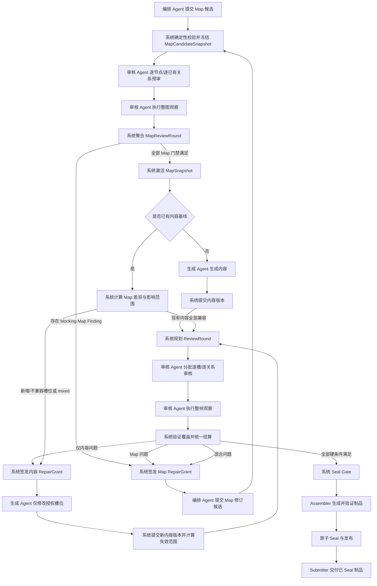

# 结构槽权威审核、返修与系统 Seal 生命周期设计

> 状态：待统一评审
>
> 日期：2026-08-13
>
> 目标版本：Structured Slot Contract v2 / `authoritative_review_v1` capability
>
> 适用范围：ForgeCore 结构槽生产模式；首个迁移目标为 `zhihu-salt-chapter-draft`
>
> 修订：根据统一评审意见，增加生成前 Map 预审；关系网改为平台可选；提高槽位与审核批次容量边界

## 1. 最终设计结论

审核 Agent 负责在生成前对候选 Map 的每个节点和每条实际关系给出结构化判断，并在生成后对每个内容槽位和每条需要语义审核的实际关系给出结构化判断，但无权决定候选 Map 或整棵槽位树是否整体通过。

系统是唯一的权威状态机：它验证审核提交是否完整、是否绑定当前内容与 Map 版本，持久化逐槽审核记录，计算失效范围，分派返修，关闭 Finding，并在全部硬条件满足时自动执行 Seal。整棵槽位树的“通过”不是 Agent 返回的字段，而是系统根据当前事实实时推导出的结果。

核心公式如下：

```text
review_passed =
  所有必审内容槽位均有当前有效的 pass
  AND 所有实际存在的 blocking 关系均有当前有效的 satisfied
  AND 本轮整树观察已完成且绑定当前基线
  AND 不存在尚未 verified_closed 的 blocking Finding
  AND Map、内容、审核策略均未发生未审核变更
```

只有 `review_passed = true`，系统才允许进入确定性的 Seal Gate。任何 Agent 都不能直接写入 `review_passed`、`sealed` 或最终交付状态。

内容生成还有一个更早的系统门禁：编排 Agent 的 Map 候选先经过确定性校验和审核 Agent 的逐节点预审，系统据此推导 `map_approved`。只有 `map_approved = true`，候选才被激活并交给生成 Agent。审核 Agent 同样不能直接写入 Map 整体通过状态。

## 2. 问题与现状诊断

当前结构槽机制把 Seal 当作一次整树级动作：审核/Seal 会得到一个全局成功或失败结果，问题可以携带 `slotId`，但系统没有为每个槽位保存独立、可复用、可失效的审核账本。由此带来五类问题：

1. 整体是否通过事实上交给了一次 Agent/Seal 行为，系统缺少逐槽事实基础。
2. 一个槽位返修后，无法精确判断哪些旧审核仍有效、哪些必须重新审核。
3. 内容问题、Map 问题和二者混合问题没有正式的分流协议。
4. 返修权限容易从“修指定槽位”退化成“重新生成整棵树”，连续性和审计边界都不稳定。
5. Map 候选没有独立的生成前语义门禁，结构槽设计错误往往要等正文生成后才暴露，造成可避免的内容返工。

本设计在 Structure 与 Fill 之间增加 Map Review，并在 Fill 与 Seal 之间增加 Content Review；同时把当前由审核 Agent 调用的 `request_seal()` 从 v2 生产链路中移除。v1 历史任务仍按原协议回放，不原地改变语义。

## 3. 目标与非目标

### 3.1 目标

- 每个内容槽位都有独立、不可变、可审计的审核记录。
- 每条实际存在的 blocking 语义关系都有独立的满足性记录；关系网为空是合法状态。
- Agent 负责语义判断；系统负责提交合法性、状态、聚合、路由和 Seal。
- 编排 Agent 产出位置网与可选关系网组成的 Map 候选；候选经系统校验和审核 Agent 预审后才可由系统激活。
- 生成 Agent 在完整上下文中工作，但只可写 Repair Grant 授权的槽位。
- 内容或 Map 变化后，系统按 digest 与影响图精确失效，而不是全量清零。
- 审核可分批、可恢复；一次审核轮次完成后再统一结算和分派。
- 整树观察能够发现局部批次以外的矛盾，并正式进入 Finding/返修闭环。
- Seal、Assembler 和最终交付继续保持确定性、原子性与可回放性。

### 3.2 非目标

- 不让系统以规则替代 Agent 判断自然语言内容是否连贯或是否满足语义关系。
- 不在首版提供人工直接编辑槽位内容或 Map 的能力。
- 不在首版引入跨任务、跨模板的共享知识图谱。
- 不要求把整棵树一次性塞进模型上下文；“可看全树”通过受权的按需读取实现。
- 不要求任何模板或任何槽位必须建立关系；关系网是可选表达能力，不是平台完整性指标。
- 不在首版支持同一任务内多个写 Agent 并行提交；写入仍遵循任务级单写者约束。
- 不修改已冻结的 v1 任务快照和历史事件含义。

## 4. 统一术语

| 术语 | 定义 |
| --- | --- |
| 槽位树 | 按结构和顺序组织的节点集合，包含内容槽位和无内容容器槽位 |
| 内容槽位 | 需要生成正文且必须接受逐槽语义审核的槽位 |
| 容器槽位 | 只表达章节、分组、层级或布局，不承载正文；参加 Map 节点预审和系统结构校验，但不参加内容逐槽审核 |
| Map | 当前槽位树的位置网与可选关系网的合称；位置网必有，关系网可为空 |
| 位置网 | 父子层级、文档顺序、邻接位置、槽位类型与结构约束 |
| 关系网 | 可选的语义关系覆盖层；由模板定义类型、编排 Agent 按需实例化，一个槽位可以有零条关系 |
| MapCandidateSnapshot | 系统完成确定性校验后冻结、等待审核但尚未激活的 Map 候选 |
| MapSnapshot | Map 候选预审通过后由系统激活的不可变 Map 版本 |
| MapReviewRound | 内容生成前，对 Map 候选逐节点、逐已有关系及整图观察的审核轮次 |
| ReviewRound | 针对一个冻结基线进行的完整审核轮次 |
| ReviewAssignment | 一次 Agent 审核会话的目标集合，分为批次审核和整树观察 |
| Finding | 审核发现的结构化问题及证据；由系统管理生命周期 |
| RepairGrant | 系统签发的返修读写授权和基线约束 |
| Seal Gate | 系统执行的最终确定性门禁与原子发布过程 |

## 5. 不可妥协的系统不变量

1. **Agent 不可 Seal。** Agent 工具集中不存在能直接产生 Seal 状态的写操作。
2. **逐槽语义、系统聚合。** Agent 给出某槽的 `pass/reject`；系统不改写其语义结论，只接受、拒绝或判定其已过期。
3. **审核绑定版本。** 有效审核至少绑定槽位内容 digest、相关 Map 子图 digest 和审核策略 digest。
4. **授权外不可写。** 生成 Agent 对整树可读，但写入必须是 Repair Grant 的 `writeSlotIds` 子集。
5. **Map 候选不等于活动 Map。** 编排 Agent 只能提交候选；候选必须先通过系统校验和 MapReviewRound，系统才可生成活动 MapSnapshot。
6. **关系网平台可选。** 平台协议自身不设置最小关系数，零关系 Map 和零度槽位在 schema 层合法；一旦存在关系，编排 Agent 只能实例化模板已声明类型，不能临时发明类型或降低其 enforcement。模板 validator 可以要求某个具体业务依赖被表达，但不能把平台默认改成“每槽必须有边”。
7. **所有状态可由事件和不可变记录重建。** UI 上的通过率、槽位状态和 Seal readiness 都是投影，不是可被随意覆盖的布尔值。
8. **整轮结算。** 单条审核可以增量持久化，但只有 MapReviewRound/ReviewRound 覆盖完整并完成相应整体观察后，系统才统一激活 Map、路由返修或进入 Seal。
9. **失效优先于继承。** 只有所有绑定 digest 完全匹配时才能复用旧审核；无法证明未受影响时一律重新审核。
10. **Seal 绑定审核事实。** SealRecord 必须包含当前 Map、内容根和 review bundle 的身份，防止审核后偷换内容。
11. **生成前先审 Map。** 系统不得为尚未 `map_approved` 的候选签发 GenerationGrant。

## 6. 选定架构

审核生命周期分为两层：内容生成前的 Map Review，以及 Fill 与 Seal 之间的 Content Review。两者都由审核 Agent 提交局部语义判断、由系统聚合；它们不是 Seal 的一种模式，也不是另一个可独立交付的制品。



初次 Map 没有旧内容时，`B2` 直接进入生成；返修 Map 已有内容时，`B2` 才进入影响计算。这样结构错误会在昂贵的正文生成前被拦住，返修 Map 也不会绕过同一预审门禁。

没有选择“扩展现有 Seal Agent”的原因是：这会继续混合语义判断、流程编排和最终状态权力。也没有把审核设计成独立模板/独立任务，因为首版需要与当前任务的 Map、内容版本、事件账本和原子发布保持同一监管边界。

## 7. 权威边界与职责矩阵

| 主体 | 可读 | 可提交/修改 | 明确禁止 |
| --- | --- | --- | --- |
| 编排 Agent | 模板、活动 Map、整树内容、相关 Findings | Map 候选及修改说明 | 批准/激活 Map、修改正文、关闭 Finding、Seal |
| 生成 Agent | 活动 Map、整树已提交内容、Findings、RepairGrant | 初次内容或 Grant 内的槽位内容；扩权请求 | 改 Map、写 Grant 外槽位、写审核结论、Seal |
| 审核 Agent | Map 候选、活动 Map、整树已提交内容、审核规则、当前 assignment | 逐 Map 节点、逐槽、逐已有关系 verdict、Finding、公开证据 | 改 Map/内容、分派返修、批准整张 Map、关闭 Finding、写整树通过、Seal |
| Review Coordinator | 所有系统记录、事件、digest、模板策略 | Map/内容轮次、批次、记录合法化、Map 激活资格、失效计算、Finding 状态、RepairGrant、路由 | 代替 Agent 判断结构/内容语义 |
| Seal Gate | 当前 Map、内容、review bundle、validators、assembler | SealRecord、制品发布事件 | 接受缺失/过期审核，调用模型做语义判断 |
| Assembler | 已满足 Seal 前置条件的冻结快照 | 候选制品字节 | 读取未提交草稿、修改审核状态 |
| Submitter | 已 Seal 的发布制品 | 提交/交付回执 | 读取或交付未 Seal 内容 |

语义所有权的精确含义是：审核 Agent 决定“这个候选 Map 节点是否设计正确”“这个当前版本的内容槽是否通过”；系统决定这些结论是否合法、是否仍然有效，以及所有事实合起来是否允许激活 Map、开始生成或整树 Seal。系统不能把一个合法且当前的 `reject` 改成 `pass`，也不能在没有所需 Agent `pass` 的情况下替节点或槽位补一个 `pass`。

审核独立性由运行边界而不是文案保证：审核 Agent 必须运行在独立 attempt，只能看到系统冻结的 MapCandidateSnapshot、已激活 MapSnapshot、已提交内容版本和公开生产输入，看不到生成 Agent 的未提交 draft、私有消息或推理；它没有任何 Map/内容写工具。生成与审核可以使用同一模型供应商，但不能复用同一个可写会话或未提交上下文。

## 8. 模板、系统与 Agent 的定义边界

### 8.1 模板负责定义

- 槽位类型、结构语法、内容 schema、布局约束。
- 可选的关系网策略；启用时声明允许使用的关系类型、方向、端点类型和实例字段 schema。
- 启用的每种关系的语义说明、审核准则、blocking/advisory enforcement。
- 启用的每种关系的影响传播策略及模板级上限。
- 哪些槽位是内容槽位、哪些容器只做系统校验。
- Map 预审和内容审核策略：批次目标大小、是否审核 advisory 关系、证据要求、轮次上限。
- 各 Agent 角色的静态最大访问边界。

### 8.2 系统负责定义并执行

- 所有 ID、digest、时间戳、版本号和不可变记录格式。
- Map 候选的结构验证、MapReviewRound 规划与系统激活。
- MapReviewRound/ReviewRound 的覆盖校验、恢复和结算。
- 审核记录的合法性、幂等性和版本绑定。
- Finding 生命周期、缺陷路由、影响计算和 RepairGrant。
- 逐槽状态、关系状态、整树状态和 Seal readiness 的派生规则。
- Seal Gate、Assembler 调用、制品验证和原子发布。
- 平台可 qualification 的容量/安全 profile、超限失败、重试和人工升级。

### 8.3 Agent 负责执行

- 编排 Agent：构造必需的位置网；模板启用关系能力时，可按需实例化零条或多条实际关系。
- 生成 Agent：按活动 Map 生成或返修内容，并维持整树连续性。
- 审核 Agent：在生成前审核 Map 候选，并在生成后根据当前内容与活动 Map 独立给出语义判断、证据和缺陷分类。

因此，这不是“完全由模板决定”或“完全由系统决定”的二选一：模板声明领域规则，Agent 给出领域判断，系统掌握流程与权威状态。

## 9. Contract v2 与角色绑定

v2 使用新 contract schema，不向严格的 v1 顶层结构偷偷添加字段。v1 与 v2 由 `contract.version` 明确区分。

概念结构如下：

```yaml
version: 2
slotTypes: []
layoutGrammar: {}
accessProfiles: {}
validators: []
assembler: {}
limits: {}

relationTypes:
  - id: causal
    direction: directed
    fromSlotTypes: [scene]
    toSlotTypes: [scene]
    attributesSchema: {}
    semanticCriterion: "后置事件必须能由前置事件充分解释"
    enforcement: blocking
    invalidation:
      direction: downstream
      maxHops: 2

relationshipPolicy:
  mode: optional

reviewPolicy:
  contentSelector: content_bearing
  mapReview: required
  mapBatchTargetSlots: 24
  contentBatchTargetSlots: 24
  wholeMapObservation: required
  wholeContentTreeObservation: required
  reviewAdvisoryRelations: true
  maxRounds: 8
```

关系层的 contract 采用显式可选语义：

```yaml
relationshipPolicy:
  mode: disabled | optional
```

- `disabled` 表示该模板不使用关系能力：模板省略 `relationTypes`，候选 Map 的 `relations` 必须为空，后续不规划任何关系审核。新模板若没有声明 `relationshipPolicy`，validator 按 `disabled` 解释；从声明过 `relationTypes` 的旧模板迁移时必须显式选择模式，不能静默丢弃关系。
- `optional` 表示模板声明了可用关系类型；schema 接受整张 Map 和任一槽位的关系数量为 0。平台没有 `minRelationsPerMap` 或 `minRelationsPerSlot` 硬门槛。
- 模板若有明确业务规则，可以用模板 validator 要求某类特定节点建立关系；这是该模板的领域约束，不是平台普遍要求。
- 所有审核和 Seal 公式都只量化“当前实际存在且需要审核的关系”。关系集合为空时，关系覆盖条件自然成立。

关系类型的首版标准集合为：

- `sequence`：前后顺序和承接。
- `causal`：因果成立与结果可解释。
- `state_inheritance`：人物、物件、场景状态继承。
- `information_dependency`：后槽理解所需的信息前置。
- `foreshadow_payoff`：伏笔与回收。
- `reveal_constraint`：信息不可过早或过晚揭示。
- `emotional_progression`：情绪强度和转折递进。

模板可以完全不启用关系层、只启用其中一部分标准类型，也可以在平台允许的命名空间内声明新类型；新类型必须经过模板验证和能力门禁，编排 Agent 不能在一次运行中临时创建未知类型。即使关系层为 optional，编排 Agent 也只在真正有助于连续性或约束表达时建边，不为了满足平台数量而造边。

`pipeline.yaml` 负责把领域角色绑定到具体 Agent：

```yaml
structuredReviewLifecycle:
  orchestrator: structure
  generator: fill
  reviewer: review
  submitter: submitter
```

v2 不再绑定 `seal` Agent。Seal 是系统阶段，不是 Agent turn。

会话类型按协议版本分开，避免当前 v1 的 `structure | fill | seal` 联合类型被静默改义：

```text
StructuredSessionKindV1 = structure | fill | seal
StructuredSessionKindV2 = structure | review_map_batch | review_map_whole
                        | fill | review_content_batch
                        | review_content_whole | map_repair | content_repair
```

其中 `structure` 在 v2 中提交初始 Map 候选；两个 `review_map_*` session 完成生成前预审；`fill` 只能读取已激活 Map 并提交初始内容；`map_repair` 和 `content_repair` 必须携带 RepairGrant。Submitter 仍使用通用下游 turn，不属于结构槽写会话。v2 的 access profile 按 session kind 投影工具集，不能只依靠 prompt 告诉 Agent“不要调用”某个工具。

v2 contract validator 强制 generator 与 reviewer 对活动任务的已提交 Map/内容具有全树读取能力；reviewer 的写集合固定为空。任一写会话的实际权限都是 `模板静态上限 ∩ 当前 assignment ∩ 当前 grant`，三个集合没有交集的对象不可写。读取全树不包含未提交 draft、私有 Grant 或其他任务数据。

v2 使用新的封闭 capability 集合，不向 v1 的十项枚举追加字段：

| Session kind | 必需 capability | 允许的终结结果 |
| --- | --- | --- |
| `structure` | `read_structure_contract`、`write_map_candidate`、`submit_map_candidate` | Map candidate commit 或 attempt incomplete |
| `review_map_batch` | `read_map_candidate`、`submit_map_node_review`、`submit_map_relation_review`、`complete_review_assignment` | assignment complete 或 incomplete |
| `review_map_whole` | `read_map_candidate`、`submit_map_whole_finding`、`complete_review_assignment` | Map observation complete 或 incomplete |
| `fill` | `read_active_map`、`read_slot_content`、`write_slot_content`、`submit_content_draft` | content commit 或 attempt incomplete |
| `review_content_batch` | `read_active_map`、`read_slot_content`、`submit_slot_review`、`submit_relation_review`、`complete_review_assignment` | assignment complete 或 incomplete |
| `review_content_whole` | 上述 review 读取能力、`submit_whole_tree_finding`、`complete_review_assignment` | content observation complete 或 incomplete |
| `map_repair` | Map/内容/Finding 读取、`write_map_patch`、`submit_map_patch`、`request_scope_expansion` | Map commit、scope request 或 incomplete |
| `content_repair` | Map/内容/Finding 读取、`write_slot_content`、`submit_content_draft`、`request_scope_expansion` | content commit、scope request 或 incomplete |

Agent 的终结结果只提交当前工作的候选事实。下一步不是 Agent Route 决定：Map candidate commit 后由系统调度 MapReviewRound；系统只有在该轮通过时才激活候选并调度 Fill/影响计算；内容 commit 后由系统规划内容 ReviewRound；review assignment complete 后由 Coordinator 决定下一个批次、整体观察或 settlement。模板若声明从 review 直接发往 generator、orchestrator、artifact 或 Submitter 的 Agent-controlled completion edge，加载时失败。

v2 validators 使用独立触发点：

- `map_candidate_commit`：节点、位置、可选关系和模板约束。
- `map_review_settlement`：Map 审核覆盖、记录绑定与候选基线。
- `map_activation`：MapReviewBundle、候选身份与 GenerationGrant 前置条件。
- `content_commit`：槽位 schema、授权范围和内容根。
- `review_settlement`：审核覆盖、记录绑定和 Finding 完整性。
- `seal_input`：ReviewBundle 与冻结输入身份。
- `seal_output`：Assembler 产物与发布约束。

v1 的 `merge-and-seal | seal` trigger 保持原义，仅由 v1 解释器处理。

## 10. Map：位置网与关系网

### 10.1 MapCandidateSnapshot 与 MapSnapshot

编排提交先形成不可变的 MapCandidateSnapshot：

```text
candidateId
baseMapId: string | null
candidateDigest
positionGraphDigest
relationGraphDigest
templateSnapshotHash
nodes[]
relations[]
systemValidationDigest
submittedByAttemptId
createdAt (system-owned)
```

只有候选 Map 确定性校验成功，系统才冻结该对象并规划 MapReviewRound。`relations` 允许为空；空关系网仍有统一的 canonical empty digest。候选在审核期间不可修改，修订必须提交一个新的 candidateId 和 candidateDigest。

MapSnapshot 是系统在 Map 预审通过后激活的不可变对象，至少包含：

```text
scaffoldId
mapId
supersedesMapId
sourceCandidateId
mapReviewBundleDigest
mapRevision
mapDigest
positionGraphDigest
relationGraphDigest
templateSnapshotHash
nodes[]
relations[]
activatedAt (system-owned)
```

`scaffoldId` 是任务内稳定的槽位树身份，`mapId` 是一次不可变活动 Map revision 的系统身份。`mapDigest` 由规范化的位置网、可选关系网和模板身份共同计算。v2 不把现有 v1 `generationId` 悄悄改名后复用语义；存储实现可以复用其索引设施，但事件和协议使用明确的候选/活动 Map 身份。Agent 提供的时间、官方 ID、digest、批准或激活状态一律忽略。

候选审核失败时，当前活动 Map（如有）保持不变，但相关 blocking Finding 继续阻止生成/Seal；初次候选失败时任务没有活动 Map，也绝不签发 GenerationGrant。

### 10.2 节点身份规则

- 一个任务内的 `slotId` 永不复用。
- Map 返修时，如果槽位语义身份、类型和职责不变，应保留 `slotId`。
- 被删除的 `slotId` 永久进入历史状态；重新新增必须获得新 ID。
- 槽位类型或内容 schema 不兼容变化时，即使保留展示位置，也必须创建新 `slotId`。
- 系统根据稳定身份映射迁移未变化槽位的内容；新槽位为空，删除槽位的内容只保留审计历史。

候选 Map 对已有节点引用官方 `slotId`，对新增节点只提交 attempt 内唯一的 `clientNodeKey`；系统冻结候选时预留官方 ID 并返回映射。预留 ID 即使候选最终失败也不复用，保证审核证据永远能指向唯一历史节点。Agent 不能自行挑选新官方 ID。关系同理：已有边引用 `relationId`，新增边使用 `clientRelationKey`，由系统预留官方 `relationId`。

### 10.3 关系实例

首版关系是有向二元边：

```text
relationId
typeId
fromSlotId
toSlotId
attributes
relationDigest
```

关系网为空时本节全部约束自然跳过。存在关系时，系统验证端点存在、端点类型、方向、字段 schema、数量、重复边、平台禁止的环以及模板传播上限。每种关系类型还声明审核所需的最小 evidence scope；系统据此计算 `requiredEvidenceSlotIds`。Map 预审判断“这条关系的设计是否正确”，内容审核判断“当前正文是否满足这条关系”。

若未来需要超边，必须通过新的 contract 版本引入，不能把数组端点塞入 v2 二元边造成隐式语义变化。

### 10.4 相关 Map 子图 digest

每个内容槽位都有系统计算的 `reviewSubgraphDigest(slotId)`，其规范化输入包括：

- 当前节点的结构规格与父级路径。
- 当前文档顺序以及直接前后邻接节点身份。
- 与该槽位相连的实际关系实例及对端节点规格；无关系时为空集合。
- 有关系时按类型 `invalidation` 规则扩展后的有限影响闭包；无关系时只使用位置邻接与父子结构。

该 digest 只描述审核所依赖的 Map 上下文，不包含槽位正文。正文单独由 `contentDigest` 绑定。

## 11. 核心记录与不可变事实

### 11.1 MapNodeReviewRecord

```text
recordId
mapReviewRoundId
assignmentId
candidateId
candidateDigest
slotId
verdict: pass | reject
nodeSpecDigest
positionContextDigest
relationContextDigest
reviewPolicyDigest
findingIds[]
evidence[]
source: batch | whole_map_observation
reviewerAttemptId
recordedAt
```

Map 预审逐节点判断：槽位职责是否明确、类型/位置/顺序是否合理、前后承接条件是否充分，以及实际存在的关系是否有助于表达约束。容器节点和内容节点都进入 Map 节点覆盖，因为此时审核的是结构设计，不是正文。

- `pass` 表示该候选版本的节点设计可用于生产，不代表未来正文通过。
- `reject` 必须产生 blocking `defectClass: map` Finding。
- 审核 Agent 不能只因为某个节点没有关系就拒绝它。若真实的跨槽依赖既未被位置/节点规格充分表达，也未被实际关系表达，reviewer 可以指出具体缺失约束并以 Map Finding 拒绝；若模板 validator 明确要求某类关系，则由系统 validator 创建同类 Map Finding。二者都必须证明具体语义缺口，不能以关系数量为依据。

### 11.2 MapRelationReviewRecord

该记录只为候选中实际存在的关系创建：

```text
recordId
mapReviewRoundId
assignmentId
candidateId
relationId
verdict: pass | reject
relationDigest
endpointNodeSpecDigests{}
reviewPolicyDigest
findingIds[]
evidence[]
source: batch | whole_map_observation
reviewerAttemptId
recordedAt
```

它判断关系类型、方向、端点选择和属性设计是否合理。候选没有关系时，覆盖集合为空，不创建占位记录，也不阻止 Map 通过。

### 11.3 MapReviewRound 与 MapReviewBundle

```text
mapReviewRoundId
candidateId
candidateDigest
contentRootDigest: string | null
reviewPolicyDigest
coverageNodeIds[]
coverageRelationIds[]
assignmentIds[]
inheritedRecordRefs[]
wholeMapObservationRefs[]
verificationFindingStages[]
state: planned | reviewing_batches | whole_map_observation | completed | settled
settlementRef
```

系统仅在以下条件全部满足时生成 MapReviewBundle 并推导 `map_approved = true`：

```text
所有候选节点均有当前有效的 pass
AND 所有实际存在的候选关系均有当前有效的 pass
AND 分层整图观察覆盖完整
AND 所有纳入本轮的 blocking map/mixed Finding，其 map repair stage 均已验证
AND candidateDigest/contentRootDigest/reviewPolicyDigest 未变化
AND map_activation validators 通过
```

MapReviewBundle 包含候选、可选的当前内容基线、采用或继承的节点/关系审核、整图观察和 Finding stage 终态，其 digest 写入活动 MapSnapshot。初次编排时 contentRootDigest 为 null；已有内容的 Map 返修预审把当前内容根用作审核期间的并发保护，防止 reviewer 审的是旧内容背景。该 contentRootDigest 只要求在 MapReviewRound 结算和激活原子事务时仍匹配；激活后的授权内容修改不会让 MapReviewBundle 本身 stale，内容连续性由后续 Content Review 重新判断。`completed` 仅表示覆盖完整，`settled` 才表示系统已选择“签发 Map RepairGrant”或“激活 Map”。审核 Agent 没有 `mapPassed` 字段。

### 11.4 SlotContentVersion

```text
slotId
slotRevision
contentDigest
taskContentRevision
mapDigest
blobRef
committedByAttemptId
```

系统对内容做 schema 校验、规范化和 digest 计算。任务级内容根是所有当前 `slotId -> contentDigest` 的规范化 Merkle 根，用于整树基线身份。

### 11.5 SlotReviewRecord

```text
recordId
reviewRoundId
assignmentId
slotId
verdict: pass | reject
contentDigest
contextSlotDigests{}
mapSubgraphDigest
reviewPolicyDigest
findingIds[]
evidence[]
source: batch | whole_tree_observation
reviewerAttemptId
recordedAt
```

规则：

- `pass` 不得同时携带针对该槽位的 blocking Finding。
- `reject` 必须有至少一个 blocking Finding 和可定位证据。
- assignment 根据直接邻接与关系 evidence scope 给出 `requiredContextSlotIds`；record 必须绑定这些槽位的当前 digest。Agent 引用额外槽位作为证据时，也必须把其 digest 加入 `contextSlotDigests`。
- 同一 assignment、同一目标、同一基线只允许一个终态提交；完全相同的重放幂等，不同载荷的重放拒绝。
- 整树观察可以把本轮早先的批次 `pass` 追加为 `reject`，但不能把批次 `reject` 反向改成 `pass`。两条记录都保留，结算采用更晚的整树拒绝。

槽位对外状态由系统派生：

- `pending`：没有当前有效审核。
- `pass`：存在当前有效 pass，且无更高优先级的当前 blocking Finding。
- `reject`：存在当前有效 reject 或审核 Agent 提交的当前 blocking Finding。
- `stale`：存在历史结论，但任一绑定 digest 已变化。

### 11.6 RelationReviewRecord

```text
recordId
reviewRoundId
assignmentId
relationId
verdict: satisfied | violated
relationDigest
relationContextDigest
evidenceSlotDigests{}
mapId
reviewPolicyDigest
findingIds[]
evidence[]
reviewerAttemptId
```

blocking 关系的 `violated` 必须产生 blocking Finding；advisory 关系可以产生 advisory Finding，不阻断 Seal。关系记录必须绑定系统计算的全部 `requiredEvidenceSlotIds`，并绑定 Agent 额外引用的所有证据槽位，而不只绑定两个端点。`mapId` 只保留提交时的完整 Map 来源；是否仍有效由关系自身、有限上下文和证据 digest 决定，因此无关 Map 变化不会让所有关系审核一起 stale。

### 11.7 Finding

```text
findingId
reviewContext:
  kind: map | content
  roundId: string
primaryLocation:
  kind: slot | relation | map_node | map
  id: string
relatedSlotIds[]
relatedRelationIds[]
defectClass: content | map | mixed
severity: blocking | advisory
source: reviewer | system_validator
evidence[]
suggestedRepairSlotIds[]
status
repairProgress:
  map: not_required | pending | committed | verified
  content: not_required | pending | committed | verified
openedBy:
  reviewerAttemptId: string        # source=reviewer
  validatorExecutionId: string     # source=system_validator
```

`primaryLocation.id` 在 Map 预审且 `kind: map` 时固定为 `candidateId`，在内容审核时固定为当前 `mapId`；其他 kind 必须引用当前轮基线中真实存在的对象。系统不接受空字符串或仅供展示的自由文本定位。

`defectClass` 的标准：

- `content`：Map 契约足够且正确，当前正文没有遵循它；路由给生成 Agent。
- `map`：位置、槽位职责或实际关系本身缺失/错误，仅改正文无法稳定解决；路由给编排 Agent。关系网整体或单个节点没有关系本身不是缺陷。
- `mixed`：必须先修 Map，再按新 Map 修内容；系统固定按这个顺序执行。

审核 Agent 只提交分类和建议范围。权威 owner 与写范围由系统根据分类、主位置、关系图和模板策略计算，Agent 不能通过 `suggestedRepairSlotIds` 自行扩大写权限。

severity 也不是可任意降级的字段：slot `reject`、blocking relation `violated` 和模板标为 blocking 的准则必须生成 blocking Finding；slot `pass` 可以附带 advisory Finding。系统 validator 按 validator enforcement 生成 severity。任何试图把 blocking 事实降为 advisory 的提交都会被拒绝。

Finding 状态和分阶段进度都由系统管理：

```text
open -> repair_planned -> repair_dispatched -> addressed
addressed -> repair_planned   # 当前 stage 已验证，但 mixed 还有下一 stage
addressed -> verified_closed  # 所有 required stage 均已验证
addressed -> open             # 当前 stage 仍存在，进入下一次返修
```

一次 stage 的返修提交成功只能进入 `addressed`。Finding 的打开载荷和每次状态迁移都是追加式不可变事实，当前 `status` 由事件投影，不原地覆盖 blob。后续当前版本的审核只能把当前 stage 判断为 resolved/still_present；系统将 resolved 投影为该 stage 的 `verified`。所有 required stage 都 verified 后，系统才投影 `verified_closed`；若 mixed 仍有下一 stage，则回到 `repair_planned`。Agent 不能直接写 stage 进度或关闭状态。advisory Finding 可以保持 open 并随 ReviewBundle 发布，不阻断 Seal。

`repairProgress` 解决 mixed 缺陷的双阶段问题：Map commit 只把 `map` 标成 committed，MapReviewRound 验证后变为 verified；系统此时可激活新 Map，但 mixed Finding 仍阻断 Seal，并进入 content stage。内容 commit 把 `content` 标成 committed，内容 ReviewRound 验证后变为 verified。纯 content/map Finding 只有一个 required stage。任一 stage 的绑定基线变化会让其 verification stale，并由系统回退到需复审状态。

system_validator 来源使用相同的 stage 进度，但“验证”由冻结 validator 重跑产生，而不是审核 Agent verdict。若 mixed Finding 来自系统 validator，Map stage 通过只能推进到 content stage，同样不能提前关闭整个 Finding。

若审核 Agent 无法在三类缺陷中可靠分类，本次 assignment 视为 `review_incomplete`，由系统重试或人工升级；不增加一个含义模糊的第四类 Finding。

### 11.8 FindingVerificationRecord

```text
recordId
reviewContext:
  kind: map | content
  roundId: string
assignmentId
findingId
repairStage: map | content
verdict: resolved | still_present
candidateId: string | null
mapId: string | null
mapContextDigests{}
evidenceSlotDigests{}
reviewPolicyDigest
evidence[]
reviewerAttemptId
```

返修后的相应 MapReviewRound 或内容 ReviewRound 必须把所有 reviewer 来源、当前 stage 已 committed 且处于 `addressed` 的 blocking Findings 作为验证目标。审核 Agent 对每个 Finding stage 单独提交 `resolved` 或 `still_present`：

- `resolved` 只是当前 repairStage 的语义判断；系统还要确认相关 Map 节点/槽位/关系已得到当前有效结论，才把该 stage 投影为 verified。仅当所有 required stage 都 verified 时才关闭 Finding。
- `still_present` 使当前 stage 回到 pending、Finding 回到 open，并参加本轮统一结算。
- `content` Finding 至少绑定其主槽内容；`map` Finding 至少绑定新 Map 和受影响观察证据；`mixed` Finding 必须同时覆盖 Map 与内容修复结果。

这避免了“返修已提交”被误当成“问题已解决”，也避免系统仅凭一个无关槽位的 pass 自动关闭 Finding。

Map stage 验证绑定 `candidateId`，content stage 验证绑定活动 `mapId`；未适用的身份必须为 null。当前有效性只比较该 Finding stage 绑定的 Map context、证据槽位 digest 与 reviewPolicyDigest。无关 Map 区域变化不会让验证记录全量 stale。

system_validator 来源的 Finding 不交给审核 Agent 作语义验证：系统在新基线上重跑同一个冻结 validator，当前 stage 通过则生成 validator verification fact 并把该 stage 投影为 verified，仍失败则回到 open；只有所有 required stage 均 verified 才投影 `verified_closed`。这样确定性规则由系统闭环，语义问题由审核 Agent 闭环。

### 11.9 ReviewRound

```text
reviewRoundId
mapDigest
contentRootDigest
reviewPolicyDigest
coverageSlotIds[]
coverageRelationIds[]
assignmentSlotIds[]
assignmentRelationIds[]
verificationFindingIds[]
verificationFindingStages[]
assignmentIds[]
inheritedRecordRefs[]
wholeTreeObservationRefs[]
state
settlementRef
```

生命周期：

```text
planned -> reviewing_batches -> whole_tree_observation -> completed -> settled
```

`completed` 只表示覆盖完整，不表示通过。`settled` 表示系统已经基于完整事实原子地产生下一步：Repair Grant 或 Seal 调度。

`coverage*` 是当前整树 Gate 必须覆盖的全部目标；`assignment*` 只包含本轮需要 Agent 新判断的目标。二者之差必须由 `inheritedRecordRefs` 中仍有效的记录完整覆盖，系统不允许出现既未继承也未分配的目标。

### 11.10 RepairGrant

```text
grantId
kind: content | map
repairBase:
  kind: active_map | rejected_candidate
  digest: string
contentRootDigest
findingIds[]
readScope: full_tree
writeSlotIds[]       # content grant only
mapWriteScope        # map grant only
boundAttemptId
grantDigest
```

Grant 是服务端签发、不可伪造的 capability token，并与一个具体 attempt 和修订基线绑定。content Grant 的 `repairBase` 必须是活动 Map；Map Grant 可以绑定活动 Map，也可以绑定刚被预审退回的不可变 candidate。基线变化、bound attempt 结束或新 Grant 签发后，旧 Grant 失效。

Map repair 的 `mapWriteScope` 包含可修改/删除的 `nodeIds`、可修改/删除的 `relationIds`、允许新增节点的父容器、允许新增的 relation type，以及可执行的操作类型。初始编排可以提交完整 Map；返修编排只提交作用域内 patch，系统在 `repairBase` 指向的活动 Map 或被退回候选上应用后生成新的完整候选并做全图验证。这样初始候选预审失败时即使还没有活动 Map，也有唯一、可审计的返修基线；后续候选修订还能保留前一次合法改动。任一越界操作使整个 patch 原子拒绝。编排 Agent 如需扩大 Map 修复范围，使用与内容扩权相同的“请求—系统校验—新 Grant”协议。

初次 Fill 也不能依赖 prompt 约束写范围。系统为它签发一次性的 `GenerationGrant`，结构与内容 RepairGrant 的读写基线相同，但目标是全部待生成内容槽位且没有 findingIds。下文把二者统称为 content write grant；RepairGrant 专指审核后返修授权。

## 12. 审核轮次与批次调度

### 12.1 Map 预审轮次

每个冻结 MapCandidateSnapshot 都必须先创建 MapReviewRound。候选中的全部节点和全部实际关系都参加生成前 Map 预审；这里判断的是关系设计是否正确，不因其未来用于内容 Gate 时是 blocking 还是 advisory 而跳过。候选的 `relations` 为空时，关系 assignment 数量为 0。

Map 节点批次遵循 12.3 的统一容量策略。所有节点批次完成后，系统进行分层整图观察，重点检查：

- 槽位树是否完整、粒度是否适合后续生成，而不是过粗或无意义地碎片化。
- 文档顺序、父子职责、信息释放与状态推进是否自洽。
- 有关系时，关系是否遗漏关键依赖、是否重复/冲突/错误连接。
- 无关系时，位置网和槽位规格是否已经足够表达生产前提；审核 Agent 不得为了形式完整强迫编排 Agent 建边，但可以针对一个具体且未被表达的依赖提出 Map Finding。

Map 预审发现的问题只能生成 `defectClass: map` Finding。系统结算失败后签发 Map RepairGrant；修订候选仍须新建完整 MapReviewRound，但不必把未变化的一万节点都交给 Agent 重判。系统以旧活动 Map/前一候选和新候选的局部 digest、位置邻接与实际关系传播闭包计算：

- `inherited`：节点规格、位置上下文、实际关系上下文和 reviewPolicyDigest 全部匹配，可引用前一候选中当前有效的 MapNode/MapRelationReviewRecord。
- `required`：上述任一绑定变化、处于 Map Finding 影响闭包，或系统无法证明未受影响，必须重新分配给 reviewer。
- `verification`：当前 Map repair stage 已 committed 的 Finding，必须获得绑定新候选的验证记录。

候选之间只能通过不可变 record ref 继承，不能复制 `pass`；每个新候选仍必须重跑分层整图观察。初始候选没有继承来源，因此全量预审。这样既避免小修导致全树重判，也不允许编排 Agent 借远端修改绕过审核。

### 12.2 内容审核轮次

初次 Fill 完成后，系统把所有内容槽位和所有实际存在的 blocking 关系加入必审集合；模板要求时也加入实际存在的 advisory 关系。无内容容器不接受内容 Agent `pass`，其层级、顺序、数量和布局已由 Map 预审与系统 validators 校验。关系网为空时，内容关系审核集合为空。

返修后的新轮次由系统计算三类集合；MapReviewRound 使用相同原则规划当前 Map stage 的 verificationFindingStages：

- `inherited`：全部绑定 digest 仍匹配，可直接引用旧记录。
- `required`：正文、Map 子图、关系证据或审核策略变化，必须重新审核。
- `verification`：当前 repair stage 已 committed 且处于 addressed 的 reviewer Findings，必须获得 FindingVerificationRecord；system_validator Findings 必须重跑原 validator。

只有 required 和 verification 进入新的 Agent assignments；inherited 仍参加当前轮覆盖统计。每个发生过 Map 或内容变化的新轮次都必须新建整树观察 assignment，不继承旧整树观察。

### 12.3 批次容量与规划

批次大小分为三个不同概念，不能把日常建议值误当成低平台容量天花板：

- **默认目标值**：Map 与内容审核都为每个 Agent turn 24 个槽位/节点。
- **模板默认软上限**：模板默认可在 1–64 之间选择目标值和软上限；具体值由槽位内容长度、模型上下文和业务复杂度决定。需要更大批次的模板可以通过 qualification 把软上限提高到当前平台安全档位，而不是改平台代码。
- **平台安全档位**：首个 production-qualified profile 必须至少支持单 assignment 256 个目标节点/槽位和 1,024 个总目标对象（节点/槽位、关系、Finding verification 合计），而不是 8。它是可通过 benchmark/qualification 提高的运行档位，不是写死在 contract/schema 中的永久天花板；模板不能超过当前已启用 profile。

这只是一次 Agent assignment 的当前安全档位，不是整棵槽位树上限。平台 v2 的首个 production-qualified profile 必须支持至少 10,000 个槽位；`maxSlots` 可通过新 profile 和证据继续提高，存储身份、事件 schema 和分页 API 不得围绕 10,000 写死。超大任务通过更多可恢复 assignments 分片，不把全部目标塞进一个模型 turn，也不因模型单 turn 上下文反向压低整树容量。

在目标大小内，系统使用确定性、图感知的规划：

1. 按文档顺序选择第一个未分配槽位作为 seed。
2. 候选依次按“blocking 关系相连、直接前后邻接、advisory 关系相连、其他文档顺序”排序。
3. 达到目标大小或上限后关闭批次。
4. 一条关系只分配给一个批次，通常归入最早覆盖其端点的批次。

同一优先级内按文档顺序、再按 `slotId/relationId` 字典序打破平局。因此相同 Map、reviewPolicy 和 assignment 目标集合必须得到相同批次计划，恢复时无需依赖进程内随机状态。

当关系网为空时，第 2 步退化为“直接前后邻接、相同父容器、其他文档顺序”，批次算法不要求伪造关系。

批次只限制可提交 `pass` 的目标，不限制读取。审核 Agent 可以按需读取整树、Map 和任意槽位，但只能为 assignment 内槽位提交正常批次 verdict。发现 assignment 外问题时可以创建 Finding；系统会把其主槽位纳入后续或下一轮必审范围。

跨范围 Finding 不会立刻触发返修。若其主目标尚未审核，系统把 Finding 上下文附到该目标既定 assignment；若主目标已经审核，系统把它加入整树观察的强制判别清单，由整树观察追加该槽位 `reject` 或该关系 `violated`。跨范围 blocking Finding 一经合法提交就不能在同一未变化基线上撤回；如果后续 reviewer 无法给出与它一致的目标 verdict，本轮保持 incomplete 并按重试/人工升级处理。只要存在未判别的跨范围 blocking Finding，整树观察就不能完成。

### 12.4 增量持久化、整轮结算

审核记录逐条原子持久化。Agent 或进程中断后，系统从未完成目标继续，不重复已经合法持久化的记录。

批次末尾 Agent 提交 `complete_review_assignment`，这只是“我已提交完”的声明。系统检查当前阶段的节点/槽位/实际关系覆盖、digest 和 Finding 约束后，才把 assignment 标记完成。相应轮次的所有批次完成前不发返修 Grant，也不激活 Map。

### 12.5 分层整图/整树观察

所有批次完成后必须执行整体观察，但“大任务整体观察”不等于一次 Agent turn。系统沿位置树生成确定性层级摘要并分层审核：

1. 每个叶级批次产生受 digest 绑定的公开观察摘要。
2. 每个父容器创建一次覆盖直接子树的 observation assignment。
3. 继续向上归并，直到根级 observation assignment 覆盖完整 Map/内容根。
4. 根级回执存在且所有子级 observation 均当前有效，系统才认定整体观察完成。

每个 observation assignment 同样受当前 profile 的目标数和总对象数安全档位约束；首个 qualified profile 至少为 256/1,024。父节点子项过多时先用确定性分组产生中间层。审核 Agent 始终拥有按需读取整树和完整 Map 的能力，层级摘要只是调度与上下文压缩，不替代原始事实。内容整树观察重点检查：

- 跨批次的因果、信息、状态和情绪连续性。
- 重复、矛盾、角色/物件状态漂移。
- 位置网或实际关系遗漏、错误和过约束；关系网为空本身不算遗漏。
- 局部修复对远端槽位造成的副作用。

整树观察不允许返回一个“整树通过/不通过”布尔值。它只能：

- 提交新 Finding；
- 对新发现的槽位追加 `reject`；
- 对关系追加 `violated`；
- 或提交“观察已完成且无新增 Finding”的覆盖回执。

系统验证根级回执及其完整子级 digest 闭包绑定当前 `mapDigest/candidateDigest + contentRootDigest + reviewPolicyDigest` 后，才允许相应轮次完成。初始 Map 预审的 contentRootDigest 为 null；对已有内容的 Map 修订预审则绑定当前内容根。

## 13. 缺陷路由与返修顺序

系统在 MapReviewRound 或内容 ReviewRound 完整后一次性结算该轮全部 blocking Finding：

### 13.1 只有 content Finding

- 系统以被 Agent 拒绝的主槽位为初始写集合。
- 相关前后槽位、关系邻居和整树内容全部可读，但默认只读。
- 系统为生成 Agent 签发内容 RepairGrant。
- 生成 Agent 提交后，系统计算新内容 digest 和审核失效范围，进入新 ReviewRound。

### 13.2 存在 map Finding

- 系统先合并所有 `map` 与 `mixed` Finding，签发一个 Map RepairGrant。
- 编排 Agent 提交授权范围内的 Map patch；系统将其应用为候选并做确定性全图校验，然后冻结 MapCandidateSnapshot。
- 审核 Agent 对修订候选执行完整 MapReviewRound；只有系统聚合 `map_approved = true` 才激活新 MapSnapshot。失败则继续 Map 返修，不进入内容写入。
- 纯 map Finding 在 Map stage 通过后可以 verified_closed；mixed Finding 只把 Map stage 标记为 verified，保持 blocking，并在新 Map 激活后进入 content stage。
- Map 激活后，系统先迁移所有身份和内容 schema 兼容的槽位内容；新增槽位、内容 schema 不兼容槽位以及被 mixed Finding 明确要求修改的槽位进入内容 RepairGrant。
- 对纯 `map` Finding：若迁移后内容仍完整，则直接复审受影响内容和关系；若出现新增/不兼容内容槽位，则先生成这些槽位，再复审。
- 对 `mixed` Finding：Map 激活后，系统必定按新 Map 重新计算内容修复集合，再签发内容 RepairGrant。
- 与 Map 无关的 content Finding 在 Map 处理后重新确认基线，再一并进入内容 Grant，避免在旧 Map 上做无效修改。

mixed 的初始内容写集合不是“所有受影响槽位”：它由该 Finding 明确拒绝的内容主槽、审核 Agent 建议且位于系统影响闭包内的内容槽、新增/内容 schema 已不兼容的槽位组成。其他影响槽位只加入读取和复审范围；如确需同步写入，由生成 Agent 走扩权协议。这样既不丢失 Map 影响，也不把关系闭包自动变成无边界写权限。

### 13.3 同轮多种问题

同一轮中只要存在任何 `map` 或 `mixed` blocking Finding，就先处理 Map，并完成修订候选预审；不并行启动内容写入。这样保证生成 Agent 永远在唯一、已审核激活的 Map 上返修。

## 14. 生成 Agent 的连续性与写权限

### 14.1 完整读取能力

生成 Agent 可以读取：

- 活动 Map 的位置网和关系网。
- 整棵槽位树当前已提交内容。
- 当前 Finding、审核证据和相关历史版本。
- Grant 目标槽位的前后邻居、关系闭包和模板约束。

“完整读取”是能力边界，不等于把所有内容一次性注入 prompt。工具支持分页、按节点和按关系展开，Agent 可在上下文预算内主动读取。

关系网为空时，生成 Agent 依赖位置顺序、父子结构、槽位规格和前后内容维持连续性；平台不能因为没有显式关系边而拒绝生成。

### 14.2 受限写入

- 初次生成只能在 MapReviewBundle 当前有效且 MapSnapshot 已激活后启动，并只能写系统当次 GenerationGrant 指定的内容槽位。
- 返修只能写 `writeSlotIds`。
- 一次提交只要包含任何未授权槽位，整个提交原子拒绝，不部分接受。
- 提交必须带 `grantDigest`、`mapDigest` 和读取时的内容基线；任一过期即拒绝。

### 14.3 扩权请求

若生成 Agent 判断修复目标槽位必然要求同步修改其他槽位，它调用 `request_repair_scope_expansion`，提交：

- 希望增加的槽位；
- 关联关系和连续性证据；
- 不扩权会产生的矛盾。

该调用不修改 Grant。系统根据关系图、Finding 和模板影响策略批准或拒绝，并结束当前写 attempt；随后签发扩大的新 Grant，或签发范围不变的新 attempt 并附拒绝原因。生成 Agent 不能“先改了再说明”。

## 15. 精确失效与审核继承

### 15.1 内容变化

当槽位正文变化：

- 该槽位旧 SlotReviewRecord 立即 stale。
- 所有 `contextSlotDigests` 引用了旧内容 digest 的 SlotReviewRecord 立即 stale。
- 所有证据包含该内容 digest 的 RelationReviewRecord 立即 stale。
- 所有证据包含该内容 digest 的 FindingVerificationRecord 立即 stale。
- 与其内容无关且 digest 全部不变的其他槽位审核保留。
- 整树观察记录总是 stale，必须重新执行。
- 模板可要求按关系传播策略把额外槽位加入复审集合，但不自动授予这些槽位写权限。

### 15.2 Map 变化

Map 候选只有通过预审并激活后才成为“Map 变化”；未通过候选不会让当前内容审核失效。系统对旧、新活动 Map 做规范化 diff：

- 新增/删除/改类型的节点及旧、新邻居受影响。
- 新增/删除/改变的实际关系及其传播闭包受影响；关系网为空时不存在这一项。
- `reviewSubgraphDigest` 变化的槽位审核 stale。
- `relationDigest` 或任一证据槽位 digest 变化的关系审核 stale。
- Map/evidence 绑定不再匹配的 FindingVerificationRecord stale。
- 新槽位进入生成和审核；删除槽位的记录保留历史但不参与当前 Gate。
- 整树观察记录总是 stale。

### 15.3 审核策略变化

模板审核准则、reviewer skill/配置身份、关系语义说明或 enforcement 变化会改变 `reviewPolicyDigest`，所有不匹配的审核结论均 stale。模型供应商的纯运行元数据不自动进入 digest；只有模板明确冻结的审核能力身份进入。

### 15.4 继承方式

新的 MapReviewRound/ReviewRound 都不复制或伪造旧 `pass`，而是通过 `inheritedRecordRefs` 引用仍完全有效的不可变记录。系统重新验证每个引用的局部 digest 后把它计入覆盖。任何无法证明当前性的记录不继承；Map 整图观察和内容整树观察都不继承。

## 16. 系统聚合与 Seal Gate

### 16.1 Review settlement

Review Coordinator 只有在以下条件全部满足时才把 round 标记 `completed`：

- 所有 coverage 内容槽位有当前有效 verdict（本轮提交或合法继承）。
- 所有实际纳入 coverage 的关系有当前有效 verdict（本轮提交或合法继承）；关系集合为空时该条件自然成立。
- 所有 reviewer verification 目标有当前有效的 FindingVerificationRecord，所有 system_validator verification 目标有当前通过的 validator verification fact。
- 所有 assignment 完整且无冲突提交。
- 整树观察绑定当前完整基线。
- 所有 Finding 引用、证据和分类通过结构校验。

然后系统计算：

- 有 blocking Finding 或 reject/violated：生成确定性修复计划和 Grant。
- 无 blocking 问题：生成不可变 `ReviewBundle`，进入 Seal 调度。

`ReviewBundle` 包含本轮、所有被采用审核记录、Finding 终态、Map/content/review policy 身份，其 digest 为 `reviewBundleDigest`。

### 16.2 Seal Gate 硬条件

Seal 前系统再次检查：

1. 活动 Map 已验证且与 ReviewBundle 一致。
2. 所有必需内容存在、schema 合法，内容根未变化。
3. 活动 Map 携带当前有效的 `mapReviewBundleDigest`，证明生成前 Map 预审曾由系统聚合通过。
4. 所有内容槽位状态为当前 `pass`。
5. 所有实际存在的 blocking 关系为当前 `satisfied`；关系集合为空时该条件成立。
6. 分层整树观察的根级回执与完整子级闭包当前有效。
7. 不存在 open、repair_planned、repair_dispatched 或 addressed 的 blocking Finding。
8. 没有 pending/stale 审核或活动 RepairGrant。
9. 所有确定性 pre-seal validators 通过。
10. assembler、resource manifest、snapshot hash 与冻结模板一致。

任何一项失败都不能 Seal，也不会请求审核 Agent“决定是否忽略”。

若 `review_settlement` 前的确定性 validator 发现问题，系统可以创建 `source: system_validator` 的 Finding：内容 schema/授权问题分类为 content，Map/位置/关系 schema 问题分类为 map；证据必须包含 validator id 和规范化位置。此类 Finding 不冒充审核 Agent 的语义结论，但使用同一返修状态机。若 `seal_input` validator 在 ReviewBundle 已生成后发现新的内容/Map 确定性问题，系统废弃该 bundle、创建上述 Finding 并返回返修；基础设施或 validator 自身异常则 fail-closed 重试/升级，不归责于 Agent。

### 16.3 Assembler 与原子发布

Gate 通过后，系统在冻结快照上运行 Assembler，并验证产物路径、媒体类型、字节、digest 和资源引用。最终原子批次同时提交：

- `SealRecord`；
- 发布制品 blob/ref；
- `structured_scaffold_sealed_v2` 事件；
- 向 Submitter 的下一阶段 dispatch。

SealRecord 的身份至少包含：

```text
taskId
mapDigest
mapReviewBundleDigest
contentRootDigest
reviewBundleDigest
templateSnapshotHash
assemblerDigest
artifactDigest
```

Assembler 不可用、超时或返回非法制品属于系统/基础设施失败：保持未 Seal，按策略重试或人工升级，不伪装成某个槽位的语义拒绝。

## 17. 状态机与事件模型

### 17.1 派生任务阶段

```text
mapping
-> reviewing_map
-> map_repairing | map_approved
-> generating
-> reviewing_content
-> repairing_map | repairing_content
-> reviewing_map | reviewing_content
-> seal_ready
-> sealing
-> sealed
-> submitting
-> completed
```

阶段由最新事件和未完成工作派生，不提供任意写阶段的 API。

### 17.2 新增领域事件

建议的 v2 事件集合：

- `structured_map_candidate_committed`
- `structured_map_review_round_planned`
- `structured_map_node_review_recorded`
- `structured_map_relation_review_recorded`
- `structured_map_observation_recorded`
- `structured_map_review_round_completed`
- `structured_map_review_round_settled`
- `structured_map_activated`
- `structured_content_revision_committed`
- `structured_review_round_planned`
- `structured_review_assignment_started`
- `structured_slot_review_recorded`
- `structured_relation_review_recorded`
- `structured_finding_opened`
- `structured_finding_verification_recorded`
- `structured_validator_finding_verification_recorded`
- `structured_review_assignment_completed`
- `structured_whole_tree_observation_recorded`
- `structured_review_round_completed`
- `structured_review_round_settled`
- `structured_repair_scope_requested`
- `structured_repair_grant_issued`
- `structured_repair_committed`
- `structured_finding_addressed`
- `structured_finding_verified_closed`
- `structured_scaffold_sealed_v2`

`structured_finding_opened` 必须带 `source: reviewer | system_validator`。reviewer 来源必须关联 reviewer attempt；system_validator 来源必须关联 validator execution identity，二者不能相互伪装。

`structured_map_observation_recorded` 与 `structured_whole_tree_observation_recorded` 都可出现多次，每条携带 `level`、`parentObservationId`、覆盖目标和子级 digest refs；只有根级事件闭包完整时才满足相应整体观察门禁。事件名中的 whole tree 表示逻辑覆盖整树，不表示单次 Agent turn 承载整树。

`stale` 不需要作为权威事件逐条写入；它由当前 digest 比较得出。为便于审计，可以在候选/Map/内容提交事件中记录一份非权威的 `affectedReviewSummary`，但回放时仍以 digest 计算为准。

### 17.3 原子边界

- Map 候选 blob、`structured_map_candidate_committed`、structure/map_repair attempt terminal 和 MapReviewRound 规划同批提交；候选提交不激活 Map。
- MapReviewRound settlement 失败与绑定当前被退回 candidate/活动 Map 的 Map RepairGrant dispatch 同批；成功则 Map stage verification、Map 激活、MapReviewBundle、旧版本 supersede、内容迁移结果和下一阶段 dispatch 同批提交。mixed Finding 此时只推进到 content stage，不能关闭。
- Map/content 提交只把对应 Finding stage 更新为 committed，并同批追加 Finding `addressed`、attempt terminal 和复审规划；审核结算再原子更新 stage verification。所有 required stage verified 后才能追加 `verified_closed`。
- 一条审核 verdict、它创建的 Findings 以及证据引用同批提交。
- ReviewRound settlement 与 Repair Grant/Seal dispatch 同批提交。
- SealRecord、制品发布和 Submitter dispatch 同批提交。

进程在批次提交前崩溃时没有可见变化；提交后崩溃时可由事件账本重放恢复，不重复副作用。

## 18. Agent 工具协议

### 18.1 编排 Agent

- `get_map_assignment()`
- `read_active_map()`
- `read_slot_tree()`
- `read_findings()`
- `propose_map_candidate(candidate, baseMapDigest)`
- `submit_map_candidate(candidateId)`

`submit_map_candidate` 只触发系统确定性校验和候选冻结；返回“候选已接收并进入预审/被拒绝”，不允许 Agent 指定批准或活动版本。即使候选完全满足 schema，也必须等待 MapReviewRound。

### 18.2 生成 Agent

- `get_generation_assignment()`
- `read_active_map()`
- `read_slots(selector)`
- `read_relations(selector)`
- `read_findings()`
- `open_content_draft(grantDigest)`
- `write_slot_content(slotId, content)`
- `request_repair_scope_expansion(...)`
- `submit_content_draft(baseContentRootDigest)`

初次生成使用 GenerationGrant，返修使用 RepairGrant。服务端在每次写工具调用和最终提交时双重检查对应 content write grant。

### 18.3 审核 Agent

- `get_review_assignment()`
- `read_map_candidate()`
- `read_active_map()`
- `read_slots(selector)`
- `read_relations(selector)`
- `submit_map_node_review(verdict, evidence, findingDrafts[])`
- `submit_map_relation_review(verdict, evidence, findingDrafts[])`
- `submit_map_whole_finding(findingDraft, anchoredVerdict?)`
- `submit_slot_review(verdict, evidence, findingDrafts[])`
- `submit_relation_review(verdict, evidence, findingDrafts[])`
- `submit_finding_verification(...)`
- `submit_whole_tree_finding(findingDraft, anchoredVerdict?)`
- `complete_review_assignment(...)`

普通 Map/内容批次中的 Finding 必须作为节点、槽位或实际关系 verdict 的 `findingDrafts` 一并原子提交。Map 整图观察使用 `submit_map_whole_finding`；内容整树观察使用 `submit_whole_tree_finding`。Agent 为每个 draft 提供操作内唯一的 `clientFindingKey`，系统分配官方 findingId 并回填 record 引用，不存在先写悬空 Finding、再补 verdict 的窗口。

审核工具只接受公开、结构化证据，不保存私有思维链。`complete_review_assignment` 不接受 `mapPassed`、`treePassed`、`seal` 或等价字段；出现未知字段即拒绝。

### 18.4 幂等与并发

所有写工具要求 `attemptId + clientOperationId + baseDigest`：

- 相同操作、相同载荷重放返回原结果。
- 相同操作 ID、不同载荷返回 conflict。
- 基线 stale 返回 `MAP_CANDIDATE_BASE_STALE`、`REVIEW_BASE_STALE`、`MAP_BASE_STALE` 或 `CONTENT_BASE_STALE`。
- 非当前任务写者返回 `TASK_WRITE_LEASE_CONFLICT`。

## 19. 存储与投影

### 19.1 持久化

大对象继续采用内容寻址 blob，不把完整正文或长证据直接塞入事件：

```text
structured-slots/
  map-candidates/<candidateDigest>.json
  maps/<mapDigest>.json
  contents/<contentDigest>.json
  reviews/<recordDigest>.json
  map-review-bundles/<mapReviewBundleDigest>.json
  review-bundles/<reviewBundleDigest>.json
  findings/<findingDigest>.json
  grants/<grantDigest>.json        # private
  artifacts/<artifactDigest>.*
```

事件只保存稳定身份、digest、必要摘要和 blob ref。RepairGrant 属于私有运行数据，不进入面向普通用户的公共制品。

### 19.2 读取 API

面向任务详情页增加只读投影：

- `GET /api/tasks/:taskId/structured-slots/map`
- `GET /api/tasks/:taskId/structured-slots/map/candidate`
- `GET /api/tasks/:taskId/structured-slots/review/map-rounds`
- `GET /api/tasks/:taskId/structured-slots/review/summary`
- `GET /api/tasks/:taskId/structured-slots/review/rounds`
- `GET /api/tasks/:taskId/structured-slots/review/slots/:slotId`
- `GET /api/tasks/:taskId/structured-slots/review/relations/:relationId`
- `GET /api/tasks/:taskId/structured-slots/review/findings`
- `GET /api/tasks/:taskId/structured-slots/review/seal-readiness`

现有 `structured-slots/issues` 在 v2 中投影当前 blocking/advisory Findings 与确定性 validator issues，以保留旧 UI 的兼容读取；新 UI 使用详细 review API。

## 20. 任务详情 UI

结构槽详情区提供六个只读视图：

1. **总览**：当前候选/活动 Map、MapReviewRound、内容 ReviewRound、审核覆盖、blocking 数量、生成 readiness 与 Seal readiness。
2. **槽位树**：位置结构、Map 节点预审状态、内容状态和 `pending/pass/reject/stale` 标记。
3. **关系网**：关系层启用且实际存在关系时，位置树叠加关系边，也可切换列表；展示类型、方向、enforcement、Map 预审和内容满足状态。关系层 disabled 或当前关系为 0 时显示“本 Map 未使用关系网”，不是错误/待补状态。
4. **审核**：Map 预审、内容审核、分层整体观察、逐节点/逐槽/逐实际关系证据及继承来源。
5. **Findings**：缺陷分类、主位置、关联范围、当前 owner、RepairGrant 和生命周期。
6. **Seal**：逐项硬门禁、review bundle、artifact identity 和失败原因。

UI 必须明确区分：

- “审核 Agent 的语义结论”；
- “系统验证后的当前有效状态”；
- “系统派生的 Map 激活/生成 readiness”；
- “系统派生的整树 Seal readiness”。

点击一个槽位时展示当前内容版本、绑定的 Map 子图、相邻/关联槽位、审核记录和历史失效原因。首版不提供 UI 直接改 verdict、关闭 Finding 或强制 Seal 的按钮。

## 21. 失败、恢复与升级策略

| 场景 | 系统行为 |
| --- | --- |
| 审核 Agent 中途退出 | 保留已提交记录，重试未完成目标 |
| 提交时内容或 Map 已变 | 整个提交拒绝为 stale，不部分接受 |
| 同目标出现冲突载荷 | 拒绝 conflict，要求新 assignment |
| 生成 Agent 写 Grant 外槽位 | 整个 draft 提交拒绝并记录策略违规 |
| Map 候选结构非法 | 不冻结/不激活，活动 Map 保持不变，编排 attempt 可重试 |
| Map 候选确定性合法但预审 reject | 不激活、不签 GenerationGrant；系统路由 Map RepairGrant |
| Map 预审中断 | 保留已提交节点/关系记录，从未完成 assignment 恢复 |
| 初始候选预审失败且尚无活动 Map | Map RepairGrant 绑定被退回 candidateDigest；修订不依赖不存在的 mapDigest |
| 关系网为空 | 正常跳过关系审核，不产生缺失错误 |
| 整树观察发现批次外问题 | 创建 Finding/追加 reject，加入返修和下一轮复审范围 |
| reviewer 无法分类 | assignment incomplete，重试；达上限后人工升级 |
| 超过最大审核/返修轮次 | fail-closed，进入人工处置，不允许降级 Seal |
| Assembler/资源失败 | 保持 seal-ready 或 sealing-failed，按基础设施策略重试 |
| 事件提交后进程崩溃 | 回放恢复；幂等 key 防止重复记录和重复发布 |

恢复时系统首先重建候选 Map、MapReviewRound、活动 Map、内容根、内容 ReviewRound、records、Findings 和 Grants，再恢复调度。任何只能从进程内存获知的状态都不属于正确设计。

## 22. 安全与平台容量档位

### 22.1 安全约束

- Map、内容、关系属性都按不可信数据处理，读取工具返回时使用明确的数据边界。
- Agent 提供的 slotId、relationId、Finding 引用和 blob ref 全部服务端校验。
- 系统生成时间、ID、digest、owner、Grant 范围和状态。
- 公共 evidence 设长度和类型限制，不记录私有推理。
- review 角色没有内容/Map 写工具；即使模型输出伪造工具名也无法改变状态。
- Seal capability 不进入任何 Agent 工具清单。

### 22.2 可 qualification 的安全上限

平台 profile 必须定义且模板只能收紧：

- 首个 production-qualified profile 的整树 `maxSlots` 至少为 10,000；后续可通过新 profile 与 benchmark evidence 继续提高。该数值是部署安全档位，不进入不可扩展的 ID/schema 设计，也不能被单次 Agent 上下文限制反向压低。
- Map 字节数、关系总数、单槽关系数；这些关系上限只在关系层启用时生效，最小关系数永远为 0。
- 关系影响最大 hops 和最大闭包节点数。
- 首个 production-qualified profile 单 assignment 至少支持 256 个目标节点/槽位、1,024 个总目标对象；模板默认目标 24、默认软上限 64。模板可在当前 profile 内收紧，也可凭 qualification 提高自己的软上限；平台 profile 本身也可随新证据继续提高。
- 单轮最大 assignments 必须至少支持把当前 profile 的全部 `maxSlots` 按模板批次切完并完成分层整体观察；不得设置与整树容量互相矛盾的低值。
- 单槽/单关系最大 Findings、单轮最大 Findings。
- evidence 单项与总字节数。
- 单次 RepairGrant 最大写槽位数。
- 单轮 scope expansion 次数。
- 最大 ReviewRound/repair 循环次数。
- 所有 Agent turn、validator、assembler 和 blob 的时间/字节限制。

超过上限必须产生明确错误并 fail-closed，不能静默截断后继续 Seal。

## 23. v1 兼容与模板迁移

### 23.1 协议兼容

- 已创建的 v1 任务继续使用冻结的 v1 contract、`structure/fill/seal` session 和历史事件回放。
- 不把 v1 的全局 Seal 结果伪造为逐槽 pass，也不回填推测出来的 ReviewRecord。
- v2 使用独立 schema、事件后缀/版本和 projection 分支。
- 同一进程可同时恢复 v1 与 v2 任务；由任务冻结快照决定解释器。

### 23.2 Capability 门禁

新运行时能力名为 `authoritative_review_v1`，初始 `disabled`。它与 `contract.version: 2` 是两个维度：前者表示实现是否具备法律能力，后者表示模板要求哪套协议。

该能力是现有 structured runtime 的附加子能力，不替代基础能力。创建、启动、恢复任何 v2 任务都必须同时满足：基础 structured runtime capability 已 enabled 且 profile/evidence 匹配，`authoritative_review_v1` 也已 enabled 且其 v2 profile/evidence 匹配。任一门禁失败都 fail-closed；历史快照仍可只读查看，但不能继续产生新运行事件。

启用顺序：

1. v2 contract/schema、候选/活动 Map 事件和回放器完成。
2. Map 预审、内容 Review ledger、Repair Grant、系统 Seal 和 API/UI 完成。
3. 关系层 disabled/optional、至少 10,000 槽位分批、分层整体观察、故障注入和安全 benchmark 通过。
4. 生成新的 qualification evidence 与 source digest bundle。
5. capability 从 disabled 经过 qualify/promote 进入 enabled。
6. 模板才允许发布引用 v2 的新冻结快照。

### 23.3 `zhihu-salt-chapter-draft` 迁移

- 不修改已经创建任务的 snapshot。
- 模板包发布新的 v2 revision；模板 ID 可保持稳定，但 snapshot hash 和 contract version 必须变化。
- 增加 `review` Agent、生成前 Map 预审与 reviewPolicy；关系层按知乎模板实际需求选 optional，不因为平台机制强制建边；从 v2 pipeline 删除 `seal` Agent 路由。
- 先在隔离模板/端口完成真实 Case，再切换默认新建任务到 v2。
- v1 revision 保留只读恢复能力，直到其任务生命周期和保留期结束。

## 24. 验收场景

以下场景必须全部通过，才算设计被正确实现：

1. 初始候选 Map 确定性合法但尚未完成 MapReviewRound 时，系统没有活动 Map、不能签发 GenerationGrant，也不能启动生成 Agent。
2. 候选 Map 的任一节点或任一实际关系被 reject 时，系统不激活候选，只签发 Map RepairGrant；修订候选仍须重新完成 MapReviewRound。
3. 所有 Map 节点与实际关系 pass、分层整图观察完整且无 blocking Map Finding 时，系统派生 `map_approved`、激活 Map 并启动生成；Agent 提交 `mapPassed` 或同义字段会被拒绝。
4. 一个 `relationshipPolicy: disabled` 且零关系的 Map，以及一个 `optional` 但当前零关系的 Map，都能在没有关系占位记录的情况下通过 Map/内容审核与 Seal。
5. optional Map 中某些槽位为零关系、其他槽位存在关系是合法状态；实际存在的关系仍须完成相应 Map 预审和内容审核。
6. 只有模板显式 validator 指出的具体关系缺口才能因“缺少关系”失败；平台和 reviewer 不能基于关系数量拒绝候选。
7. 所有内容槽 pass、实际 blocking 关系 satisfied、整树观察无问题，系统自动 Seal。
8. 只有一个槽位 reject，生成 Agent 能读全树但只能修改该槽位。
9. 生成 Agent 尝试连带写未授权槽位，整个提交失败且无部分写入。
10. 生成 Agent 申请扩权，系统按位置结构、实际关系和 Finding 签发新 Grant 后才能修改新增槽位。
11. 纯 Map 问题先由编排 Agent 修复；新候选预审通过并激活后，系统计算影响并仅复审受影响内容范围。
12. 未通过的 Map 修订候选不替换活动 Map，也不让现有内容和无关审核记录提前 stale。
13. mixed 问题严格先修 Map、预审并激活，再修内容，不允许相反顺序。
14. 分层整图/整树观察发现批次外矛盾，问题进入 Finding、返修和复审闭环。
15. 首个 profile 的 10,000 槽位容量用可恢复 assignments 和分层 observation 完成；任何 assignment 不超过该 profile 的 256 个节点/槽位或 1,024 个总对象，且不存在必须把整树塞进单 turn 的步骤。
16. 默认目标 24、模板默认软上限 64、qualification 后模板软上限可提升至当前 profile 256；升级后的更高平台 profile 无需修改协议 schema。各档位边界值和越界值均有明确行为。
17. 审核提交期间内容或候选基线变化，旧提交以 stale 拒绝。
18. 实际关系或邻接变化只让相关子图审核 stale，不清空无关 pass。
19. 未变化内容槽位以及修订候选中局部 Map 上下文未变化的节点/关系，都通过不可变 record ref 继承；两个阶段的整体观察均不继承。
20. blocking 关系 violated 时即使所有内容槽位 pass 也不能 Seal。
21. 只有 advisory Finding 时可 Seal，但 UI 和制品审计保留警告。
22. 审核进程中断后从未审核目标恢复，不重复已提交 verdict。
23. 相同 clientOperationId 的相同重放幂等，不同载荷 conflict。
24. 任一已激活 Map 或内容修改都会让旧的相应根级整体观察 stale；未激活候选不会污染活动基线。
25. 审核 Agent 工具集中不存在 Map 整体批准或 Seal 能力，伪造调用也失败。
26. Assembler 失败不产生 SealRecord，也不变成槽位 reject。
27. 每个声明的原子边界都通过 crash-before/crash-after 故障注入。
28. 旧 v1 任务在新版本服务中回放结果不变。
29. 一个新建 v2 知乎任务在真实 Agent、浏览器 UI、journal 和发布制品上完整走通，并能看到 Map 预审先于生成。
30. mixed Finding 的 Map stage 完成后仍不得验证关闭，必须完成内容 stage 和复审。
31. system validator Finding 与 reviewer Finding 在 UI、事件来源和路由上可区分。

## 25. 测试策略

### 25.1 单元与属性测试

- canonicalization、所有 digest 和 record identity。
- MapCandidateSnapshot 冻结、MapNode/MapRelationReviewRecord、MapReviewBundle 聚合与活动 Map 原子激活。
- Map diff、邻接变化和实际关系影响闭包；未通过候选不影响活动基线。
- map node、slot、relation 状态派生，MapReviewRound/ReviewRound 覆盖与局部 digest 继承。
- disabled/optional 关系策略、零关系 Map、零度槽位与模板特定关系 validator。
- 默认目标、模板软上限、qualification 提升、平台 assignment 上限和总目标对象上限的边界测试。
- 至少 10,000 节点及更高合成 profile 的确定性分批与分层 observation 闭包属性测试，验证 schema/算法没有 10,000 写死假设。
- Finding 状态机与缺陷路由。
- mixed repairProgress 与 reviewer/system-validator 两类验证闭环。
- Grant 子集写检查、stale 检查和扩权决策。
- Seal eligibility 公式。
- 随机事件序列下“无 Agent 可直接 Seal”“stale 记录不能计入 Gate”等不变量属性测试。

### 25.2 Contract 与安全测试

- v1/v2 schema 严格拒绝未知字段和跨版本混用。
- relationshipPolicy 与 relation type/instance 合法、非法和空集合组合。
- Agent 工具 allowlist、伪造 ID/ref、越权写和超限载荷。
- pass 携带 blocking Finding、reject 无证据、关系证据 digest 缺失、`mapPassed/treePassed` 等恶意/错误提交。

### 25.3 集成与故障注入

- 候选提交、Map 分批预审、分层整图观察、系统激活、初次生成、内容审核、三类返修、重新审核和 Seal 全链路。
- Map 预审失败后不启动生成；Map 返修候选预审失败后保留旧活动 Map 与内容；通过后才执行迁移与失效。
- 零关系、部分槽位零关系、关系 validator 强制特定边三条独立链路。
- 至少 10,000 槽位及提高 profile 后的调度、断点恢复和高 fan-out 中间 observation 分组。
- 每个事件原子批次的进程崩溃、超时、重放和重复 dispatch。
- Map 变更后的内容迁移、slotId 稳定性和失效范围。
- Assembler、blob、validator 暂时失败后的恢复。

### 25.4 浏览器与生产门禁证据

最终证据必须来自新创建的真实 v2 任务，而不是只看单测或静态页面。至少核对：

- 浏览器里能看到候选/活动 Map、逐 Map 节点预审、逐内容槽状态、实际关系状态、Findings、分层 observation、ReviewRound、生成 readiness 和 Seal readiness。
- 浏览器与 journal 明确证明初始生成在 MapReviewBundle 聚合和 Map 激活之前被阻断；零关系展示为合法“未使用”，不是待补错误。
- 真实返修只修改 RepairGrant 允许的槽位。
- journal/event ledger 能重建每个状态和路由决定。
- SealRecord 的 Map/content/review/artifact digest 与浏览器和磁盘制品一致。
- capability evidence、运行源码 digest 与部署 checkout 一致。

## 26. 分阶段落地边界

这不是实现任务清单，而是降低切换风险的交付边界：

1. **协议层**：Contract v2、可选关系策略、记录 schema、事件、投影和 v1/v2 回放分流。
2. **Map 候选层**：位置结构、可选关系、候选验证、Map 预审账本、系统激活、版本化、diff 和影响计算。
3. **内容审核层**：reviewer tools、增量账本、高容量批次、分层整树观察和继承。
4. **返修层**：Finding 路由、RepairGrant、扩权和 Map/content 顺序。
5. **Seal 层**：移除 v2 Agent Seal、ReviewBundle、系统 Gate 与原子发布。
6. **可视化层**：任务详情 API、Map/Review/Findings/Seal UI。
7. **模板层**：知乎模板 v2 revision、真实关系定义和 reviewer 配置。
8. **门禁层**：测试、故障注入、真实 Case、qualify/promote 和逐步启用。

每一层必须保持 capability disabled，直到其下游依赖和证据完成；不能因为模板文件已经写好就宣称生产能力可用。

## 27. 本次设计已冻结的决策

为了统一评审，本设计不保留待补的关键选项，当前建议全部明确如下：

- 采用 Structure 与 Fill 之间的 Map Review，以及 Fill 与 Seal 之间的 Content Review 两层生命周期。
- 编排 Agent 提交的只是 MapCandidateSnapshot；审核 Agent 逐节点/逐实际关系预审，系统聚合 `map_approved` 并激活，随后才允许生成。
- Map 预审覆盖内容节点和容器节点；内容审核只对内容槽逐槽执行，容器槽仍接受系统结构校验。
- 关系网是平台可选能力：位置网必有，整图和单槽都可以零关系；存在的关系类型由模板声明、编排 Agent 按需实例化、系统验证、审核 Agent 分别判断设计与内容满足性。
- 缺陷只使用 `content/map/mixed` 三类，mixed 固定 Map 优先。
- 审核每槽增量持久化、整轮统一结算。
- Map/内容批次默认目标 24、模板默认软上限 64；首个 production profile 至少支持单 assignment 256 节点/槽位或 1,024 总对象、整树 10,000 槽位，并使用分层整体观察。全部数值都是可经 qualification 提高的 profile 档位，不是 schema 永久天花板。
- 生成 Agent 全树可读、Grant 范围可写，扩权必须由系统重新签发。
- 审核至少绑定内容、相关 Map 子图和审核策略 digest。
- 未受影响审核可继承；整树观察每次变更后必重跑。
- Agent 不得写整树 pass、Finding 关闭、Grant、Seal 或最终交付状态。
- v2 Seal 完全系统化；v1 历史任务不迁移、不重解释。
- `zhihu-salt-chapter-draft` 通过新模板 revision 和 capability 生产门禁迁移。

统一评审只需针对这份完整设计指出需要变更的决策；批准后再进入实现计划拆分，不在设计阶段直接修改生产代码。
