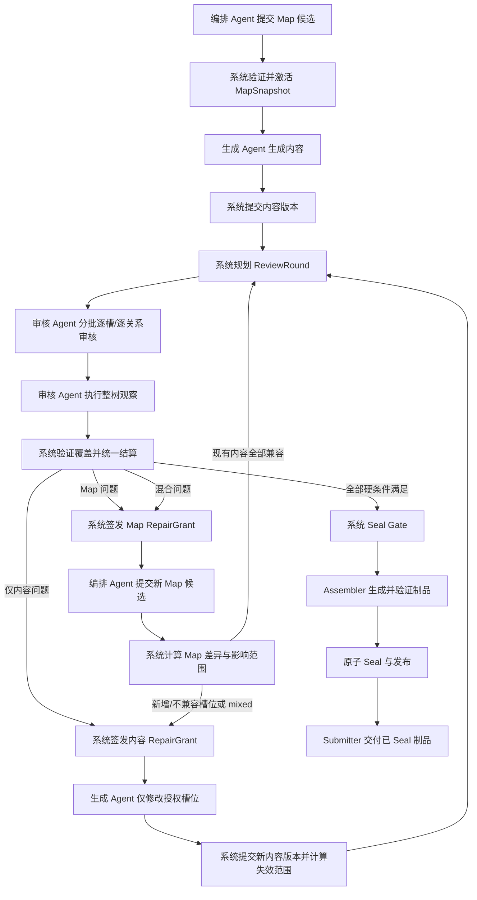

# 结构槽权威审核、返修与系统 Seal 生命周期设计

> 状态：待统一评审
>
> 日期：2026-08-13
>
> 目标版本：Structured Slot Contract v2 / `authoritative_review_v1` capability
>
> 适用范围：ForgeCore 结构槽生产模式；首个迁移目标为 `zhihu-salt-chapter-draft`

## 1. 最终设计结论

审核 Agent 负责对每个内容槽位和每条需要语义审核的关系给出结构化判断，但无权决定整棵槽位树是否通过。

系统是唯一的权威状态机：它验证审核提交是否完整、是否绑定当前内容与 Map 版本，持久化逐槽审核记录，计算失效范围，分派返修，关闭 Finding，并在全部硬条件满足时自动执行 Seal。整棵槽位树的“通过”不是 Agent 返回的字段，而是系统根据当前事实实时推导出的结果。

核心公式如下：

```text
review_passed =
  所有必审内容槽位均有当前有效的 pass
  AND 所有 blocking 关系均有当前有效的 satisfied
  AND 本轮整树观察已完成且绑定当前基线
  AND 不存在尚未 verified_closed 的 blocking Finding
  AND Map、内容、审核策略均未发生未审核变更
```

只有 `review_passed = true`，系统才允许进入确定性的 Seal Gate。任何 Agent 都不能直接写入 `review_passed`、`sealed` 或最终交付状态。

## 2. 问题与现状诊断

当前结构槽机制把 Seal 当作一次整树级动作：审核/Seal 会得到一个全局成功或失败结果，问题可以携带 `slotId`，但系统没有为每个槽位保存独立、可复用、可失效的审核账本。由此带来四类问题：

1. 整体是否通过事实上交给了一次 Agent/Seal 行为，系统缺少逐槽事实基础。
2. 一个槽位返修后，无法精确判断哪些旧审核仍有效、哪些必须重新审核。
3. 内容问题、Map 问题和二者混合问题没有正式的分流协议。
4. 返修权限容易从“修指定槽位”退化成“重新生成整棵树”，连续性和审计边界都不稳定。

本设计在 Fill 与 Seal 之间增加独立的审核生命周期，并把当前由审核 Agent 调用的 `request_seal()` 从 v2 生产链路中移除。v1 历史任务仍按原协议回放，不原地改变语义。

## 3. 目标与非目标

### 3.1 目标

- 每个内容槽位都有独立、不可变、可审计的审核记录。
- 每条 blocking 语义关系都有独立的满足性记录。
- Agent 负责语义判断；系统负责提交合法性、状态、聚合、路由和 Seal。
- 编排 Agent 产出位置网与关系网组成的 Map；系统验证后才激活。
- 生成 Agent 在完整上下文中工作，但只可写 Repair Grant 授权的槽位。
- 内容或 Map 变化后，系统按 digest 与影响图精确失效，而不是全量清零。
- 审核可分批、可恢复；一次审核轮次完成后再统一结算和分派。
- 整树观察能够发现局部批次以外的矛盾，并正式进入 Finding/返修闭环。
- Seal、Assembler 和最终交付继续保持确定性、原子性与可回放性。

### 3.2 非目标

- 不让系统以规则替代 Agent 判断自然语言内容是否连贯或是否满足语义关系。
- 不在首版提供人工直接编辑槽位内容或 Map 的能力。
- 不在首版引入跨任务、跨模板的共享知识图谱。
- 不要求把整棵树一次性塞进模型上下文；“可看全树”通过受权的按需读取实现。
- 不在首版支持同一任务内多个写 Agent 并行提交；写入仍遵循任务级单写者约束。
- 不修改已冻结的 v1 任务快照和历史事件含义。

## 4. 统一术语

| 术语 | 定义 |
| --- | --- |
| 槽位树 | 按结构和顺序组织的节点集合，包含内容槽位和无内容容器槽位 |
| 内容槽位 | 需要生成正文且必须接受逐槽语义审核的槽位 |
| 容器槽位 | 只表达章节、分组、层级或布局，不承载正文；由系统做结构校验 |
| Map | 当前槽位树的位置网与关系网的合称 |
| 位置网 | 父子层级、文档顺序、邻接位置、槽位类型与结构约束 |
| 关系网 | 由模板定义类型、编排 Agent 实例化的槽位间语义关系 |
| MapSnapshot | 系统验证并激活后的不可变 Map 版本 |
| ReviewRound | 针对一个冻结基线进行的完整审核轮次 |
| ReviewAssignment | 一次 Agent 审核会话的目标集合，分为批次审核和整树观察 |
| Finding | 审核发现的结构化问题及证据；由系统管理生命周期 |
| RepairGrant | 系统签发的返修读写授权和基线约束 |
| Seal Gate | 系统执行的最终确定性门禁与原子发布过程 |

## 5. 不可妥协的系统不变量

1. **Agent 不可 Seal。** Agent 工具集中不存在能直接产生 Seal 状态的写操作。
2. **逐槽语义、系统聚合。** Agent 给出某槽的 `pass/reject`；系统不改写其语义结论，只接受、拒绝或判定其已过期。
3. **审核绑定版本。** 有效审核至少绑定槽位内容 digest、相关 Map 子图 digest 和审核策略 digest。
4. **授权外不可写。** 生成 Agent 对整树可读，但写入必须是 Repair Grant 的 `writeSlotIds` 子集。
5. **Map 候选不等于 Map。** 编排 Agent 只能提交候选；系统验证通过并生成 MapSnapshot 后才能成为活动 Map。
6. **关系类型由模板定义。** 编排 Agent 只能实例化已声明类型，不能临时发明关系类型或降低其 enforcement。
7. **所有状态可由事件和不可变记录重建。** UI 上的通过率、槽位状态和 Seal readiness 都是投影，不是可被随意覆盖的布尔值。
8. **整轮结算。** 单条审核可以增量持久化，但只有 ReviewRound 覆盖完整并完成整树观察后，系统才统一路由返修或进入 Seal。
9. **失效优先于继承。** 只有所有绑定 digest 完全匹配时才能复用旧审核；无法证明未受影响时一律重新审核。
10. **Seal 绑定审核事实。** SealRecord 必须包含当前 Map、内容根和 review bundle 的身份，防止审核后偷换内容。

## 6. 选定架构

在现有 Fill 与 Seal 之间增加独立的 Review Lifecycle。审核不是 Seal 的一种模式，也不是另一个可独立交付的制品。



没有选择“扩展现有 Seal Agent”的原因是：这会继续混合语义判断、流程编排和最终状态权力。也没有把审核设计成独立模板/独立任务，因为首版需要与当前任务的 Map、内容版本、事件账本和原子发布保持同一监管边界。

## 7. 权威边界与职责矩阵

| 主体 | 可读 | 可提交/修改 | 明确禁止 |
| --- | --- | --- | --- |
| 编排 Agent | 模板、活动 Map、整树内容、相关 Findings | Map 候选及修改说明 | 激活 Map、修改正文、关闭 Finding、Seal |
| 生成 Agent | 活动 Map、整树已提交内容、Findings、RepairGrant | 初次内容或 Grant 内的槽位内容；扩权请求 | 改 Map、写 Grant 外槽位、写审核结论、Seal |
| 审核 Agent | 活动 Map、整树已提交内容、审核规则、当前 assignment | 逐槽 verdict、逐关系 verdict、Finding、公开证据 | 改 Map/内容、分派返修、关闭 Finding、写整树通过、Seal |
| Review Coordinator | 所有系统记录、事件、digest、模板策略 | 轮次、批次、记录合法化、失效计算、Finding 状态、RepairGrant、路由 | 代替 Agent 判断自然语言语义 |
| Seal Gate | 当前 Map、内容、review bundle、validators、assembler | SealRecord、制品发布事件 | 接受缺失/过期审核，调用模型做语义判断 |
| Assembler | 已满足 Seal 前置条件的冻结快照 | 候选制品字节 | 读取未提交草稿、修改审核状态 |
| Submitter | 已 Seal 的发布制品 | 提交/交付回执 | 读取或交付未 Seal 内容 |

语义所有权的精确含义是：审核 Agent 决定“这个当前版本的槽位是否通过”；系统决定“这条决定是否合法、是否仍然有效，以及所有事实合起来是否允许整树通过”。系统不能把一个合法且当前的 `reject` 改成 `pass`，也不能在没有 Agent `pass` 的情况下替槽位补一个 `pass`。

审核独立性由运行边界而不是文案保证：审核 Agent 必须运行在独立 attempt，只能看到系统已提交的 MapSnapshot、内容版本和公开生产输入，看不到生成 Agent 的未提交 draft、私有消息或推理；它没有任何 Map/内容写工具。生成与审核可以使用同一模型供应商，但不能复用同一个可写会话或未提交上下文。

## 8. 模板、系统与 Agent 的定义边界

### 8.1 模板负责定义

- 槽位类型、结构语法、内容 schema、布局约束。
- 允许使用的关系类型、方向、端点类型和实例字段 schema。
- 每种关系的语义说明、审核准则、blocking/advisory enforcement。
- 每种关系的影响传播策略及模板级上限。
- 哪些槽位是内容槽位、哪些容器只做系统校验。
- 审核策略：批次目标大小、是否审核 advisory 关系、证据要求、轮次上限。
- 各 Agent 角色的静态最大访问边界。

### 8.2 系统负责定义并执行

- 所有 ID、digest、时间戳、版本号和不可变记录格式。
- Map 候选的结构验证和激活。
- ReviewRound 规划、覆盖校验、恢复和结算。
- 审核记录的合法性、幂等性和版本绑定。
- Finding 生命周期、缺陷路由、影响计算和 RepairGrant。
- 逐槽状态、关系状态、整树状态和 Seal readiness 的派生规则。
- Seal Gate、Assembler 调用、制品验证和原子发布。
- 平台硬上限、超限失败、重试和人工升级。

### 8.3 Agent 负责执行

- 编排 Agent：在模板关系类型范围内构造实际位置网和关系网。
- 生成 Agent：按活动 Map 生成或返修内容，并维持整树连续性。
- 审核 Agent：根据当前内容与 Map 独立给出语义判断、证据和缺陷分类。

因此，这不是“完全由模板决定”或“完全由系统决定”的二选一：模板声明领域规则，Agent 给出领域判断，系统掌握流程与权威状态。

## 9. Contract v2 与角色绑定

v2 使用新 contract schema，不向严格的 v1 顶层结构偷偷添加字段。v1 与 v2 由 `contract.version` 明确区分。

概念结构如下：

```yaml
version: 2
slotTypes: []
layoutGrammar: {}
accessProfiles: {}
validators: []
assembler: {}
limits: {}

relationTypes:
  - id: causal
    direction: directed
    fromSlotTypes: [scene]
    toSlotTypes: [scene]
    attributesSchema: {}
    semanticCriterion: "后置事件必须能由前置事件充分解释"
    enforcement: blocking
    invalidation:
      direction: downstream
      maxHops: 2

reviewPolicy:
  contentSelector: content_bearing
  batchTargetSize: 6
  batchMaxSize: 8
  wholeTreeObservation: required
  reviewAdvisoryRelations: true
  maxRounds: 8
```

关系类型的首版标准集合为：

- `sequence`：前后顺序和承接。
- `causal`：因果成立与结果可解释。
- `state_inheritance`：人物、物件、场景状态继承。
- `information_dependency`：后槽理解所需的信息前置。
- `foreshadow_payoff`：伏笔与回收。
- `reveal_constraint`：信息不可过早或过晚揭示。
- `emotional_progression`：情绪强度和转折递进。

模板可以只启用其中一部分，也可以在平台允许的命名空间内声明新类型；新类型必须经过模板验证和能力门禁，编排 Agent 不能在一次运行中临时创建未知类型。

`pipeline.yaml` 负责把领域角色绑定到具体 Agent：

```yaml
structuredReviewLifecycle:
  orchestrator: structure
  generator: fill
  reviewer: review
  submitter: submitter
```

v2 不再绑定 `seal` Agent。Seal 是系统阶段，不是 Agent turn。

会话类型按协议版本分开，避免当前 v1 的 `structure | fill | seal` 联合类型被静默改义：

```text
StructuredSessionKindV1 = structure | fill | seal
StructuredSessionKindV2 = structure | fill | review_batch
                        | review_whole_tree | map_repair | content_repair
```

其中 `structure` 在 v2 中提交初始 Map，`fill` 提交初始内容；`map_repair` 和 `content_repair` 必须携带 RepairGrant。Submitter 仍使用通用下游 turn，不属于结构槽写会话。v2 的 access profile 按 session kind 投影工具集，不能只依靠 prompt 告诉 Agent“不要调用”某个工具。

v2 contract validator 强制 generator 与 reviewer 对活动任务的已提交 Map/内容具有全树读取能力；reviewer 的写集合固定为空。任一写会话的实际权限都是 `模板静态上限 ∩ 当前 assignment ∩ 当前 grant`，三个集合没有交集的对象不可写。读取全树不包含未提交 draft、私有 Grant 或其他任务数据。

v2 使用新的封闭 capability 集合，不向 v1 的十项枚举追加字段：

| Session kind | 必需 capability | 允许的终结结果 |
| --- | --- | --- |
| `structure` | `read_structure_contract`、`write_map_candidate`、`submit_map_candidate` | Map commit 或 attempt incomplete |
| `fill` | `read_active_map`、`read_slot_content`、`write_slot_content`、`submit_content_draft` | content commit 或 attempt incomplete |
| `review_batch` | `read_active_map`、`read_slot_content`、`submit_slot_review`、`submit_relation_review`、`complete_review_assignment` | assignment complete 或 incomplete |
| `review_whole_tree` | 上述 review 读取能力、`submit_whole_tree_finding`、`complete_review_assignment` | observation complete 或 incomplete |
| `map_repair` | Map/内容/Finding 读取、`write_map_patch`、`submit_map_patch`、`request_scope_expansion` | Map commit、scope request 或 incomplete |
| `content_repair` | Map/内容/Finding 读取、`write_slot_content`、`submit_content_draft`、`request_scope_expansion` | content commit、scope request 或 incomplete |

Agent 的终结结果只提交当前工作的候选事实。下一步不是 Agent Route 决定：Map commit 后由系统调度 Fill/复审，内容 commit 后由系统规划 ReviewRound，review assignment complete 后由 Coordinator 决定下一个批次/整树观察/settlement，repair commit 后由系统重新规划审核。模板若声明从 review 直接发往 generator、orchestrator、artifact 或 Submitter 的 Agent-controlled completion edge，加载时失败。

v2 validators 使用独立触发点：

- `map_commit`：节点、位置、关系和模板约束。
- `content_commit`：槽位 schema、授权范围和内容根。
- `review_settlement`：审核覆盖、记录绑定和 Finding 完整性。
- `seal_input`：ReviewBundle 与冻结输入身份。
- `seal_output`：Assembler 产物与发布约束。

v1 的 `merge-and-seal | seal` trigger 保持原义，仅由 v1 解释器处理。

## 10. Map：位置网与关系网

### 10.1 MapSnapshot

MapSnapshot 是系统激活的不可变对象，至少包含：

```text
scaffoldId
mapId
supersedesMapId
mapRevision
mapDigest
positionGraphDigest
relationGraphDigest
templateSnapshotHash
nodes[]
relations[]
createdFromAttemptId
createdAt (system-owned)
```

`scaffoldId` 是任务内稳定的槽位树身份，`mapId` 是一次不可变 Map revision 的系统身份。`mapDigest` 由规范化的位置网、关系网和模板身份共同计算。v2 不把现有 v1 `generationId` 悄悄改名后复用语义；存储实现可以复用其索引设施，但事件和协议使用明确的 Map 身份。Agent 提供的时间、官方 ID、digest 或激活状态一律忽略。

### 10.2 节点身份规则

- 一个任务内的 `slotId` 永不复用。
- Map 返修时，如果槽位语义身份、类型和职责不变，应保留 `slotId`。
- 被删除的 `slotId` 永久进入历史状态；重新新增必须获得新 ID。
- 槽位类型或内容 schema 不兼容变化时，即使保留展示位置，也必须创建新 `slotId`。
- 系统根据稳定身份映射迁移未变化槽位的内容；新槽位为空，删除槽位的内容只保留审计历史。

候选 Map 对已有节点引用官方 `slotId`，对新增节点只提交 attempt 内唯一的 `clientNodeKey`；系统验证后分配官方 ID 并返回映射。Agent 不能自行挑选新官方 ID。关系同理：已有边引用 `relationId`，新增边使用 `clientRelationKey`，由系统分配官方 `relationId`。这既允许稳定身份延续，也防止 Agent 伪造或复用已删除身份。

### 10.3 关系实例

首版关系是有向二元边：

```text
relationId
typeId
fromSlotId
toSlotId
attributes
relationDigest
```

系统验证端点存在、端点类型、方向、字段 schema、数量、重复边、平台禁止的环以及模板传播上限。每种关系类型还声明审核所需的最小 evidence scope；系统据此计算 `requiredEvidenceSlotIds`。自然语言上是否真正满足关系，由审核 Agent 判断。

若未来需要超边，必须通过新的 contract 版本引入，不能把数组端点塞入 v2 二元边造成隐式语义变化。

### 10.4 相关 Map 子图 digest

每个内容槽位都有系统计算的 `reviewSubgraphDigest(slotId)`，其规范化输入包括：

- 当前节点的结构规格与父级路径。
- 当前文档顺序以及直接前后邻接节点身份。
- 与该槽位相连的关系实例及对端节点规格。
- 按关系类型 `invalidation` 规则扩展后的有限影响闭包。

该 digest 只描述审核所依赖的 Map 上下文，不包含槽位正文。正文单独由 `contentDigest` 绑定。

## 11. 核心记录与不可变事实

### 11.1 SlotContentVersion

```text
slotId
slotRevision
contentDigest
taskContentRevision
mapDigest
blobRef
committedByAttemptId
```

系统对内容做 schema 校验、规范化和 digest 计算。任务级内容根是所有当前 `slotId -> contentDigest` 的规范化 Merkle 根，用于整树基线身份。

### 11.2 SlotReviewRecord

```text
recordId
reviewRoundId
assignmentId
slotId
verdict: pass | reject
contentDigest
contextSlotDigests{}
mapSubgraphDigest
reviewPolicyDigest
findingIds[]
evidence[]
source: batch | whole_tree_observation
reviewerAttemptId
recordedAt
```

规则：

- `pass` 不得同时携带针对该槽位的 blocking Finding。
- `reject` 必须有至少一个 blocking Finding 和可定位证据。
- assignment 根据直接邻接与关系 evidence scope 给出 `requiredContextSlotIds`；record 必须绑定这些槽位的当前 digest。Agent 引用额外槽位作为证据时，也必须把其 digest 加入 `contextSlotDigests`。
- 同一 assignment、同一目标、同一基线只允许一个终态提交；完全相同的重放幂等，不同载荷的重放拒绝。
- 整树观察可以把本轮早先的批次 `pass` 追加为 `reject`，但不能把批次 `reject` 反向改成 `pass`。两条记录都保留，结算采用更晚的整树拒绝。

槽位对外状态由系统派生：

- `pending`：没有当前有效审核。
- `pass`：存在当前有效 pass，且无更高优先级的当前 blocking Finding。
- `reject`：存在当前有效 reject 或审核 Agent 提交的当前 blocking Finding。
- `stale`：存在历史结论，但任一绑定 digest 已变化。

### 11.3 RelationReviewRecord

```text
recordId
reviewRoundId
assignmentId
relationId
verdict: satisfied | violated
relationDigest
relationContextDigest
evidenceSlotDigests{}
mapId
reviewPolicyDigest
findingIds[]
evidence[]
reviewerAttemptId
```

blocking 关系的 `violated` 必须产生 blocking Finding；advisory 关系可以产生 advisory Finding，不阻断 Seal。关系记录必须绑定系统计算的全部 `requiredEvidenceSlotIds`，并绑定 Agent 额外引用的所有证据槽位，而不只绑定两个端点。`mapId` 只保留提交时的完整 Map 来源；是否仍有效由关系自身、有限上下文和证据 digest 决定，因此无关 Map 变化不会让所有关系审核一起 stale。

### 11.4 Finding

```text
findingId
reviewRoundId
primaryLocation:
  kind: slot | relation | map_node | map
  id: string
relatedSlotIds[]
relatedRelationIds[]
defectClass: content | map | mixed
severity: blocking | advisory
source: reviewer | system_validator
evidence[]
suggestedRepairSlotIds[]
status
repairProgress:
  map: not_required | pending | committed
  content: not_required | pending | committed
openedBy:
  reviewerAttemptId: string        # source=reviewer
  validatorExecutionId: string     # source=system_validator
```

`primaryLocation.id` 在 `kind: map` 时固定为当前 `mapId`；其他 kind 必须引用当前或本轮基线中真实存在的对象。系统不接受空字符串或仅供展示的自由文本定位。

`defectClass` 的标准：

- `content`：Map 契约足够且正确，当前正文没有遵循它；路由给生成 Agent。
- `map`：位置、槽位职责或关系本身缺失/错误，仅改正文无法稳定解决；路由给编排 Agent。
- `mixed`：必须先修 Map，再按新 Map 修内容；系统固定按这个顺序执行。

审核 Agent 只提交分类和建议范围。权威 owner 与写范围由系统根据分类、主位置、关系图和模板策略计算，Agent 不能通过 `suggestedRepairSlotIds` 自行扩大写权限。

severity 也不是可任意降级的字段：slot `reject`、blocking relation `violated` 和模板标为 blocking 的准则必须生成 blocking Finding；slot `pass` 可以附带 advisory Finding。系统 validator 按 validator enforcement 生成 severity。任何试图把 blocking 事实降为 advisory 的提交都会被拒绝。

Finding 状态由系统管理：

```text
open -> repair_planned -> repair_dispatched -> addressed
addressed -> verified_closed  # 审核确认已解决
addressed -> open             # 审核确认仍存在，进入下一次返修
```

返修提交成功只能进入 `addressed`。Finding 的打开载荷和每次状态迁移都是追加式不可变事实，当前 `status` 由事件投影，不原地覆盖 blob。只有后续当前版本的审核明确提交“已解决”证据，系统才投影为 `verified_closed`；Agent 不能直接写关闭状态。advisory Finding 可以保持 open 并随 ReviewBundle 发布，不阻断 Seal。

`repairProgress` 解决 mixed 缺陷的双阶段问题：Map commit 只把 `map` 标成 committed；内容 commit 再把 `content` 标成 committed。只有该 Finding 所有 required stage 都 committed，系统才把状态投影为 `addressed` 并进入审核验证。纯 content/map Finding 只有一个 required stage。

若审核 Agent 无法在三类缺陷中可靠分类，本次 assignment 视为 `review_incomplete`，由系统重试或人工升级；不增加一个含义模糊的第四类 Finding。

### 11.5 FindingVerificationRecord

```text
recordId
reviewRoundId
assignmentId
findingId
verdict: resolved | still_present
mapId
mapContextDigests{}
evidenceSlotDigests{}
reviewPolicyDigest
evidence[]
reviewerAttemptId
```

返修后的 assignment 必须把所有 reviewer 来源且处于 `addressed` 的 blocking Findings 作为验证目标。审核 Agent 对每个 Finding 单独提交 `resolved` 或 `still_present`：

- `resolved` 只是语义判断；系统还要确认相关槽位/关系已得到当前有效的 pass/satisfied，才投影 `verified_closed`。
- `still_present` 使 Finding 回到 open，并参加本轮统一结算。
- `content` Finding 至少绑定其主槽内容；`map` Finding 至少绑定新 Map 和受影响观察证据；`mixed` Finding 必须同时覆盖 Map 与内容修复结果。

这避免了“返修已提交”被误当成“问题已解决”，也避免系统仅凭一个无关槽位的 pass 自动关闭 Finding。

`mapId` 记录验证发生在哪个完整 Map 上；当前有效性只比较该 Finding 绑定的 `mapContextDigests`、证据槽位 digest 与 reviewPolicyDigest。无关 Map 区域变化不会让验证记录全量 stale。

system_validator 来源的 Finding 不交给审核 Agent 作语义验证：系统在新基线上重跑同一个冻结 validator，当前通过则生成 validator verification fact 并投影 `verified_closed`，仍失败则回到 open。这样确定性规则由系统闭环，语义问题由审核 Agent 闭环。

### 11.6 ReviewRound

```text
reviewRoundId
mapDigest
contentRootDigest
reviewPolicyDigest
coverageSlotIds[]
coverageRelationIds[]
assignmentSlotIds[]
assignmentRelationIds[]
verificationFindingIds[]
assignmentIds[]
inheritedRecordRefs[]
wholeTreeObservationRef
state
settlementRef
```

生命周期：

```text
planned -> reviewing_batches -> whole_tree_observation -> completed -> settled
```

`completed` 只表示覆盖完整，不表示通过。`settled` 表示系统已经基于完整事实原子地产生下一步：Repair Grant 或 Seal 调度。

`coverage*` 是当前整树 Gate 必须覆盖的全部目标；`assignment*` 只包含本轮需要 Agent 新判断的目标。二者之差必须由 `inheritedRecordRefs` 中仍有效的记录完整覆盖，系统不允许出现既未继承也未分配的目标。

### 11.7 RepairGrant

```text
grantId
kind: content | map
mapDigest
contentRootDigest
findingIds[]
readScope: full_tree
writeSlotIds[]       # content grant only
mapWriteScope        # map grant only
boundAttemptId
grantDigest
```

Grant 是服务端签发、不可伪造的 capability token，并与一个具体 attempt 和活动基线绑定。基线变化、bound attempt 结束或新 Grant 签发后，旧 Grant 失效。

Map repair 的 `mapWriteScope` 包含可修改/删除的 `nodeIds`、可修改/删除的 `relationIds`、允许新增节点的父容器、允许新增的 relation type，以及可执行的操作类型。初始编排可以提交完整 Map；返修编排只提交作用域内 patch，系统在活动 Map 上应用后生成完整候选并做全图验证。任一越界操作使整个 patch 原子拒绝。编排 Agent 如需扩大 Map 修复范围，使用与内容扩权相同的“请求—系统校验—新 Grant”协议。

初次 Fill 也不能依赖 prompt 约束写范围。系统为它签发一次性的 `GenerationGrant`，结构与内容 RepairGrant 的读写基线相同，但目标是全部待生成内容槽位且没有 findingIds。下文把二者统称为 content write grant；RepairGrant 专指审核后返修授权。

## 12. 审核轮次与批次调度

### 12.1 初始轮次

初次 Fill 完成后，系统把所有内容槽位和所有 blocking 关系加入必审集合；模板要求时也加入 advisory 关系。无内容容器不接受 Agent `pass`，其层级、顺序、数量和布局由系统 validators 校验。

返修后的新轮次由系统计算三类集合：

- `inherited`：全部绑定 digest 仍匹配，可直接引用旧记录。
- `required`：正文、Map 子图、关系证据或审核策略变化，必须重新审核。
- `verification`：处于 addressed 的 reviewer Findings，必须获得 FindingVerificationRecord；system_validator Findings 必须重跑原 validator。

只有 required 和 verification 进入新的 Agent assignments；inherited 仍参加当前轮覆盖统计。每个发生过 Map 或内容变化的新轮次都必须新建整树观察 assignment，不继承旧整树观察。

### 12.2 批次规划

默认目标为每个 Agent turn 审核 6 个内容槽位，模板可在 4–8 范围内调整，平台硬上限为 8。系统使用确定性、图感知的规划：

1. 按文档顺序选择第一个未分配槽位作为 seed。
2. 候选依次按“blocking 关系相连、直接前后邻接、advisory 关系相连、其他文档顺序”排序。
3. 达到目标大小或上限后关闭批次。
4. 一条关系只分配给一个批次，通常归入最早覆盖其端点的批次。

同一优先级内按文档顺序、再按 `slotId/relationId` 字典序打破平局。因此相同 Map、reviewPolicy 和 assignment 目标集合必须得到相同批次计划，恢复时无需依赖进程内随机状态。

批次只限制可提交 `pass` 的目标，不限制读取。审核 Agent 可以按需读取整树、Map 和任意槽位，但只能为 assignment 内槽位提交正常批次 verdict。发现 assignment 外问题时可以创建 Finding；系统会把其主槽位纳入后续或下一轮必审范围。

跨范围 Finding 不会立刻触发返修。若其主目标尚未审核，系统把 Finding 上下文附到该目标既定 assignment；若主目标已经审核，系统把它加入整树观察的强制判别清单，由整树观察追加该槽位 `reject` 或该关系 `violated`。跨范围 blocking Finding 一经合法提交就不能在同一未变化基线上撤回；如果后续 reviewer 无法给出与它一致的目标 verdict，本轮保持 incomplete 并按重试/人工升级处理。只要存在未判别的跨范围 blocking Finding，整树观察就不能完成。

### 12.3 增量持久化、整轮结算

审核记录逐条原子持久化。Agent 或进程中断后，系统从未完成目标继续，不重复已经合法持久化的记录。

批次末尾 Agent 提交 `complete_review_assignment`，这只是“我已提交完”的声明。系统检查槽位/关系覆盖、digest 和 Finding 约束后，才把 assignment 标记完成。所有批次完成前不发返修 Grant。

### 12.4 整树观察

所有批次完成后，系统创建单独的整树观察 assignment。审核 Agent 拥有整树和完整 Map 的读取能力，重点检查：

- 跨批次的因果、信息、状态和情绪连续性。
- 重复、矛盾、角色/物件状态漂移。
- 位置网或关系网遗漏、错误和过约束。
- 局部修复对远端槽位造成的副作用。

整树观察不允许返回一个“整树通过/不通过”布尔值。它只能：

- 提交新 Finding；
- 对新发现的槽位追加 `reject`；
- 对关系追加 `violated`；
- 或提交“观察已完成且无新增 Finding”的覆盖回执。

系统验证回执绑定当前 `mapDigest + contentRootDigest + reviewPolicyDigest` 后，才允许 ReviewRound 完成。

## 13. 缺陷路由与返修顺序

系统在 ReviewRound 完整后一次性结算所有 blocking Finding：

### 13.1 只有 content Finding

- 系统以被 Agent 拒绝的主槽位为初始写集合。
- 相关前后槽位、关系邻居和整树内容全部可读，但默认只读。
- 系统为生成 Agent 签发内容 RepairGrant。
- 生成 Agent 提交后，系统计算新内容 digest 和审核失效范围，进入新 ReviewRound。

### 13.2 存在 map Finding

- 系统先合并所有 `map` 与 `mixed` Finding，签发一个 Map RepairGrant。
- 编排 Agent 提交授权范围内的 Map patch；系统将其应用为候选、做全图验证、计算差异并激活新 MapSnapshot。
- Map 激活后，系统先迁移所有身份和内容 schema 兼容的槽位内容；新增槽位、内容 schema 不兼容槽位以及被 mixed Finding 明确要求修改的槽位进入内容 RepairGrant。
- 对纯 `map` Finding：若迁移后内容仍完整，则直接复审受影响内容和关系；若出现新增/不兼容内容槽位，则先生成这些槽位，再复审。
- 对 `mixed` Finding：Map 激活后，系统必定按新 Map 重新计算内容修复集合，再签发内容 RepairGrant。
- 与 Map 无关的 content Finding 在 Map 处理后重新确认基线，再一并进入内容 Grant，避免在旧 Map 上做无效修改。

mixed 的初始内容写集合不是“所有受影响槽位”：它由该 Finding 明确拒绝的内容主槽、审核 Agent 建议且位于系统影响闭包内的内容槽、新增/内容 schema 已不兼容的槽位组成。其他影响槽位只加入读取和复审范围；如确需同步写入，由生成 Agent 走扩权协议。这样既不丢失 Map 影响，也不把关系闭包自动变成无边界写权限。

### 13.3 同轮多种问题

同一轮中只要存在任何 `map` 或 `mixed` blocking Finding，就先处理 Map；不并行启动内容写入。这样保证生成 Agent 永远在唯一、已激活的 Map 上返修。

## 14. 生成 Agent 的连续性与写权限

### 14.1 完整读取能力

生成 Agent 可以读取：

- 活动 Map 的位置网和关系网。
- 整棵槽位树当前已提交内容。
- 当前 Finding、审核证据和相关历史版本。
- Grant 目标槽位的前后邻居、关系闭包和模板约束。

“完整读取”是能力边界，不等于把所有内容一次性注入 prompt。工具支持分页、按节点和按关系展开，Agent 可在上下文预算内主动读取。

### 14.2 受限写入

- 初次生成只能写系统当次 generation assignment 指定的内容槽位。
- 返修只能写 `writeSlotIds`。
- 一次提交只要包含任何未授权槽位，整个提交原子拒绝，不部分接受。
- 提交必须带 `grantDigest`、`mapDigest` 和读取时的内容基线；任一过期即拒绝。

### 14.3 扩权请求

若生成 Agent 判断修复目标槽位必然要求同步修改其他槽位，它调用 `request_repair_scope_expansion`，提交：

- 希望增加的槽位；
- 关联关系和连续性证据；
- 不扩权会产生的矛盾。

该调用不修改 Grant。系统根据关系图、Finding 和模板影响策略批准或拒绝，并结束当前写 attempt；随后签发扩大的新 Grant，或签发范围不变的新 attempt 并附拒绝原因。生成 Agent 不能“先改了再说明”。

## 15. 精确失效与审核继承

### 15.1 内容变化

当槽位正文变化：

- 该槽位旧 SlotReviewRecord 立即 stale。
- 所有 `contextSlotDigests` 引用了旧内容 digest 的 SlotReviewRecord 立即 stale。
- 所有证据包含该内容 digest 的 RelationReviewRecord 立即 stale。
- 所有证据包含该内容 digest 的 FindingVerificationRecord 立即 stale。
- 与其内容无关且 digest 全部不变的其他槽位审核保留。
- 整树观察记录总是 stale，必须重新执行。
- 模板可要求按关系传播策略把额外槽位加入复审集合，但不自动授予这些槽位写权限。

### 15.2 Map 变化

系统对旧、新 Map 做规范化 diff：

- 新增/删除/改类型的节点及旧、新邻居受影响。
- 新增/删除/改变的关系及其传播闭包受影响。
- `reviewSubgraphDigest` 变化的槽位审核 stale。
- `relationDigest` 或任一证据槽位 digest 变化的关系审核 stale。
- Map/evidence 绑定不再匹配的 FindingVerificationRecord stale。
- 新槽位进入生成和审核；删除槽位的记录保留历史但不参与当前 Gate。
- 整树观察记录总是 stale。

### 15.3 审核策略变化

模板审核准则、reviewer skill/配置身份、关系语义说明或 enforcement 变化会改变 `reviewPolicyDigest`，所有不匹配的审核结论均 stale。模型供应商的纯运行元数据不自动进入 digest；只有模板明确冻结的审核能力身份进入。

### 15.4 继承方式

新 ReviewRound 不复制或伪造旧 `pass`，而是通过 `inheritedRecordRefs` 引用仍完全有效的不可变记录。系统重新验证每个引用的 digest 后把它计入覆盖。任何无法证明当前性的记录不继承。

## 16. 系统聚合与 Seal Gate

### 16.1 Review settlement

Review Coordinator 只有在以下条件全部满足时才把 round 标记 `completed`：

- 所有 coverage 内容槽位有当前有效 verdict（本轮提交或合法继承）。
- 所有 coverage 关系有当前有效 verdict（本轮提交或合法继承）。
- 所有 reviewer verification 目标有当前有效的 FindingVerificationRecord，所有 system_validator verification 目标有当前通过的 validator verification fact。
- 所有 assignment 完整且无冲突提交。
- 整树观察绑定当前完整基线。
- 所有 Finding 引用、证据和分类通过结构校验。

然后系统计算：

- 有 blocking Finding 或 reject/violated：生成确定性修复计划和 Grant。
- 无 blocking 问题：生成不可变 `ReviewBundle`，进入 Seal 调度。

`ReviewBundle` 包含本轮、所有被采用审核记录、Finding 终态、Map/content/review policy 身份，其 digest 为 `reviewBundleDigest`。

### 16.2 Seal Gate 硬条件

Seal 前系统再次检查：

1. 活动 Map 已验证且与 ReviewBundle 一致。
2. 所有必需内容存在、schema 合法，内容根未变化。
3. 所有内容槽位状态为当前 `pass`。
4. 所有 blocking 关系为当前 `satisfied`。
5. 整树观察当前有效。
6. 不存在 open、repair_planned、repair_dispatched 或 addressed 的 blocking Finding。
7. 没有 pending/stale 审核或活动 RepairGrant。
8. 所有确定性 pre-seal validators 通过。
9. assembler、resource manifest、snapshot hash 与冻结模板一致。

任何一项失败都不能 Seal，也不会请求审核 Agent“决定是否忽略”。

若 `review_settlement` 前的确定性 validator 发现问题，系统可以创建 `source: system_validator` 的 Finding：内容 schema/授权问题分类为 content，Map/位置/关系 schema 问题分类为 map；证据必须包含 validator id 和规范化位置。此类 Finding 不冒充审核 Agent 的语义结论，但使用同一返修状态机。若 `seal_input` validator 在 ReviewBundle 已生成后发现新的内容/Map 确定性问题，系统废弃该 bundle、创建上述 Finding 并返回返修；基础设施或 validator 自身异常则 fail-closed 重试/升级，不归责于 Agent。

### 16.3 Assembler 与原子发布

Gate 通过后，系统在冻结快照上运行 Assembler，并验证产物路径、媒体类型、字节、digest 和资源引用。最终原子批次同时提交：

- `SealRecord`；
- 发布制品 blob/ref；
- `structured_scaffold_sealed_v2` 事件；
- 向 Submitter 的下一阶段 dispatch。

SealRecord 的身份至少包含：

```text
taskId
mapDigest
contentRootDigest
reviewBundleDigest
templateSnapshotHash
assemblerDigest
artifactDigest
```

Assembler 不可用、超时或返回非法制品属于系统/基础设施失败：保持未 Seal，按策略重试或人工升级，不伪装成某个槽位的语义拒绝。

## 17. 状态机与事件模型

### 17.1 派生任务阶段

```text
mapping
-> generating
-> reviewing
-> repairing_map | repairing_content
-> reviewing
-> seal_ready
-> sealing
-> sealed
-> submitting
-> completed
```

阶段由最新事件和未完成工作派生，不提供任意写阶段的 API。

### 17.2 新增领域事件

建议的 v2 事件集合：

- `structured_map_revision_committed`
- `structured_content_revision_committed`
- `structured_review_round_planned`
- `structured_review_assignment_started`
- `structured_slot_review_recorded`
- `structured_relation_review_recorded`
- `structured_finding_opened`
- `structured_finding_verification_recorded`
- `structured_validator_finding_verification_recorded`
- `structured_review_assignment_completed`
- `structured_whole_tree_observation_recorded`
- `structured_review_round_completed`
- `structured_review_round_settled`
- `structured_repair_scope_requested`
- `structured_repair_grant_issued`
- `structured_repair_committed`
- `structured_finding_addressed`
- `structured_finding_verified_closed`
- `structured_scaffold_sealed_v2`

`structured_finding_opened` 必须带 `source: reviewer | system_validator`。reviewer 来源必须关联 reviewer attempt；system_validator 来源必须关联 validator execution identity，二者不能相互伪装。

`stale` 不需要作为权威事件逐条写入；它由当前 digest 比较得出。为便于审计，可以在 Map/内容提交事件中记录一份非权威的 `affectedReviewSummary`，但回放时仍以 digest 计算为准。

### 17.3 原子边界

- Map 激活、旧版本 supersede、内容迁移结果、attempt terminal 和下一阶段 dispatch 同批提交。
- Map/content 提交只更新对应 Finding 的 repairProgress；当全部 required stage 完成时，同批追加 Finding `addressed`、attempt terminal 和复审规划。
- 一条审核 verdict、它创建的 Findings 以及证据引用同批提交。
- ReviewRound settlement 与 Repair Grant/Seal dispatch 同批提交。
- SealRecord、制品发布和 Submitter dispatch 同批提交。

进程在批次提交前崩溃时没有可见变化；提交后崩溃时可由事件账本重放恢复，不重复副作用。

## 18. Agent 工具协议

### 18.1 编排 Agent

- `get_map_assignment()`
- `read_active_map()`
- `read_slot_tree()`
- `read_findings()`
- `propose_map_candidate(candidate, baseMapDigest)`
- `submit_map_candidate(candidateId)`

`submit_map_candidate` 只触发系统验证；返回“候选已接收/被拒绝”，不允许 Agent 指定活动版本。

### 18.2 生成 Agent

- `get_generation_assignment()`
- `read_active_map()`
- `read_slots(selector)`
- `read_relations(selector)`
- `read_findings()`
- `open_content_draft(grantDigest)`
- `write_slot_content(slotId, content)`
- `request_repair_scope_expansion(...)`
- `submit_content_draft(baseContentRootDigest)`

初次生成使用 GenerationGrant，返修使用 RepairGrant。服务端在每次写工具调用和最终提交时双重检查对应 content write grant。

### 18.3 审核 Agent

- `get_review_assignment()`
- `read_active_map()`
- `read_slots(selector)`
- `read_relations(selector)`
- `submit_slot_review(verdict, evidence, findingDrafts[])`
- `submit_relation_review(verdict, evidence, findingDrafts[])`
- `submit_finding_verification(...)`
- `submit_whole_tree_finding(findingDraft, anchoredVerdict?)`
- `complete_review_assignment(...)`

普通批次中的 Finding 必须作为槽位或关系 verdict 的 `findingDrafts` 一并原子提交。整树观察使用 `submit_whole_tree_finding`，其 Finding 与可选的槽位 reject/关系 violated 同批提交；纯 Map Finding 则锚定整树观察 assignment。Agent 为每个 draft 提供操作内唯一的 `clientFindingKey`，系统分配官方 findingId 并回填 record 引用，不存在先写悬空 Finding、再补 verdict 的窗口。

审核工具只接受公开、结构化证据，不保存私有思维链。`complete_review_assignment` 不接受 `treePassed`、`seal` 或等价字段；出现未知字段即拒绝。

### 18.4 幂等与并发

所有写工具要求 `attemptId + clientOperationId + baseDigest`：

- 相同操作、相同载荷重放返回原结果。
- 相同操作 ID、不同载荷返回 conflict。
- 基线 stale 返回 `REVIEW_BASE_STALE`、`MAP_BASE_STALE` 或 `CONTENT_BASE_STALE`。
- 非当前任务写者返回 `TASK_WRITE_LEASE_CONFLICT`。

## 19. 存储与投影

### 19.1 持久化

大对象继续采用内容寻址 blob，不把完整正文或长证据直接塞入事件：

```text
structured-slots/
  maps/<mapDigest>.json
  contents/<contentDigest>.json
  reviews/<recordDigest>.json
  review-bundles/<reviewBundleDigest>.json
  findings/<findingDigest>.json
  grants/<grantDigest>.json        # private
  artifacts/<artifactDigest>.*
```

事件只保存稳定身份、digest、必要摘要和 blob ref。RepairGrant 属于私有运行数据，不进入面向普通用户的公共制品。

### 19.2 读取 API

面向任务详情页增加只读投影：

- `GET /api/tasks/:taskId/structured-slots/map`
- `GET /api/tasks/:taskId/structured-slots/review/summary`
- `GET /api/tasks/:taskId/structured-slots/review/rounds`
- `GET /api/tasks/:taskId/structured-slots/review/slots/:slotId`
- `GET /api/tasks/:taskId/structured-slots/review/relations/:relationId`
- `GET /api/tasks/:taskId/structured-slots/review/findings`
- `GET /api/tasks/:taskId/structured-slots/review/seal-readiness`

现有 `structured-slots/issues` 在 v2 中投影当前 blocking/advisory Findings 与确定性 validator issues，以保留旧 UI 的兼容读取；新 UI 使用详细 review API。

## 20. 任务详情 UI

结构槽详情区提供六个只读视图：

1. **总览**：当前 Map/内容/ReviewRound、审核覆盖、blocking 数量、Seal readiness。
2. **槽位树**：位置结构、内容状态和 `pending/pass/reject/stale` 标记。
3. **关系网**：位置树叠加关系边，也可切换列表；展示类型、方向、enforcement 和满足状态。
4. **审核**：批次、整树观察、逐槽/逐关系证据及继承来源。
5. **Findings**：缺陷分类、主位置、关联范围、当前 owner、RepairGrant 和生命周期。
6. **Seal**：逐项硬门禁、review bundle、artifact identity 和失败原因。

UI 必须明确区分：

- “审核 Agent 的语义结论”；
- “系统验证后的当前有效状态”；
- “系统派生的整树 Seal readiness”。

点击一个槽位时展示当前内容版本、绑定的 Map 子图、相邻/关联槽位、审核记录和历史失效原因。首版不提供 UI 直接改 verdict、关闭 Finding 或强制 Seal 的按钮。

## 21. 失败、恢复与升级策略

| 场景 | 系统行为 |
| --- | --- |
| 审核 Agent 中途退出 | 保留已提交记录，重试未完成目标 |
| 提交时内容或 Map 已变 | 整个提交拒绝为 stale，不部分接受 |
| 同目标出现冲突载荷 | 拒绝 conflict，要求新 assignment |
| 生成 Agent 写 Grant 外槽位 | 整个 draft 提交拒绝并记录策略违规 |
| Map 候选结构非法 | 不激活，活动 Map 保持不变，编排 attempt 可重试 |
| 整树观察发现批次外问题 | 创建 Finding/追加 reject，加入返修和下一轮复审范围 |
| reviewer 无法分类 | assignment incomplete，重试；达上限后人工升级 |
| 超过最大审核/返修轮次 | fail-closed，进入人工处置，不允许降级 Seal |
| Assembler/资源失败 | 保持 seal-ready 或 sealing-failed，按基础设施策略重试 |
| 事件提交后进程崩溃 | 回放恢复；幂等 key 防止重复记录和重复发布 |

恢复时系统首先重建活动 Map、内容根、ReviewRound、records、Findings 和 Grants，再恢复调度。任何只能从进程内存获知的状态都不属于正确设计。

## 22. 安全与平台硬上限

### 22.1 安全约束

- Map、内容、关系属性都按不可信数据处理，读取工具返回时使用明确的数据边界。
- Agent 提供的 slotId、relationId、Finding 引用和 blob ref 全部服务端校验。
- 系统生成时间、ID、digest、owner、Grant 范围和状态。
- 公共 evidence 设长度和类型限制，不记录私有推理。
- review 角色没有内容/Map 写工具；即使模型输出伪造工具名也无法改变状态。
- Seal capability 不进入任何 Agent 工具清单。

### 22.2 硬上限

平台 profile 必须定义且模板只能收紧：

- 最大槽位数、Map 字节数、关系总数、单槽关系数。
- 关系影响最大 hops 和最大闭包节点数。
- 单批最大槽位数 8、单轮最大 assignments。
- 单槽/单关系最大 Findings、单轮最大 Findings。
- evidence 单项与总字节数。
- 单次 RepairGrant 最大写槽位数。
- 单轮 scope expansion 次数。
- 最大 ReviewRound/repair 循环次数。
- 所有 Agent turn、validator、assembler 和 blob 的时间/字节限制。

超过上限必须产生明确错误并 fail-closed，不能静默截断后继续 Seal。

## 23. v1 兼容与模板迁移

### 23.1 协议兼容

- 已创建的 v1 任务继续使用冻结的 v1 contract、`structure/fill/seal` session 和历史事件回放。
- 不把 v1 的全局 Seal 结果伪造为逐槽 pass，也不回填推测出来的 ReviewRecord。
- v2 使用独立 schema、事件后缀/版本和 projection 分支。
- 同一进程可同时恢复 v1 与 v2 任务；由任务冻结快照决定解释器。

### 23.2 Capability 门禁

新运行时能力名为 `authoritative_review_v1`，初始 `disabled`。它与 `contract.version: 2` 是两个维度：前者表示实现是否具备法律能力，后者表示模板要求哪套协议。

该能力是现有 structured runtime 的附加子能力，不替代基础能力。创建、启动、恢复任何 v2 任务都必须同时满足：基础 structured runtime capability 已 enabled 且 profile/evidence 匹配，`authoritative_review_v1` 也已 enabled 且其 v2 profile/evidence 匹配。任一门禁失败都 fail-closed；历史快照仍可只读查看，但不能继续产生新运行事件。

启用顺序：

1. v2 contract/schema、事件和回放器完成。
2. Map v2、Review ledger、Repair Grant、系统 Seal 和 API/UI 完成。
3. benchmark/故障注入/安全测试通过。
4. 生成新的 qualification evidence 与 source digest bundle。
5. capability 从 disabled 经过 qualify/promote 进入 enabled。
6. 模板才允许发布引用 v2 的新冻结快照。

### 23.3 `zhihu-salt-chapter-draft` 迁移

- 不修改已经创建任务的 snapshot。
- 模板包发布新的 v2 revision；模板 ID 可保持稳定，但 snapshot hash 和 contract version 必须变化。
- 增加 `review` Agent、关系类型与 reviewPolicy；从 v2 pipeline 删除 `seal` Agent 路由。
- 先在隔离模板/端口完成真实 Case，再切换默认新建任务到 v2。
- v1 revision 保留只读恢复能力，直到其任务生命周期和保留期结束。

## 24. 验收场景

以下场景必须全部通过，才算设计被正确实现：

1. 所有内容槽 pass、blocking 关系 satisfied、整树观察无问题，系统自动 Seal。
2. 只有一个槽位 reject，生成 Agent 能读全树但只能修改该槽位。
3. 生成 Agent 尝试连带写未授权槽位，整个提交失败且无部分写入。
4. 生成 Agent 申请扩权，系统按关系图签发新 Grant 后才能修改新增槽位。
5. 纯 Map 问题先由编排 Agent 修复，系统计算影响后仅复审受影响范围。
6. mixed 问题严格先修 Map、再修内容，不允许相反顺序。
7. 整树观察发现批次外矛盾，问题进入 Finding、返修和复审闭环。
8. 审核提交期间内容变化，旧提交以 stale 拒绝。
9. 关系或邻接变化只让相关子图审核 stale，不清空无关 pass。
10. 未变化槽位在新轮通过不可变 record ref 继承。
11. blocking 关系 violated 时即使所有槽位 pass 也不能 Seal。
12. 只有 advisory Finding 时可 Seal，但 UI 和制品审计保留警告。
13. 审核进程中断后从未审核目标恢复，不重复已提交 verdict。
14. 相同 clientOperationId 的相同重放幂等，不同载荷 conflict。
15. 任一内容或 Map 修改都会让旧整树观察 stale。
16. 审核 Agent 工具集中不存在 Seal 能力，伪造调用也失败。
17. Assembler 失败不产生 SealRecord，也不变成槽位 reject。
18. 每个声明的原子边界都通过 crash-before/crash-after 故障注入。
19. 旧 v1 任务在新版本服务中回放结果不变。
20. 一个新建 v2 知乎任务在真实 Agent、浏览器 UI、journal 和发布制品上完整走通。
21. mixed Finding 的 Map stage 完成后仍不得验证关闭，必须完成内容 stage 和复审。
22. system validator Finding 与 reviewer Finding 在 UI、事件来源和路由上可区分。

## 25. 测试策略

### 25.1 单元与属性测试

- canonicalization、所有 digest 和 record identity。
- Map diff、邻接变化和关系影响闭包。
- slot/relation 状态派生、ReviewRound 覆盖和继承。
- Finding 状态机与缺陷路由。
- mixed repairProgress 与 reviewer/system-validator 两类验证闭环。
- Grant 子集写检查、stale 检查和扩权决策。
- Seal eligibility 公式。
- 随机事件序列下“无 Agent 可直接 Seal”“stale 记录不能计入 Gate”等不变量属性测试。

### 25.2 Contract 与安全测试

- v1/v2 schema 严格拒绝未知字段和跨版本混用。
- relation type/instance 合法与非法组合。
- Agent 工具 allowlist、伪造 ID/ref、越权写和超限载荷。
- pass 携带 blocking Finding、reject 无证据、关系证据 digest 缺失等恶意/错误提交。

### 25.3 集成与故障注入

- 初次生成、分批审核、整树观察、结算、三类返修、重新审核和 Seal 全链路。
- 每个事件原子批次的进程崩溃、超时、重放和重复 dispatch。
- Map 变更后的内容迁移、slotId 稳定性和失效范围。
- Assembler、blob、validator 暂时失败后的恢复。

### 25.4 浏览器与生产门禁证据

最终证据必须来自新创建的真实 v2 任务，而不是只看单测或静态页面。至少核对：

- 浏览器里能看到 Map、逐槽状态、关系状态、Findings、ReviewRound 和 Seal readiness。
- 真实返修只修改 RepairGrant 允许的槽位。
- journal/event ledger 能重建每个状态和路由决定。
- SealRecord 的 Map/content/review/artifact digest 与浏览器和磁盘制品一致。
- capability evidence、运行源码 digest 与部署 checkout 一致。

## 26. 分阶段落地边界

这不是实现任务清单，而是降低切换风险的交付边界：

1. **协议层**：Contract v2、记录 schema、事件、投影和 v1/v2 回放分流。
2. **Map 层**：关系类型、Map 候选验证、版本化、diff 和影响计算。
3. **审核层**：reviewer tools、增量账本、批次、整树观察和继承。
4. **返修层**：Finding 路由、RepairGrant、扩权和 Map/content 顺序。
5. **Seal 层**：移除 v2 Agent Seal、ReviewBundle、系统 Gate 与原子发布。
6. **可视化层**：任务详情 API、Map/Review/Findings/Seal UI。
7. **模板层**：知乎模板 v2 revision、真实关系定义和 reviewer 配置。
8. **门禁层**：测试、故障注入、真实 Case、qualify/promote 和逐步启用。

每一层必须保持 capability disabled，直到其下游依赖和证据完成；不能因为模板文件已经写好就宣称生产能力可用。

## 27. 本次设计已冻结的决策

为了统一评审，本设计不保留待补的关键选项，当前建议全部明确如下：

- 采用 Fill 与 Seal 之间的独立审核生命周期。
- 内容槽逐槽审核；容器槽只做系统结构校验。
- 关系类型模板定义、编排 Agent 实例化、系统验证、审核 Agent 判断语义满足性。
- 缺陷只使用 `content/map/mixed` 三类，mixed 固定 Map 优先。
- 审核每槽增量持久化、整轮统一结算。
- 批次目标 6、硬上限 8，结束后必须单独整树观察。
- 生成 Agent 全树可读、Grant 范围可写，扩权必须由系统重新签发。
- 审核至少绑定内容、相关 Map 子图和审核策略 digest。
- 未受影响审核可继承；整树观察每次变更后必重跑。
- Agent 不得写整树 pass、Finding 关闭、Grant、Seal 或最终交付状态。
- v2 Seal 完全系统化；v1 历史任务不迁移、不重解释。
- `zhihu-salt-chapter-draft` 通过新模板 revision 和 capability 生产门禁迁移。

统一评审只需针对这份完整设计指出需要变更的决策；批准后再进入实现计划拆分，不在设计阶段直接修改生产代码。
