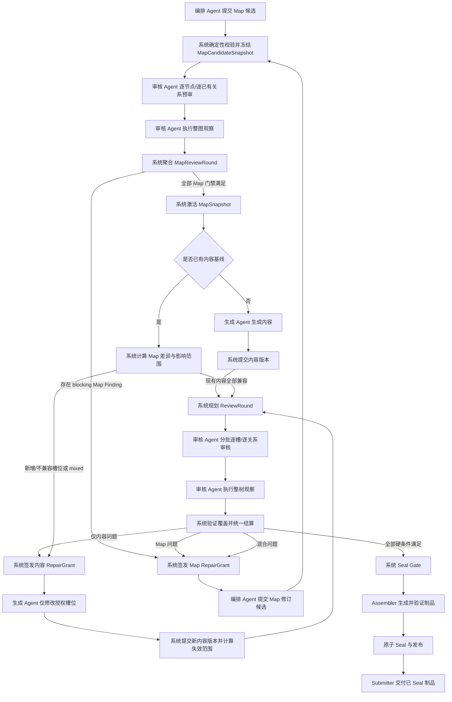

# 结构槽权威审核、返修与系统 Seal 生命周期设计

> 状态：设计已批准（Cycle 5 Round 4）
>
> 日期：2026-08-13
>
> 目标版本：Structured Slot Contract v2 / `authoritative_review_v1` capability
>
> 适用范围：ForgeCore 结构槽生产模式；首个迁移目标为 `zhihu-salt-chapter-draft`
>
> 修订：根据统一评审意见，增加生成前 Map 预审；关系网改为平台可选；提高槽位与审核批次容量边界
>
> 对抗审查说明：经过 5 个独立审查周期共 24 轮，Cycle 5 Round 4 返回 `VERDICT: APPROVED`；该版本作为 Spec 与实施计划的冻结设计基线。

## 1. 最终设计结论

审核 Agent 负责在生成前对候选 Map 的每个节点和每条实际关系给出结构化判断，并在生成后对每个内容槽位和每条需要语义审核的实际关系给出结构化判断，但无权决定候选 Map 或整棵槽位树是否整体通过。

系统是唯一的权威状态机：它验证审核提交是否完整、是否绑定当前内容与 Map 版本，持久化逐槽审核记录，计算失效范围，分派返修，关闭 Finding，并在全部硬条件满足时自动执行 Seal。整棵槽位树的“通过”不是 Agent 返回的字段，而是系统根据当前事实实时推导出的结果。

核心公式如下：

```text
review_passed =
  所有必审内容槽位均有当前有效的 pass
  AND 所有实际存在的 blocking 关系均有当前有效的 satisfied
  AND 本轮整树观察已完成且绑定当前基线
  AND 不存在尚未 verified_closed 的 blocking Finding
  AND Map、内容、审核策略均未发生未审核变更
```

只有 `review_passed = true`，系统才允许进入确定性的 Seal Gate。任何 Agent 都不能直接写入 `review_passed`、`sealed` 或最终交付状态。

内容生成还有一个更早的系统门禁：编排 Agent 的 Map 候选先经过确定性校验和审核 Agent 的逐节点预审，系统据此推导 `map_approved`。只有 `map_approved = true`，候选才被激活并交给生成 Agent。审核 Agent 同样不能直接写入 Map 整体通过状态。

## 2. 问题与现状诊断

当前结构槽机制把 Seal 当作一次整树级动作：审核/Seal 会得到一个全局成功或失败结果，问题可以携带 `slotId`，但系统没有为每个槽位保存独立、可复用、可失效的审核账本。由此带来五类问题：

1. 整体是否通过事实上交给了一次 Agent/Seal 行为，系统缺少逐槽事实基础。
2. 一个槽位返修后，无法精确判断哪些旧审核仍有效、哪些必须重新审核。
3. 内容问题、Map 问题和二者混合问题没有正式的分流协议。
4. 返修权限容易从“修指定槽位”退化成“重新生成整棵树”，连续性和审计边界都不稳定。
5. Map 候选没有独立的生成前语义门禁，结构槽设计错误往往要等正文生成后才暴露，造成可避免的内容返工。

本设计在 Structure 与 Fill 之间增加 Map Review，并在 Fill 与 Seal 之间增加 Content Review；同时把当前由审核 Agent 调用的 `request_seal()` 从 v2 生产链路中移除。v1 历史任务仍按原协议回放，不原地改变语义。

## 3. 目标与非目标

### 3.1 目标

- 每个内容槽位都有独立、不可变、可审计的审核记录。
- 每条实际存在的 blocking 语义关系都有独立的满足性记录；关系网为空是合法状态。
- Agent 负责语义判断；系统负责提交合法性、状态、聚合、路由和 Seal。
- 编排 Agent 产出位置网与可选关系网组成的 Map 候选；候选经系统校验和审核 Agent 预审后才可由系统激活。
- 生成 Agent 在完整上下文中工作，但只可写 Repair Grant 授权的槽位。
- 内容或 Map 变化后，系统按 digest 与影响图精确失效，而不是全量清零。
- 审核可分批、可恢复；一次审核轮次完成后再统一结算和分派。
- 整树观察能够发现局部批次以外的矛盾，并正式进入 Finding/返修闭环。
- Seal、Assembler 和最终交付继续保持确定性、原子性与可回放性。

### 3.2 非目标

- 不让系统以规则替代 Agent 判断自然语言内容是否连贯或是否满足语义关系。
- 不在首版提供人工直接编辑槽位内容或 Map 的能力。
- 不在首版引入跨任务、跨模板的共享知识图谱。
- 不要求把整棵树一次性塞进模型上下文；“可看全树”通过受权的按需读取实现。
- 不要求任何模板或任何槽位必须建立关系；关系网是可选表达能力，不是平台完整性指标。
- 不在首版支持同一任务内多个写 Agent 并行提交；写入仍遵循任务级单写者约束。
- 不修改已冻结的 v1 任务快照和历史事件含义。

## 4. 统一术语

| 术语 | 定义 |
| --- | --- |
| 槽位树 | 按结构和顺序组织的节点集合，包含内容槽位和无内容容器槽位 |
| 内容槽位 | 需要生成正文且必须接受逐槽语义审核的槽位 |
| 容器槽位 | 只表达章节、分组、层级或布局，不承载正文；参加 Map 节点预审和系统结构校验，但不参加内容逐槽审核 |
| Map | 当前槽位树的位置网与可选关系网的合称；位置网必有，关系网可为空 |
| 位置网 | 父子层级、文档顺序、邻接位置、槽位类型与结构约束 |
| 关系网 | 可选的语义关系覆盖层；由模板定义类型、编排 Agent 按需实例化，一个槽位可以有零条关系 |
| MapCandidateSnapshot | 系统完成确定性校验后冻结、等待审核但尚未激活的 Map 候选 |
| MapSnapshot | Map 候选预审通过后由系统激活的不可变 Map 版本 |
| MapReviewRound | 内容生成前，对 Map 候选逐节点、逐已有关系及整图观察的审核轮次 |
| ReviewRound | 针对一个冻结基线进行的完整审核轮次 |
| ReviewAssignment | 一次 Agent 审核会话的目标集合，分为批次审核和整树观察 |
| WorkItem | 系统拥有的持久化可执行工作单元；把轮次/返修/Seal 决策转成可认领、可恢复的 Agent 或系统命令 |
| AssignmentDispatch | WorkItem 对一次具体 Agent attempt 的投递记录，绑定 assignment、attempt 和冻结基线 |
| Finding | 审核发现的结构化问题及证据；由系统管理生命周期 |
| RepairGrant | 系统签发的返修读写授权和基线约束 |
| Seal Gate | 系统执行的最终确定性门禁与原子发布过程 |

## 5. 不可妥协的系统不变量

1. **Agent 不可 Seal。** Agent 工具集中不存在能直接产生 Seal 状态的写操作。
2. **逐槽语义、系统聚合。** Agent 给出某槽的 `pass/reject`；系统不改写其语义结论，只接受、拒绝或判定其已过期。
3. **审核绑定版本。** 有效审核至少绑定槽位内容 digest、相关 Map 子图 digest 和审核策略 digest。
4. **授权外不可写。** 生成 Agent 对整树可读，但写入必须是 Repair Grant 的 `writeSlotIds` 子集。
5. **Map 候选不等于活动 Map。** 编排 Agent 只能提交候选；候选必须先通过系统校验和 MapReviewRound，系统才可生成活动 MapSnapshot。
6. **关系网平台可选。** 平台协议自身不设置最小关系数，零关系 Map 和零度槽位在 schema 层合法；一旦存在关系，编排 Agent 只能实例化模板已声明类型，不能临时发明类型或降低其 enforcement。模板 validator 可以要求某个具体业务依赖被表达，但不能把平台默认改成“每槽必须有边”。
7. **所有状态可由事件和不可变记录重建。** UI 上的通过率、槽位状态和 Seal readiness 都是投影，不是可被随意覆盖的布尔值。
8. **整轮结算。** 单条审核可以增量持久化，但只有 MapReviewRound/ReviewRound 覆盖完整并完成相应整体观察后，系统才统一激活 Map、路由返修或进入 Seal。
9. **失效优先于继承。** 只有所有绑定 digest 完全匹配时才能复用旧审核；无法证明未受影响时一律重新审核。
10. **Seal 绑定审核事实。** SealRecord 必须包含当前 Map、内容根和 review bundle 的身份，防止审核后偷换内容。
11. **生成前先审 Map。** 系统不得为尚未 `map_approved` 的候选签发 GenerationGrant。
12. **系统调度必须落盘。** Coordinator 的下一步决定必须原子地产生持久化 WorkItem，不能只写状态、依赖 Agent Route 或依赖进程内队列。

## 6. 选定架构

审核生命周期分为两层：内容生成前的 Map Review，以及 Fill 与 Seal 之间的 Content Review。两者都由审核 Agent 提交局部语义判断、由系统聚合；它们不是 Seal 的一种模式，也不是另一个可独立交付的制品。



初次 Map 没有旧内容时，`B2` 直接进入生成；返修 Map 已有内容时，`B2` 才进入影响计算。这样结构错误会在昂贵的正文生成前被拦住，返修 Map 也不会绕过同一预审门禁。

图中的每一条“系统规划/签发/调度”边都由下文的 WorkItem Coordinator 落成持久化工作项，不直接沿用当前由 Agent completion Route 产生下一条 `agent_input` 的机制。模板仍声明允许哪些角色承担哪些工作，但运行时的具体下一步由系统结算决定；两者不会混为“Agent 选择 Route”。

没有选择“扩展现有 Seal Agent”的原因是：这会继续混合语义判断、流程编排和最终状态权力。也没有把审核设计成独立模板/独立任务，因为首版需要与当前任务的 Map、内容版本、事件账本和原子发布保持同一监管边界。

## 7. 权威边界与职责矩阵

| 主体 | 可读 | 可提交/修改 | 明确禁止 |
| --- | --- | --- | --- |
| 编排 Agent | 模板、活动 Map、整树内容、相关 Findings | Map 候选及修改说明 | 批准/激活 Map、修改正文、关闭 Finding、Seal |
| 生成 Agent | 活动 Map、整树已提交内容、Findings、RepairGrant | 初次内容或 Grant 内的槽位内容；扩权请求 | 改 Map、写 Grant 外槽位、写审核结论、Seal |
| 审核 Agent | Map 候选、活动 Map、整树已提交内容、审核规则、当前 assignment | 逐 Map 节点、逐槽、逐已有关系 verdict、Finding、公开证据 | 改 Map/内容、分派返修、批准整张 Map、关闭 Finding、写整树通过、Seal |
| Review Coordinator | 所有系统记录、事件、digest、模板策略 | Map/内容轮次、批次、记录合法化、Map 激活资格、失效计算、Finding 状态、RepairGrant、路由 | 代替 Agent 判断结构/内容语义 |
| WorkItem Coordinator | 轮次、Grant、系统结算、冻结角色绑定、WorkItem ledger | 原子创建/认领/完成/重试 WorkItem 与 AssignmentDispatch，并产生可执行 Agent 输入或系统命令 | 让 Agent 自选下一步、在未持久化内存队列中调度、越过冻结角色绑定 |
| Seal Gate | 当前 Map、内容、review bundle、validators、assembler | SealRecord、制品发布事件 | 接受缺失/过期审核，调用模型做语义判断 |
| Assembler | 已满足 Seal 前置条件的冻结快照 | 候选制品字节 | 读取未提交草稿、修改审核状态 |
| Submitter | 已 Seal 的发布制品 | 提交/交付回执 | 读取或交付未 Seal 内容 |

语义所有权的精确含义是：审核 Agent 决定“这个候选 Map 节点是否设计正确”“这个当前版本的内容槽是否通过”；系统决定这些结论是否合法、是否仍然有效，以及所有事实合起来是否允许激活 Map、开始生成或整树 Seal。系统不能把一个合法且当前的 `reject` 改成 `pass`，也不能在没有所需 Agent `pass` 的情况下替节点或槽位补一个 `pass`。

审核独立性由运行边界而不是文案保证：审核 Agent 必须运行在独立 attempt，只能看到系统冻结的 MapCandidateSnapshot、已激活 MapSnapshot、已提交内容版本和公开生产输入，看不到生成 Agent 的未提交 draft、私有消息或推理；它没有任何 Map/内容写工具。生成与审核可以使用同一模型供应商，但不能复用同一个可写会话或未提交上下文。

## 8. 模板、系统与 Agent 的定义边界

### 8.1 模板负责定义

- 槽位类型、结构语法、内容 schema、布局约束。
- 可选的关系网策略；启用时声明允许使用的关系类型、方向、端点类型和实例字段 schema。
- 启用的每种关系的语义说明、审核准则、blocking/advisory enforcement。
- 启用的每种关系的影响传播策略及模板级上限。
- 哪些槽位是内容槽位、哪些容器只做系统校验。
- Map 预审和内容审核策略：批次目标大小、是否审核 advisory 关系、证据要求、轮次上限。
- 各 Agent 角色的静态最大访问边界。

### 8.2 系统负责定义并执行

- 所有 ID、digest、时间戳、版本号和不可变记录格式。
- Map 候选的结构验证、MapReviewRound 规划与系统激活。
- MapReviewRound/ReviewRound 的覆盖校验、恢复和结算。
- 审核记录的合法性、幂等性和版本绑定。
- Finding 生命周期、缺陷路由、影响计算和 RepairGrant。
- 逐槽状态、关系状态、整树状态和 Seal readiness 的派生规则。
- Seal Gate、Assembler 调用、制品验证和原子发布。
- 平台可 qualification 的容量/安全 profile、超限失败、持久化重试，以及通过 `retryable_failure/manual retry` 或 `failed/reopen_failed` 实现的显式人工处置。

### 8.3 Agent 负责执行

- 编排 Agent：构造必需的位置网；模板启用关系能力时，可按需实例化零条或多条实际关系。
- 生成 Agent：按活动 Map 生成或返修内容，并维持整树连续性。
- 审核 Agent：在生成前审核 Map 候选，并在生成后根据当前内容与活动 Map 独立给出语义判断、证据和缺陷分类。

因此，这不是“完全由模板决定”或“完全由系统决定”的二选一：模板声明领域规则，Agent 给出领域判断，系统掌握流程与权威状态。

## 9. Contract v2 与角色绑定

v2 使用新 contract schema，不向严格的 v1 顶层结构偷偷添加字段。v1 与 v2 由 `contract.version` 明确区分。

概念结构如下：

```yaml
version: 2
slotTypes: []
layoutGrammar: {}
accessProfiles: {}
validators: []
assembler: {}
limits: {}

relationTypes:
  - id: causal
    direction: directed
    fromSlotTypes: [scene]
    toSlotTypes: [scene]
    attributesSchema: {}
    semanticCriterion: "后置事件必须能由前置事件充分解释"
    enforcement: blocking
    invalidation:
      direction: downstream
      maxHops: 2

relationshipPolicy:
  mode: optional

reviewPolicy:
  contentSelector: content_bearing
  mapReview: required
  mapBatchTargetSlots: 24
  contentBatchTargetSlots: 24
  wholeMapObservation: required
  wholeContentTreeObservation: required
  reviewAdvisoryRelations: true
  maxRounds: 8
```

关系层的 contract 采用显式可选语义：

```yaml
relationshipPolicy:
  mode: disabled | optional
```

- `disabled` 表示该模板不使用关系能力：模板省略 `relationTypes`，候选 Map 的 `relations` 必须为空，后续不规划任何关系审核。新模板若没有声明 `relationshipPolicy`，validator 按 `disabled` 解释；从声明过 `relationTypes` 的旧模板迁移时必须显式选择模式，不能静默丢弃关系。
- `optional` 表示模板声明了可用关系类型；schema 接受整张 Map 和任一槽位的关系数量为 0。平台没有 `minRelationsPerMap` 或 `minRelationsPerSlot` 硬门槛。
- 模板若有明确业务规则，可以用模板 validator 要求某类特定节点建立关系；这是该模板的领域约束，不是平台普遍要求。
- 所有审核和 Seal 公式都只量化“当前实际存在且需要审核的关系”。关系集合为空时，关系覆盖条件自然成立。

关系类型的首版标准集合为：

- `sequence`：前后顺序和承接。
- `causal`：因果成立与结果可解释。
- `state_inheritance`：人物、物件、场景状态继承。
- `information_dependency`：后槽理解所需的信息前置。
- `foreshadow_payoff`：伏笔与回收。
- `reveal_constraint`：信息不可过早或过晚揭示。
- `emotional_progression`：情绪强度和转折递进。

模板可以完全不启用关系层、只启用其中一部分标准类型，也可以在平台允许的命名空间内声明新类型；新类型必须经过模板验证和能力门禁，编排 Agent 不能在一次运行中临时创建未知类型。即使关系层为 optional，编排 Agent 也只在真正有助于连续性或约束表达时建边，不为了满足平台数量而造边。

`pipeline.yaml` 负责把领域角色绑定到具体 Agent：

```yaml
structuredReviewLifecycle:
  orchestrator: structure
  generator: fill
  reviewer: review
  submitter: submitter
```

v2 不再绑定 `seal` Agent。Seal 是系统阶段，不是 Agent turn。

会话类型按协议版本分开，避免当前 v1 的 `structure | fill | seal` 联合类型被静默改义：

```text
StructuredSessionKindV1 = structure | fill | seal
StructuredSessionKindV2 = structure_chunk | review_map_batch | review_map_whole
                        | generation_batch | review_content_batch
                        | review_content_whole | map_repair | content_repair
```

其中 `structure_chunk` 只提交一个 MapBuild 分块或 finish 提议，不能提交完整候选；两个 `review_map_*` session 完成生成前预审；`generation_batch` 只能读取已激活 Map 并提交当前 GenerationPlan 批次内容；`map_repair` 和 `content_repair` 必须携带 RepairGrant。Submitter 仍使用通用下游 turn，不属于结构槽写会话。v2 的 access profile 按 session kind 投影工具集，不能只依靠 prompt 告诉 Agent“不要调用”某个工具。

v2 contract validator 强制 generator 与 reviewer 对活动任务的已提交 Map/内容具有全树读取能力；reviewer 的写集合固定为空。任一写会话的实际权限都是 `模板静态上限 ∩ 当前 assignment ∩ 当前 grant`，三个集合没有交集的对象不可写。读取全树不包含未提交 draft、私有 Grant 或其他任务数据。

“独立审核”同时由身份与历史边界强制，而不是 prompt 约定：reviewer Agent ID 必须与 orchestrator、generator 以及任何可承担 `structure_chunk/generation_batch/map_repair/content_repair` 的 Agent ID 不同；可以使用相同模型/provider 配置，但不能复用运行身份。所有 v2 Agent WorkItem（不只是 reviewer）都使用 `<executionKind>/<roleBinding>/<workItemId>/<attemptId>` 隔离 conversation namespace。runner 只装配当前 AssignmentDispatch、明确绑定本 WorkItem 的 HumanAnswerDelivery（如有）、系统公开且有 profile 字节上限的 checkpoint/ledger 摘要，以及当前 attempt 的可恢复消息；不得按 Agent ID 聚合或注入其他 WorkItem 的原始输入、输出和人工对话。跨 chunk/batch/assignment 的连续性只能通过已提交 MapBuild/Map/内容/Findings 读取工具和有 digest 的 bounded checkpoint 获得，不能通过无限增长的聊天历史继承。loader 与 runtime dispatch 都执行 reviewer 身份约束和全体 v2 namespace 约束，防止冻结模板与运行时绑定不一致。

v2 pipeline 把“角色许可图”和“运行调度图”拆开。模板角色声明仍用于证明哪些 Agent 可以承担 structure_chunk/generation_batch/review/map_repair/content_repair/submitter，但这些声明不是运行时 completion Route；模板不能靠某个 Agent 的输出选择 review、repair 或 Seal 分支。加载器必须验证：每类可能由系统产生的 Agent WorkItem 都有且只有一个合法角色绑定，reviewer 满足上述独立身份约束，submitter 只接受系统已发布的 artifact WorkItem，系统内部 WorkItem 不要求伪造模板 Agent。

v2 使用新的封闭 capability 集合，不向 v1 的十项枚举追加字段：

| Session kind | 必需 capability | 允许的终结结果 |
| --- | --- | --- |
| `structure_chunk` | `read_structure_contract`、`read_map_build_frontier`、`append_map_candidate_chunk`、`finish_map_build` | chunk committed、finish proposed 或 incomplete |
| `review_map_batch` | `read_map_candidate`、`submit_map_node_review`、`submit_map_relation_review`、`complete_review_assignment` | assignment complete 或 incomplete |
| `review_map_whole` | `read_map_candidate`、`submit_map_whole_finding`、`complete_review_assignment` | Map observation complete 或 incomplete |
| `generation_batch` | `read_active_map`、`read_slot_content`、`write_slot_content`、`submit_content_draft` | generation batch commit 或 attempt incomplete |
| `review_content_batch` | `read_active_map`、`read_slot_content`、`submit_slot_review`、`submit_relation_review`、`complete_review_assignment` | assignment complete 或 incomplete |
| `review_content_whole` | 上述 review 读取能力、`submit_whole_tree_finding`、`complete_review_assignment` | content observation complete 或 incomplete |
| `map_repair` | Map/内容/Finding 读取、`write_map_patch`、`submit_map_patch`、`request_scope_expansion` | Map commit、scope request 或 incomplete |
| `content_repair` | Map/内容/Finding 读取、`write_slot_content`、`submit_content_draft`、`request_scope_expansion` | content commit、scope request 或 incomplete |

Agent 的终结结果只提交当前工作的候选事实。下一步不是 Agent Route 决定：structure chunk commit 后系统创建下一 chunk，finish proposal 经验证后才创建 finalizer；Map candidate finalize 后由系统调度 MapReviewRound；系统只有在该轮通过时才激活候选并调度 GenerationPlan/影响计算；generation batch commit 后由系统创建下一批，完整计划完成后才规划内容 ReviewRound；review assignment complete 后由 Coordinator 决定下一个批次、整体观察或 settlement。上述决定与对应 WorkItem 必须在同一原子提交中产生。模板若声明从 review 直接发往 generator、orchestrator、artifact 或 Submitter 的 Agent-controlled completion edge，加载时失败。

这要求 v2 调度器增加一个明确的适配层：它先读取当前 `ready` WorkItem，用 CAS 将其认领为 `leased`，再为 Agent WorkItem 物化一条带 `workItemId + logicalAssignmentId + attemptId + authorityBaseRef` 的确认 `agent_input`；系统 WorkItem则调用封闭的内部 command handler。Agent 结果与 WorkItem `completed/failed` 同批提交。进程崩溃后通过 lease expiry 与 ledger 恢复，不以“是否还有旧 Route 生成的 agent_input”判断任务结束。v1 任务仍只走现有 Route 驱动调度器。

v2 validators 使用独立的 `ValidatorRegistrationV2`，绝不扩写或重解释 v1 `ValidatorRegistrationV1`：

```text
ValidatorRegistrationV2
  validatorId
  handlerKey
  implementationDigest
  implementationRef: { kind: builtin, moduleId, exportName }
  trigger: map_candidate_commit | map_review_settlement | map_activation
         | content_commit | review_settlement | seal_input | seal_output
  executionPhase: batch_commit | plan_finalize | null
  selector
  enforcement: blocking | advisory
  deterministic: true
  inputContractVersion
  outputContractVersion
  budgetProfileId

ValidatorInputEnvelopeV2 =
  | { trigger: map_candidate_commit, taskId, templateSnapshotHash,
      mapCandidateValidationCoreRef: BlobRefV2, selectedTargetRefs[] }
  | { trigger: map_review_settlement, taskId, templateSnapshotHash,
      mapReviewCoverageCoreRef: BlobRefV2, selectedTargetRefs[] }
  | { trigger: map_activation, taskId, templateSnapshotHash,
      mapReviewSettlementCoreRef: BlobRefV2, proposedMapCoreRef: BlobRefV2,
      selectedTargetRefs[] }
  | { trigger: content_commit, executionPhase: batch_commit | plan_finalize,
      taskId, templateSnapshotHash,
      contentValidationCoreRef: BlobRefV2,
      selectedTargetRefs[] }
  | { trigger: review_settlement, taskId, templateSnapshotHash,
      contentReviewCoverageCoreRef: BlobRefV2, selectedTargetRefs[] }
  | { trigger: seal_input, taskId, templateSnapshotHash,
      reviewBundleRef: BlobRefV2, selectedTargetRefs[] }
  | { trigger: seal_output, taskId, templateSnapshotHash,
      reviewBundleRef: BlobRefV2, artifactRef: BlobRefV2, selectedTargetRefs[] }

ValidatorIssueV2
  validatorId + implementationDigest
  issueCode
  location: { targetKind, stableTargetId, jsonPointer? }
  repairTargets: { mapNodeIds[], relationIds[], slotIds[] }
  evidenceDigest

ValidatorResultV2 =
  | { status: valid, executionDigest }
  | { status: domain_invalid, issues: NonEmptyArray<ValidatorIssueV2>, executionDigest }
```

`ValidatorInputEnvelopeV2` 本身也是 canonical Blob；执行前先 durable put，得到 `inputRef: BlobRefV2`。它的全部输入只能是上面判别联合中显式列出的 BlobRefs，不能把“可从当前任务查到”当作隐式输入。`ValidatorRegistrationV2.executionPhase` 只有 `content_commit` 可取非空值，并且必须精确取 `batch_commit` 或 `plan_finalize`；其余 trigger 必须为 null。registration selection 同时按 `trigger + executionPhase + selector` 冻结，因此局部 batch validator 不会在 plan finalizer 被误跑，全局完整性 validator 也不会在首个 partial batch 上误阻断。

首版 v2 validator 只允许安装包内 allowlist 的 `builtin` 实现，不从模板路径加载任意代码。handler 注册表以 `handlerKey + implementationDigest + inputContractVersion + outputContractVersion` 唯一解析实现，再校验 trigger/phase；重复或零个匹配、未知字段、module/export 不匹配或 digest 不匹配都使模板加载失败。`budgetProfileId` 解析成平台冻结的 max input bytes、max selected targets、max duration、max output bytes、max issue count 和内存档位；模板只能收紧，不能扩大。runtime 只给由 `inputRef` 解析并校验过的 canonical `ValidatorInputEnvelopeV2` 和只读 snapshot resolver，禁止网络、时钟、随机数及任务外 I/O。同一 canonical 输入运行两次必须得到同一 canonical result digest，否则 implementation 被隔离并记为 `infrastructure_failure`。

validator 只能返回上述封闭结果：`valid` 不允许携带 issues，`domain_invalid` 必须携带至少一条 issue；空/畸形/未知字段结果属于 handler contract violation，并由平台包装成 `infrastructure_failure`。issue 不携带 `severity/enforcement/classification`，blocking/advisory 只从冻结的 ValidatorRegistrationV2 派生，handler 不能降级。每条 issue 必须提供可由当前快照验证的稳定 location/repairTargets，Coordinator 才能生成 Finding、ValidationReceipt 或 correction scope；越界/不存在的 target 使 execution 非法并 fail-closed。超时、抛错、预算超限、runtime/I/O/资源耗尽同样由平台包装成 `infrastructure_failure`，不能由模板输出伪造。deterministic execution identity、handler/implementation/budget、输入 digests 与结果 digest 全部进入 receipt/Finding verification；v1 的 `merge-and-seal | seal` 注册与输出保持原义。

v2 trigger 语义如下：

- `map_candidate_commit`：节点、位置、可选关系和模板约束。
- `map_review_settlement`：不可变 MapReviewCoverageCore 的 Map 审核覆盖、记录绑定与候选基线；不得读取含自身 aggregate 的 SettlementCore。
- `map_activation`：不可变 MapReviewSettlementCore、候选/拟激活 Map 身份与 GenerationGrant 前置条件；不得读取尚未形成的最终 MapReviewBundle。
- `content_commit/batch_commit`：只校验该批 ContentRevisionCommitCore 的槽位 schema、授权范围、局部内容及局部关系约束。
- `content_commit/plan_finalize`：只校验绑定完整 provisional manifest 的 ContentPlanFinalizeCore，执行必需槽覆盖、完整内容根和跨槽/全局约束。
- `review_settlement`：不可变 ContentReviewCoverageCore 的审核覆盖、记录绑定和 Finding 完整性；不得读取含自身 aggregate 的 SettlementCore 或最终 ReviewBundle。
- `seal_input`：ReviewBundle 与冻结输入身份。
- `seal_output`：Assembler 产物与发布约束。

trigger 的定位与处置是封闭表，不由 handler 自选。下表“阻断处置”只在 registration `enforcement=blocking` 时执行；`enforcement=advisory` 的合法 `domain_invalid` 只写不可变 ValidationReceipt 和 ValidationWarningRoot 后继续原流程，不触发返修、不阻止激活/Seal/发布。Map/review 阶段 warning root 在相应 bundle 冻结前纳入 digest；后置 seal warning 进入独立 SealValidationBundle，不回写既有 bundle。为避免发布无效字节，`seal_output` 首版 loader 明确禁止 advisory registration，只允许 blocking；模板若声明 advisory seal_output 则加载失败。

| trigger | 合法 location/repairTargets | blocking `domain_invalid` 处置 |
| --- | --- | --- |
| `map_candidate_commit` / `map_review_settlement` / `map_activation` | 当前 candidate/map 的 node、relation；仅 Map repair targets | 写 Map validation receipt/Finding，进入 Map 修订或拒绝激活 |
| `content_commit` / `review_settlement` | 当前 slot、实际 relation，必要时绑定当前 Map target；仅可验证的 content/map targets | 写 system-validator Finding，并按 content/map/mixed 路由 |
| `seal_input` | 当前 slot、relation、Map node；必须有非空可返修 targets | 废弃待用 ReviewBundle，写 Finding 并回到相应返修，不运行 Assembler |
| `seal_output` | 仅 `{ targetKind: artifact, stableTargetId: artifactDigest }`；repairTargets 必须全空 | 不发布 artifact、不伪造内容 Finding；System seal 以稳定 `ARTIFACT_VALIDATION_FAILED` terminal failure 进入 failed，只能按冻结 `reopen_failed` recipe 重建 seal WorkItem |

任一 trigger 返回表外 target、`seal_output` 返回内容返修 target，或 `seal_input` 无可达返修 target，均是 validator contract violation/infrastructure failure；绝不由不同实现各自猜路由。

`map_candidate_commit` 与 `content_commit` 均遵守 pre-validation core 规则：validator 只读取不含自身 aggregate/warning refs 的 MapCandidateValidationCore 或 ContentValidationCore；clear 后才构造最终 candidate/manifest。`map_review_settlement` 只读取 MapReviewCoverageCore，`review_settlement` 只读取 ContentReviewCoverageCore；任何 ValidatorInputEnvelope 直接引用包含其自身输出的 settlement/finalized object 都是 schema error。

所有 trigger/handler 执行后先由系统归一为同一个不可变聚合，不允许各 finalizer 再直接判断“有无 domain_invalid”字符串：

```text
ValidatorAggregateV2
  trigger
  executionPhase: batch_commit | plan_finalize | null
  inputRef: BlobRefV2
  inputDigest  # 必须等于 inputRef.digest，仅作冗余展示
  registrationSetDigest
  validExecutionDigests[]
  blockingInvalidReceiptRefs: BlobRefV2[]
  advisoryReceiptRefs: BlobRefV2[]
  infrastructureFailureRefs: BlobRefV2[]
  warningRootRef: BlobRefV2
  aggregateDigest
  outcome: clear | blocking_invalid | infrastructure_failure

ValidationWarningRoot
  trigger
  executionPhase: batch_commit | plan_finalize | null
  inputRef: BlobRefV2
  inputDigest  # 必须等于 inputRef.digest
  orderedAdvisoryReceiptRefs[]
  warningCount
  rootDigest
```

每个 infrastructure failure blob 固定包含 `validatorId + handlerKey + implementationDigest + executionId + inputRef + inputDigest + failureCode + failureDigest + attempt/command identity`，不以“缺执行”代替失败证据。聚合器按 `validatorId + implementationDigest` 排序并验证 registrationSet 全覆盖；缺执行、重复执行或 contract violation 也先生成对应 failure blob/ref。outcome 推导优先级冻结为：`infrastructureFailureRefs.length > 0 => infrastructure_failure`；否则 `blockingInvalidReceiptRefs.length > 0 => blocking_invalid`；否则 `clear`。aggregateDigest 包含 inputRef、三个有序 ref 数组、valid executions、warningRootRef 与 registration set。MapBuild/Generation/Repair finalizer、Map activation、map/review settlement、Seal input/output 和 Seal Gate 只消费 ValidatorAggregateV2：`blocking_invalid` 才执行上表返修/拒绝/failed，`clear` 继续，`infrastructure_failure` 依据具体 failure refs 走冻结 System retry/terminal policy。advisory receipt 明确满足“validator hard Gate 已执行且无 blocking invalid”，不会触发 successor plan。无论 clear、blocking、retry 还是 terminal，正式事件只需保活 aggregateRef，便可递归保活 `inputRef` 以及 envelope 内的 candidate/content core、provisional manifest、ReviewBundle 或 staging artifact；失败分支绝不只剩不可复验的裸 digest。

跨 trigger/batch 的 warning custody 使用另一层正式内容寻址对象，而不是把单-trigger root 临时拼接：

```text
ValidationWarningCustodyRoot
  scope: map_candidate | map_review | content_review | seal
  taskId
  baseRefs: BlobRefV2[]
  entries[]: {
    trigger,
    inputRef: BlobRefV2,
    inputDigest,
    executionScope: { planRevisionId?, batchOrdinal?, roundId?, sealWorkItemId? },
    validatorAggregateRef: BlobRefV2,
    warningRootRef: BlobRefV2
  }
  supersessionPolicyVersion
  rootDigest
```

entries 先按冻结 trigger 顺序，再按 executionPhase、planRevision/batchOrdinal/round/seal identity、inputDigest 排序；同一 execution identity 只允许一个 current aggregate。`map_candidate` 纳入当前候选 provenance 中 candidate-commit/finalizer executions；`map_review` 在其基础上纳入当前 MapReviewSettlementCore 的 settlement 与 activation executions；`content_review` 只纳入当前 content-root manifest 实际引用的 generation/repair/content-commit executions及当前 review settlement，已被 manifest 替换的 batch/revision warning 不继承；`seal` 只纳入当前 seal WorkItem 的 seal_input/output。没有 advisory 的 scope 使用带相同 baseRefs 的 canonical empty custody root。supersession 只由正式 manifest/revision/round 身份决定，不按时间或目录“最新”猜测。

v1 的 `merge-and-seal | seal` trigger 保持原义，仅由 v1 解释器处理。

## 10. Map：位置网与关系网

### 10.1 MapCandidateSnapshot 与 MapSnapshot

编排提交先形成不可变的 MapCandidateSnapshot：

```text
MapCandidateValidationCore
  candidateId
  baseMapId: string | null
  positionGraphDigest
  relationGraphDigest
  templateSnapshotHash
  nodes[]
  relations[]
  candidateProvenanceWithoutValidation:
    | { producerKind: system_map_finalize, producerWorkItemId, commandId,
        mapBuildId, mapBuildRevision, contributionManifestRef: BlobRefV2 }
    | { producerKind: system_repair_finalize, producerWorkItemId, commandId,
        repairPlanId, repairPlanRevision, contributionManifestRef: BlobRefV2 }
  coreDigest

MapCandidateSnapshot
candidateId
baseMapId: string | null
candidateDigest
validationCoreRef: BlobRefV2
candidateValidationAggregateRef: BlobRefV2
candidateWarningCustodyRootRef: BlobRefV2
createdAt (system-owned)
```

System finalizer 先冻结不含 validator 输出的 MapCandidateValidationCore；`map_candidate_commit` 只读取 coreRef。aggregate clear 后系统才构造 MapCandidateSnapshot，将 coreRef、aggregateRef 和 warning custody ref 纳入 candidateDigest 并规划 MapReviewRound；blocking/infrastructure 不产生 snapshot。MapCandidateSnapshot 是 System finalizer 的发布物，因此不伪造 `submittedByAttemptId`：core provenance 的 `system_map_finalize` 绑定冻结 MapBuild revision，`system_repair_finalize` 绑定冻结 RepairPlan revision，二者都绑定实际 completion 的 WorkItem、SystemCommand 和 contribution manifest。manifest 再确定性列出所有有效 chunk/batch、staging root、key ledger 及其 Agent attempt 身份，使来源可追溯但不会把单个 Agent attempt 误写成整张候选的发布者。`relations` 允许为空；空关系网仍有统一的 canonical empty digest。候选在审核期间不可修改，修订必须提交一个新的 candidateId 和 candidateDigest。

MapSnapshot 是系统在 Map 预审通过后激活的不可变对象，至少包含：

```text
ProposedMapCore
  scaffoldId
  proposedMapId
  supersedesMapId
  sourceCandidateRef: BlobRefV2
  mapRevision
  mapSemanticDigest
  positionGraphDigest
  relationGraphDigest
  templateSnapshotHash
  nodes[]
  relations[]
  coreDigest

MapSnapshot
scaffoldId
mapId
supersedesMapId
sourceCandidateId
proposedMapCoreRef: BlobRefV2
mapReviewBundleRef: BlobRefV2
mapRevision
mapSemanticDigest
positionGraphDigest
relationGraphDigest
templateSnapshotHash
nodes[]
relations[]
activatedAt (system-owned)
```

`scaffoldId` 是任务内稳定的槽位树身份，`mapId` 是一次不可变活动 Map revision 的系统身份。`mapSemanticDigest` 只由规范化的位置网、可选关系网和模板身份共同计算；`MapSnapshotRef.digest` 则是包含 review bundle、revision、系统时间等 provenance 的完整 canonical MapSnapshot 对象 digest。两者是不同身份，绝不要求相等。同一语义图经不同审核轮激活可以有相同 mapSemanticDigest，却必须有不同 MapSnapshotRef；存储永远按完整对象 digest 寻址。v2 不把现有 v1 `generationId` 悄悄改名后复用语义；存储实现可以复用其索引设施，但事件和协议使用明确的候选/活动 Map 身份。Agent 提供的时间、官方 ID、digest、批准或激活状态一律忽略。

候选审核失败时，当前活动 Map（如有）保持不变，但相关 blocking Finding 继续阻止生成/Seal；初次候选失败时任务没有活动 Map，也绝不签发 GenerationGrant。

### 10.2 节点身份规则

- 一个任务内的 `slotId` 永不复用。
- Map 返修时，如果槽位语义身份、类型和职责不变，应保留 `slotId`。
- 被删除的 `slotId` 永久进入历史状态；重新新增必须获得新 ID。
- 槽位类型或内容 schema 不兼容变化时，即使保留展示位置，也必须创建新 `slotId`。
- 系统根据稳定身份映射迁移未变化槽位的内容；新槽位为空，删除槽位的内容只保留审计历史。

初始 MapBuild 使用 build 级命名空间：`buildNodeKey` / `buildRelationKey` 在同一 `mapBuildId` 内全局唯一，并在每次 chunk commit 时写入不可变 `MapBuildKeyLedger`。后续 chunk 的 parent/关系端点只能引用 ledger 中已提交的 build key 或本 chunk 中先声明的 key；finalize 根据完整 ledger 一次性分配永不复用的官方 `slotId/relationId` 并保存映射。MapBuild abandoned 或候选最终失败后，其 build keys/已预留官方 ID 均进入历史、不可在同任务复用。

Map repair staging 对已有节点/关系只引用官方 `slotId/relationId`，对新增对象只允许 `repairPlanNodeKey/repairPlanRelationKey`。这些 key 的作用域是不可变的 `repairPlanId + revision`，每批提交进入 plan key ledger，后续 WorkItem/attempt 可通过 ledger 引用；scope expansion 或 validation successor 必须通过显式 lineage 把仍合法的旧 plan key 映射到新 revision namespace。工具调用可以使用 attempt-local `clientOperationId/clientAlias` 做本次请求的幂等与便捷引用，但 alias 在服务端校验时必须解析成该 revision 的 plan key，绝不进入 staging graph、关系端点、manifest 或 final candidate。只有 `system_repair_finalize` 依据完整 plan ledger/contribution manifest 一次性分配官方 ID 并保存映射。Agent 不能自行挑选官方 ID，也不能用 attempt-local key 跨 batch/chunk 引用。

### 10.3 关系实例

首版关系是有向二元边：

```text
relationId
typeId
fromSlotId
toSlotId
attributes
relationDigest
```

关系网为空时本节全部约束自然跳过。存在关系时，系统验证端点存在、端点类型、方向、字段 schema、数量、重复边、平台禁止的环以及模板传播上限。每种关系类型还声明审核所需的最小 evidence scope；系统据此计算 `requiredEvidenceSlotIds`。Map 预审判断“这条关系的设计是否正确”，内容审核判断“当前正文是否满足这条关系”。

若未来需要超边，必须通过新的 contract 版本引入，不能把数组端点塞入 v2 二元边造成隐式语义变化。

### 10.4 相关 Map 子图 digest

每个内容槽位都有系统计算的 `reviewSubgraphDigest(slotId)`，其规范化输入包括：

- 当前节点的结构规格与父级路径。
- 当前文档顺序以及直接前后邻接节点身份。
- 与该槽位相连的实际关系实例及对端节点规格；无关系时为空集合。
- 有关系时按类型 `invalidation` 规则扩展后的有限影响闭包；无关系时只使用位置邻接与父子结构。

该 digest 只描述审核所依赖的 Map 上下文，不包含槽位正文。正文单独由 `contentDigest` 绑定。

## 11. 核心记录与不可变事实

### 11.1 MapNodeReviewRecord

```text
recordId
mapReviewRoundId
assignmentId
candidateId
candidateDigest
slotId
verdict: pass | reject
nodeSpecDigest
positionContextDigest
relationContextDigest
reviewPolicyDigest
findingIds[]
evidence[]
source: batch | whole_map_observation
reviewerAttemptId
recordedAt
```

Map 预审逐节点判断：槽位职责是否明确、类型/位置/顺序是否合理、前后承接条件是否充分，以及实际存在的关系是否有助于表达约束。容器节点和内容节点都进入 Map 节点覆盖，因为此时审核的是结构设计，不是正文。

- `pass` 表示该候选版本的节点设计可用于生产，不代表未来正文通过。
- `reject` 必须产生 blocking `defectClass: map` Finding。
- 审核 Agent 不能只因为某个节点没有关系就拒绝它。若真实的跨槽依赖既未被位置/节点规格充分表达，也未被实际关系表达，reviewer 可以指出具体缺失约束并以 Map Finding 拒绝；若模板 validator 明确要求某类关系，则由系统 validator 创建同类 Map Finding。二者都必须证明具体语义缺口，不能以关系数量为依据。

### 11.2 MapRelationReviewRecord

该记录只为候选中实际存在的关系创建：

```text
recordId
mapReviewRoundId
assignmentId
candidateId
relationId
verdict: pass | reject
relationDigest
endpointNodeSpecDigests{}
reviewPolicyDigest
findingIds[]
evidence[]
source: batch | whole_map_observation
reviewerAttemptId
recordedAt
```

它判断关系类型、方向、端点选择和属性设计是否合理。候选没有关系时，覆盖集合为空，不创建占位记录，也不阻止 Map 通过。

### 11.3 MapReviewRound 与 MapReviewBundle

```text
mapReviewRoundId
candidateId
candidateDigest
contentRevisionManifestRef: BlobRefV2 | null
contentRootDigest: string | null  # 冗余展示
reviewPolicyDigest
coverageNodeIds[]
coverageRelationIds[]
assignmentIds[]
inheritedRecordRefs[]
wholeMapObservationRefs[]
verificationFindingStages[]
state: planned | reviewing_batches | whole_map_observation | completed | settled
settlementRef
```

Map settlement 使用无环的三段内容寻址结构：

```text
MapReviewCoverageCore
  mapReviewRoundId
  candidateRef: BlobRefV2
  contentRevisionManifestRef: BlobRefV2 | null
  contentRootDigest: string | null  # 冗余展示
  reviewPolicyDigest
  coverageLedgerRootRefs: BlobRefV2[]
  wholeMapObservationRootRefs: BlobRefV2[]
  findingStageRootRef: BlobRefV2
  coreDigest

MapReviewSettlementCore
  coverageCoreRef: BlobRefV2
  mapReviewSettlementValidatorAggregateRef: BlobRefV2
  coreDigest

MapReviewBundle
  settlementCoreRef: BlobRefV2
  proposedMapCoreRef: BlobRefV2
  mapActivationValidatorAggregateRef: BlobRefV2
  mapWarningCustodyRootRef: BlobRefV2
  bundleDigest
```

系统先冻结不含 settlement validator 输出的 MapReviewCoverageCore；`map_review_settlement` 只读取 coverageCoreRef。settlement aggregate clear 后才冻结 MapReviewSettlementCore，并基于 candidate/core 构造不含 bundle 的 ProposedMapCore。`map_activation` 只读取 `settlementCoreRef + proposedMapCoreRef + templateSnapshotHash`；activation aggregate clear 后，系统才构造 map warning custody root、最终 MapReviewBundle 与引用它的 MapSnapshot。任一步 blocking/infrastructure outcome 都不会生成下游对象，因此 settlement/activation/bundle/MapSnapshot 之间没有内容寻址循环。

系统仅在以下条件全部满足时生成 MapReviewBundle 并推导 `map_approved = true`：

```text
所有候选节点均有当前有效的 pass
AND 所有实际存在的候选关系均有当前有效的 pass
AND 分层整图观察覆盖完整
AND 所有纳入本轮的 blocking map/mixed Finding，其 map repair stage 均已验证
AND candidateRef/contentRevisionManifestRef/reviewPolicyDigest 未变化
AND map_activation ValidatorAggregate outcome = clear（advisory receipts 允许存在）
```

MapReviewBundle 通过 settlementCoreRef 闭包包含候选、可选当前 content manifest 基线、采用或继承的节点/关系审核、整图观察和 Finding stage 终态，并直接绑定 activation aggregate 与 `mapWarningCustodyRootRef`；其 digest 写入活动 MapSnapshot。初次编排时 contentRevisionManifestRef 为 null；已有内容的 Map 返修预审把当前 manifest ref 用作审核期间的并发保护，防止 reviewer 审的是同 root 但不同 provenance 的内容背景。该 ref 只要求在 MapReviewRound 结算和激活原子事务时仍匹配；激活后的授权内容修改不会让 MapReviewBundle 本身 stale，内容连续性由后续 Content Review 重新判断。`completed` 仅表示覆盖完整，`settled` 才表示系统已选择“签发 Map RepairGrant”或“激活 Map”。审核 Agent 没有 `mapPassed` 字段。

### 11.4 ReviewFact 与 ReviewAdoptionRecord

跨候选/跨轮继承不能直接复用绑定旧 `candidateDigest/reviewRoundId` 的提交记录。v2 将其拆成两层不可变事实：

```text
ReviewFact
  factId
  targetKind: map_node | map_relation | content_slot | content_relation
  targetStableId
  verdict
  factOrigin: batch | whole_observation
  adoptionEligible: boolean
  localSubjectDigest
  localContextDigest
  reviewPolicyDigest
  findingIds[]
  evidence[]
  reviewerAttemptId
  recordedAt

ReviewAdoptionRecord
  adoptionId
  roundKind: map | content
  roundId
  candidateId: string | null
  mapId: string | null
  factId
  targetStableId
  expectedLocalSubjectDigest
  expectedLocalContextDigest
  reviewPolicyDigest
  adoptedBy: system
```

MapNode/MapRelation/Slot/Relation review 提交记录是 ReviewFact 的领域视图；其中 `candidateId/mapId/roundId/assignmentId` 只记录事实产生来源，不是跨轮复用身份。当前 round 由 Agent 新提交的 ReviewFact 通过当前 AssignmentLedgerBlob 直接参加 Gate，不再为它生成 adoption。只有历史 ReviewFact 需要由系统生成 ReviewAdoptionRecord，逐项证明稳定目标、局部 subject/context 和 policy digest 与当前候选/活动 Map 完全一致。Gate 的覆盖来源是“当前 round committed AssignmentLedger facts ∪ 当前 round ReviewAdoptionRoot 闭包”，不直接读取旧 round record；旧 candidate digest 因此既不会错误阻断合法局部继承，也不能被忽略后重放到不相干候选。整体观察没有可复用的局部事实，仍必须每轮新建。

其中只有 `factOrigin: batch && adoptionEligible: true` 的历史事实可进入后续 ReviewAdoptionLedger。whole observation 追加的 reject/violated 使用 `factOrigin: whole_observation, adoptionEligible: false`，这两个字段进入 fact identity/digest；Adoption validator 对任何 whole-observation fact 或 `adoptionEligible != true` 硬拒绝，不能仅凭局部 digest 恰好未变而继承。当前 round 的整体观察事实仍可直接参与本轮 Gate。

### 11.5 SlotContentVersion

```text
SlotContentVersionV2 =
  | { state: unset, slotId, slotRevision, taskContentRevision,
      mapRef: BlobRefV2, mapSemanticDigest,
      contentSchemaDigest, unsetReason: initial | new_slot | schema_reset | carried_optional_unset,
      unsetProvenance:
        | { kind: created_empty }
        | { kind: rebased_after_map_activation,
            sourceVersionRef: BlobRefV2,
            contentMigrationSettlementCoreRef: BlobRefV2,
            compatibilityProofRef: BlobRefV2 } }
  | { state: rewrite_required, slotId, slotRevision, taskContentRevision,
      mapRef: BlobRefV2, mapSemanticDigest, contentSchemaDigest,
      sourceVersionRef: BlobRefV2,
      contentMigrationSettlementCoreRef: BlobRefV2,
      rewriteCause:
        | { kind: validation_rejected,
            blockingValidatorAggregateRef: BlobRefV2,
            validationReceiptRef: BlobRefV2,
            findingSetRef: BlobRefV2 }
        | { kind: mixed_rewrite_required,
            findingStageRootRef: BlobRefV2 },
      sourceContentDigest: string | null }
  | { state: set, slotId, slotRevision, contentDigest, taskContentRevision,
      mapRef: BlobRefV2, mapSemanticDigest, contentSchemaDigest, blobRef: BlobRefV2,
      provenance:
        | { kind: generated,
            producer: { kind: generation_batch | content_repair_batch,
                        planRevisionId, batchOrdinal, attemptId },
            contentRevisionCommitCoreRef: BlobRefV2,
            contentCommitValidatorAggregateRef: BlobRefV2,
            contentCommitWarningRootRef: BlobRefV2,
            committedByAttemptId }
        | { kind: inherited_after_map_activation,
            sourceVersionRef: BlobRefV2,
            contentMigrationSettlementCoreRef: BlobRefV2,
            compatibilityProofRef: BlobRefV2,
            localValidatorEquivalenceProofRef: BlobRefV2 | null,
            migratedBatchValidatorAggregateRef: BlobRefV2 | null,
            migratedBatchWarningRootRef: BlobRefV2 | null,
            migrationReason: stable_slot_and_schema_compatible } }

ContentCompatibilityProofV2
  taskId
  slotId
  sourceVersionRef: BlobRefV2
  sourceMapRef: BlobRefV2
  targetMapRef: BlobRefV2
  sourceContentSchemaDigest
  targetContentSchemaDigest
  stableIdentityEvidenceRef: BlobRefV2
  proofPolicyVersion
  proofDigest

ContentMigrationIntentCoreV2
  taskId
  migrationSpecRef: BlobRefV2
  sourceManifestRef: BlobRefV2
  sourceMapRef: BlobRefV2
  targetMapRef: BlobRefV2
  decisions[]:
    | { action: inherit_or_validate, slotId, sourceVersionRef: BlobRefV2,
        compatibilityProofRef: BlobRefV2 }
    | { action: carry_unset, slotId, sourceVersionRef: BlobRefV2,
        compatibilityProofRef: BlobRefV2 }
    | { action: rewrite_required, slotId, sourceVersionRef: BlobRefV2,
        rewriteReason: mixed_rewrite_required,
        findingStageRootRef: BlobRefV2 }
    | { action: unset, slotId, unsetReason: new_slot | schema_reset,
        sourceVersionRef: BlobRefV2 | null }
  impactClosureRef: BlobRefV2
  migrationPolicyVersion
  coreDigest

ContentMigrationSettlementCoreV2
  migrationIntentCoreRef: BlobRefV2
  migrationValidationPlanSpecRef: BlobRefV2
  orderedBatchResultRootRefs: BlobRefV2[]
  decisions[]:
    | { outcome: inherit_equivalent, slotId,
        sourceVersionRef: BlobRefV2,
        compatibilityProofRef: BlobRefV2,
        localValidatorEquivalenceProofRef: BlobRefV2 }
    | { outcome: inherit_revalidated, slotId,
        sourceVersionRef: BlobRefV2,
        compatibilityProofRef: BlobRefV2,
        migratedBatchValidatorAggregateRef: BlobRefV2,
        migratedBatchWarningRootRef: BlobRefV2 }
    | { outcome: carry_unset, slotId, sourceVersionRef: BlobRefV2,
        compatibilityProofRef: BlobRefV2 }
    | { outcome: unset, slotId,
        unsetReason: new_slot | schema_reset }
    | { outcome: rewrite_required, slotId, sourceVersionRef: BlobRefV2,
        rewriteCause: validation_rejected | mixed_rewrite_required,
        blockingValidatorAggregateRef: BlobRefV2 | null,
        validationReceiptRef: BlobRefV2 | null,
        findingStageRootRef: BlobRefV2 | null }
  batchClassifiedFindingSetRef: BlobRefV2 | null
  batchRouteOutcome: clear | content_repair | map_repair | infrastructure_failure
  settlementDigest

MigrationValidationBatchResultV2
  migrationValidationPlanSpecRef: BlobRefV2
  batchOrdinal
  slotResults[]:
    | { outcome: equivalent, slotId,
        localValidatorEquivalenceProofRef: BlobRefV2 }
    | { outcome: revalidated, slotId,
        validatorAggregateRef: BlobRefV2,
        warningRootRef: BlobRefV2 }
    | { outcome: rejected, slotId,
        validatorAggregateRef: BlobRefV2,
        validationReceiptRef: BlobRefV2,
        findingSetRef: BlobRefV2 }
  batchOutcome: clear | content_repair | map_repair | infrastructure_failure
  resultDigest

MigrationActivationDecisionV2
  migrationSettlementCoreRef: BlobRefV2
  provisionalManifestRef: BlobRefV2
  contentPlanFinalizeCoreRef: BlobRefV2
  finalizerAggregateRef: BlobRefV2
  combinedClassifiedFindingSetRef: BlobRefV2 | null
  combinedRouteOutcome: clear | content_repair | map_repair | infrastructure_failure
  decisionPolicyVersion
  decisionDigest

ContentMigrationSpecV2
  migrationId
  mapReviewSettlementCoreRef: BlobRefV2
  sourceManifestRef: BlobRefV2
  sourceMapRef: BlobRefV2
  targetMapRef: BlobRefV2
  impactClosureRef: BlobRefV2
  migrationPolicyVersion
  specDigest

ContentMigrationValidationPlanSpecV2
  migrationValidationPlanId
  migrationIntentCoreRef: BlobRefV2
  candidateRef: BlobRefV2
  proposedMapCoreRef: BlobRefV2
  sourceManifestRef: BlobRefV2
  frozenRegistrationSetDigest
  orderedBatchSlotIds[][]
  profileRef: BlobRefV2
  specDigest

ContentMigrationValidationPlanState (由事件投影)
  migrationValidationPlanSpecRef: BlobRefV2
  completedBatchOrdinals[]
  orderedBatchResultRootRefs: BlobRefV2[]
  state: validating | settling | completed | failed

LocalValidatorEquivalenceProofV2
  slotId
  sourceVersionRef: BlobRefV2
  sourceMapRef: BlobRefV2
  targetMapRef: BlobRefV2
  sourceBatchInputRef: BlobRefV2
  frozenRegistrationSetDigest
  localMapSubgraphDigest
  localRelationContextDigest
  selectorExpansionDigest
  equivalencePolicyVersion
  proofDigest
```

每个 `SlotContentVersionV2` 是单独的 canonical Blob。系统对内容做 schema 校验、规范化和 digest 计算；`mapSemanticDigest` 必须等于解析 `mapRef` 后得到的 `MapSnapshot.mapSemanticDigest`，但绝不等于 `mapRef.digest`。任务级内容根不再只有一个不可追溯的 Merkle digest，而由正式 manifest 发布：

```text
ContentRevisionManifestV2
  taskId
  mapRef: BlobRefV2
  mapSemanticDigest  # 必须等于 resolve(mapRef).mapSemanticDigest
  taskContentRevision
  manifestPhase: baseline_unset | provisional | finalized
  entries[]: { slotId, versionRef: BlobRefV2 }
  producerPlanSpecRef: BlobRefV2 | null  # Generation/Repair/Migration spec；初始 unset 为 null
  priorManifestRef: BlobRefV2 | null
  finalizerValidatorAggregateRefs: BlobRefV2[]
  finalizerWarningRootRefs: BlobRefV2[]
  contentRootDigest
  manifestDigest
```

entries 按 slotId 排序并必须完整覆盖当前 Map 的全部内容槽位；每个 version 的 slotId/mapRef 必须与 entry/current Map 精确一致，mapSemanticDigest 必须等于解析当前 mapRef 的语义摘要。初始 Map 激活时创建合法 `baseline_unset` manifest：所有内容槽均为 `unset(initial|new_slot)`、`unsetProvenance=created_empty`、`producerPlanSpecRef=null`、finalizer refs 为空；`contentRootDigest` 对 unset 使用冻结的 `UNSET(contentSchemaDigest)` 叶值，对 rewrite_required 使用冻结的 `REWRITE_REQUIRED(slotId, contentSchemaDigest, sourceContentDigest?)` 叶值。两者都不伪造正文或 validator execution，且 Gate 明确要求所有 required entry 为 set、所有 rewrite_required 被修复。batch/migration 中间结果只能是 `provisional` 且 finalizer refs 为空；只有 plan-finalize aggregate clear 后才可形成 `finalized` 且 finalizer refs 非空。Seal Gate 只接受当前 `finalized` manifest。

内容 validator 的输入 core 是封闭判别联合：

```text
ContentValidationCoreV2 =
  | { phase: batch_commit,
      contentRevisionCommitCoreRef: BlobRefV2 }
  | { phase: plan_finalize,
      contentPlanFinalizeCoreRef: BlobRefV2 }

ContentRevisionCommitCoreV2
  priorManifestRef: BlobRefV2
  producerPlanSpecRef: BlobRefV2
  batchOrdinal
  authorizedReplacementEntriesWithoutValidation[]
  expectedMapRef: BlobRefV2
  coreDigest

ContentPlanFinalizeCoreV2
  producerPlanSpecRef: BlobRefV2
  provisionalManifestRef: BlobRefV2
  mapContext:
    | { kind: active,
        activeMapRef: BlobRefV2 }
    | { kind: migration_preactivation,
        candidateRef: BlobRefV2,
        proposedMapCoreRef: BlobRefV2,
        targetMapRef: BlobRefV2,
        migrationValidationPlanSpecRef: BlobRefV2,
        migrationSettlementCoreRef: BlobRefV2,
        settlementOperationId }
  expectedContentRootDigest
  requiredSlotCoverageDigest
  expectedBatchClosureDigest
  coreDigest
```

`mapContext.kind=active` 是 Generation/ContentRepair finalizer 的唯一合法分支，activeMapRef 必须等于任务活动 Map。`migration_preactivation` 只能由 `system_review_settlement(stage=post_migration)` 构造和消费；targetMapRef 是已 durable put 但尚未激活的 proposed MapSnapshot，必须与 candidate/proposed core/plan/settlement operation 闭包一致，普通 content finalizer、Agent 或其他 System WorkItem 使用该分支均拒绝。这样 migration 可以在激活前校验 target Map，而不会放宽普通 finalizer 的活动基线门禁。

每次 generation/repair batch 先冻结不含 validator 输出的 `ContentRevisionCommitCoreV2`，再以 `ContentValidationCoreV2(phase=batch_commit)` 包装；只选择同 phase registrations。aggregate clear 后才把被授权 entries 替换为带 core/aggregate/warning refs 的 generated set versions，并发布新 manifest；`structured_content_revision_committed` 事件持有该 ref。

计划最后一个 batch 产生的仍是 provisional manifest。finalizer 另建不含任何 finalizer 输出的 `ContentPlanFinalizeCoreV2`，它绑定 plan spec、完整 provisional manifest、活动 Map、预期 root、必需槽覆盖和 batch 闭包，再以 `phase=plan_finalize` 执行全局 validators。clear 后发布新的 finalized manifest revision，沿用 entries/producerPlanSpecRef，并追加 finalizer aggregate/warning refs；completion event 持有 finalizedManifestRef。blocking/infrastructure 分支只持 aggregate/receipt，仍可经 aggregate.inputRef 追溯 finalize core 和完整 provisional manifest。相同 contentRootDigest 但 provenance/custody 不同的 manifest 仍是不同权威 revision。Content warning custody 只遍历当前 manifest entry versionRefs/finalizer refs；prior manifest 只由历史事件保留审计。

Map 修订激活时不允许就地改旧 version 的 Map 身份。Coordinator 先为每个槽构造 `ContentCompatibilityProofV2`，冻结不含任何 validator 输出的 `ContentMigrationIntentCoreV2`，再创建 candidate-bound `ContentMigrationValidationPlanSpecV2`。兼容 set 槽只有两条合法路径：若系统能证明冻结 registration set、selector expansion、正文、局部 Map 子图和关系上下文与旧 batch input 完全等价，则该 batch 产生 LocalValidatorEquivalenceProof；否则针对 target proposed Map 构造新的 batch ContentRevisionCommitCore/InputEnvelope 并真实执行 `content_commit/batch_commit`。每个分片受当前 profile 的 assignment/字节/validator budget 上限约束，并把逐槽 equivalent/revalidated/rejected 统一冻结成 `MigrationValidationBatchResultV2`；batch completion 事件持有 result root。崩溃后从有序 result roots 找首个未完成 ordinal 恢复，绝不把 10k 槽验证塞入一次 lease或让 equivalence proof 成为 orphan。

全部批次终态后，唯一 `system_review_settlement(stage=post_migration)` command 验证 ordinal/registration/receipt 闭包，首次冻结 `ContentMigrationSettlementCoreV2`；不可变 intent 不会被事后补 ref。对等价/clear 槽生成 inherited version并携带相应 proof 或新 aggregate/warning refs。任一 content blocking 或 mixed Finding 强制重写槽生成 `rewrite_required` version，绑定 source、aggregate/Finding，因而 provisional manifest 仍能全覆盖且不能被 Seal；新增/schema reset 使用 unset；optional unset 使用 carry_unset，仍不满足 required Gate。只有 settlement core 产生后才构造 migrated manifest。

迁移 provenance 只证明字节继承与 schema/稳定身份兼容，不冒充在新 Map 上执行过 batch `content_commit`；只有 LocalValidatorEquivalenceProof 或新 target-Map batch aggregate 能满足局部 validator custody。旧 version 的 aggregate/warning/review 只通过 `sourceVersionRef` 保留审计，不自动成为新 current validation custody。Coordinator 在分片 plan 完成后以 settlement core 构造 `provisional` migrated manifest，再构造 `ContentPlanFinalizeCoreV2` 并执行 `plan_finalize`。因为 finalizer 仍可能新发现 content/map/mixed 问题，settlement core 只冻结 batchRouteOutcome，不能提前宣称最终路由；finalizer aggregate 形成后首次冻结 `MigrationActivationDecisionV2`，按 batch + finalizer findings 合并出的 combinedRouteOutcome 路由。最后由 Map settlement completion 在一次短原子事务内复验 decision/plan/settlement/finalizer refs 与当前 candidate/旧基线仍匹配：

- 全部 aggregate clear：同一 activation envelope 发布 `finalized` migrated manifest并规划内容复审。
- 仅纯 content blocking：允许激活 Map，把 provisional migrated manifest 设为当前，并同批创建 system-validator content Finding 与 ContentRepairPlan；禁止进入 review/Seal。
- 任一 map 或 mixed blocking：不得激活 proposed Map；旧活动 Map/manifest 保持当前，同批把 candidate 绑定到 MapRepairPlan。若为首次 Map 则仍无活动 Map。Content Grant 不能接收此问题。
- 任一 infrastructure failure：整个 activation envelope 不提交，按 System retry/terminal policy 处理。

所有旧 ReviewFact 按新 Map 的局部 subject/context/policy 重新做 adoption，受影响或无法证明等价的记录 stale；mixed Finding 的 content stage 永不因迁移而关闭。

### 11.6 SlotReviewRecord

```text
recordId
reviewRoundId
assignmentId
slotId
verdict: pass | reject
contentVersionRef: BlobRefV2
contentDigest: string | null
contextSlotDigests{}
mapSubgraphDigest
reviewPolicyDigest
findingIds[]
evidence[]
source: batch | whole_tree_observation
reviewerAttemptId
recordedAt
```

内容覆盖是 presence-aware 的封闭联合：

```text
ContentSlotCoverageFactV2 =
  | { disposition: reviewed, slotId, contentVersionRef: BlobRefV2,
      reviewFactRef: BlobRefV2 }          # required/optional 且当前为 set
  | { disposition: absent_not_applicable, slotId,
      contentVersionRef: BlobRefV2,
      presencePolicyDigest,
      producedBy: system }               # 仅 optional 且当前为 unset
```

required 槽必须为 set 才能规划内容 review；optional-set 与 required-set 一样由 reviewer 逐槽审核，optional-unset 不创建伪造的 SlotReviewRecord/contentDigest，而由系统在 round planning 原子产生 `absent_not_applicable` coverage fact。`rewrite_required` 对 required/optional 都不生成 absent fact，必须先进入 ContentRepairPlan。optional-unset 的 absence fact 绑定精确 versionRef/presence policy，Map、schema、presence 或 manifest ref 变化即 stale。

规则：

- `pass` 不得同时携带针对该槽位的 blocking Finding。
- `reject` 必须有至少一个 blocking Finding 和可定位证据。
- assignment 根据直接邻接与关系 evidence scope 给出 `requiredContextSlotIds`；record 必须绑定这些槽位的当前 digest。Agent 引用额外槽位作为证据时，也必须把其 digest 加入 `contextSlotDigests`。
- 同一 assignment、同一目标、同一基线只允许一个终态提交；完全相同的重放幂等，不同载荷的重放拒绝。
- 整树观察可以把本轮早先的批次 `pass` 追加为 `reject`，但不能把批次 `reject` 反向改成 `pass`。两条记录都保留，结算采用更晚的整树拒绝。

槽位对外状态由系统派生：

- `pending`：没有当前有效审核。
- `pass`：存在当前有效 pass，且无更高优先级的当前 blocking Finding。
- `reject`：存在当前有效 reject 或审核 Agent 提交的当前 blocking Finding。
- `stale`：存在历史结论，但任一绑定 digest 已变化。

### 11.7 RelationReviewRecord

```text
recordId
reviewRoundId
assignmentId
relationId
verdict: satisfied | violated
relationDigest
relationContextDigest
evidenceSlotDigests{}
mapId
reviewPolicyDigest
findingIds[]
evidence[]
reviewerAttemptId
```

blocking 关系的 `violated` 必须产生 blocking Finding；advisory 关系可以产生 advisory Finding，不阻断 Seal。关系记录必须绑定系统计算的全部 `requiredEvidenceSlotIds`，并绑定 Agent 额外引用的所有证据槽位，而不只绑定两个端点。`mapId` 只保留提交时的完整 Map 来源；是否仍有效由关系自身、有限上下文和证据 digest 决定，因此无关 Map 变化不会让所有关系审核一起 stale。

### 11.8 Finding

```text
findingId
reviewContext:
  kind: map | content
  roundId: string
primaryLocation:
  kind: slot | relation | map_node | map
  id: string
relatedSlotIds[]
relatedRelationIds[]
defectClass: content | map | mixed
severity: blocking | advisory
source: reviewer | system_validator
evidence[]
suggestedRepairSlotIds[]
status
repairProgress:
  map: not_required | pending | committed | verified
  content: not_required | pending | committed | verified
openedBy:
  reviewerAttemptId: string        # source=reviewer
  validatorExecutionId: string     # source=system_validator
```

`primaryLocation.id` 在 Map 预审且 `kind: map` 时固定为 `candidateId`，在内容审核时固定为当前 `mapId`；其他 kind 必须引用当前轮基线中真实存在的对象。系统不接受空字符串或仅供展示的自由文本定位。

`defectClass` 的标准：

- `content`：Map 契约足够且正确，当前正文没有遵循它；路由给生成 Agent。
- `map`：位置、槽位职责或实际关系本身缺失/错误，仅改正文无法稳定解决；路由给编排 Agent。关系网整体或单个节点没有关系本身不是缺陷。
- `mixed`：必须先修 Map，再按新 Map 修内容；系统固定按这个顺序执行。

审核 Agent 只提交分类和建议范围。权威 owner 与写范围由系统根据分类、主位置、关系图和模板策略计算，Agent 不能通过 `suggestedRepairSlotIds` 自行扩大写权限。

severity 也不是可任意降级的字段：slot `reject`、blocking relation `violated` 和模板标为 blocking 的准则必须生成 blocking Finding；slot `pass` 可以附带 advisory Finding。系统 validator 按 validator enforcement 生成 severity。任何试图把 blocking 事实降为 advisory 的提交都会被拒绝。

Finding 状态和分阶段进度都由系统管理：

```text
open -> repair_planned -> repair_dispatched -> addressed
addressed -> repair_planned   # 当前 stage 已验证，但 mixed 还有下一 stage
addressed -> verified_closed  # 所有 required stage 均已验证
addressed -> open             # 当前 stage 仍存在，进入下一次返修
```

一次 stage 的返修提交成功只能进入 `addressed`。Finding 的打开载荷和每次状态迁移都是追加式不可变事实，当前 `status` 由事件投影，不原地覆盖 blob。后续当前版本的审核只能把当前 stage 判断为 resolved/still_present；系统将 resolved 投影为该 stage 的 `verified`。所有 required stage 都 verified 后，系统才投影 `verified_closed`；若 mixed 仍有下一 stage，则回到 `repair_planned`。Agent 不能直接写 stage 进度或关闭状态。advisory Finding 可以保持 open 并随 ReviewBundle 发布，不阻断 Seal。

`repairProgress` 解决 mixed 缺陷的双阶段问题：Map commit 只把 `map` 标成 committed，MapReviewRound 验证后变为 verified；系统此时可激活新 Map，但 mixed Finding 仍阻断 Seal，并进入 content stage。内容 commit 把 `content` 标成 committed，内容 ReviewRound 验证后变为 verified。纯 content/map Finding 只有一个 required stage。任一 stage 的绑定基线变化会让其 verification stale，并由系统回退到需复审状态。

system_validator 来源使用相同的 stage 进度，但“验证”由冻结 validator 重跑产生，而不是审核 Agent verdict。若 mixed Finding 来自系统 validator，Map stage 通过只能推进到 content stage，同样不能提前关闭整个 Finding。

若审核 Agent 无法在三类缺陷中可靠分类，本次 assignment 视为 `review_incomplete`，由系统按 WorkItem retry policy 重试；预算耗尽后原子进入 `retryable_failure`，只能通过显式人工 retry 恢复。它不会凭空打开人工问题，也不增加一个含义模糊的第四类 Finding。

### 11.9 FindingVerificationRecord

```text
recordId
reviewContext:
  kind: map | content
  roundId: string
assignmentId
findingId
repairStage: map | content
verdict: resolved | still_present
candidateId: string | null
mapId: string | null
mapContextDigests{}
evidenceSlotDigests{}
reviewPolicyDigest
evidence[]
reviewerAttemptId
```

返修后的相应 MapReviewRound 或内容 ReviewRound 必须把所有 reviewer 来源、当前 stage 已 committed 且处于 `addressed` 的 blocking Findings 作为验证目标。审核 Agent 对每个 Finding stage 单独提交 `resolved` 或 `still_present`：

- `resolved` 只是当前 repairStage 的语义判断；系统还要确认相关 Map 节点/槽位/关系已得到当前有效结论，才把该 stage 投影为 verified。仅当所有 required stage 都 verified 时才关闭 Finding。
- `still_present` 使当前 stage 回到 pending、Finding 回到 open，并参加本轮统一结算。
- `content` Finding 至少绑定其主槽内容；`map` Finding 至少绑定新 Map 和受影响观察证据；`mixed` Finding 必须同时覆盖 Map 与内容修复结果。

这避免了“返修已提交”被误当成“问题已解决”，也避免系统仅凭一个无关槽位的 pass 自动关闭 Finding。

Map stage 验证绑定 `candidateId`，content stage 验证绑定活动 `mapId`；未适用的身份必须为 null。当前有效性只比较该 Finding stage 绑定的 Map context、证据槽位 digest 与 reviewPolicyDigest。无关 Map 区域变化不会让验证记录全量 stale。

system_validator 来源的 Finding 不交给审核 Agent 作语义验证：系统在新基线上重跑同一个冻结 validator，当前 stage 通过则生成 validator verification fact 并把该 stage 投影为 verified，仍失败则回到 open；只有所有 required stage 均 verified 才投影 `verified_closed`。这样确定性规则由系统闭环，语义问题由审核 Agent 闭环。

### 11.10 ReviewRound

```text
reviewRoundId
mapRef: BlobRefV2
mapSemanticDigest
contentRevisionManifestRef: BlobRefV2
contentRootDigest  # 冗余展示
reviewPolicyDigest
coverageSlotIds[]
coverageRelationIds[]
assignmentSlotIds[]
assignmentRelationIds[]
verificationFindingIds[]
verificationFindingStages[]
assignmentIds[]
inheritedRecordRefs[]
wholeTreeObservationRefs[]
state
settlementRef
```

内容结算与 Map activation 使用同样的无环三段对象：

```text
ContentReviewCoverageCore
  reviewRoundId
  mapRef: BlobRefV2
  contentRevisionManifestRef: BlobRefV2
  reviewPolicyDigest
  coverageLedgerRootRefs: BlobRefV2[]
  adoptionRootRef: BlobRefV2
  wholeTreeObservationRootRefs: BlobRefV2[]
  findingStageRootRef: BlobRefV2
  coreDigest

ContentReviewSettlementCore
  coverageCoreRef: BlobRefV2
  reviewSettlementValidatorAggregateRef: BlobRefV2
  coreDigest

ReviewBundle
  settlementCoreRef: BlobRefV2
  mapRef: BlobRefV2
  contentRevisionManifestRef: BlobRefV2
  reviewWarningCustodyRootRef: BlobRefV2
  bundleDigest
```

Coordinator 先在 coverage/adoption/observation/Finding 闭包完整后冻结不含 settlement validator 输出的 ContentReviewCoverageCore；`review_settlement` ValidatorInput 只绑定 coverageCoreRef。aggregate clear 后才冻结 ContentReviewSettlementCore，再构造 current content warning custody root 与最终 ReviewBundle。`seal_input` 才读取 ReviewBundle。blocking/infrastructure outcome 不形成 settlement core/bundle，因此不存在任何 self-ref 循环。

生命周期：

```text
planned -> reviewing_batches -> whole_tree_observation -> completed -> settled
```

`completed` 只表示覆盖完整，不表示通过。`settled` 表示系统已经基于完整事实原子地产生下一步：Repair Grant 或 Seal 调度。

`coverage*` 是当前整树 Gate 必须覆盖的全部目标；`assignment*` 只包含本轮需要 Agent 新判断的目标。二者之差必须由 `inheritedRecordRefs` 中仍有效的记录完整覆盖，系统不允许出现既未继承也未分配的目标。

### 11.11 WriteGrantSpec 与 GrantInstance

所有 Agent 写授权都拆成“工作级 scope”和“attempt 级实例”，消除 WorkItem 创建时还没有 attempt 的循环依赖：

```text
WriteGrantSpec = InitialStructureGrantSpec | InitialGenerationGrantSpec | RepairBatchGrantSpec

RepairAuthorityBaseV2 =
  | { kind: map_active, mapRef: BlobRefV2 }
  | { kind: map_candidate, candidateRef: BlobRefV2 }
  | { kind: content, mapRef: BlobRefV2,
      contentRevisionManifestRef: BlobRefV2 }

InitialStructureGrantSpec
  grantSpecId
  workItemId
  kind: initial_structure_chunk
  snapshotHash
  authorityBaseRef: BlobRefV2
  mapBuildSpecRef: BlobRefV2
  expectedFrontierDigest
  structureChunkScope
  specDigest

InitialGenerationGrantSpec
  grantSpecId
  workItemId
  kind: initial_generation_batch
  snapshotHash
  authorityBaseRef: BlobRefV2
  generationPlanSpecRef: BlobRefV2
  activeMapRef: BlobRefV2
  expectedContentRevisionManifestRef: BlobRefV2
  writeSlotIds[]
  readScope
  specDigest

RepairBatchGrantSpec
  grantSpecId
  workItemId
  kind: map_repair_batch | content_repair_batch
  snapshotHash
  authorityBaseRef: BlobRefV2
  repairPlanSpecRef: BlobRefV2
  repairBase: RepairAuthorityBaseV2
  expectedStagingRootRef: BlobRefV2
  planKeyLedgerRef: BlobRefV2 | null
  batchOrdinal
  findingIds[]
  readScope
  writeSlotIds[] | mapWriteScope
  specDigest

GrantInstance
  grantInstanceId
  grantSpecRef: BlobRefV2
  workItemId
  leaseEpoch
  boundAttemptId
  agentId
  instanceDigest
```

创建 Agent 写 WorkItem 的原子批次同时创建不可变 WriteGrantSpec；WorkItem 保存 `grantSpecRef: BlobRefV2`，不保存尚不存在的 attempt-bound instance。GrantSpec.authorityBaseRef 必须与 WorkItem.authorityBaseRef 完全相同，且其直列的 map/manifest/plan/staging refs 必须等于 AuthorityBaseSetV2 中对应子 ref；二者任一不一致即 schema error。每次 Agent WorkItem lease envelope 在生成 attemptId 后，按同一 scope 原子签发 GrantInstance，并把 `grantInstanceRef: BlobRefV2` 放入 AssignmentDispatch。GrantInstance 是服务端签发、不可伪造的 capability token；工具入参可携带 ref.digest 作为 capability token，但服务端必须从 WorkItem/dispatch 的 ref 闭包解析并逐字段校验 spec、workItem、leaseEpoch、attempt、agent、snapshot 和活动基线 BlobRefs。lease reclaim/attempt 终结会废弃旧 instance，新 lease 依据同一 WriteGrantSpec 重签新 instance；scope 不因重签改变。

四类 spec 的创建边界固定如下：

- `initial_structure_chunk`：`task_started + 首个 structure-chunk WorkItem` 批次同时创建对应 WriteGrantSpec，绑定 snapshot、`MapBuildId`、当前 chunk ordinal/parent frontier 和模板允许的单批 Map proposal 上限；不要求活动 Map。proposal/journal 仍绑定 lease/attempt，reclaim 后旧 proposal 不可提交。
- `initial_generation_batch`：MapReview settlement 激活首个 Map 时，只为确定性 generation plan 的首个批次创建 WorkItem/spec；写集合严格等于当前 batch 的槽位，不覆盖全部待生成槽位。每批提交后由系统推进 plan 并创建下一批。
- `map_repair_batch` / `content_repair_batch`：相应 RepairPlan 与每个 batch WorkItem 同批创建，强制绑定 repairPlan revision、batch ordinal、expected staging root 和适用的 plan key ledger；scope 来自该批 Findings、影响闭包与模板上限。

InitialGenerationGrantSpec 必须精确绑定活动 `MapSnapshotRef + 当前 ContentRevisionManifestRef`；Content RepairBatch 的 repairBase 必须为 `kind=content`，同时绑定活动 Map 与当前权威 content manifest，写入基线另由私有 staging manifest ref 表示。Map RepairBatch 的 repairBase 只允许 `map_active` 或 `map_candidate`，写入基线始终是 plan staging Map root。repairPlan revision、expected staging ref、WorkItem 或任一权威 BlobRef 变化时，spec 及所有 instance stale。仅 contentRootDigest 相同而 manifestRef 不同也必须 stale，不能把相同正文 Merkle root 当作相同权威 revision。

Map repair 的 `mapWriteScope` 包含可修改/删除的官方 node/relation IDs、允许引用的 plan keys、允许新增节点的父容器、relation type 和操作类型。每个 repair batch 只向私有 staging root 应用 patch，绝不生成候选；中间状态只能通过 plan-aware 私有读取工具访问。最后一个 Agent batch也只推进 staging 并创建 finalizer。初始候选预审失败时 repairBase 仍可绑定被退回 candidate，但只有 `system_repair_finalize` completion 能把完整 staging 冻结为新 MapCandidateSnapshot。任一越界操作使整个 batch 原子拒绝；扩权必须创建 successor plan revision/new Grant，不能改变活动 batch。

初次 Structure 和 Fill 都不能依赖单个模型回合承载整棵 10k 树。计划身份拆成不可变 Spec 与事件派生运行态，避免 PlanRef ↔ ManifestRef 循环；WorkItem/manifest 只引用 Spec：

```text
MapBuildSpec
  mapBuildId
  revision
  supersedesMapBuildId: string | null
  sourceValidationReceiptRef: BlobRefV2 | null
  snapshotHash
  plannedChunkPolicy
  specDigest

MapBuildState (由事件投影)
  mapBuildSpecRef: BlobRefV2
  committedChunkOrdinals[]
  frontierDigest
  keyLedgerRef: BlobRefV2
  activeChunkManifestRef: BlobRefV2
  finishProposal: null | { expectedChunkCount, expectedFrontierDigest, expectedRootCount }
  state: building | finalizing | committed | rejected | abandoned

GenerationPlanSpec
  generationPlanId
  revision
  supersedesGenerationPlanId: string | null
  sourceValidationReceiptRef: BlobRefV2 | null
  activeMapRef: BlobRefV2
  baseContentRevisionManifestRef: BlobRefV2
  importedContentManifestRef: BlobRefV2
  correctionScopeDigest: string | null
  orderedBatchSlotIds[][]
  specDigest

GenerationPlanState (由事件投影)
  generationPlanSpecRef: BlobRefV2
  completedBatchOrdinals[]
  currentContentRevisionManifestRef: BlobRefV2
  currentContentRootDigest  # 必须等于 ref 所指 manifest.contentRootDigest，仅展示
  state: generating | finalizing | complete | rejected | abandoned
```

Structure Agent 使用 `append_map_candidate_chunk` 提交规范化节点/实际关系分块；每个 chunk WorkItem/Grant 只允许声明的 ordinal、父节点 frontier 和 MapBuild 级 key namespace，系统立即做局部 schema、key 唯一性、引用与容量校验并形成不可变 chunk blob/key ledger。关系只能引用已提交 build node key 或同一 chunk 中先声明的 key。Agent 认为完成时调用 `finish_map_build(expectedChunkCount, expectedFrontierDigest, expectedRootCount)`，它只是 finish proposal：系统验证 ordinal 从 0 连续到 count-1、frontier/root 声明、冻结 profile 上限和当前 lease 后，才原子完成该 structure WorkItem、把 MapBuildState 置为 finalizing 并创建独立 `system_map_finalize` WorkItem；没有 finish proposal 时系统只能创建下一 chunk，绝不猜测结束。finalizer 对 spec/chunk/key-ledger 闭包、根、父子顺序、悬空引用、全局唯一性和 template validators 做确定性验证，成功才原子生成唯一 MapCandidateValidationCore并进入 candidate validator。任何 Agent 都不能直接把未 finalize 的 build 标为候选；MapBuild 单写者、chunk 数/重试/字节上限进入冻结 profile。

finalizer 只消费规范化 ValidatorAggregate。`blocking_invalid` 生成不可变 `MapBuildValidationReceipt`（blocking issues、chunk/key ledger/active manifest digests、validator aggregate identity），以 `finalizing -> rejected` 将 finalizer WorkItem正常 completed；旧 build 永不再写。同一原子批次创建新的 MapBuild revision（新 `mapBuildId`），记录 `supersedesMapBuildId`、receipt、按 digest 导入的合法不可变 chunk refs、明确的 replacement ordinal manifest 和 build-key lineage，再为新 build 创建首个 `structure_chunk` 修订 WorkItem/WriteGrantSpec。导入 ref 不复制或篡改旧 chunk；被替换 ordinal 在新 active manifest 中只指向新 chunk，finalize 只读取该唯一 manifest。旧 build key 不被“复用”为新 key，而是通过 lineage 映射到新 build namespace；新增 key 仍全局新建。新 revision 最终仍需独立 finish/finalize。aggregate `clear`（包括 advisory receipts）正常完成 MapBuild，并把 validatorAggregateRef/candidateWarningCustodyRootRef 写入候选；`infrastructure_failure` 才进入 System WorkItem retry/terminal failure。同一 blocking invalid receipt 不做盲目自动重试，也不直接把任务置为 failed。

Map 通过后，Coordinator 按文档顺序与图局部性冻结 `GenerationPlan`，创建串行 `initial_generation_batch` WorkItems。每批 Grant 只写该批槽位，但 Agent 可读取完整活动 Map和截至当前批次的全部已提交内容；批次提交以 expected content root CAS 原子更新内容根、完成当前 WorkItem并创建下一批。任一时刻同一 GenerationPlan 最多一个可运行写 WorkItem。所有能定位到当前/既往槽位的拒绝型规则尽可能在对应 batch commit 时增量执行；最后一批完成后不直接进入 Review，而是创建唯一 `system_generation_finalize` WorkItem。它验证必需槽完整性及不可局部判定的全局规则：ValidatorAggregate `clear` 时原子标记 plan complete、保存 generation warning root 并规划 Content ReviewRound；`blocking_invalid` 时生成 `GenerationValidationReceipt`，旧 plan 进入 rejected，并以 `receiptDigest + rejectedPlanId` 稳定幂等键创建唯一 successor GenerationPlan revision。successor 记录 supersedes/receipt/base root、按 `slotId -> contentVersionDigest` 的 imported content manifest 和 correction scope digest，仅把 receipt 指向的 batches/slots 确定性切片为串行 generation/content-repair WorkItems；未在 correction scope 的版本只有 manifest digest匹配时才能继承。相同 receipt 重放返回同一 successor，不得出现竞争 plan；纠错完成后必须重新运行 system_generation_finalize。`infrastructure_failure` 才走 system retry。advisory receipts 不能创建 correction plan。不得对半成品或 rejected 内容启动审核。初次 generation 没有 findingIds；下文把其批次 Grant 与 RepairGrant 统称为 content write grant，RepairGrant 专指审核后返修授权。

## 12. 审核轮次与批次调度

### 12.1 Map 预审轮次

每个冻结 MapCandidateSnapshot 都必须先创建 MapReviewRound。候选中的全部节点和全部实际关系都参加生成前 Map 预审；这里判断的是关系设计是否正确，不因其未来用于内容 Gate 时是 blocking 还是 advisory 而跳过。候选的 `relations` 为空时，关系 assignment 数量为 0。

Map 节点批次遵循 12.3 的统一容量策略。所有节点批次完成后，系统进行分层整图观察，重点检查：

- 槽位树是否完整、粒度是否适合后续生成，而不是过粗或无意义地碎片化。
- 文档顺序、父子职责、信息释放与状态推进是否自洽。
- 有关系时，关系是否遗漏关键依赖、是否重复/冲突/错误连接。
- 无关系时，位置网和槽位规格是否已经足够表达生产前提；审核 Agent 不得为了形式完整强迫编排 Agent 建边，但可以针对一个具体且未被表达的依赖提出 Map Finding。

Map 预审发现的问题只能生成 `defectClass: map` Finding。系统结算失败后签发 Map RepairGrant；修订候选仍须新建完整 MapReviewRound，但不必把未变化的一万节点都交给 Agent 重判。系统以旧活动 Map/前一候选和新候选的局部 digest、位置邻接与实际关系传播闭包计算：

- `inherited`：节点规格、位置上下文、实际关系上下文和 reviewPolicyDigest 全部匹配，可引用前一候选中当前有效的 MapNode/MapRelationReviewRecord。
- `required`：上述任一绑定变化、处于 Map Finding 影响闭包，或系统无法证明未受影响，必须重新分配给 reviewer。
- `verification`：当前 Map repair stage 已 committed 的 Finding，必须获得绑定新候选的验证记录。

候选之间只能通过系统创建的 ReviewAdoptionRecord 采纳局部 ReviewFact，不能直接引用旧 candidate-bound record，也不能复制 `pass`；每个新候选仍必须重跑分层整图观察。初始候选没有继承来源，因此全量预审。这样既避免小修导致全树重判，也不允许编排 Agent 借远端修改绕过审核。

### 12.2 内容审核轮次

初次 Fill 完成后，系统把所有 required-set 与 optional-set 内容槽位、所有实际存在的 blocking 关系加入 Agent 必审集合；模板要求时也加入实际存在的 advisory 关系。optional-unset 以系统产生的 `absent_not_applicable` fact 计入 coverage，但不进入 Agent assignment；required-unset 或任意 rewrite_required 使本轮不可规划并先进入 Generation/ContentRepair。无内容容器不接受内容 Agent `pass`，其层级、顺序、数量和布局已由 Map 预审与系统 validators 校验。关系网为空时，内容关系审核集合为空。

返修后的新轮次由系统计算三类集合；MapReviewRound 使用相同原则规划当前 Map stage 的 verificationFindingStages：

- `inherited`：全部绑定 digest 仍匹配，可直接引用旧记录。
- `required`：正文、Map 子图、关系证据或审核策略变化，必须重新审核。
- `verification`：当前 repair stage 已 committed 且处于 addressed 的 reviewer Findings，必须获得 FindingVerificationRecord；system_validator Findings 必须重跑原 validator。

只有 required 和 verification 进入新的 Agent assignments；inherited 仍参加当前轮覆盖统计。每个发生过 Map 或内容变化的新轮次都必须新建整树观察 assignment，不继承旧整树观察。

### 12.3 批次容量与规划

批次大小分为三个不同概念，不能把日常建议值误当成低平台容量天花板：

- **默认目标值**：Map 与内容审核都为每个 Agent turn 24 个槽位/节点。
- **模板默认软上限**：模板默认可在 1–64 之间选择目标值和软上限；具体值由槽位内容长度、模型上下文和业务复杂度决定。需要更大批次的模板可以通过 qualification 把软上限提高到当前平台安全档位，而不是改平台代码。
- **平台安全档位**：首个 production-qualified profile 必须至少支持单 assignment 256 个目标节点/槽位和 1,024 个总目标对象（节点/槽位、关系、Finding verification 合计），而不是 8。它是可通过 benchmark/qualification 提高的运行档位，不是写死在 contract/schema 中的永久天花板；模板不能超过当前已启用 profile。

这只是一次 Agent assignment 的当前安全档位，不是整棵槽位树上限。平台 v2 的首个 production-qualified profile 必须支持至少 10,000 个槽位；`maxSlots` 可通过新 profile 和证据继续提高，存储身份、事件 schema 和分页 API 不得围绕 10,000 写死。超大任务通过更多可恢复 assignments 分片，不把全部目标塞进一个模型 turn，也不因模型单 turn 上下文反向压低整树容量。

在目标大小内，系统使用确定性、图感知的规划：

1. 按文档顺序选择第一个未分配槽位作为 seed。
2. 候选依次按“blocking 关系相连、直接前后邻接、advisory 关系相连、其他文档顺序”排序。
3. 达到目标大小或上限后关闭批次。
4. 一条关系只分配给一个批次，通常归入最早覆盖其端点的批次。

同一优先级内按文档顺序、再按 `slotId/relationId` 字典序打破平局。因此相同 Map、reviewPolicy 和 assignment 目标集合必须得到相同批次计划，恢复时无需依赖进程内随机状态。

当关系网为空时，第 2 步退化为“直接前后邻接、相同父容器、其他文档顺序”，批次算法不要求伪造关系。

批次只限制可提交 `pass` 的目标，不限制读取。审核 Agent 可以按需读取整树、Map 和任意槽位，但只能为 assignment 内槽位提交正常批次 verdict。发现 assignment 外问题时可以创建 Finding；系统会把其主槽位纳入后续或下一轮必审范围。

跨范围 Finding 不会立刻触发返修。若其主目标尚未审核，系统把 Finding 上下文附到该目标既定 assignment；若主目标已经审核，系统把它加入整树观察的强制判别清单，由整树观察追加该槽位 `reject` 或该关系 `violated`。跨范围 blocking Finding 一经合法提交就不能在同一未变化基线上撤回；如果后续 reviewer 无法给出与它一致的目标 verdict，本轮保持 incomplete 并按 WorkItem retry budget 处理，预算耗尽进入 `retryable_failure` 等待显式人工 retry。只要存在未判别的跨范围 blocking Finding，整树观察就不能完成。

### 12.4 增量持久化、整轮结算

审核工具调用先逐条幂等写入 attempt-scoped draft journal；assignment 完成时，系统把本 assignment 的 ReviewFacts、Finding drafts 和 evidence refs 冻结成单个 AssignmentLedgerBlob，并以一条轻量引用事件原子纳入权威账本。只有这个完成批次才产生“已提交 verdict”。系统继承 adoption 使用独立的 ReviewAdoptionLedgerBlob，不归属于 Agent assignment。

draft journal 明确采用 fail-closed 的“整 attempt 废弃”语义：它严格绑定 `workItemId + leaseEpoch + attemptId + authorityBaseRef`，只允许同一活动 attempt 在工具响应丢失或尚未发生 reclaim 时按 clientOperationId 幂等继续。只要 lease 被 reclaim、attempt 被 crash/timeout terminalize，旧 journal 立即 abandoned，只保留审计；新 attempt 不得读取、采纳或续写其中的 draft verdict，必须重新完成整个 assignment。已经在更早 WorkItem 中原子完成的 AssignmentLedgerBlob 继续有效，Coordinator 只重新调度尚未完成的 assignment；但一个未完成 assignment 内无论写了多少 draft 目标都整批重审。这里不承诺跨 attempt 复用 partial draft，跨 lease 的安全优先于节省调用。

批次末尾 Agent 提交 `complete_review_assignment`，这只是“我已提交完”的声明。系统检查当前阶段的节点/槽位/实际关系覆盖、digest 和 Finding 约束后，才把 assignment 标记完成。相应轮次的所有批次完成前不发返修 Grant，也不激活 Map。

### 12.5 防空转与长流程进度语义

v1 当前按 `agent_result` 总数计数、并在 32 turn 处硬停的 progress guard 不适用于 v2 的已冻结大规模 ReviewRound；即使使用首个 256 目标安全档位，10,000 个目标也至少需要 40 个批次 turn。v2 必须采用两层互补门禁：

- **计划预算**：Coordinator 在 round 创建时冻结 assignment 数量、层级 observation 数量和每类允许的 retry budget。执行这些已计划且每次提交了新覆盖事实的 WorkItem，不按原始 turn 总数判为空转。
- **无语义进展预算**：只统计同一 WorkItem/round 上没有增加合法 coverage、没有推进 Finding stage、没有提交新 candidate/content digest 的重复 attempt；达到 profile 阈值时当前 attempt 以稳定 `NO_SEMANTIC_PROGRESS` 失败，WorkItem 消耗其持久 retry budget。预算耗尽则 park 为 `retry_budget_exhausted` 并把任务投影为 `retryable_failure`，只能由授权人工 retry 命令恢复，Coordinator 不创建伪造的人工作答问题。

每次 WorkItem 完成后系统记录单调 `progressCheckpoint`（coverage 计数、当前 observation level、Finding stage 计数及相应 digest）。retry 若 checkpoint 不前进则计入 no-progress；正常完成 417 个不同 assignment 不会触发空转。实际 WorkItem 数超过冻结计划、计划闭包无法覆盖 `maxSlots`、或 checkpoint 倒退都视为系统错误并 fail-closed。v1 guard 与模板 `maxTurnsSinceHumanAnswer` 保持原义，不能静默改写历史任务。

### 12.6 分层整图/整树观察

所有批次完成后必须执行整体观察，但“大任务整体观察”不等于一次 Agent turn。系统沿位置树生成确定性层级摘要并分层审核：

1. 每个叶级批次产生受 digest 绑定的公开观察摘要。
2. 每个父容器创建一次覆盖直接子树的 observation assignment。
3. 继续向上归并，直到根级 observation assignment 覆盖完整 Map/内容根。
4. 根级回执存在且所有子级 observation 均当前有效，系统才认定整体观察完成。

每个 observation assignment 同样受当前 profile 的目标数和总对象数安全档位约束；首个 qualified profile 至少为 256/1,024。父节点子项过多时先用确定性分组产生中间层。审核 Agent 始终拥有按需读取整树和完整 Map 的能力，层级摘要只是调度与上下文压缩，不替代原始事实。内容整树观察重点检查：

- 跨批次的因果、信息、状态和情绪连续性。
- 重复、矛盾、角色/物件状态漂移。
- 位置网或实际关系遗漏、错误和过约束；关系网为空本身不算遗漏。
- 局部修复对远端槽位造成的副作用。

整树观察不允许返回一个“整树通过/不通过”布尔值。它只能：

- 提交新 Finding；
- 对新发现的槽位追加 `reject`；
- 对关系追加 `violated`；
- 或提交“观察已完成且无新增 Finding”的覆盖回执。

系统验证根级回执及其完整子级 digest 闭包绑定当前 `mapRef/candidateRef + contentRevisionManifestRef + reviewPolicyDigest` 后，才允许相应轮次完成；mapSemanticDigest/contentRootDigest 只是对应 ref 所指对象的冗余摘要，不能代替权威 ref。初始 Map 预审的 content ref 为 null；对已有内容的 Map 修订预审则绑定当前 manifest ref。

## 13. 缺陷路由与返修顺序

系统在 MapReviewRound 或内容 ReviewRound 完整后一次性结算该轮全部 blocking Finding，但“统一结算”不等于把全部写范围塞进一个 Grant。若目标超过 profile 的单 Grant/assignment 上限，Coordinator 必须冻结不可变 `MapRepairPlan` 或 `ContentRepairPlan`，按文档顺序、关系局部性与 Finding stage 确定性切片为串行 RepairGrant WorkItems；plan 保存全部 findingIds、ordered batch scopes、基线、completed ordinals 和 plan digest。任一时刻同一 plan 只有一个可运行写 WorkItem，每批通过 expected Map/content root CAS 提交；全部批次完成后才形成一个完整修订候选/内容根并启动相应新审核轮。scope expansion 修改的是后续 successor plan revision，不能让当前 Grant 越过单批上限。

MapRepairPlan 使用独立 staging 身份，不能把中间 patch 冒充活动 Map 或候选：

```text
RepairPlanSpec
  repairPlanId
  revision
  planRevisionId
  origin:
    | { kind: initial, settlementId, settlementDigest, creationOperationKey }
    | { kind: successor,
        supersedesPlanSpecRef: BlobRefV2,
        successorReason: scope_expansion | validation_correction | recovery,
        successorOperationKey }
  sourceReceiptRef: BlobRefV2 | null
  repairBase: RepairAuthorityBaseV2
  orderedBatchScopes[]
  keyLineageRef: BlobRefV2
  importedStagingManifestRef: BlobRefV2
  specDigest

RepairPlanState (由事件投影)
  repairPlanSpecRef: BlobRefV2
  completedBatchOrdinals[]
  stagingMapRootRef: BlobRefV2
  planKeyLedgerRef: BlobRefV2
  state: repairing | finalizing | complete | rejected | abandoned
```

`planRevisionId = hash(repairPlanId, revision, specDigest)` 是 WorkItem/Grant/事件使用的不可变身份；specDigest 覆盖所有 BlobRefs 及 origin，但不引用随后由事件推进的 RepairPlanState/manifest，因而无 SpecRef ↔ ManifestRef 循环。同一 repairPlan 的 revision 严格递增，跨独立返修流程必须分配新 repairPlanId。初始 plan 没有虚构 predecessor，使用 `creationOperationKey = hash(settlementId, settlementDigest, orderedFindingIdsDigest, canonicalRepairBaseRefDigest, plannedScopeDigest)`，其中 canonicalRepairBaseRefDigest 覆盖判别类型和完整 BlobRefV2；它与 Review settlement/首个 WorkItem/GrantSpec 同批创建，相同 key 重放同一 initial plan。

只有 `origin.kind=successor` 才要求 predecessor 和 `successorOperationKey`。每个 predecessor 最多一个 active successor：创建时以 predecessor `state + planRevisionId + expectedLastSequence` CAS，稳定 `successorOperationKey = hash(predecessorPlanRevisionId, successorReason, sourceReceiptRef?.digest, requestedScopeDigest?)`；相同 key 重放同一 successor，不同 key 在 predecessor 已失活后冲突。scope expansion 与 validation correction 同时竞争时只有先提交者成为 successor；后者必须针对新 active revision 重新验证并产生新的 operation key，不能形成分叉 active lineage。ContentRepairPlan 使用相同的 origin 判别联合。

每批 Map patch 以 `expectedStagingMapRootRef.digest` CAS 应用到上一不可变 staging root，产生新的 result ref 和 plan 级 node/relation key ledger ref；后续批次可引用 ledger 中已提交的 plan key。`keyLineageRef` 指向 canonical 映射 `{ predecessorPlanKey -> currentPlanKey | tombstone }`，其 ref 进入 specDigest/contribution manifest；没有映射的旧 key 不可继承。官方 ID 只在最终 candidate freeze 时一次性分配。scope expansion 或 final validation 的 blocking invalid 都创建上述唯一 successor，明确继承 staging manifest/key lineage 和 replacement batch scopes，旧 plan 原子变为 abandoned/rejected、不可再写；advisory receipt 不创建 successor。ContentRepairPlan 使用同一 `planRevisionId/origin/successorOperationKey` 规则，保存 receipt/base content root/imported content manifest/correction scopes，并以 content manifest ref CAS 串行推进；其 keyLineageRef 使用 canonical empty ref。

两类 RepairPlan 的最后 Agent batch 只创建 `system_repair_finalize(repairKind)`。finalizer 的 ValidatorAggregate `clear`（含 advisory receipts）才生成完整 MapCandidateSnapshot 或内容根、绑定 aggregate/custody BlobRefs 并规划审核；`blocking_invalid` 生成不可变 `RepairValidationReceipt`，旧 plan rejected，以 `receiptDigest + rejectedPlanId` 幂等创建唯一 successor，只重开定位批次/槽位并继承其余合法 staging/content manifest；`infrastructure_failure` 才进入 SystemCommandAttempt retry。advisory receipt 不触发 successor，blocking 领域错误既不能盲重试最后一批，也不能升级为 task failed。

### 13.1 只有 content Finding

- 系统以被 Agent 拒绝的主槽位为初始写集合。
- 相关前后槽位、关系邻居和整树内容全部可读，但默认只读。
- 系统为生成 Agent 创建一个 ContentRepairPlan；未超限时它只有一个 RepairGrant batch，超限时串行切片。
- 全部批次提交后，系统计算完整新内容 root 和审核失效范围，进入新 ReviewRound；中间批次不提前审核。

### 13.2 存在 map Finding

- 系统先合并所有 `map` 与 `mixed` Finding，创建一个 MapRepairPlan；未超限时只有一个 Map RepairGrant batch，超限时串行切片且保持单写者。
- 编排 Agent 按 RepairPlan batches 把授权 patch 串行应用到私有 staging Map；最后由唯一 `system_repair_finalize` 做全图校验并冻结 MapCandidateSnapshot，任何 Agent batch 都不能直接发布候选。
- 审核 Agent 对修订候选执行完整 MapReviewRound；只有系统聚合 `map_approved = true` 才激活新 MapSnapshot。失败则继续 Map 返修，不进入内容写入。
- 纯 map Finding 在 Map stage 通过后可以 verified_closed；mixed Finding 只把 Map stage 标记为 verified，保持 blocking，并在新 Map 激活后进入 content stage。
- Map 激活后，系统先迁移所有身份和内容 schema 兼容的槽位内容；新增槽位、内容 schema 不兼容槽位以及被 mixed Finding 明确要求修改的槽位进入 ContentRepairPlan，并按上限切片。
- 对纯 `map` Finding：若迁移后内容仍完整，则直接复审受影响内容和关系；若出现新增/不兼容内容槽位，则先生成这些槽位，再复审。
- 对 `mixed` Finding：Map 激活后，系统必定按新 Map 重新计算内容修复集合，再创建 ContentRepairPlan。
- 与 Map 无关的 content Finding 在 Map 处理后重新确认基线，再一并进入内容 Grant，避免在旧 Map 上做无效修改。

mixed 的初始内容写集合不是“所有受影响槽位”：它由该 Finding 明确拒绝的内容主槽、审核 Agent 建议且位于系统影响闭包内的内容槽、新增/内容 schema 已不兼容的槽位组成。其他影响槽位只加入读取和复审范围；如确需同步写入，由生成 Agent 走扩权协议。这样既不丢失 Map 影响，也不把关系闭包自动变成无边界写权限。

### 13.3 同轮多种问题

同一轮中只要存在任何 `map` 或 `mixed` blocking Finding，就先处理 Map，并完成修订候选预审；不并行启动内容写入。这样保证生成 Agent 永远在唯一、已审核激活的 Map 上返修。

## 14. 生成 Agent 的连续性与写权限

### 14.1 完整读取能力

生成 Agent 可以读取：

- 活动 Map 的位置网和关系网。
- 整棵槽位树当前已提交内容。
- 当前 Finding、审核证据和相关历史版本。
- Grant 目标槽位的前后邻居、关系闭包和模板约束。

“完整读取”是能力边界，不等于把所有内容一次性注入 prompt。工具支持分页、按节点和按关系展开，Agent 可在上下文预算内主动读取。

关系网为空时，生成 Agent 依赖位置顺序、父子结构、槽位规格和前后内容维持连续性；平台不能因为没有显式关系边而拒绝生成。

### 14.2 受限写入

- 初次生成只能在 MapReviewBundle 当前有效且 MapSnapshot 已激活后启动，并只能写系统当次 GenerationGrant 指定的内容槽位。
- 返修只能写 `writeSlotIds`。
- 一次提交只要包含任何未授权槽位，整个提交原子拒绝，不部分接受。
- 提交必须带当前 `grantInstanceRef`、其 `grantSpecRef`、`authorityBaseRef` 和读取时的 map/content refs；服务端从权威 refs 解析对象，任一过期即拒绝。

### 14.3 扩权请求

若编排或生成 Agent 判断当前 repair batch 必须同步修改授权外对象，它只能在活动 `map_repair/content_repair` attempt 调用对应 scope expansion 工具，提交：

- 希望增加的槽位；
- 关联关系和连续性证据；
- 不扩权会产生的矛盾。

工具调用使用 `grantInstanceDigest + requestedScope + evidence + clientOperationId`，本身不修改当前 WriteGrantSpec/GrantInstance，也不允许在已有 staging batch commit 之后追加请求。系统根据位置/关系图、Finding、模板影响策略和 profile 上限确定性批准或拒绝，并在一个 CAS envelope 结束当前 attempt、abandon 当前 draft journal、完成/ supersede 当前 WorkItem 且废弃旧 GrantInstance。

- **批准**：predecessor RepairPlan 原子失活，创建 `origin.kind=successor/scope_expansion` 的唯一 plan revision，继承已提交 staging/manifest/key lineage，重新切片尚未完成 batches；同批创建 successor 的首个全新 WorkItem 和全新 WriteGrantSpec。新 spec 绑定新 `planRevisionId/workItemId/expectedStagingRootRef/planKeyLedgerRef`。
- **拒绝**：写 `structured_repair_scope_expansion_rejected_v2`，保持 predecessor plan/staging active，但仍创建 replacement WorkItem 与全新、同 scope 的 WriteGrantSpec；旧 spec 因绑定旧 WorkItem 永不复用。拒绝理由作为下一 AssignmentDispatch 的公开输入。若同一请求重放，返回相同 replacement；不同载荷 conflict。

Map/Content 两种工具共享上述事务但使用不同 scope schema。Agent 不能“先改了再说明”，也不能靠拒绝请求刷新旧 lease。

## 15. 精确失效与审核继承

### 15.1 内容变化

当槽位正文变化：

- 该槽位旧 SlotReviewRecord 立即 stale。
- 所有 `contextSlotDigests` 引用了旧内容 digest 的 SlotReviewRecord 立即 stale。
- 所有证据包含该内容 digest 的 RelationReviewRecord 立即 stale。
- 所有证据包含该内容 digest 的 FindingVerificationRecord 立即 stale。
- 与其内容无关且 digest 全部不变的其他槽位审核保留。
- 整树观察记录总是 stale，必须重新执行。
- 模板可要求按关系传播策略把额外槽位加入复审集合，但不自动授予这些槽位写权限。

### 15.2 Map 变化

Map 候选只有通过预审并激活后才成为“Map 变化”；未通过候选不会让当前内容审核失效。系统对旧、新活动 Map 做规范化 diff：

- 新增/删除/改类型的节点及旧、新邻居受影响。
- 新增/删除/改变的实际关系及其传播闭包受影响；关系网为空时不存在这一项。
- `reviewSubgraphDigest` 变化的槽位审核 stale。
- `relationDigest` 或任一证据槽位 digest 变化的关系审核 stale。
- Map/evidence 绑定不再匹配的 FindingVerificationRecord stale。
- 新槽位进入生成和审核；删除槽位的记录保留历史但不参与当前 Gate。
- 整树观察记录总是 stale。

### 15.3 审核策略变化

模板审核准则、reviewer skill/配置身份、关系语义说明或 enforcement 变化会改变 `reviewPolicyDigest`，所有不匹配的审核结论均 stale。模型供应商的纯运行元数据不自动进入 digest；只有模板明确冻结的审核能力身份进入。

### 15.4 继承方式

新的 MapReviewRound/ReviewRound 都不复制或伪造旧 `pass`。`inheritedRecordRefs` 指向系统为当前 round 新建的 ReviewAdoptionRecord；adoption 再引用旧 ReviewFact，并保存系统针对当前候选/Map 重新计算的局部 digest。任何无法证明当前性的事实不采纳；Map 整图观察和内容整树观察都不继承。

## 16. 系统聚合与 Seal Gate

### 16.1 Review settlement

Review Coordinator 只有在以下条件全部满足时才把 round 标记 `completed`：

- 每个 coverage 内容槽位恰有一个当前 `ContentSlotCoverageFactV2`：set version 必须是 `reviewed` 并解析到本轮提交或合法继承的 verdict；optional-unset 必须是 system `absent_not_applicable`；required-unset/rewrite_required 不允许进入 coverage，而应在规划前路由修复。
- 所有实际纳入 coverage 的关系有当前有效 verdict（本轮提交或合法继承）；关系集合为空时该条件自然成立。
- 所有 reviewer verification 目标有当前有效的 FindingVerificationRecord，所有 system_validator verification 目标有当前通过的 validator verification fact。
- 所有 assignment 完整且无冲突提交。
- 整树观察绑定当前完整基线。
- 所有 Finding 引用、证据和分类通过结构校验。

然后系统计算：

- 有 blocking Finding 或 reject/violated：生成确定性修复计划和 Grant。
- 无 blocking 问题：生成不可变 `ReviewBundle`，进入 Seal 调度。

`ReviewBundle` 是 BlobRefV2 指向的上述两阶段最终对象；通过 settlementCoreRef 包含本轮、所有被采用审核 ledger/root refs、Finding 终态 root、Map/content manifest/review policy 身份，并直接重复绑定经过校验的 mapRef/contentRevisionManifestRef、review-settlement aggregate 与 warning custody root。重复 refs 必须与 coverage core 中对应 refs 完全一致。其 ref.digest 为 `reviewBundleDigest`，不依赖 UI 临时投影。

### 16.2 Seal Gate 硬条件

Seal 前系统再次检查：

1. 活动 MapSnapshotRef 与 ReviewBundle/MapReviewBundle 闭包中的 Map ref 精确一致；仅 mapSemanticDigest 相同不够。
2. AuthorityBaseSet 中当前 `finalized` ContentRevisionManifestRef 与 ReviewBundle 的 ContentReviewCoverageCore.contentRevisionManifestRef 精确一致；所有必需内容存在、schema 合法。仅 contentRootDigest 相同不够。
3. 活动 Map 携带当前有效的 `mapReviewBundleRef: BlobRefV2`，其 digest/闭包证明生成前 Map 预审曾由系统聚合通过。
4. 所有 review-eligible set 内容槽位状态为当前 `pass`；optional-unset 必须有当前 `absent_not_applicable` system fact，required-unset 和任意 rewrite_required 不通过。
5. 所有实际存在的 blocking 关系为当前 `satisfied`；关系集合为空时该条件成立。
6. 分层整树观察的根级回执与完整子级闭包当前有效。
7. 不存在 open、repair_planned、repair_dispatched 或 addressed 的 blocking Finding。
8. 没有 pending/stale 审核或活动 RepairGrant。
9. 所有确定性 pre-seal ValidatorAggregate 均已执行且 outcome 为 `clear`；advisory receipt 计为 clear，blocking invalid/infrastructure failure 不通过；aggregate.inputRef 所指 envelope 必须闭包绑定上述同一 Map/manifest/ReviewBundle refs。
10. assembler、resource manifest、snapshot hash 与冻结模板一致。

任何一项失败都不能 Seal，也不会请求审核 Agent“决定是否忽略”。

若 `review_settlement` 前的 blocking validator 发现问题，系统创建 `source: system_validator` 的 Finding：内容 schema/授权问题分类为 content，Map/位置/关系 schema 问题分类为 map；证据必须包含 validator id 和规范化位置。此类 Finding 不冒充审核 Agent 的语义结论，但使用同一返修状态机。advisory validator 只进入 ReviewBundle warning root。若 `seal_input` ValidatorAggregate 在 ReviewBundle 已生成后出现 blocking invalid，系统废弃该 bundle、创建上述 Finding 并返回返修；advisory receipts 不修改 ReviewBundle，而进入下文独立 SealValidationBundle；infrastructure failure 则 fail-closed 走 System retry/terminal policy，不归责于 Agent。

### 16.3 Assembler 与原子发布

v2 contract 引入封闭的平台 artifact producer 身份 `system:structured_seal`。它不是 Agent、没有 prompt/模型/Agent 工具，也不能出现在普通 Agent Route 的 `from/to`；模板 validator 只允许它作为 v2 structured review lifecycle 的 required create artifact producer。其 assembler 配置、允许产物、extract/媒体类型、资源约束和 submitter 目标仍冻结在 template snapshot，系统不能在运行时自由增加产物。

Gate 通过后，`system_seal` WorkItem 以该平台主体在冻结快照上运行 Assembler，并验证产物路径、媒体类型、字节、digest 和资源引用。最终原子批次同时提交：

- `SealRecord`；
- 发布制品 blob/ref；
- `structured_scaffold_sealed_v2` 事件；
- 向 Submitter 的下一阶段 dispatch。

SealRecord 的身份至少包含：

```text
taskId
mapRef: BlobRefV2
mapSemanticDigest
mapReviewBundleRef: BlobRefV2
contentRevisionManifestRef: BlobRefV2
contentRootDigest  # 必须等于解析 manifest 的 root，仅展示
reviewBundleRef: BlobRefV2
sealValidationBundleRef: BlobRefV2
templateSnapshotHash
assemblerDigest
artifactRef: BlobRefV2
artifactDigest  # 必须等于 artifactRef.digest，仅展示
```

`seal_input` 和 `seal_output` 均发生在既有 ReviewBundle 之后，因此使用独立不可变 custody：

```text
SealValidationBundle
  sealWorkItemId
  reviewBundleRef: BlobRefV2
  contentRevisionManifestRef: BlobRefV2
  sealInputAggregateRef: BlobRefV2
  sealOutputAggregateRef: BlobRefV2
  sealWarningCustodyRootRef: BlobRefV2  # seal_output warning entry 首版必须为空
  assemblerDigest
  artifactRef: BlobRefV2
  artifactDigest  # 必须等于 artifactRef.digest，仅展示
  bundleDigest
```

seal_input clear 后才能运行 Assembler；seal_output clear 后才可在最终发布 envelope 冻结 SealValidationBundle、SealRecord 和 artifact。任何 blocking/infrastructure outcome 都不生成 bundle/SealRecord。SealRecord 强制绑定 `sealValidationBundleRef: BlobRefV2`，SystemArtifactDelivery/API/UI 通过它展示完整 warning custody；它从不原地修改 MapReviewBundle 或 ReviewBundle。Map/Review/Seal 三层 custody roots 和对应 aggregate refs 都使用 BlobRefV2、正式事件引用与回放校验，裸 digest 只作为 ref.digest 的展示别名。

Seal blocking 也必须在没有成功 bundle 时保留证据：`seal_input` blocking 原子写 `structured_seal_validation_rejected_v2(stage: input, validatorAggregateRef, validationReceiptRef)`、创建 system-validator Finding/返修 WorkItem并完成当前 seal command；`seal_output` blocking 写同一事件的 `stage: output` 分支和 `structured_task_failed_v2(failureCode: ARTIFACT_VALIDATION_FAILED)`，不发布 artifact。两分支的事件都是 validatorAggregateRef/receiptRef 的正式 GC roots；infrastructure outcome 则由携带 aggregateRef 的 System retryable/terminal 事件保活。

Assembler 不可用、超时或返回非法制品属于系统/基础设施失败：保持未 Seal；瞬时失败进入 System WorkItem 的持久 retry/backoff，预算耗尽进入 `retryable_failure`，策略/不可恢复失败进入 `failed` 并只允许 `reopen_failed`。它不伪装成某个槽位的语义拒绝，也不打开 StructuredHumanQuestion。

artifact custody 由系统内部命令处理：Assembler 先写内容寻址 staging blob，Seal Gate 验证 digest 后才在同一原子批次发布引用；Submitter 只能从系统生成的 artifact WorkItem 读取已 Seal custody ref。v2 不调用 Agent `request_seal()`，也不伪造 seal grant 或 `artifact_published` 的 Agent sourceNodeId。事件 schema 为 `system:structured_seal` 提供独立 `producerKind: system` 与 `workItemId` 来源字段，旧 v1 Agent producer 事件保持不变。

v2 为这条交付链定义独立的 `SystemArtifactDelivery`，而不是把 system producer 硬塞进现有 Agent route reachability：

```text
SystemArtifactDelivery
  deliveryId
  producer: system:structured_seal
  sealRecordRef: BlobRefV2
  sealRecordDigest  # 必须等于 ref.digest，仅展示
  artifactId
  artifactVersion
  artifactRef: BlobRefV2
  artifactDigest  # 必须等于 ref.digest，仅展示
  custodyRef: BlobRefV2
  custodyDigest  # 必须等于 ref.digest，仅展示
  submitterWorkItemId
  submitterAgentId
  templateSnapshotHash
```

artifact provenance 在共享 contract/storage/API 中改为严格判别联合，不能继续把 `sourceNodeId` 设为所有产物的必填字段：

```text
ArtifactProvenanceV2 =
  | { producerKind: agent, sourceNodeId, producerAgentId }
  | { producerKind: system, producerWorkItemId,
      sealRecordRef: BlobRefV2, artifactRef: BlobRefV2,
      custodyRef: BlobRefV2 }
```

系统 Seal 原子批次以稳定 `publishOperationId = sealWorkItemId + artifactRef.digest` 同时写正式 `artifact_published_v2`、`structured_system_artifact_delivery_created`、SystemArtifactDelivery 和带 `inputArtifactDeliveryId` 的 submitter WorkItem；重复提交必须返回同一 artifactVersion/delivery，载荷不同则 conflict。storage/API schema 依据 producerKind 校验各自字段，System 来源明确禁止 `sourceNodeId`，且所有跨对象 custody 都必须为 BlobRefV2；Agent v1/v2 来源仍要求它。Submitter 的 AssignmentDispatch/agent_input 通过 deliveryRef 装配 `currentInputArtifact`，不依赖 v1 `inputVersion + agent_result.sourceNodeId`。final commit validator 对 v2 system artifact 使用封闭规则：delivery 存在且当前、关联 system Seal WorkItem completed、SealRecord/artifact/custody/template refs 全匹配、目标 submitter 与当前 WorkItem 一致；任一失败返回不可达。它不调用 v1 committed Agent Route walk，也不允许 humanAuthorized 绕过。UI 对 Agent provenance 保留“定位节点”，对 System provenance 展示 SealRecord/模板快照/producer WorkItem 链且不渲染不存在的节点链接；旧 v1 artifact input、`sourceNodeId` 和 `assertReachable` 规则保持原义。

## 17. 状态机与事件模型

### 17.1 派生任务阶段

```text
mapping
-> reviewing_map
-> map_repairing | map_approved
-> generating
-> reviewing_content
-> repairing_map | repairing_content
-> reviewing_map | reviewing_content
-> seal_ready
-> sealing
-> sealed
-> submitting
-> completed
任一非终态 v2 阶段 -> failed
```

阶段由最新事件和未完成工作派生，不提供任意写阶段的 API。这里的 `failed` 是正式的 v2 任务终态，不是 WorkItem 的 `terminal_failed` 别名；二者通过下文的失败原子批次关联。

### 17.2 持久化 WorkItem 状态机

v2 的可执行性不再依赖 Agent Route 恰好生成下一条输入。Coordinator 为每个确定下一步创建系统拥有的 WorkItem：

```text
AuthorityBaseSetV2
  taskId
  templateSnapshotRef: BlobRefV2
  mapRef: BlobRefV2 | null
  mapCandidateRef: BlobRefV2 | null
  mapReviewBundleRef: BlobRefV2 | null
  contentRevisionManifestRef: BlobRefV2 | null
  planSpecRef: BlobRefV2 | null
  stagingManifestRef: BlobRefV2 | null
  reviewCoverageCoreRef: BlobRefV2 | null
  reviewRoundRef: BlobRefV2 | null
  reviewBundleRef: BlobRefV2 | null
  sealRecordRef: BlobRefV2 | null
  artifactRef: BlobRefV2 | null
  findingSetRef: BlobRefV2 | null
  artifactDeliveryRef: BlobRefV2 | null
  displayDigests{}  # 每项必须等于对应 ref.digest，仅供日志/UI
  baseSetDigest

WorkItem
  workItemId
  kind: agent_assignment | system_map_finalize | system_generation_finalize | system_repair_finalize
      | system_migration_validation_batch | system_review_settlement | system_seal
  roleBinding: string | null
  agentExecutionKind: structured_session | generic_turn | null
  sessionKind: StructuredSessionKindV2 | null
  roundId: string | null
  logicalAssignmentId: string | null
  reviewAssignmentId: string | null
  grantSpecRef: BlobRefV2 | null
  inputArtifactDeliveryId: string | null
  authorityBaseRef: BlobRefV2
  payloadRef: BlobRefV2
  state: ready | leased | parked | completed | retryable_failed | terminal_failed | superseded
  parkDisposition:
    | null
    | { kind: retry_budget_exhausted, retryOrdinal, budgetPolicyDigest }
    | { kind: human_question, questionId, questionVersion }
  leaseEpoch
  leaseOwner: string | null
  leaseExpiresAt: string | null
  attemptCount
  retryOrdinal
  retryNotBefore: string | null
  maxAutomaticRetries
```

`AuthorityBaseSetV2` 是 canonical Blob，并按 WorkItem kind 使用封闭字段矩阵：不适用字段必须为 null，必需字段不能缺失。例如 Generation batch 必须绑定 mapRef/contentRevisionManifestRef/generation planSpecRef；Content Repair 绑定 mapRef/content manifest/repair plan/staging manifest；Map Repair 绑定 map 或 candidate、repair plan和 staging manifest；Review/settlement 绑定相应 Map/content、round/coverage；System Seal 必须绑定 mapRef、mapReviewBundleRef、当前 finalized contentRevisionManifestRef 与精确 reviewBundleRef；Submitter 必须绑定 sealRecordRef、artifactRef 与 artifactDeliveryRef。WorkItem、GrantSpec、AssignmentDispatch、attempt/command 和所有结果事件引用同一个 `authorityBaseRef`，不能各自复制一组裸 digest。任何一个 ref 改变都使旧 lease、Grant 和提交 stale；特别是 contentRootDigest 相同但 ContentRevisionManifestRef 不同，仍是不同基线。

状态转换为：

```text
ready -> leased -> completed
leased -> retryable_failed -> ready  # 通过持久化 requeue 事件
leased(epoch n) -> ready(epoch n+1)  # crash/timeout reclaim
leased -> terminal_failed
ready | leased -> superseded  # 仅由新的权威基线/人工处置使旧工作失效
```

`parkDisposition` 是 WorkItem 底态的一部分：仅 `state=parked` 时允许非空，且两个判别分支字段互斥。任务级 stop/interruption 不写入该字段，也不会把 retry 或 question 的身份覆盖成一个模糊字符串。

首版冻结 `maxActiveLeasesPerTask = 1`，涵盖 Agent、reviewer、Submitter 和全部 System WorkItem，不只是写 Agent。task projector 持有 `activeLease: { workItemId, leaseEpoch, attemptId | commandId } | null`；任何 `ready -> leased` envelope 都以 task tail CAS 校验 activeLease 为空并同批设置，terminal/reclaim envelope 精确匹配后清除。存在第二个 lease、第二个未消费 StructuredHumanQuestion 或第二个 `retry_budget_exhausted` disposition 都是历史不变量破坏并投影 corrupt，而不是让 answer/retry API 猜目标。大量审核仍可创建许多 ready WorkItems，但按确定顺序串行 lease；未来若要并行必须升级协议，先设计逐 question/retry 聚合，不能只调高 scheduler 并发参数。

- 创建 WorkItem 与导致它产生的 candidate/content/review/grant/settlement 事实同一原子批次提交。
- `agent_assignment` 必须满足封闭判别：`logicalAssignmentId` 永远非空且在任务内稳定唯一；结构槽 StructureChunk/Review/GenerationBatch/Repair 使用 `agentExecutionKind: structured_session` 且 `sessionKind` 非空；Submitter 使用 `agentExecutionKind: generic_turn`、`sessionKind: null` 且 `inputArtifactDeliveryId` 非空。只有 review/observation Agent WorkItem 的 `reviewAssignmentId` 非空，其他 Agent WorkItem 为 null；所有 System WorkItem 的两种 assignment ID 和 Agent 三字段均为 null。validator 不从 role 名称猜测 execution kind，也不把领域 ReviewAssignment ID 当调度身份。
- Agent WorkItem 的 `ready -> leased` 使用 `workItemId + leaseEpoch + expectedLastSequence` CAS。公共部分原子写入 `structured_work_item_leased`、AssignmentDispatch 和确认 `agent_input`；`structured_session` 分支在同一 envelope 追加版本隔离的 `structured_agent_attempt_started_v2` 以及适用的 GrantInstance，`generic_turn` 分支则追加 `structured_generic_agent_attempt_started`，且不伪造 StructuredSessionKindV2 或结构槽写 Grant。v2 structured attempt 的 started/completed/retryable_failed/terminal_failed/abandoned 事件都完整携带 `workItemId + logicalAssignmentId + reviewAssignmentId? + attemptId + sessionKind + leaseEpoch + authorityBaseRef`；绝不扩写当前只接受 v1 `structure|fill|seal` 的 `structured_slot_attempt_*` 语义。不存在“已 lease 但无 input/attempt/grant”的可见半状态。只有当前 lease 能物化或完成对应 Agent attempt。
- Agent 输入不是权威调度状态，只是 AssignmentDispatch 的执行投影；其身份固定绑定 `workItemId + logicalAssignmentId + attemptId + authorityBaseRef`，review 时额外绑定 `reviewAssignmentId`。
- Agent 结果、对应类型的 attempt terminal、review/content/final-commit 事实和 WorkItem completion 同批提交。响应丢失时以相同 operation/commit identity 重放。
- lease 期限由服务端时钟和冻结 profile 决定。启动恢复或调度扫描发现已过期 lease 时，先以 CAS 原子提交旧 structured/generic attempt `abandoned/lease_expired`、旧 AssignmentDispatch `superseded`、`structured_work_item_lease_reclaimed` 和 WorkItem `ready(epoch+1)`；随后才允许新的 lease 原子 envelope。旧 attempt 的迟到提交因 epoch/authorityBaseRef 不符原子拒绝。reclaim 不是 retryable failure 的隐式别名，必须有独立权威事件和可审计原因。
- 调度器没有旧式 pending `agent_input` 时，必须继续检查 ready/retryable WorkItem；只有不存在可运行 WorkItem 且任务处于合法等待/终态时才能停止。
- v1 事件回放和 Route 调度保持原义；v2 WorkItem 使用独立 schema/解释器，不能把历史 Route 事件推测成 WorkItem。

v2 的第一个工作项也不例外：任务启动命令必须根据冻结 template snapshot 判定协议版本。v2 `start` 是一次性命令，只接受从未出现过 `task_started/task_resumed` 的 `ready` 任务；`stopped/interrupted` 一律返回稳定的 `USE_RESUME` 冲突，不能再次创建初始工作项。合法 start 以 `task_started + MapBuild + 首个 structure-chunk WorkItem(ready) + initial_structure_chunk WriteGrantSpec` 一个原子批次创建，roleBinding 固定为唯一 orchestrator，payloadRef 绑定冻结用户输入和 template hash；随后统一走 structured-session lease/AssignmentDispatch/GrantInstance envelope。v2 禁止再执行当前“取 agents[0] 直接 seed agent_input”的路径。v2 `resume` 只接受 stopped/interrupted 且必须精确清除活动 suspension overlay；它不笼统“恢复 parked WorkItem”，而是让 ready 底态重新可认领、human/retry parked 底态继续由专用命令处理，绝不 seed 初始输入。对 v1，现有 start-from-stopped、initial input seed/recovery 行为保持原义。若服务在响应前崩溃，start command 用稳定 operationId 重放相同批次，不能重复创建 MapBuild/初始 WorkItem/spec。

Submitter 的通用执行不能借用结构槽 attempt：

```text
GenericAgentAttempt
  attemptId
  workItemId
  agentId
  logicalAssignmentId
  leaseEpoch
  inputArtifactDeliveryId
  authorityBaseRef: BlobRefV2
  state: started | completed | retryable_failed | terminal_failed | abandoned
```

`structured_generic_agent_attempt_started` 必须验证 SystemArtifactDelivery 当前、目标 WorkItem/Agent 一致，并把 deliveryId 固定进 attempt identity。Submitter 的 `submit_final` 成功批次原子写 final commit、generic attempt completed 和 WorkItem completed。可恢复失败原子写 `structured_generic_agent_attempt_retryable_failed + structured_work_item_retryable_failed`、retry ordinal/not-before；永久失败写 `structured_generic_agent_attempt_terminal_failed + structured_work_item_terminal_failed + structured_task_failed_v2`；lease reclaim 写 abandoned。两种 failed 事件是封闭判别成员，各自强制完整 workItem/logicalAssignment/attempt/epoch/delivery/base/failure 字段；若失败源自 validator/system handler，还强制 `validatorAggregateRef: BlobRefV2` 和其 infrastructureFailureRefs 闭包，projector 不从 failure code 文本猜分支。它可以继续复用通用 turn runner 和输出协议，但不能写 `structured_slot_attempt_started`、不能填造 StructuredSessionKindV2，也不能获得结构槽写工具。

System WorkItem 不伪造 Agent attempt。它使用独立的 `SystemCommandAttempt`：

```text
SystemCommandAttempt
  commandId
  workItemId
  commandKind: map_finalize | generation_finalize | repair_finalize
             | migration_validation_batch | review_settlement | seal
  leaseEpoch
  authorityBaseRef: BlobRefV2
  state: started | completed | retryable_failed | terminal_failed | abandoned
```

System WorkItem 的 lease envelope 原子提交 `structured_work_item_leased + structured_system_command_started`；handler 的所有外部准备动作只能写未发布、内容寻址的 staging 对象，最终可见 completion 使用 `workItemId + commandId + leaseEpoch + authorityBaseRef + expectedLastSequence` CAS，把领域事实、WorkItem completed 和后续 WorkItem 同批提交。retryable/terminal failure 分别写正式 `structured_system_command_retryable_failed` / `structured_system_command_terminal_failed` 与对应 WorkItem/task 事实；凡 failure 来自 ValidatorAggregate infrastructure outcome，事件必填 `validatorAggregateRef: BlobRefV2` 并通过它保活 input/failure refs，普通非-validator failure 则禁止该字段。MapBuild/Generation/Repair/settlement 的 blocking rejected 事件必填 `validatorAggregateRef + validationReceiptRef: BlobRefV2`；successor plan/build 再直接引用 receiptRef。reclaim 原子写旧 command abandoned 与 epoch+1 ready。旧 handler 即使晚到也无法通过 completion CAS，staging 由后台回收。`system_seal` 是唯一的 assembler、promote、artifact publish 和 SystemArtifactDelivery 入口；不再存在 `system_artifact_publish` WorkItem，防止双重发布。

系统命令图有六个封闭 system kinds，职责唯一：`system_map_finalize` 负责校验 MapBuild chunk 闭包并唯一地产生候选/MapReviewRound；`system_generation_finalize` 负责完整初生成内容根与全局 validator；`system_repair_finalize` 负责 Map/Content RepairPlan 的最终候选/内容根验证；`system_migration_validation_batch` 只执行 candidate-bound migration plan 的一个冻结 ordinal，并持久化 aggregate/receipt；`system_review_settlement` 有封闭的 `stage: initial | post_migration` payload，同一 settlementOperationId 的 initial 阶段若需迁移只创建 validation plan/首批 WorkItem并正常完成、不激活 Map，最后一个 batch 创建唯一 post_migration WorkItem；post_migration 才验证完整 closure、首次冻结 migration settlement core/provisional manifest、执行 plan-finalize并在短事务中激活或路由 repair。没有迁移时 initial 可直接走同一激活逻辑。由此 Map 激活仍只有 `system_review_settlement` 一个 kind，已完成 WorkItem 不会被非法恢复为 ready，也不存在独立 `system_map_activation`；`system_seal` 负责 Gate、Assembler、唯一 publish/delivery，并直接创建 `agent_assignment(agentExecutionKind=generic_turn, roleBinding=submitter)`，不存在 `system_submitter_dispatch`。所有 Structure/Review/Generation/Repair/Submitter 工作都是 agent_assignment，但只有前四类属于 structured session。

失败与重试协议也必须持久化：

- retryable failure 原子提交 attempt `retryable_failed`、WorkItem `retryable_failed`、递增 retryOrdinal、服务端计算的 retryNotBefore 和剩余预算；到期后 Coordinator 以 CAS 提交 `structured_work_item_requeued` 将其置为 ready，再按新 epoch lease。scheduler 不直接 lease retryable_failed。
- 自动 retry budget 耗尽时，同批把 WorkItem park 为 `parked(reason: retry_budget_exhausted)`，并把任务投影为 `retryable_failure`。人工 retry 是正式 v2 原子命令：校验唯一 budget-exhausted WorkItem 和 expectedLastSequence 后，同批写 `structured_task_retry_resumed_v2`、把该 WorkItem 恢复为 ready、清除/重置冻结策略允许的预算并提升 epoch；projector 由该事件立即转为 running，提交后 scheduler 才能 lease，不等待未来 agent_input 来解除状态死锁。
- permanent/system terminal failure 同批写 Agent/System attempt terminal_failed、WorkItem terminal_failed 和正式事件 `structured_task_failed_v2`，确保任务不保持假 running。SystemCommandAttempt 不允许打开 StructuredHumanQuestion，也不存在 System 失败到 waiting_human 的隐式分支；可恢复 System 故障只能进入 retryable failure，永久故障只能进入 failed，之后如需人工介入必须走显式 `reopen_failed`。Agent attempt 只有在尚未 terminal failure 时才可按冻结 question policy 打开人工问题。terminal_failed 不能通过普通 resume/retry。
- retry/requeue/terminal 事件都绑定 WorkItem、attempt/command、epoch、failure code 和 authorityBaseRef；v1 继续使用现有 retry_scheduled/attempt 投影。

v2 永久失败合同冻结如下：共享 `TaskStatus` union 正式增加 `failed`，但只有 `structured_task_failed_v2` 能产生该投影；事件携带 `workItemId`、`attemptId | commandId`、`leaseEpoch`、稳定 `failureCode`、`failureDigest` 和 `authorityBaseRef`。projector 收到后设置 `status=failed`，API list/detail 返回结构化 failure summary，UI 显示失败来源和人工处置入口；scheduler 对 failed 的 start/resume/retry 全部拒绝。v1 事件不投影为 failed，旧回放结果不变。

`failed` 对普通运行命令是终态。唯一的同任务恢复入口是具备权限的 `reopen_failed` 人工处置：它必须携带 expectedLastSequence、稳定 operationId、操作者和原因，并由冻结 recovery policy 证明可创建唯一替代 WorkItem；提交批次原子写 `structured_task_reopened_v2`、replacement WorkItem（以及适用的 WriteGrantSpec），原 terminal_failed WorkItem 保持不可变，任务回到 running。基线或恢复配方不合法时硬拒绝，只允许克隆为新任务；不得把 failed 偷映射成 retryable_failure 或用普通 resume 绕过。

### 17.3 Task 生命周期与 WorkItem 联动

WorkItem 可运行性的首要前置条件是任务投影严格为 `running`；`stopped/interrupted/waiting_human/completed/failed/corrupt/incompatible` 下，scheduler 即使看到 ready 或 lease-expired WorkItem 也不得认领或 reclaim 后执行。

- **正式暂停层**：`TaskSuspensionOverlay = { suspensionId, taskId, reason: user_stop | operator_interrupt, appliedAtSequence, operationId }` 是由事件账本唯一投影的 task-level 判别对象，不是 WorkItem 上的临时布尔值。`structured_task_suspension_applied_v2` 创建它，`structured_task_suspension_cleared_v2` 精确引用并消费同一个 `suspensionId`；重复 operationId 幂等，不同载荷冲突，同时存在两个活动 overlay 非法并投影 corrupt。scheduler 的可认领谓词同时要求 `task.status=running && activeSuspension=null && workItem.state=ready`。
- **用户 stop**：CAS envelope 先终止/abandon 当前 Agent/System attempt、supersede AssignmentDispatch、废弃相关 draft journal，并把 leased 项通过正式 lease reclaim 提升 epoch 回到 ready；随后同批写普通 `task_stopped` 与 `structured_task_suspension_applied_v2`。原本 ready 的项仍为 ready，原本 `parked` 的 `retry_budget_exhausted|human_question` disposition 和身份原样保留；overlay 的优先级令整个任务显示 stopped 且不可 lease。stop 不取消问题、不清 retry budget，也不制造 `parked -> parked` 假转换。
- **优雅 shutdown/operator interrupt**：对 v2 不允许沿用只写普通 `task_interrupted` 的旧路径。一个 CAS envelope 关闭/abandon 当前 Agent/System attempt、supersede dispatch、废弃 draft journal、把 leased 项正式 reclaim 为 ready(epoch+1)，并同批写 `task_interrupted + structured_task_suspension_applied_v2(reason: operator_interrupt)`。ready/parked 底态保持原样。只有这对事件都成功，任务才投影 interrupted；任一半批不可见。
- **非优雅 crash 与启动 recovery**：崩溃本身没有可靠写事件的机会，因此 v2 启动扫描用稳定 `recoveryOperationId = taskId + observedTailCommitId + recoveryPolicyVersion` 收敛。冻结 profile 选择且只选择一种语义：首版采用“自动继续”，不把 crash 猜成 operator interrupt。`running + leased/in-flight` 原子关闭悬空 Agent/System attempt、废弃 lease/dispatch/journal，并按 lease expiry/recovery policy reclaim 为 ready；`running + ready + no lease` 注册进持久 runnable Coordinator 的启动扫描队列并以 CAS 确定性 claim；`running + retryable_failed` 重新注册持久 `retryNotBefore` timer，若已到期则以 CAS 写 requeue，绝不依赖崩溃前内存 timer；`running + 无任何非终态 WorkItem` 写 `structured_task_failed_v2(failureCode: RUNNING_WITHOUT_WORK)`。stopped/interrupted 任务不 lease，但恢复器仍把其 `retryable_failed` 底态写入持久 wakeup index（不触发 requeue），使 timer 不因暂停/重启丢失；waiting_human/终态不 claim。Coordinator 不依赖进程内“正在执行”集合；启动扫描、正常完成通知和 retry timer 都只是同一持久索引的唤醒器。如果 recovery envelope 前再次崩溃，下次以同一稳定 operationId 重扫，幂等收敛。未来若 profile 引入“crash 后显式 interrupted”，必须作为新 recovery policy version，并在同一补偿 envelope 同时写 operator overlay，绝不产生无 overlay 的 interrupted。
- **resume**：只允许具有活动 overlay 的 stopped/interrupted 任务。服务端在同一 CAS envelope 扫描该任务全部非终态底态：写 `structured_task_suspension_cleared_v2` 清除精确 suspensionId；ready 项无需伪造状态转换，stop 时从 leased 回收的项也已提升 epoch；`retryable_failed` 若 `retryNotBefore <= serverNow` 则同批写正式 requeue/ready，未到期则保留并在 envelope 提交后可靠注册持久 timer；authorityBaseRef 陈旧的 ready/retryable 项 supersede 并同批产生唯一替代项。底态为 `retry_budget_exhausted` 的项继续 parked，清除 overlay 后任务投影为 retryable_failure，只有 `structured_task_retry_resumed_v2` 可清预算；底态为 human_question 则投影为 waiting_human。resume 不能借 task lifecycle 绕过 retry/human 专用命令。
- **waiting human**：活动 Agent attempt 请求人工输入时，系统先构造正式 `StructuredHumanQuestion`：`questionId + questionVersion + originalWorkItemId + attemptId + leaseEpoch + logicalAssignmentId + questionDigest + authorityBaseRef`。`questionVersion` 是服务端产生的稳定 opaque token，确定性绑定 question identity、原 WorkItem/assignment、canonical question digest、authorityBaseRef 与 opened commit identity；它不包含可由调用方猜测的当前事件尾序号。`structured_human_question_opened_v2`、普通公开 human-request 展示事件、旧 attempt/AssignmentDispatch/draft journal waiting-human terminal/abandoned、原 WorkItem `parked({kind: human_question, questionId, questionVersion})` 与任务 waiting_human 在一个原子批次提交；绝不保留可复活的 attempt 或 draft。普通 v1 `human_requested` 只用于兼容显示，不能建立 v2 权威绑定。服务重启从 opened/delivered 对重建精确 pending question；普通 resume 不允许直接处理 waiting_human。若用户先 stop，问题和 version 保持不变，只由 overlay 暂停，随后 resume 因同一 pending question 仍投影回 waiting_human。answer/continue 使用唯一 `HumanAnswerDelivery` 记录：`deliveryId + questionId + questionVersion + originalWorkItemId + replacementWorkItemId + logicalAssignmentId + answerDigest + authorityBaseRef + operationId`。服务端在内部读取当前账本尾并以 CAS 原子校验该 version 仍唯一未消费、原 WorkItem/authorityBaseRef 仍匹配；若只因无关并发事件导致 CAS 失败，则重读并在 questionVersion 仍活动时安全重试，不把内部 sequence 要求泄露给调用方。成功批次写普通公开 human answer、`structured_human_answer_delivered_v2`、消费精确 pending question、supersede 原 question WorkItem并创建绑定回答与最新合法基线的 replacement WorkItem/WriteGrantSpec（如需）。projector 仅根据正式 opened/delivery 关联问题与替代项，不按“最新问题”或事件 ID 猜测，也不让普通旧 `human_answered` 单独把 v2 任务变为 running。旧 attempt/draft/GrantInstance 永不复活；重复相同 operationId/answer 返回原 delivery，不同载荷冲突，已消费或被新问题替代的 version 返回 `HUMAN_QUESTION_STALE`。若回答时领域基线已不可继续则拒绝并保留问题，或进入显式人工处置，不得丢弃回答后假装 running。未回答前不运行其他同任务 WorkItem。

任务投影优先级冻结为：`failed/completed/corrupt/incompatible` 终态最高；其后是活动 TaskSuspensionOverlay（映射 stopped/interrupted）；再后是未消费 human-question disposition、retry-budget disposition；最后才是 running。该优先级与 scheduler 谓词、API 和 UI 使用同一 projector，不允许各自从最后一条普通 lifecycle 事件猜状态。

WorkItem 状态因此扩展 `parked`；合法转换包含 `ready|leased -> parked -> ready|superseded`。task lifecycle、attempt、dispatch、journal 与 WorkItem 不允许分别写成可见半状态。v1 stop/recovery/resume 仍执行现有 attempt/input 逻辑。

### 17.4 新增领域事件

建议的 v2 事件集合：

- `structured_map_candidate_committed`
- `structured_work_item_created`
- `structured_work_item_leased`
- `structured_work_item_completed`
- `structured_work_item_retryable_failed`
- `structured_work_item_requeued`
- `structured_work_item_lease_reclaimed`
- `structured_work_item_terminal_failed`
- `structured_work_item_superseded`
- `structured_work_item_parked`
- `structured_work_item_resumed`
- `structured_assignment_dispatched`
- `structured_generic_agent_attempt_started`
- `structured_generic_agent_attempt_completed`
- `structured_generic_agent_attempt_retryable_failed`
- `structured_generic_agent_attempt_terminal_failed`
- `structured_generic_agent_attempt_abandoned`
- `structured_agent_attempt_started_v2`
- `structured_agent_attempt_completed_v2`
- `structured_agent_attempt_retryable_failed_v2`
- `structured_agent_attempt_terminal_failed_v2`
- `structured_agent_attempt_abandoned_v2`
- `structured_system_command_started`
- `structured_system_command_completed`
- `structured_system_command_retryable_failed`
- `structured_system_command_terminal_failed`
- `structured_system_command_abandoned`
- `structured_seal_validation_rejected_v2`
- `structured_map_build_started`
- `structured_map_chunk_committed`
- `structured_map_build_finish_proposed`
- `structured_map_build_rejected`
- `structured_map_build_finalized`
- `structured_generation_plan_started`
- `structured_generation_batch_committed`
- `structured_generation_plan_rejected`
- `structured_generation_plan_completed`
- `structured_migration_validation_plan_started`
- `structured_migration_validation_batch_completed`
- `structured_migration_validation_settlement_completed`
- `structured_map_repair_plan_started`
- `structured_map_repair_batch_committed`
- `structured_map_repair_plan_rejected`
- `structured_content_repair_plan_started`
- `structured_content_repair_batch_committed`
- `structured_content_repair_plan_rejected`
- `structured_repair_plan_revision_started`
- `structured_task_failed_v2`
- `structured_task_reopened_v2`
- `structured_task_retry_resumed_v2`
- `structured_task_suspension_applied_v2`
- `structured_task_suspension_cleared_v2`
- `structured_human_answer_delivered_v2`
- `structured_human_question_opened_v2`
- `artifact_published_v2`
- `structured_system_artifact_delivery_created`
- `structured_map_review_round_planned`
- `structured_map_review_assignment_committed`
- `structured_map_observation_recorded`
- `structured_map_review_round_completed`
- `structured_map_review_round_settled`
- `structured_map_activated`
- `structured_content_revision_committed`
- `structured_review_round_planned`
- `structured_review_assignment_started`
- `structured_content_review_assignment_committed`
- `structured_finding_opened`
- `structured_finding_verification_recorded`
- `structured_validator_finding_verification_recorded`
- `structured_review_assignment_completed`
- `structured_whole_tree_observation_recorded`
- `structured_review_round_completed`
- `structured_review_round_settled`
- `structured_repair_scope_requested`
- `structured_repair_scope_expansion_approved_v2`
- `structured_repair_scope_expansion_rejected_v2`
- `structured_repair_grant_issued`
- `structured_repair_committed`
- `structured_finding_addressed`
- `structured_finding_verified_closed`
- `structured_scaffold_sealed_v2`

`structured_finding_opened` 必须带 `source: reviewer | system_validator`。reviewer 来源必须关联 reviewer attempt；system_validator 来源必须关联 validator execution identity，二者不能相互伪装。

`structured_map_observation_recorded` 与 `structured_whole_tree_observation_recorded` 都可出现多次，每条携带 `level`、`parentObservationId`、覆盖目标和子级 digest refs；只有根级事件闭包完整时才满足相应整体观察门禁。事件名中的 whole tree 表示逻辑覆盖整树，不表示单次 Agent turn 承载整树。

所有 attempt/command/WorkItem 事件都是 v2 封闭 union 的正式成员，带协议版本和完整身份；回放器不得依据事件名字符串、缺省字段或当前进程状态猜测 epoch/owner。

`stale` 不需要作为权威事件逐条写入；它由当前 digest 比较得出。为便于审计，可以在候选/Map/内容提交事件中记录一份非权威的 `affectedReviewSummary`，但回放时仍以 digest 计算为准。

### 17.5 原子边界

- 初始 Map chunk blob、`structured_map_chunk_committed`、structure attempt terminal、当前 WorkItem completion 与下一 chunk 或 `system_map_finalize` WorkItem 同批提交；只有 finalize command completion 才把完整候选 blob、`structured_map_candidate_committed`、MapReviewRound 规划和首批 review WorkItems 同批提交，候选仍不激活 Map。Map repair Agent batches 只提交私有 staging roots/key ledger；完整候选也只能由 `system_repair_finalize` completion 发布。
- MapReviewRound settlement 失败与绑定当前被退回 candidate/活动 Map 的 Map RepairGrant、下一 Map repair WorkItem 同批。无现有内容可迁移的成功分支仍可直接把 Map stage verification、Map 激活、MapReviewBundle、初始 unset manifest 与下一阶段 WorkItem 同批提交。
- 有现有内容的成功分支分成三个明确原子边界：initial review-settlement completion 原子写 `structured_migration_validation_plan_started(intentCoreRef, planSpecRef)`、完成 initial WorkItem并创建 ordinal 0 batch WorkItem，不激活 Map；每个 batch completion 原子写 `structured_migration_validation_batch_completed(planSpecRef, ordinal, batchResultRootRef)`、完成当前 WorkItem并创建下一 ordinal，最后一批创建唯一 post_migration review-settlement WorkItem；post_migration completion 原子写 `structured_migration_validation_settlement_completed(settlementCoreRef, provisionalManifestRef, finalizerAggregateRef, activationDecisionRef)`，随后在同一 envelope 按 decision.combinedRouteOutcome 激活 Map+finalized/provisional manifest+MapReviewBundle+下一 WorkItem，或保持旧活动基线并创建 MapRepairPlan，或进入 failure。mixed Finding 在激活时只推进到 content stage，不能关闭。
- 初次生成批次的 content versions/root、GenerationPlan ordinal、attempt/WorkItem completion 与下一 generation batch 同批；最后一批只创建 `system_generation_finalize`。ValidatorAggregate clear（允许 advisory）才同批写 plan completed、warning root、完整 content root、Content ReviewRound 和首批 review WorkItems；blocking invalid 同批写 receipt/rejected 与 successor correction plan/首项，infrastructure failure 走 retry/terminal。
- Map/Content RepairPlan 每批的私有 staging patch/content versions、result root、plan ordinal、attempt/WorkItem completion 和下一批同批；最后一批只创建 `system_repair_finalize`。只有 finalizer 全局校验通过后才发布新候选或完整内容根并规划下一审核轮。
- Map/content 提交只把对应 Finding stage 更新为 committed，并同批追加 Finding `addressed`、attempt terminal 和复审规划；审核结算再原子更新 stage verification。所有 required stage verified 后才能追加 `verified_closed`。
- 一条审核 verdict、它创建的 Findings 以及证据引用同批提交。
- ReviewRound settlement 与 Repair Grant/系统 Seal WorkItem 同批提交。
- 系统 Seal WorkItem completion、SealRecord、制品发布和 Submitter WorkItem 同批提交。

进程在批次提交前崩溃时没有可见变化；提交后崩溃时可由事件账本重放恢复，不重复副作用。

## 18. Agent 工具协议

### 18.1 编排 Agent

- `get_map_assignment()`
- `read_active_map()`
- `read_slot_tree()`
- `read_findings()`
- `open_map_chunk(grantInstanceDigest)`
- `append_map_candidate_chunk(nodes, relations, expectedFrontierDigest)`
- `complete_map_chunk(expectedChunkOrdinal)`
- `finish_map_build(expectedChunkCount, expectedFrontierDigest, expectedRootCount)`
- `read_map_repair_staging(repairPlanId, revision, selector)`
- `propose_map_repair_batch(patch, expectedStagingMapRootDigest, planKeyLedgerDigest)`
- `request_map_repair_scope_expansion(grantInstanceDigest, requestedMapScope, evidence, clientOperationId)`
- `submit_map_repair_batch(expectedStagingMapRootDigest)`

初始编排只提交当前 Grant 允许的 chunk；`complete_map_chunk` 返回“分块已接收/被拒绝”，不创建活动候选。只有 `finish_map_build` 的声明通过连续 ordinal/frontier/root/profile 校验后，系统才创建 `system_map_finalize`。返修工具强制校验当前 RepairPlan revision、expected staging root、plan key ledger、batch scope 和 lease；每批只返回新的私有 staging root/ledger，不接受 candidateId，也不允许 Agent 指定批准或活动版本。最后一批只创建 finalizer；即使 staging 完全满足 schema，也必须等待 finalizer 和 MapReviewRound。

### 18.2 生成 Agent

- `get_generation_assignment()`
- `read_active_map()`
- `read_slots(selector)`
- `read_relations(selector)`
- `read_findings()`
- `read_content_repair_staging(repairPlanId, revision, selector)`
- `open_content_draft(grantInstanceDigest)`
- `write_slot_content(slotId, content)`
- `request_content_repair_scope_expansion(grantInstanceDigest, requestedSlotIds, evidence, clientOperationId)`
- `submit_content_draft(expectedContentOrStagingRootDigest)`

初次生成和返修都使用“WriteGrantSpec + 每 lease GrantInstance”；initial generation 绑定当前 GenerationPlan/content root，repair batch 绑定 RepairPlan revision/private staging root/Findings。服务端在每次写工具调用和最终提交时双重检查 GrantInstance；repair batch 提交只推进私有 staging root，最后一批只创建 system_repair_finalize，不能直接发布完整内容根或 ReviewRound。

### 18.3 审核 Agent

- `get_review_assignment()`
- `read_map_candidate()`
- `read_active_map()`
- `read_slots(selector)`
- `read_relations(selector)`
- `submit_map_node_review(verdict, evidence, findingDrafts[])`
- `submit_map_relation_review(verdict, evidence, findingDrafts[])`
- `submit_map_whole_finding(findingDraft, anchoredVerdict?)`
- `submit_slot_review(verdict, evidence, findingDrafts[])`
- `submit_relation_review(verdict, evidence, findingDrafts[])`
- `submit_finding_verification(...)`
- `submit_whole_tree_finding(findingDraft, anchoredVerdict?)`
- `complete_review_assignment(...)`

普通 Map/内容批次中的 Finding 必须作为节点、槽位或实际关系 verdict 的 `findingDrafts` 一并原子提交。Map 整图观察使用 `submit_map_whole_finding`；内容整树观察使用 `submit_whole_tree_finding`。Agent 为每个 draft 提供操作内唯一的 `clientFindingKey`，系统分配官方 findingId 并回填 record 引用，不存在先写悬空 Finding、再补 verdict 的窗口。

审核工具只接受公开、结构化证据，不保存私有思维链。`complete_review_assignment` 不接受 `mapPassed`、`treePassed`、`seal` 或等价字段；出现未知字段即拒绝。

### 18.4 幂等与并发

所有写工具要求 `attemptId + clientOperationId + authorityBaseRef`：

- 相同操作、相同载荷重放返回原结果。
- 相同操作 ID、不同载荷返回 conflict。
- 基线 stale 返回 `MAP_CANDIDATE_BASE_STALE`、`REVIEW_BASE_STALE`、`MAP_BASE_STALE` 或 `CONTENT_BASE_STALE`。
- 非当前任务写者返回 `TASK_WRITE_LEASE_CONFLICT`。

## 19. 存储与投影

### 19.1 持久化

大对象继续采用内容寻址 blob，不把完整正文、长证据或一万条 verdict 直接塞入事件：

```text
structured-slots/
  map-candidates/<candidateDigest>.json
  map-candidate-validation-cores/<coreDigest>.json
  map-builds/<mapBuildId>/chunks/<chunkDigest>.json
  map-builds/<mapBuildId>/manifests/<manifestDigest>.json
  map-builds/<mapBuildId>/key-ledgers/<ledgerDigest>.json
  maps/<mapSnapshotBlobDigest>.json
  proposed-map-cores/<coreDigest>.json
  generation-plans/<generationPlanDigest>.json
  generation-manifests/<manifestDigest>.json
  repair-plans/<repairPlanDigest>.json          # private
  repair-staging/<stagingRootDigest>.json       # private
  repair-key-ledgers/<ledgerDigest>.json        # private
  validation-receipts/<receiptDigest>.json      # private
  validation-warning-roots/<rootDigest>.json
  validation-warning-custody-roots/<rootDigest>.json
  validator-aggregates/<aggregateDigest>.json
  validator-failures/<failureDigest>.json
  map-review-settlement-cores/<coreDigest>.json
  content-review-settlement-cores/<coreDigest>.json
  seal-validation-bundles/<bundleDigest>.json
  contribution-manifests/<manifestDigest>.json # private
  contents/<contentDigest>.json
  content-revision-manifests/<manifestDigest>.json
  content-revision-commit-cores/<coreDigest>.json
  review-facts/<factDigest>.json
  review-assignments/<assignmentLedgerDigest>.json
  review-adoptions/<adoptionLedgerDigest>.json
  map-review-bundles/<mapReviewBundleDigest>.json
  review-bundles/<reviewBundleDigest>.json
  findings/<findingDigest>.json
  grant-specs/<grantSpecDigest>.json       # private
  grant-instances/<grantInstanceDigest>.json # private
  artifacts/<artifactDigest>.*
```

所有目录共享封闭的 `BlobRefV2 = { kind, digest, byteLength, mediaType, schemaVersion }`，事件和其他 blob 只能保存这个 ref，不接受 Agent 提供的任意路径。写事务采用“先耐久、后引用”，并以安装级持久 publication pin/GC generation 屏障消除 put 与 append 之间的删除竞态：

1. 在同一存储根的 `publication-pins/<pinId>.json` durable 创建 `PublicationPin = { pinId, taskId, operationId, expectedTailCommitId, blobRefs[], gcGeneration, createdAtServer, ownerEpoch }`，文件与目录均 fsync；相同 operationId/refs 幂等，不同载荷冲突。
2. 服务端把 canonical bytes 写入同文件系统临时文件，校验 digest/size、fsync 并原子 rename 到内容地址，再 fsync 父目录；同 digest 已存在时必须逐字节/长度一致，否则存储进入 corrupt。GC 必须排除所有 durable pins 引用的 ref，以及 `objectGeneration > markStartGeneration` 的对象。
3. append CAS 前在 pin 持有的跨进程 store lock/generation read barrier 下重新验证所有 blob 和 expected task tail；验证成功才提交正式 refs。事件 envelope 保存 `publicationPinId` 供审计，但权威可见性仍来自事件本身。
4. commit durability 确认后才 durable 标记 pin committed 并删除 pin；响应丢失以 operationId/commitId 重放。崩溃发生在 put 后、事件前留下 pinned orphan，绝不会被 GC 抢删；事件提交后 blob 已保证可读。

GC 每轮先在同一个跨进程 generation lock 下记录 `markStartGeneration` 和活动 pin 快照，mark/sweep 期间持续重新读取 pin；删除前再次在 lock 下确认 ref 未被 event roots、任一 active pin或新 generation 对象保护。启动恢复扫描 pins：若 operationId 已有合法 commit，则验证 refs 后清 pin；若 expected tail 仍匹配且 command 可安全重放，则续提交流程；否则在冻结 prepare TTL 与 owner lease 过期后标记 abandoned，至少再过一个完整 GC generation 才可回收。锁文件包含 owner PID/start token/lease epoch，进程死亡只能通过原子 epoch takeover；不得仅凭墙钟删除活 pin。

MapBuild active manifest/key ledger、Generation/RepairPlan manifest、repair staging root/key ledger、各类 ValidationReceipt/ValidationWarningRoot/ValidationWarningCustodyRoot/ValidatorAggregate/ValidatorFailure/MapReviewSettlementCore/SealValidationBundle、candidate contribution manifest、Assignment/Adoption ledger 都遵守这一协议。私有对象不会因为“文件存在”而可见：只有当前 event-derived plan/build revision 的 manifest 闭包能授权读取，且 staging/Grant/receipt API 继续执行任务、WorkItem、revision 与 lease 校验。finalizer 只能遍历事件绑定的唯一 active manifest，不能扫描目录猜“最新文件”。

正式 GC roots 由事件 schema 封闭列举：MapBuild/Generation/Repair spec started/revision 事件持有 plan/build spec ref；每次 content revision commit/finalize 持有 ContentRevisionManifestRef；candidate commit 持有 candidateRef（其内含 core/aggregate/custody/contribution refs）；`structured_migration_validation_plan_started` 持有 migrationSpecRef/intentCoreRef/planSpecRef，`structured_migration_validation_batch_completed` 持有 planSpecRef/ordinal/batchResultRootRef（递归保活 equivalence proofs、aggregates、warnings、receipts、findings），`structured_migration_validation_settlement_completed` 持有 settlementCoreRef/provisionalManifestRef/finalizerAggregateRef/activationDecisionRef；Map settlement/activation envelope 持有 mapReviewCoverageCoreRef、settlementCoreRef、proposedMapCoreRef、activationAggregateRef、mapReviewBundleRef、targetMapRef、migration intent/plan/settlement/decision refs 与 migratedContentRevisionManifestRef；content Review settlement 持有 contentReviewCoverageCoreRef、contentReviewSettlementCoreRef、reviewSettlementAggregateRef、reviewBundleRef；System retryable/terminal 事件在 validator failure 分支持有 validatorAggregateRef；MapBuild/Generation/Repair rejected 及 settlement blocking 事件持有 validatorAggregateRef + validationReceiptRef；seal validation rejected 事件持有 aggregate/receipt refs；Seal completion/publish envelope 持有 sealValidationBundleRef、SealRecord ref 与 artifact ref。GC 从这些 BlobRefV2 递归遍历对象 schema 中的子 refs，尤其 `ValidatorAggregate.inputRef -> ValidatorInputEnvelope -> validated cores/manifests/artifact` 和 `ContentManifest.entries.versionRef -> provenance/source refs` 必须完整可达；任何对应字段仅有裸 digest 都使事件/对象校验失败并投影 corrupt。digest 字段只能是同一 ref.digest 的冗余展示值，不单独形成 custody。

启动回放遇到正式事件引用缺失、digest/length/schema 不符的 blob 时，任务投影 `corrupt` 并 fail-closed，绝不跳过或降级成空对象。GC 以 genesis 事件账本及其不可变 manifest 闭包为唯一 mark roots；checkpoint 只加速，不可单独保活或删除权威对象。未引用 orphan 和已过冻结审计保留期的私有 staging 可后台回收，回收与 append/finalizer 使用 ref lease/epoch，不能删除正在 prepare 或仍被历史事件引用的对象。

一个 assignment 的 verdicts、Finding drafts 和 evidence refs 规范化为单个不可变 `AssignmentLedgerBlob`，assignment 完成时原子提交；事件只保存稳定身份、目标范围摘要、计数、digest 和 blob ref，不为每条 verdict 写一个大载荷事件。逐条工具记录先写入上文严格绑定 attempt 的 draft journal；只有 `complete_review_assignment` 校验覆盖后，系统冻结 ledger blob 并追加一条权威 completion 引用事件。未完成 journal 不计入 Gate，跨 lease 不继承。

继承 adoption 不属于任何 Agent assignment，使用独立的系统账本：Coordinator 在规划 round 时已经拥有所有历史 ReviewFacts 和当前局部 digests，因此可确定 `inherited/required`，按当前 profile 的总对象上限把仅历史事实的 ReviewAdoptionRecord 规范化分块写入 `ReviewAdoptionLedgerBlob`，最后生成一个 `ReviewAdoptionRoot`（roundId、ordered chunk digests、adopted target count、coverage digest）。root 引用事件与 round plan/assignments 在同一原子批次提交；它不预声明未来 Agent 新事实。未被当前 root 闭包引用的 adoption blob 不可见，也不能计入 Gate。详情 API 和 qualification 对 adoption chunks 使用与 assignment ledger 相同的分页、大小、重放和 RSS 门限。0 个继承目标使用 canonical empty root，不借用某个 Agent ledger。Gate 以 adoption root 覆盖 inherited 集合，以当前 round 后续 committed assignment ledgers 覆盖 required 集合。

事件历史另外维护系统派生、可重建的增量设施：

- 每任务 append manifest：保存当前 tail sequence、commitId 索引、事件 ID 索引和 envelope digest，append CAS 不再为正常写入反复扫描全部历史文件。
- 单调 projection checkpoint：绑定 `throughSequence + priorCheckpointDigest + projectionSchemaVersion`，包含 WorkItem、当前 Map/content、round coverage、Finding 和 Seal readiness 索引。
- 启动/恢复从最近合法 checkpoint 回放尾部；后台/qualification 可从 genesis 全量重放并核对 checkpoint digest。manifest/checkpoint 缺失或损坏时仍能全扫描恢复，不能把缓存当权威事实。

RepairGrant 属于私有运行数据，不进入面向普通用户的公共制品。

### 19.2 读取 API

面向任务详情页增加只读投影：

- `GET /api/tasks/:taskId/structured-slots/map`
- `GET /api/tasks/:taskId/structured-slots/map/candidate`
- `GET /api/tasks/:taskId/structured-slots/tree?parentId=&limit=&after=`
- `GET /api/tasks/:taskId/structured-slots/tree/locate/:slotId`
- `GET /api/tasks/:taskId/structured-slots/review/map-rounds`
- `GET /api/tasks/:taskId/structured-slots/review/summary`
- `GET /api/tasks/:taskId/structured-slots/review/rounds`
- `GET /api/tasks/:taskId/structured-slots/review/slots/:slotId`
- `GET /api/tasks/:taskId/structured-slots/review/relations/:relationId`
- `GET /api/tasks/:taskId/structured-slots/review/findings`
- `GET /api/tasks/:taskId/structured-slots/review/seal-readiness`

所有可能返回集合的 review API 强制使用稳定游标分页：`?limit=&after=`。第一页请求由服务端选择一个已提交 `throughSequence` 上界并返回带签名的 `snapshotCursor`；后续页固定在同一 projection schema、查询基线、filtersDigest、sortKey 和 throughSequence 上重放/读取，即使后台继续 lease 或完成 WorkItem，也不会改变这次遍历。排序至少由 `documentOrder/targetStableId/recordedAt/id` 的确定组合定义，默认 50、profile 最大 500。

树读取使用同一 snapshot cursor，但排序键冻结为 `parentId + siblingOrder + slotId`；响应包含 parent/child counts、`hasMoreChildren` 和当前审核摘要，不递归内嵌整棵树。`tree/locate/:slotId` 在指定/latest snapshot 返回从根到目标的 ancestor path、每一层应使用的分页 seek cursor 与目标 summary，支持从 Finding/搜索直接跳转到任意槽位。API 不允许静默截断为 1,000 条；超过页面上限只能通过 `hasMore/nextCursor` 表达。

系统按冻结保留策略保存或可重建这些只读 projection snapshots；只有 snapshot 已被合法淘汰、查询者改变 filters/sort/baseline，或历史损坏时才返回明确 `CURSOR_STALE`，并附新的首页入口。活跃任务的新事件不会让正在使用的 cursor stale。summary/seal-readiness 默认返回最新态计数和 digest，不内嵌全量 records；详情可在指定 snapshot 上按 ID 点查 AssignmentLedgerBlob/ReviewFact。

cursor 的认证材料也属于可恢复运行状态。v2 禁止使用进程启动时随机生成且不持久化的 signer：部署必须提供安装级持久签名密钥，cursor 携带 `keyId`，服务端维护冻结的 active/verification key ring 和轮换保留期；或者使用事件/数据库中持久化的 opaque token 记录。正常进程重启不得让仍在 snapshot 保留期内的 cursor 失效。只有对应 key/token 依据公开保留策略被淘汰时才返回 `CURSOR_STALE(reason: signing_key_retired)`；密钥文件缺失/不可读时 v2 review API fail-closed，不临时生成新密钥伪装正常。qualification 必须覆盖分页中途重启与密钥轮换。

现有 `structured-slots/issues` 在 v2 中投影当前 blocking/advisory Findings 与确定性 validator issues，以保留旧 UI 的兼容读取；新 UI 使用详细 review API。

v2 workspace/pending-question 读取与回答 mutation 也必须版本化。workspace 返回：

```text
pendingQuestionV2 = {
  questionId,
  questionDigest,
  questionVersion,
  source,
  text
}
```

`POST /api/tasks/:taskId/answer` 对 v2 body 强制为 `{ questionId, questionVersion, operationId, answer | decision }`；服务端在当前尾部的内部 CAS 中原子校验它仍是唯一未消费 question，才构造 HumanAnswerDelivery。调用方不需要也不会获得 `expectedLastSequence`，因此问题打开后的无关 journal/stop/resume 事件不会令合法回答凭空过期；question/version 任一不匹配返回稳定 `HUMAN_QUESTION_STALE`，不自动绑定当前问题。相同 operationId/相同 canonical answer 返回原结果，不同载荷 conflict。v1 继续接受旧 body，由冻结 task contract 分流，不能用缺 question identity 的 v1 body 回答 v2 任务。

## 20. 任务详情 UI

结构槽详情区提供六个只读视图：

1. **总览**：当前候选/活动 Map、MapReviewRound、内容 ReviewRound、审核覆盖、blocking 数量、生成 readiness 与 Seal readiness。
2. **槽位树**：位置结构、Map 节点预审状态、内容状态和 `pending/pass/reject/stale` 标记。采用按父节点 lazy-load 的虚拟树/虚拟列表，只渲染可视窗口；展开、折叠和按 slotId 跳转都固定在同一 snapshot，后台更新以“刷新到最新”提示呈现，不偷偷改动当前遍历。
3. **关系网**：关系层启用且实际存在关系时，位置树叠加关系边，也可切换列表；展示类型、方向、enforcement、Map 预审和内容满足状态。关系层 disabled 或当前关系为 0 时显示“本 Map 未使用关系网”，不是错误/待补状态。
4. **审核**：Map 预审、内容审核、分层整体观察、逐节点/逐槽/逐实际关系证据及继承来源。
5. **Findings**：缺陷分类、主位置、关联范围、当前 owner、RepairGrant 和生命周期。
6. **Seal**：逐项硬门禁、review bundle、artifact identity 和失败原因。

UI 必须明确区分：

- “审核 Agent 的语义结论”；
- “系统验证后的当前有效状态”；
- “系统派生的 Map 激活/生成 readiness”；
- “系统派生的整树 Seal readiness”。

点击一个槽位时展示当前内容版本、绑定的 Map 子图、相邻/关联槽位、审核记录和历史失效原因。首版不提供 UI 直接改 verdict、关闭 Finding 或强制 Seal 的按钮。

## 21. 失败、恢复与升级策略

| 场景 | 系统行为 |
| --- | --- |
| 审核 Agent 中途退出 | 保留此前已原子完成的 assignment ledgers；当前未完成 assignment 的 partial draft 全部废弃并整批重审 |
| 提交时内容或 Map 已变 | 整个提交拒绝为 stale，不部分接受 |
| 同目标出现冲突载荷 | 拒绝 conflict，要求新 assignment |
| 生成 Agent 写 Grant 外槽位 | 整个 draft 提交拒绝并记录策略违规 |
| MapBuild finalize 领域校验失败 | 写 rejected build + validation receipt，finalizer 正常完成并原子创建绑定该 receipt 的 StructureChunk 修订 WorkItem；不当作基础设施重试或 task failed |
| Map 候选确定性合法但预审 reject | 不激活、不签 GenerationGrant；系统路由 Map RepairGrant |
| Map 预审中断 | 保留此前已完成的 assignment ledgers；当前未完成 assignment 无论已有多少 draft 节点/关系 verdict 都整批重审 |
| 初始候选预审失败且尚无活动 Map | Map RepairGrant 绑定被退回 candidateRef；修订不依赖不存在的 MapSnapshotRef |
| 关系网为空 | 正常跳过关系审核，不产生缺失错误 |
| 整树观察发现批次外问题 | 创建 Finding/追加 reject，加入返修和下一轮复审范围 |
| reviewer 无法分类 | assignment incomplete，按 WorkItem budget 重试；预算耗尽进入 `retryable_failure`，由显式人工 retry 恢复 |
| 超过最大审核/返修轮次 | 原子写 `structured_task_failed_v2(failureCode: REVIEW_REPAIR_LIMIT_EXCEEDED)`；只允许受权 `reopen_failed` 按冻结 recovery recipe 建替代 WorkItem，不允许降级 Seal |
| Assembler/资源瞬时失败 | System WorkItem 进入持久化 retryable failure/退避；预算耗尽则任务进入 retryable_failure |
| Assembler/策略或不可恢复失败 | 原子写 `structured_task_failed_v2`，任务进入 failed；仅受权 `reopen_failed` 可建立替代工作 |
| 事件提交后进程崩溃 | 回放恢复；幂等 key 防止重复记录和重复发布 |

恢复时系统首先重建 MapBuild/chunks、候选 Map、MapReviewRound、活动 Map、GenerationPlan、内容根、内容 ReviewRound、records、Findings、Grants 和 cursor key ring/token 状态，再恢复调度。任何只能从进程内存获知的状态都不属于正确设计。

## 22. 安全与平台容量档位

### 22.1 安全约束

- Map、内容、关系属性都按不可信数据处理，读取工具返回时使用明确的数据边界。
- Agent 提供的 slotId、relationId、Finding 引用和 blob ref 全部服务端校验。
- 系统生成时间、ID、digest、owner、Grant 范围和状态。
- 公共 evidence 设长度和类型限制，不记录私有推理。
- review 角色没有内容/Map 写工具；即使模型输出伪造工具名也无法改变状态。
- reviewer Agent ID 与全部 Map/内容写角色不同，review conversation namespace 不包含写角色历史。
- Seal capability 不进入任何 Agent 工具清单。

### 22.2 可 qualification 的安全上限

平台 profile 必须定义且模板只能收紧：

- 首个 production-qualified profile 的整树 `maxSlots` 至少为 10,000；后续可通过新 profile 与 benchmark evidence 继续提高。该数值是部署安全档位，不进入不可扩展的 ID/schema 设计，也不能被单次 Agent 上下文限制反向压低。
- Map 字节数、关系总数、单槽关系数；这些关系上限只在关系层启用时生效，最小关系数永远为 0。
- 关系影响最大 hops 和最大闭包节点数。
- 首个 production-qualified profile 单 assignment 至少支持 256 个目标节点/槽位、1,024 个总目标对象；模板默认目标 24、默认软上限 64。模板可在当前 profile 内收紧，也可凭 qualification 提高自己的软上限；平台 profile 本身也可随新证据继续提高。
- 单轮最大 assignments 必须至少支持把当前 profile 的全部 `maxSlots` 按模板批次切完并完成分层整体观察；不得设置与整树容量互相矛盾的低值。
- v2 `maxPlannedWorkItemsPerRound` 必须覆盖批次、分层 observation、系统 settlement 和 qualification 允许的 retry；`maxConsecutiveAttemptsWithoutProgress` 单独限制无语义进展重试，不得复用 v1 的 32-turn ceiling 截断合法计划。
- 单槽/单关系最大 Findings、单轮最大 Findings。
- evidence 单项与总字节数。
- 单次 RepairGrant 最大写槽位数。
- 单轮 scope expansion 次数。
- 最大 ReviewRound/repair 循环次数。
- 所有 Agent turn、validator、assembler 和 blob 的时间/字节限制。
- Map chunk 与 generation batch 的目标/字节/数量上限、总计划 WorkItems，以及 cursor key 轮换/保留期。

超过上限必须产生明确错误并 fail-closed，不能静默截断后继续 Seal。

## 23. v1 兼容与模板迁移

### 23.1 协议兼容

- 已创建的 v1 任务继续使用冻结的 v1 contract、`structure/fill/seal` session 和历史事件回放。
- 不把 v1 的全局 Seal 结果伪造为逐槽 pass，也不回填推测出来的 ReviewRecord。
- v2 使用独立 schema、事件后缀/版本和 projection 分支。
- 同一进程可同时恢复 v1 与 v2 任务；由任务冻结快照决定解释器。

### 23.2 Capability 门禁

新运行时能力名为 `authoritative_review_v1`，初始 `disabled`。它与 `contract.version: 2` 是两个维度：前者表示实现是否具备法律能力，后者表示模板要求哪套协议。

该能力是现有 structured runtime 的附加子能力，不替代基础能力。创建、启动、恢复任何 v2 任务都必须同时满足：基础 structured runtime capability 已 enabled 且 profile/evidence 匹配，`authoritative_review_v1` 也已 enabled 且其 v2 profile/evidence 匹配。任一门禁失败都 fail-closed；历史快照仍可只读查看，但不能继续产生新运行事件。

启用顺序：

1. v2 contract/schema、候选/活动 Map 事件和回放器完成。
2. Map 预审、内容 Review ledger、Repair Grant、系统 Seal 和 API/UI 完成。
3. 关系层 disabled/optional、至少 10,000 槽位分批、分层整体观察、v2 progress checkpoint/无进展门禁、WorkItem/ledger/checkpoint 存储、故障注入和安全 benchmark 通过。
4. 生成新的 qualification evidence 与 source digest bundle。
5. capability 从 disabled 经过 qualify/promote 进入 enabled。
6. 模板才允许发布引用 v2 的新冻结快照。

### 23.3 `zhihu-salt-chapter-draft` 迁移

- 不修改已经创建任务的 snapshot。
- 模板包发布新的 v2 revision；模板 ID 可保持稳定，但 snapshot hash 和 contract version 必须变化。
- 增加 `review` Agent、生成前 Map 预审与 reviewPolicy；关系层按知乎模板实际需求选 optional，不因为平台机制强制建边。
- 从 v2 pipeline 删除 `seal` Agent 与其 message/artifact Route；把 `chapter.md` 的 producer 从 `seal` 显式改为 `system:structured_seal`，把 assembler/custody 约束冻结到 v2 contract，并由系统产生面向 `submitter` 的 artifact WorkItem。该修改必须改变 snapshot hash，loader 不做隐式迁移。
- 先在隔离模板/端口完成真实 Case，再切换默认新建任务到 v2。
- v1 revision 保留只读恢复能力，直到其任务生命周期和保留期结束。

## 24. 验收场景

以下场景必须全部通过，才算设计被正确实现：

1. 初始候选 Map 确定性合法但尚未完成 MapReviewRound 时，系统没有活动 Map、不能签发 GenerationGrant，也不能启动生成 Agent。
2. 候选 Map 的任一节点或任一实际关系被 reject 时，系统不激活候选，只签发 Map RepairGrant；修订候选仍须重新完成 MapReviewRound。
3. 所有 Map 节点与实际关系 pass、分层整图观察完整且无 blocking Map Finding 时，系统派生 `map_approved`、激活 Map 并启动生成；Agent 提交 `mapPassed` 或同义字段会被拒绝。
4. 一个 `relationshipPolicy: disabled` 且零关系的 Map，以及一个 `optional` 但当前零关系的 Map，都能在没有关系占位记录的情况下通过 Map/内容审核与 Seal。
5. optional Map 中某些槽位为零关系、其他槽位存在关系是合法状态；实际存在的关系仍须完成相应 Map 预审和内容审核。
6. 只有模板显式 validator 指出的具体关系缺口才能因“缺少关系”失败；平台和 reviewer 不能基于关系数量拒绝候选。
7. 所有内容槽 pass、实际 blocking 关系 satisfied、整树观察无问题，系统自动 Seal。
8. 只有一个槽位 reject，生成 Agent 能读全树但只能修改该槽位。
9. 生成 Agent 尝试连带写未授权槽位，整个提交失败且无部分写入。
10. 生成 Agent 申请扩权，系统按位置结构、实际关系和 Finding 签发新 Grant 后才能修改新增槽位。
11. 纯 Map 问题先由编排 Agent 修复；新候选预审通过并激活后，系统计算影响并仅复审受影响内容范围。
12. 未通过的 Map 修订候选不替换活动 Map，也不让现有内容和无关审核记录提前 stale。
13. mixed 问题严格先修 Map、预审并激活，再修内容，不允许相反顺序。
14. 分层整图/整树观察发现批次外矛盾，问题进入 Finding、返修和复审闭环。
15. 首个 profile 的 10,000 槽位容量从 MapBuild chunks、Map 审核、generation batches、内容审核到分层 observation 全程可恢复；任何 Agent assignment 不超过 profile 上限，且不存在必须把整树塞进单 turn 的步骤。
16. 默认目标 24、模板默认软上限 64、qualification 后模板软上限可提升至当前 profile 256；升级后的更高平台 profile 无需修改协议 schema。各档位边界值和越界值均有明确行为。
17. 审核提交期间内容或候选基线变化，旧提交以 stale 拒绝。
18. 实际关系或邻接变化只让相关子图审核 stale，不清空无关 pass。
19. 未变化内容槽位以及修订候选中局部 Map 上下文未变化的节点/关系，都通过不可变 record ref 继承；两个阶段的整体观察均不继承。
20. blocking 关系 violated 时即使所有内容槽位 pass 也不能 Seal。
21. 只有 advisory Finding 时可 Seal，但 UI 和制品审计保留警告。
22. 审核进程中断后保留已完成 assignment ledger，从未完成 assignment 恢复；该 assignment 的 partial draft 整批废弃并重审，绝不把 draft verdict 当作已提交事实。
23. 相同 clientOperationId 的相同重放幂等，不同载荷 conflict。
24. 任一已激活 Map 或内容修改都会让旧的相应根级整体观察 stale；未激活候选不会污染活动基线。
25. 审核 Agent 工具集中不存在 Map 整体批准或 Seal 能力，伪造调用也失败。
26. Assembler 失败不产生 SealRecord，也不变成槽位 reject。
27. 每个声明的原子边界都通过 crash-before/crash-after 故障注入。
28. 旧 v1 任务在新版本服务中回放结果不变。
29. 一个新建 v2 知乎任务在真实 Agent、浏览器 UI、journal 和发布制品上完整走通，并能看到 Map 预审先于生成。
30. mixed Finding 的 Map stage 完成后仍不得验证关闭，必须完成内容 stage 和复审。
31. system validator Finding 与 reviewer Finding 在 UI、事件来源和路由上可区分。
32. Structure/Review/Repair 结果不产生 Agent Route 时，系统仍能通过持久化 WorkItem 物化下一 Agent 输入；进程在 create/lease/result/completion 各边界崩溃后不会丢任务或重复提交。
33. v2 模板的 required artifact producer 为 `system:structured_seal`，loader 合法接受、Agent 不能冒用；Assembler custody、SealRecord 和 Submitter WorkItem 原子关联。
34. 10,000 槽位按默认 24 目标产生的数百个合法 review WorkItems 可在无人介入下完成；只有连续无 coverage/digest/Finding-stage 进展的重试才触发 v2 progress guard。
35. 修订 candidate 继承时，旧 ReviewFact 必须经当前 round 的 ReviewAdoptionRecord 才计入覆盖；candidate/context/policy 任一不匹配都不可采纳。
36. 10,000 槽位 Map+内容审核账本完整写入、进程崩溃恢复、genesis 重放、checkpoint 尾部重放和分页查询均满足冻结性能/RSS 门限；旧 cursor 在 checkpoint/filter 变化时明确 stale。
37. v2 task start 原子创建初始 Structure WorkItem；start 响应丢失重放不重复创建，且不会走 v1 `agents[0]` 直接 seed 路径；stopped/interrupted v2 调 start 返回 `USE_RESUME`，只能由 resume 恢复旧 WorkItem。
38. WorkItem lease 与 AssignmentDispatch/input/对应 execution kind 的 attempt start 同批；在 lease 各崩溃边界恢复时通过显式 reclaim 终结旧 attempt、推进 epoch，旧提交全部拒绝。
39. system artifact 通过 SystemArtifactDelivery 装配 Submitter 输入并完成 final commit；缺 SealRecord/custody/target 任一绑定都会拒绝，且不伪造 `agent_result`。
40. 9,999 个继承目标可由分块 ReviewAdoptionLedgerBlob + root event 计入当前 round，不归属唯一重审 assignment，也不突破单对象上限。
41. reviewer 写入部分 draft 后，同 attempt 响应恢复幂等；lease reclaim 后旧 journal abandoned、新 attempt 全批重审，旧 draft 永不进入 Gate。
42. 活跃审核期间后台持续写事件或服务进程重启时，基于固定 throughSequence snapshot 和持久 key/token 的分页仍能完整遍历；仅快照/签名 key 合法淘汰、查询基线改变或历史损坏才 stale。
43. 初始/当前 round 的新 ReviewFacts 通过 committed AssignmentLedger 直接计入 required 覆盖；ReviewAdoptionRoot 只包含规划时已知的历史 inherited facts，不会冻结未来事实。
44. settlement 创建 GrantSpec/WorkItem 时不需要 attempt；每次 lease 原子签发绑定新 attempt/epoch 的 GrantInstance，reclaim 后旧 instance 失效且新 instance scope 不变。
45. system seal 使用 SystemCommandAttempt epoch/CAS；旧 handler 晚到不能发布，且不存在第二个 system_artifact_publish 入口。
46. stop/operator interruption 在关闭 attempt/dispatch/journal、reclaim leased 项后原子创建 task suspension overlay；ready/retry-budget/human 底态不被 park 覆盖，非 running/有 overlay 任务不可 lease，resume 精确清除 overlay且不绕过 retry/question disposition。
47. whole-observation reject/violated 标记 `adoptionEligible: false` 并进入 fact digest；后续 round 无论局部 digest 是否相同都不得继承。
48. v2 task start 同批创建首个 initial_structure_chunk WriteGrantSpec；每个 Structure chunk lease 都有 attempt-bound Instance，reclaim 后旧 proposal/instance 不能提交，只有 system_map_finalize 能产生完整候选。
49. waiting_human 在服务重启后保持 question-bound parked 和可回答状态；stop 只暂停、不取消问题，随后 resume 回到 waiting_human。answer/continue 通过 HumanAnswerDelivery 永久 supersede 旧问题项并同批创建绑定回答/最新基线的 replacement WorkItem，不复活旧 attempt/draft/GrantInstance。
50. retryable failure 持久化 ordinal/not-before/budget 并显式 requeue；预算耗尽进入 task retryable_failure，terminal failure 通过正式 `structured_task_failed_v2` 进入 `failed`，API/UI 可见且不留下假 running；只有受权 `reopen_failed` 可创建替代 WorkItem。
51. system command 图只有 map_finalize、generation_finalize、repair_finalize、migration_validation_batch、review_settlement 与 seal；迁移按 candidate-bound 可恢复 batches 执行，Map 激活仍只有 post_migration review_settlement 一个入口，artifact 发布只有 seal，submitter 由 seal 直接创建 Agent WorkItem，不存在不可达/重复 kind。
52. Submitter WorkItem 以 `generic_turn` lease，使用绑定 delivery/workItem/epoch 的 GenericAgentAttempt；它能完成 final commit，但无法伪造 StructuredSessionKindV2 或获得结构槽写 Grant。
53. 人工 retry 原子写 `structured_task_retry_resumed_v2`、恢复唯一 budget-exhausted WorkItem 并把任务先投影为 running，随后才允许 scheduler lease。
54. reviewer 与所有写角色使用不同 Agent ID；全部 v2 WorkItems 都使用隔离 conversation namespace 和 bounded checkpoint，即使 Agent ID/provider/model 相同也不会聚合此前 chunk/batch 原始历史。
55. 10,000 节点 Map 由 chunks/finalize 生成，10,000 槽内容由串行 GenerationPlan 批次生成；半成品 Map/内容不可进入审核。
56. finish_map_build 是显式、可验证的结束提议；缺它只会创建下一 chunk，合法提议才创建 finalizer，截断输出不能提前冻结残缺 Map。
57. MapBuild 级 node/relation keys 可跨 chunk 稳定引用并在 finalize 映射成永不复用的官方 ID；attempt-local key 不能跨 chunk。
58. finalize 的 domain_invalid 产生 receipt 和修订 WorkItem，基础设施故障才重试；同一确定性错误不会盲目循环或把任务直接 failed。
59. `structured_human_answer_delivered_v2` 完整绑定 question、原/替代 WorkItem、answer 与 authorityBaseRef，重启回放不猜测“最新问题”。
60. 每次人工问题先以 `structured_human_question_opened_v2` 原子绑定 WorkItem/attempt/epoch/logical assignment/base；普通 v1 展示事件不能驱动 v2 projector。
61. Generation finalize 的 blocking invalid 生成 receipt 和 successor correction plan，只重开被定位 batches/slots，纠正后重新 finalize；advisory receipt 只进入 warning root 并继续。
62. 服务在创建 ready WorkItem 后、lease 前崩溃，启动扫描仍从持久 ready 索引 claim；running 且无非终态 WorkItem 明确失败，不永久卡住。
63. System artifact 使用判别 provenance、正式 publish/delivery 事件和幂等 publishOperationId；API/UI 不要求或伪造 sourceNodeId。
64. 超上限 Map/Content Findings 形成串行 RepairPlan batches，全部完成后才进入复审；单 Grant 永不突破 profile。
65. 所有 Agent WorkItem 有非空 logicalAssignmentId，只有审核项额外有 reviewAssignmentId，二者不混用。
66. 10k 树 API 支持稳定分页、按 ID 定位和 ancestor seek；UI lazy-load/虚拟化且不静默截断 1,000 条。
67. MapRepairPlan 每批基于上一 stagingMapRootDigest CAS，使用 plan 级 key ledger；finalize 时一次性分配官方 ID，successor revision 继承明确 staging/key lineage。
68. Map/Content Repair finalize 的 blocking invalid 生成 receipt 和唯一 successor plan，只重开定位批次；advisory receipt 继续并进入 warning root，基础设施错误才重试。
69. Generation successor revision 完整绑定 supersedes/receipt/base root/import manifest/correction scope，同一 receipt 只能创建一个 successor。
70. v2 structured Agent 与 System command 的 started/completed/failed/abandoned 事件均为版本隔离封闭 union，完整绑定 WorkItem/logical assignment/epoch/authorityBaseRef。
71. ValidatorRegistrationV2 冻结七类 trigger、输入 digest、稳定 issue location/repair targets、deterministic identity 和 domain/infrastructure 分类；v1 ABI 不重解释。
72. RepairBatchGrantSpec 强制绑定 plan revision/staging root/key ledger；plan-aware 工具每批只推进私有 staging，只有 repair finalizer 能发布 candidate/content root。
73. task stop 通过成对、可回放的 suspension applied/cleared 事件建立 task-level overlay，WorkItem retry-budget/human 底态不变；resume 不恢复 budget-exhausted 项，只有专用 retry 事件可清预算。
74. v2 workspace 暴露 questionId/questionVersion，answer mutation 只回传该稳定身份和 operationId；内部账本 CAS 可在无关并发事件后重试，旧问题版本回答返回 HUMAN_QUESTION_STALE。
75. MapCandidateSnapshot 的 provenance 只能是 system_map_finalize 或 system_repair_finalize，并绑定实际 WorkItem/SystemCommand、输入 revision 与 contribution manifest；Agent attempt 只作为 manifest contribution，不能冒充候选发布者。
76. SystemCommandAttempt 不可打开人工问题：可恢复失败进入 retryable failure，永久失败进入 failed；waiting_human 只来自合法活动 Agent attempt。
77. 首版 task-level active lease 严格为 0/1，覆盖 reviewer、Agent、Submitter 与 System；第二个 lease/question/budget-exhausted disposition 会 fail-closed，不会让 answer/retry 猜目标。
78. stop/restart 期间 retryable_failed 的 wakeup identity 保留；resume 对已到期项同批 requeue、未到期项可靠重建 timer，不会恢复成无工作 running。
79. Blob durable put 由持久 PublicationPin 与 GC generation barrier 保护；put/append 竞态、进程崩溃和 pin takeover 下正式事件都不会引用已被 GC 删除的对象。
80. RepairPlan successor 以 planRevisionId、完整 supersedes、successorOperationKey、predecessor-active CAS 和内容寻址 key lineage 形成单一无分叉历史。
81. ValidatorResultV2 只有 valid/domain_invalid(non-empty issues)；issue 无 severity，enforcement 只来自 registration，七个 trigger 的合法 targets/处置封闭，seal_output invalid 进入 System failure。
82. 初始 RepairPlan 使用 settlement-derived creationOperationKey；只有 successor 分支要求 predecessor/successorOperationKey，不存在 null predecessor sentinel。
83. Map/Content scope expansion 均有正式工具；批准创建 successor plan/new WorkItem/new GrantSpec，拒绝也创建同 scope 的 replacement WorkItem/new GrantSpec，旧 workItem-bound spec 永不复用。
84. advisory validator 只记录 warning 并继续；blocking 才执行 trigger 处置，seal_output 首版禁止 advisory registration。
85. GenericAgentAttempt 的 retryable/terminal failed 使用两个正式封闭事件，分别唯一驱动 retry timer 与 task failed。
86. 所有 validator 执行先归一成 ValidatorAggregateV2；只有 blockingInvalid 触发修订/failed，advisory receipts 形成 warning root 并满足 Map/Generation/Repair/Review/Seal hard Gate。
87. MapReviewBundle/ReviewBundle 在冻结前绑定各自 warning root；后置 seal_input/output 使用独立 SealValidationBundle，SealRecord 绑定其 digest，任何 bundle 都不原地修改。
88. ValidatorAggregate 持有有序 infrastructureFailureRefs 并以 infrastructure > blocking > clear 推导 outcome，重放无需从缺执行猜 failure。
89. Map activation 只校验 MapReviewSettlementCore/proposed Map；clear 后才形成含 activation aggregate 的 MapReviewBundle，对象图无 digest 循环。
90. 跨 trigger/batch warning 使用正式 ValidationWarningCustodyRoot，按 current manifest/revision/round 封闭 supersession 和 canonical 排序。
91. candidate/core/MapReviewBundle/ReviewBundle/SealValidationBundle 及正式事件全部持有 BlobRefV2；GC 从事件 roots 递归闭包，裸 digest 不形成 custody。
92. ContentReviewSettlementCore -> review-settlement aggregate -> ReviewBundle 两阶段构造，seal_input 才读取最终 bundle，内容侧同样无 digest 循环。
93. ContentRevisionManifestV2 逐当前 slot version 绑定 producer、content-commit aggregate/warning refs；content warning custody 只从 current manifest 闭包构造。
94. Validator infrastructure/rejected/settlement blocking 事件持有 aggregate/receipt BlobRefs，失败分支即使不产生成功对象也能回放并被 GC 保活。
95. MapBuild/GenerationPlan/RepairPlan/candidate provenance/Grant/WorkItem 所有跨对象 lineage 均使用 BlobRefV2；裸 digest 只可作为同 ref 展示值。
96. map_candidate_commit/content_commit 只读取不含自身输出的 Validation/Commit Core；clear 后才形成 candidate/manifest，不存在 self-ref digest 循环。
97. Map settlement 使用 CoverageCore -> settlement aggregate/Core -> ProposedMapCore -> activation aggregate -> Bundle/MapSnapshot 五段单向图。
98. ContentRevisionManifest entry 是 unset|set 封闭联合；初始全部 unset 合法且 Gate fail-closed，set 才要求 content/producer/validator refs。
99. MapBuild/Generation/Repair 计划拆成不可变 Spec 与事件派生 State；manifest 只引用 pre-commit Spec，finalize 发布含 aggregate/warning refs 的新 manifest revision。
100. seal_input/output blocking 写正式 seal-validation-rejected 事件持有 aggregate/receipt refs，即使不生成 SealValidationBundle 也可回放与 GC 保活。
101. 每个 ValidatorAggregate 持有 canonical inputRef；candidate/content/seal 的 blocking、retry、terminal 失败分支经 aggregate 递归保活实际被验证 core/manifest/artifact，GC 后仍可逐字节复验 issue location。
102. content_commit registration 明确区分 batch_commit 与 plan_finalize；前者只读 batch core，后者绑定完整 provisional manifest/coverage/closure，clear 后才发布 finalized manifest。
103. Map 激活内容迁移通过 ContentMigrationSpec/Intent/ValidationPlan/SettlementCore、逐槽 sourceVersionRef 与 compatibilityProofRef 构造新 Map 上的 provisional/finalized manifest；旧 aggregate/review 不冒充新 Map 当前事实。
104. Generation/Repair Plan、Grant、WorkItem、dispatch 与 attempt 全部绑定 BlobRef authority base；same content root/different manifest 必然使旧 capability stale。
105. migration 使用 immutable intent -> 可恢复 validation batches -> settlement core -> provisional/finalized manifest；blocking compatible/mixed 槽以 rewrite_required 全覆盖，不会构造半张 manifest。
106. 内容审核覆盖是 presence-aware：required/optional set 逐槽审核，optional unset 由系统 absent_not_applicable fact 覆盖，rewrite_required 不得进入审核或 Seal。

## 25. 测试策略

### 25.1 单元与属性测试

- canonicalization、所有 digest 和 record identity。
- MapCandidateSnapshot 冻结、MapNode/MapRelationReviewRecord、MapReviewBundle 聚合与活动 Map 原子激活。
- Map diff、邻接变化和实际关系影响闭包；未通过候选不影响活动基线。
- map node、slot、relation 状态派生，MapReviewRound/ReviewRound 覆盖与局部 digest 继承。
- disabled/optional 关系策略、零关系 Map、零度槽位与模板特定关系 validator。
- 默认目标、模板软上限、qualification 提升、平台 assignment 上限和总目标对象上限的边界测试。
- 至少 10,000 节点及更高合成 profile 的确定性分批与分层 observation 闭包属性测试，验证 schema/算法没有 10,000 写死假设。
- ReviewFact/ReviewAdoptionRecord 的合法局部继承、跨候选重放拒绝和 policy/context stale 属性测试。
- 当前 assignment fact 与 inherited adoption root 的互斥覆盖、未来事实不可预冻结、whole-observation fact 不可 adoption。
- WorkItem create/lease/epoch/retry/supersede、AssignmentDispatch 物化和 progressCheckpoint 单调性属性测试。
- GrantSpec/GrantInstance 的 lease 签发、reclaim 重签、scope 恒定和旧 instance 迟到拒绝。
- structure_chunk WriteGrantSpec/Instance、显式 finish proposal、MapBuild key ledger/frontier/chunk closure、system finalize、proposal attempt 绑定和 start/reclaim 可达性。
- SystemCommandAttempt 的 completion CAS、双 handler 竞态、staging orphan 回收与唯一 publish 入口。
- GenericAgentAttempt 的 delivery 绑定、lease/reclaim/迟到提交，以及 Submitter final commit 与 WorkItem completion 原子性。
- retry ordinal/not-before/requeue/budget exhausted/manual retry/permanent failure 的 WorkItem 与 task 投影闭环。
- `structured_task_retry_resumed_v2` 与唯一 budget-exhausted WorkItem 的原子恢复，证明 running 投影先于 lease。
- `structured_task_failed_v2` 的严格事件校验、`TaskStatus=failed` 投影、API/UI 呈现、普通命令拒绝与 `reopen_failed` 唯一替代项。
- ReviewAdoptionLedger 分块/root 闭包、canonical empty root、孤儿 blob 不可见与 10k-1 继承场景。
- snapshot cursor 的固定 throughSequence、持久 signer/keyId 或 token、并发 append/进程重启不饥饿、轮换淘汰/stale 和确定排序属性测试。
- reviewer/write-role Agent ID 不相交、所有 v2 WorkItem conversation namespace 隔离、bounded checkpoint 以及跨 WorkItem 历史注入拒绝。
- GenerationPlan 的确定分批、单写者、content-root CAS、半成品不可审核与 10k 完整闭包。
- Map finalize domain_invalid receipt/修订路径与 infrastructure retry 的互斥分类。
- HumanAnswerDelivery 的 question/original/replacement/answer/base 绑定、回放与重复回答冲突。
- StructuredHumanQuestion opened/delivered 的成对回放、普通 v1 human 事件对 v2 无权威作用。
- questionVersion 的无关并发 append、stop/resume 后回答、双标签页竞争、已消费旧版本与内部 CAS 重试属性测试。
- Generation finalize receipt/successor correction plan、早期 batch 问题重开与再次 finalize。
- Map/Content RepairPlan 的确定切片、单写者、批次 CAS、最终聚合与超限 Finding 集合。
- MapRepair staging root/plan key ledger/官方 ID finalize 与 successor staging lineage。
- system_repair_finalize 的 receipt/successor 与 infrastructure retry 互斥路径。
- logicalAssignmentId 非空与 reviewAssignmentId 可选的判别 schema/去重性质。
- GenerationPlan revision/supersedes/receipt/import manifest/correction scope 与唯一 successor 幂等。
- v2 structured Agent attempt/System command 全状态封闭事件、字段完整性和 v1 union 回归不变。
- ValidatorRegistrationV2 七 trigger ABI、输入/输出定位、repair targets、身份与错误分类。
- ValidatorResultV2 封闭联合、空/畸形 issue 拒绝、registration enforcement 不可降级、七 trigger target matrix 与 seal_output terminal path。
- advisory/blocking validator 在七 trigger 的差异处置、advisory-only Seal 继续和 advisory seal_output loader 拒绝。
- ValidatorAggregate registration-set 全覆盖、blocking/advisory/infrastructure 三分、各 finalizer/Gate 一致消费和 advisory 不产生 successor 属性测试。
- ValidationWarningRoot 的稳定排序/digest、MapReviewBundle/ReviewBundle custody、后置 SealValidationBundle、SealRecord/API/UI 回放一致性测试。
- Validator infrastructure failure refs 的 registration 全覆盖、failure identity、优先 outcome 与 retry/terminal 重放测试。
- MapReviewSettlementCore -> activation aggregate -> MapReviewBundle 两阶段构造、崩溃边界与无内容寻址循环测试。
- ValidationWarningCustodyRoot 跨 trigger/batch canonical 排序、manifest supersession、canonical empty root 与相同账本同 digest 测试。
- candidate/settlement core/bundles/events 的 BlobRef schema 校验、GC recursive mark、裸 digest 拒绝和重启 custody 完整性测试。
- ContentReviewSettlementCore 两阶段无环、review-settlement blocking/infrastructure 不生成 bundle与 seal_input 只读最终 bundle 测试。
- ContentRevisionManifest 当前 slot producer/aggregate/warning 闭包、correction/repair supersession、相同 content root 不同 custody 和历史保留测试。
- System validator retryable/terminal、build/generation/repair rejected、settlement blocking 事件的 aggregate/receipt GC roots 与重启回放测试。
- MapBuild/Generation/Repair/candidate/Grant/WorkItem 全 lineage BlobRef schema 与递归 GC 机械扫描测试。
- CandidateValidationCore/contentCommitCore 自引用禁止、core->aggregate->final object 构造和 crash boundary 测试。
- Map CoverageCore/SettlementCore/ProposedMapCore/activation/bundle 五段对象图的无环 schema 与逐段 blocking/infrastructure 测试。
- ContentRevisionManifest unset/set 全覆盖、初始空内容、new slot/schema reset、Gate 必需 set 与 set provenance refs 测试。
- PlanSpec/derived state/manifest 单向引用、batch commit/finalizer manifest revision、相同 content root custody 差异和 GC 测试。
- seal input/output blocking rejected event、aggregate/receipt GC roots、返修/failed 分支与无 artifact publish 测试。
- ValidatorInputEnvelope/aggregate.inputRef 的递归 custody、失败分支 GC、重启回放与原始输入字节/issue location 复验测试。
- content batch_commit/plan_finalize registration phase 隔离、partial batch 不跑全局 validator、完整 provisional manifest finalization 与 finalized-only Seal 测试。
- ContentMigrationSpec/Intent/ValidationPlan/SettlementCore、逐槽 versionRef/sourceVersionRef/compatibility proof、new-slot/schema-reset、迁移 warning/review stale 与 Map+manifest 激活原子性测试。
- AuthorityBaseSetV2 kind 字段矩阵、Plan/Grant/WorkItem ref 一致性，以及 same-root/different-manifest stale capability 属性测试。
- RepairBatchGrantSpec 判别联合、plan-aware staging reads/CAS writes 与 Agent batch 不可发布不变量。
- TaskSuspensionOverlay 对 ready/retry-budget/human 三种底态的 stop/resume/retry 组合属性测试。
- suspension applied/cleared 事件成对回放、双 stop/resume 幂等、活动 overlay 唯一性、projector 优先级与 scheduler 不可 claim 属性测试。
- task-level single active lease 在 Agent/System/reviewer/Submitter 之间的 CAS 竞争，以及双 question/双 budget disposition corrupt 测试。
- suspended retryable_failed 在 stop/restart/resume 前后已到期/未到期的 timer index、requeue 与无重复 lease 测试。
- PublicationPin 的 put-before-append GC 竞态、mark generation、新 pin、进程死亡 epoch takeover、commit/abandon recovery 与正式 ref 不丢失属性测试。
- RepairPlan 同前驱 scope/validation successor 竞争、稳定 operation key 幂等、revision identity、key lineage tombstone 与官方 ID 映射测试。
- initial/successor RepairPlan origin 判别、settlement creationOperationKey 和 null predecessor 拒绝测试。
- Map/Content scope expansion 批准/拒绝的 attempt terminal、plan lineage、replacement WorkItem/new GrantSpec 原子性与旧 spec 拒绝测试。
- GenericAgentAttempt retryable/terminal/abandoned 事件回放、Submitter timer/task-failed 分支和 v1 generic runner 回归测试。
- MapCandidate system provenance/contribution manifest 闭包、Agent attempt 冒充发布者拒绝和双 finalizer CAS 测试。
- SystemCommand failure 到 retryable/failed 的封闭分支、System 人工提问拒绝及 Agent question policy 测试。
- v2 pendingQuestion/answer API schema、双标签页迟到回答、幂等重放和 v1 body 分流。
- Finding 状态机与缺陷路由。
- mixed repairProgress 与 reviewer/system-validator 两类验证闭环。
- Grant 子集写检查、stale 检查和扩权决策。
- Seal eligibility 公式。
- 随机事件序列下“无 Agent 可直接 Seal”“stale 记录不能计入 Gate”等不变量属性测试。

### 25.2 Contract 与安全测试

- v1/v2 schema 严格拒绝未知字段和跨版本混用。
- relationshipPolicy 与 relation type/instance 合法、非法和空集合组合。
- Agent 工具 allowlist、伪造 ID/ref、越权写和超限载荷。
- pass 携带 blocking Finding、reject 无证据、关系证据 digest 缺失、`mapPassed/treePassed` 等恶意/错误提交。
- `system:structured_seal` 只能用于 v2 artifact producer，不能声明成 Agent、Route 端点或模型工具调用者。
- ArtifactProvenance 判别联合严格要求 Agent sourceNodeId，或 System producerWorkItemId + sealRecordRef/artifactRef/custodyRef，禁止裸跨对象 digest 和跨分支字段。
- reviewer 绑定复用任一 Structure/Fill/Repair Agent ID 时 loader 拒绝；runtime namespace 与冻结绑定不符时 dispatch 拒绝。

### 25.3 集成与故障注入

- 候选提交、Map 分批预审、分层整图观察、系统激活、初次生成、内容审核、三类返修、重新审核和 Seal 全链路。
- Map 预审失败后不启动生成；Map 返修候选预审失败后保留旧活动 Map 与内容；通过后才执行迁移与失效。
- 零关系、部分槽位零关系、关系 validator 强制特定边三条独立链路。
- 至少 10,000 槽位及提高 profile 后的 Map chunk/finalize、generation batch、审核调度、断点恢复和高 fan-out 中间 observation 分组。
- 默认 24 目标下的完整 10k Map+内容审核 WorkItem 流程，证明 v1 32-turn guard 不会错误介入，v2 无进展重试仍能正确停车。
- 10k 审核 AssignmentLedgerBlob 写入、append manifest、projection checkpoint、genesis/增量重放、游标分页延迟与峰值 RSS。
- system Seal producer 的 assembler staging、digest 验证、崩溃恢复、原子 custody 发布和 Submitter 交接。
- v2 task start 初始 WorkItem、structured/generic lease+dispatch+attempt 原子 envelope、expired reclaim 与旧 epoch 迟到提交；stopped/interrupted 的 start/resume 版本分流。
- stop/interruption/resume/waiting-human 与 Agent/System WorkItem、dispatch、journal 的原子联动和非 running 禁止 lease。
- waiting_human 重启保持可回答、stop 暂停问题、resume 返回 waiting_human、HumanAnswerDelivery supersede 原项并创建 replacement WorkItem；旧 attempt/draft/Grant 不可复活。
- partial review journal 的同 attempt 幂等恢复和跨 lease 整批废弃/重审。
- SystemArtifactDelivery 到 currentInputArtifact/final commit 的 v2 权威链，以及 v1 route reachability 回归不变。
- ready-before-lease 崩溃后的启动扫描 claim、leased reclaim、retryable_failed timer 重建/到期 requeue、running-without-work failure 四分支恢复矩阵。
- 10k tree cursor、slotId locate/ancestor seek、UI 虚拟化以及实际访问序号 >1000 槽位。
- 每个事件原子批次的进程崩溃、超时、重放和重复 dispatch。
- Map 变更后的内容迁移、slotId 稳定性和失效范围。
- Assembler、blob、validator 暂时失败后的恢复。

### 25.4 浏览器与生产门禁证据

最终证据必须来自新创建的真实 v2 任务，而不是只看单测或静态页面。至少核对：

- 浏览器里能看到候选/活动 Map、逐 Map 节点预审、逐内容槽状态、实际关系状态、Findings、分层 observation、ReviewRound、生成 readiness 和 Seal readiness。
- 浏览器与 journal 明确证明初始生成在 MapReviewBundle 聚合和 Map 激活之前被阻断；零关系展示为合法“未使用”，不是待补错误。
- 真实返修只修改 RepairGrant 允许的槽位。
- journal/event ledger 能重建每个状态和路由决定。
- SealRecord 的 Map/content/review/artifact digest 与浏览器和磁盘制品一致。
- capability evidence、运行源码 digest 与部署 checkout 一致。

## 26. 分阶段落地边界

这不是实现任务清单，而是降低切换风险的交付边界：

1. **协议层**：Contract v2、可选关系策略、记录 schema、事件、投影和 v1/v2 回放分流。
2. **调度/存储底座**：WorkItem ledger、lease/AssignmentDispatch、v2 progress guard、assignment ledger blob、append manifest、projection checkpoint 和分页游标。
3. **Map 候选层**：位置结构、可选关系、候选验证、Map 预审账本、系统激活、版本化、diff 和影响计算。
4. **内容审核层**：reviewer tools、增量账本、高容量批次、ReviewFact/Adoption、分层整树观察和继承。
5. **返修层**：Finding 路由、RepairGrant、扩权和 Map/content 顺序。
6. **Seal 层**：移除 v2 Agent Seal、引入 `system:structured_seal` producer、ReviewBundle、系统 Gate、custody 与原子发布。
7. **可视化层**：分页任务详情 API、Map/Review/Findings/Seal UI。
8. **模板层**：知乎模板 v2 revision、artifact producer 迁移、真实关系定义和 reviewer 配置。
9. **门禁层**：10k 全流程测试、故障注入、真实 Case、qualify/promote 和逐步启用。

每一层必须保持 capability disabled，直到其下游依赖和证据完成；不能因为模板文件已经写好就宣称生产能力可用。

## 27. 本次设计已冻结的决策

为了统一评审，本设计不保留待补的关键选项，当前建议全部明确如下：

- 采用 Structure 与 Fill 之间的 Map Review，以及 Fill 与 Seal 之间的 Content Review 两层生命周期。
- 编排 Agent 提交的只是 MapCandidateSnapshot；审核 Agent 逐节点/逐实际关系预审，系统聚合 `map_approved` 并激活，随后才允许生成。
- Map 预审覆盖内容节点和容器节点；内容审核只对内容槽逐槽执行，容器槽仍接受系统结构校验。
- 关系网是平台可选能力：位置网必有，整图和单槽都可以零关系；存在的关系类型由模板声明、编排 Agent 按需实例化、系统验证、审核 Agent 分别判断设计与内容满足性。
- 缺陷只使用 `content/map/mixed` 三类，mixed 固定 Map 优先。
- 审核每槽增量持久化、整轮统一结算。
- Map/内容批次默认目标 24、模板默认软上限 64；首个 production profile 至少支持单 assignment 256 节点/槽位或 1,024 总对象、整树 10,000 槽位，并使用分层整体观察。全部数值都是可经 qualification 提高的 profile 档位，不是 schema 永久天花板。
- 生成 Agent 全树可读、Grant 范围可写，扩权必须由系统重新签发。
- 审核至少绑定内容、相关 Map 子图和审核策略 digest。
- 未受影响审核可继承；整树观察每次变更后必重跑。
- Agent 不得写整树 pass、Finding 关闭、Grant、Seal 或最终交付状态。
- 所有系统调度决定必须原子产生持久化 WorkItem；v2 不依赖 Agent Route 选择下一步，v1 Route 语义保持不变。
- 跨候选/跨轮复用审核必须通过当前 round 的 ReviewAdoptionRecord，不能直接把绑定旧 candidate/round 的 record 计入覆盖。
- v2 大规模审核按冻结计划和语义进展计数，不能被 v1 32-turn guard 截断；10k ledger、checkpoint、重放和分页性能进入 capability 硬门。
- v2 Seal 完全系统化；v1 历史任务不迁移、不重解释。
- `zhihu-salt-chapter-draft` 通过新模板 revision 和 capability 生产门禁迁移。

统一评审只需针对这份完整设计指出需要变更的决策；批准后再进入实现计划拆分，不在设计阶段直接修改生产代码。
